# Wayfair Pricing Platform -- Comprehensive System Architecture

> **Last updated:** 2026-03-01 | **Data sources:** Datadog APM (1h/24h), GKE SDE-prod/prod, GCP console (CloudSQL/Bigtable/Pub/Sub), Terraform, Helm charts
>
> All RPS/latency from Datadog production traces. CloudSQL/Bigtable specs from `gcloud` prod project.

---

```mermaid
flowchart TD

subgraph Actors["External Actors and Traffic Sources"]
  Suppliers["SUPPLIERS ~70K active<br/>Submit promos, update costs, manage products<br/>Peak: 9am-6pm ET weekdays<br/>Hits: ph-ui-web BFFs, gst-acc-promotions,<br/>ucms-partner-home, product-addition-file-processor<br/>Auth: Partner Home SSO"]
  PricingManagers["PRICING/PROFIT MANAGERS<br/>Configure runs, set margins, review sims<br/>Hits: PMS UI, PAS UI, Dashboards/BQ<br/>Auth: Internal SSO"]
  Customers["CUSTOMERS storefront<br/>Browse, search, cart, checkout<br/>All trigger price lookups<br/>Peak: ~12K+ price reads/sec<br/>Hits: Aletheia ~21K RPS + Barter ~5K RPS<br/>US-evening heavy, multi-region US/EU"]
  BatchSchedulers["BATCH / SCHEDULERS<br/>Pilgrim, cron jobs, Dataflow<br/>Full-catalog pricing runs, ML scoring<br/>Periodic bursts millions of rows<br/>Off-peak heavy night/early AM"]
end

Suppliers --> PH_UI
PricingManagers --> PMS_UI
PricingManagers --> PAS_UI
PricingManagers --> Dashboards
Customers --> Storefront
BatchSchedulers --> Pilgrim

subgraph UI_And_Tools["0. UIs and Control Surfaces"]
  PH_UI["PARTNER HOME UI ph-ui-web<br/>Team: PPE, Pattern: SPA + BFF<br/>BFF micro-frontends on GKE:<br/>promotions: HPA 2-5 200m/1Gi-1/2Gi<br/>pricingHome: HPA 1-2<br/>importCenter: HPA 15-40 300m/1Gi-2/2Gi<br/>orders: HPA 8-10 2/3Gi-3/4Gi<br/>productDetails: HPA 12-40 200m/1Gi-1/2Gi"]
  PMS_UI["PMS UI<br/>Price Run / Simulation console<br/>Team: Price Management<br/>Scale: Internal users only"]
  PAS_UI["PAS UI price-adjustment-system-app<br/>Team: PAS, 2 pods HPA 2-4<br/>req 1m/128Mi lim 10m/256Mi"]
  Dashboards["DASHBOARDS Looker/BQ<br/>WBR, Pricing Indices<br/>Pattern: BI over BigQuery"]
end

subgraph Cost_Aggregation["1. Cost Aggregation Layer"]
  UCMS["UCMS Supplier Core<br/>ucms-partner-home + background-svc<br/>Team: Supplier Cost and Promotions<br/>partner-home: HPA 10-35 req 4/8Gi lim 8/16Gi<br/>FastAPI RPS: ~1.7 avg, aiohttp: ~6.9 avg<br/>background-svc: HPA 6-12 req 60m/4Gi<br/>CloudSQL proxy: 4 replicas"]
  SPCS["SPCS Supplier Cost Service<br/>Net cost calculator<br/>Team: PPD Supplier Cost<br/>supplier-cost-consumer: 1 pod req 2/3Gi lim 4/4Gi<br/>Bigtable: supplier-cost-bt<br/>QPS: ~2800 avg ~4200 peak"]
  PricingAlgo["PRICING ALGO ML<br/>Cost/Revenue/Shipping models<br/>Team: Pricing and Profit Algo<br/>Pattern: Vertex AI + Dataflow batch"]
  Hydros["HYDROS / EDENREADER<br/>ML + logistics inputs aggregator<br/>Team: Estimated Costs<br/>eden-reader-go: HPA 2-16<br/>RPS: ~200K avg ~337K peak, Lat: 2.6s<br/>77 Bigtable endpoints<br/>eden-reader-svc: HPA 2-15 req 1/512Mi<br/>eden-hub: HPA 2-4"]
  PAS_Cost["PAS COST ADJUSTMENTS<br/>Corrections, subsidies<br/>Team: PAS<br/>Bigtable: pricing-cost-adjustment-bt PROD<br/>3 clusters x 3 nodes SSD = 9 nodes<br/>us-east4 a/b/c"]
  ScheduledReader["SCHEDULEDREADER Total Cost Engine<br/>Team: Total Cost<br/>1 pod HPA 1-2 req 500m/100M lim 1/250M<br/>+ speculative: 1 pod 100m/50M"]
end

UCMS --> SPCS
SPCS --> ScheduledReader
PricingAlgo --> Hydros
Hydros --> ScheduledReader
PAS_Cost --> ScheduledReader

subgraph Strategy_Intel["2. Strategy and Intelligence Layer"]
  CompIntel["COMPINTEL<br/>Target price from competitors<br/>Team: Comp Intel<br/>1 pod req 100m/100M lim 250m/500M"]
  MarginOptimizer["MARGINOPTIMIZER Margin strategy ML<br/>Team: Pricing and Profit Algo<br/>1 pod/cluster dsm1+iad1<br/>POST /v3/margins<br/>RPS: ~1377 avg bursty 10-4344<br/>Daily: ~26M hits<br/>Pattern: Batch model passes"]
  PAS_Price["PAS PRICE ADJUSTMENTS<br/>FSP HMGR LMGR Loyalty<br/>Overrides Corrections Experiments<br/>Team: PAS<br/>Low-latency reads via Bigtable<br/>Pattern: CQRS read model"]
  ProfitAlgos["PROFIT PLATFORM<br/>Team: Profit Algo<br/>profit-estimator: HPA 5-10 req 200m/1Gi<br/>profit-service: HPA 1-3 req 150m/500Mi<br/>POST /fetchestimates: ~232 RPS 98pct<br/>GET /customerregions: ~3 RPS<br/>Daily: ~41M, Error: ~0.02pct"]
end

CompIntel -->|Target Price| Delphi
MarginOptimizer -->|Margin strategy| Delphi
PAS_Price -->|Price adj| Delphi
ProfitAlgos --> Delphi

subgraph Orchestration_Sim["3. Orchestration and Simulation"]
  Pilgrim["PILGRIM ORCHESTRATOR<br/>Team: Price Scheduler<br/>1 pod prod-iad1 + preorder-consumer"]
  PricingRunOrch["PRICING RUN ORCHESTRATOR<br/>PMS backend, Team: Price Run"]
  RunManifest["RUN MANIFEST SERVICE<br/>Memorystore/Redis<br/>Team: Price Run"]
  RunDF["SIMULATION DATAFLOW<br/>Millions of rows/run<br/>PubSub: cost-simulation-requests"]
  RunPubSub["PUBSUB: simulation-requests<br/>+ sr-analytics-topic<br/>+ sr-speculative-analytics<br/>Each with DLQ + staging variants"]
  RunDispatcher["RUN-DISPATCHER<br/>Consumes PubSub, calls Delphi<br/>Stateless worker"]
end

PMS_UI -->|Configure runs| PricingRunOrch
PH_UI -->|Trigger sims| PMS_UI
PricingRunOrch --> RunManifest
PricingRunOrch --> RunDF
RunDF --> RunPubSub
RunPubSub --> RunDispatcher
RunDispatcher -->|HTTP| Delphi
RunManifest --> Delphi
RunManifest --> ScheduledReader
RunManifest --> PAS_Price
Pilgrim --> Delphi
Pilgrim --> ScheduledReader
Pilgrim --> PAS_Price

subgraph Core_Calc["4. Calculation Core"]
  Delphi["DELPHI RETAIL PRICE CALCULATOR<br/>delphi-price-optimizer<br/>Team: Pricing Calculators<br/>GKE nodes: c2d-standard-56<br/>56 vCPU / 224 GiB per node<br/>Scale: Full-catalog + on-demand<br/>Pattern: Stateless pure function"]
end

ScheduledReader -->|Total Cost| Delphi
PAS_Cost -->|Cost adj| Delphi
SPCS -->|Net cost direct| Delphi

subgraph Distribution["5. Distribution and Storefront"]
  Aletheia["ALETHEIA Price Cache + GQL API<br/>Team: Price Output Systems, ASP.NET Core<br/>storefront-svc: HPA 20-50, 7 prod clusters<br/>dsm1 iad1 fra1 grq1 pdx1 + dev/sde<br/>RPS: ~20590 avg ~24822 peak<br/>Latency: 2.1s avg<br/>internal-svc: HPA 3-5 req 8/2Gi lim 10/5Gi<br/>RPS: ~347 avg peak ~2333<br/>rpc-svc: HPA 1-6 req 2/2Gi lim 3/3Gi<br/>scribe-price: 2 pods<br/>Storage: Bigtable + in-memory"]
  PriceChangeKafka["PRICE CHANGE KAFKA<br/>pricing_refresh: 40 partitions<br/>Siphon3Events: 1+ partitions<br/>sku_pricing_refresh: 3 partitions<br/>Pattern: Event-sourcing"]
  Barter["BARTER SHIPPING ENGINE<br/>Team: Shipping<br/>HPA 4-8 pods, 5 clusters<br/>Total RPS: ~4900 avg ~6500 peak<br/>Latency: 305ms, Error: 0.001pct<br/>Daily: ~753M hits<br/>Bigtable: barter-bt ~310 QPS<br/>POST /graphql: 4276 87pct<br/>POST /groundchargesummary: 212<br/>POST /productshipsfree: 189<br/>POST /generateshipcharge: 165<br/>Pattern: Hexagonal + layered cache"]
  BasketService["BASKET SERVICE<br/>Team: Basket id:1926<br/>HPA 2-20 pods req 500m/1Gi lim 3/4Gi<br/>RPS: ~838 avg ~1437 peak<br/>Latency: 337ms, Error: 0.009pct<br/>Daily: ~72M hits<br/>Pattern: DDD + Hexagonal"]
  Storefront["STOREFRONT web/app<br/>Customer traffic gateway<br/>Calls Aletheia + Barter"]
end

Delphi -->|Retail price feed| Aletheia
Aletheia -->|Price change events| PriceChangeKafka
Aletheia -->|Retail price| Storefront
Aletheia -->|Retail price| BasketService
Barter -->|Ship charge| Storefront
Barter -->|Ship charge| BasketService
Storefront --> PH_UI

subgraph Promotions_Adjustments["6. Promotions and Adjustments"]
  PromoUI["PROMOTIONS UI<br/>ph-ui-web/apps/promotions<br/>Team: PPE, HPA 2-5 pods<br/>req 200m/1Gi lim 1/2Gi"]
  PromoSvc["GST-ACC-PROMOTIONS<br/>Team: PPE / Promotions, Python FastAPI<br/>http: 12 pods req 4/8Gi lim 8/16Gi<br/>Istio: 500m-2/1-4Gi<br/>streaming: 2 pods 4/8Gi-8/16Gi<br/>crons: 150m/128Mi-300m/500Mi<br/>RPS: ~0.9 avg, Latency: 0.56s<br/>CloudSQL proxy: 2 replicas"]
  PAS_Core["PAS CORE GraphQL+REST<br/>price-adjustment-system<br/>Team: PAS id:3140, Java Servlet<br/>POST /graphql 100pct of traffic<br/>RPS: ~3414 avg ~15263 peak<br/>Latency: 3.1s avg spiky 1.3s-6.5s<br/>Daily: ~295M, Off-peak: ~23 RPS<br/>HPA 2-4 per cluster<br/>Deployed: iad1 sdeprod-c3<br/>5 migration svcs: fsp corrections<br/>overrides rfp main, HPA 2-4 each"]
  PAS_DF["PAS DATAFLOW PIPELINES<br/>GBQ to CloudSQL + Bigtable<br/>PubSub: pas-analytics Avro<br/>Scale: Millions of rows/run"]
  PAS_SQL["CLOUDSQL: PAS DBs x5 PROD<br/>PostgreSQL 14, us-east4, ALL REGIONAL HA<br/>main: 16vCPU/32GB<br/>rfp: 16vCPU/32GB<br/>corrections: 14vCPU/28GB<br/>fsp: 8vCPU/15GB<br/>overrides: 14vCPU/28GB<br/>Pattern: OLTP normalized"]
  PAS_BT["BIGTABLE: pricing-adjustment-bt PROD<br/>3 clusters x 2 nodes SSD = 6 nodes<br/>us-east4 a/b/c<br/>+ pricing-cost-adjustment-bt<br/>3 clusters x 3 nodes SSD = 9 nodes<br/>Row key: catalog/ocid composite<br/>Pattern: Wide-column read model"]
  PAS_BQ["BIGQUERY via Datastream<br/>Dataset: promotions_dataset_7_public<br/>Datastream: e2-standard-8 proxy<br/>data_freshness: 600s<br/>Scale: TB-scale serverless"]
end

subgraph Promo_DB["Promotions Data Stores"]
  PromoDB["CLOUDSQL: promotions DB<br/>PROD: 32vCPU/64GB REGIONAL HA<br/>us-east4, max_conn: 1000<br/>PITR, 14 backups<br/>DEV: 6vCPU/8GB ZONAL"]
  PromoPubSub["PROMOTIONS PUBSUB<br/>3 Topics x 7 Subscriptions<br/>Priority: EXPRESS/STANDARD/BULK<br/>Ack: 30s-600s, Retention: 7d<br/>Max retries: 5, Backoff: 10-600s"]
  PromoGCS["GCS: promotions bucket<br/>US multi-region STANDARD<br/>Autoclass enabled"]
end

subgraph Kafka_Consumers["6b. Kafka Consumers"]
  BaseCostConsumer["baseCostChange 3 pods<br/>200m/512Mi-1/1Gi"]
  MarkdownConsumer["markdownPartStatus 3 pods<br/>200m/512Mi-1/1Gi"]
  PartCloseoutCron["partCloseout cron<br/>500m/1Gi-1/2Gi"]
end

PH_UI -->|Supplier promo flows| PromoUI
PromoUI --> PromoSvc
PMS_UI -->|PAS config| PAS_UI
PAS_UI --> PAS_Core
PromoSvc -->|adj sets + data| PAS_Core
PromoSvc --> PromoDB
PromoSvc --> PromoPubSub
PromoSvc --> PromoGCS
PAS_Core --> PAS_SQL
PAS_SQL -->|Datastream| PAS_BQ
PAS_Core --> PAS_BT
PAS_Core -->|queueAdjustments| PAS_DF
PAS_DF --> PAS_SQL
PAS_DF --> PAS_BT
PAS_Core --> PAS_Cost
PAS_Core --> PAS_Price
UCMS --> BaseCostConsumer
BaseCostConsumer --> SPCS
MarkdownConsumer --> SPCS

subgraph Reporting["7. Reporting and Analytics"]
  SR_Analytics["SCHEDULEDREADER ANALYTICS<br/>TB-scale BQ slots"]
  Delphi_Analytics["DELPHI ANALYTICS<br/>Prices + simulations BQ"]
  PAS_Analytics["PAS ANALYTICS BQ<br/>pas-analytics PubSub"]
  PricingIndices["PRICING INDICES AND REPORTS<br/>Derived marts"]
end

ScheduledReader --> SR_Analytics
Delphi --> Delphi_Analytics
PAS_Core --> PAS_Analytics
SR_Analytics --> PricingIndices
Delphi_Analytics --> PricingIndices
PAS_Analytics --> PricingIndices
Dashboards --> SR_Analytics
Dashboards --> Delphi_Analytics
Dashboards --> PAS_Analytics

subgraph Infra["8. Infrastructure"]
  GKE["GKE CLUSTERS<br/>US: dsm1 iad1 pdx1<br/>EU: fra1 grq1<br/>SDE: sdeprod-c1/c3-dsm1<br/>Nodes: c2d-standard-56<br/>Runtime: Argo + Istio"]
  VPC["NETWORK<br/>VPC 1000Mbps<br/>NAT: 2 IPs/region 512 ports<br/>5 regions"]
  Observability["OBSERVABILITY<br/>DD agent 7.70.2<br/>APM + Metrics + Traces<br/>PagerDuty: P72O4NP"]
end
```

---

## Traffic Flow and Load Distribution by Actor

**Supplier Traffic** (peak: weekday 9am-6pm ET)

> Supplier --> ph-ui-web BFFs --> gst-acc-promotions (promo submit, ~0.9 RPS FastAPI)
>                              --> ucms-partner-home (cost updates, ~8.6 RPS combined)
>                              --> product-addition-file-processor (catalog, Cloud Run)

**Pricing Manager Traffic**

> Manager --> PMS UI --> Pricing Run Orchestrator --> Dataflow --> Pub/Sub --> Dispatcher --> Delphi
>          --> PAS UI --> PAS Core (POST /graphql, ~3,414 RPS avg) --> CloudSQL + Bigtable
>          --> Dashboards --> BigQuery

**Customer (Storefront) Traffic -- HIGHEST VOLUME**

> Customer --> Storefront --> Aletheia storefront (~20,590 RPS avg) --> Bigtable cache
>                          --> Barter shipping (~4,900 RPS avg)    --> barter-bt 310 QPS + cache
>                          --> Basket Service (~838 RPS avg)        --> aggregates price+ship+tax

**Batch/Scheduler Traffic** (off-peak heavy)

> Pilgrim/Cron --> Delphi (full-catalog) --> Aletheia (price feed) --> Kafka (40 partitions)
>              --> ScheduledReader --> BigQuery analytics
>              --> eden-reader-go (~200K RPS!!) --> 77 Bigtable views

---

## Service Metrics Dashboard

### Throughput -- All Services (Datadog APM, production)

| Service | Lang | Trace Type | Avg RPS | Peak RPS | Off-Peak | Daily Hits | Latency avg |
|---------|------|-----------|---------|----------|----------|------------|-------------|
| **eden-reader-go** | Go | trace.http.request | 200,152 | 337,448 | ~60K | ~17.3B | 2.6s |
| **aletheia-storefront** | .NET | aspnet_core.request | 20,590 | 24,822 | ~15K | ~1.78B | 2.1s |
| **barter** | Java | servlet.request | 8,721 | 12,293 | 4,017 | ~753M | 305ms |
| **price-adjustment-system** | Java | servlet.request | 3,414 | 15,263 | 23 | ~295M | 3.1s |
| **margin-optimizer** | Java | servlet.request | 1,377 | 4,344 | ~10 | ~26M | -- |
| **basket-service** | Java | servlet.request | 838 | 1,437 | 283 | ~72M | 337ms |
| **profit-service** | Java | servlet.request | 474 | 827 | 205 | ~41M | -- |
| **aletheia-internal** | .NET | aspnet_core.request | 347 | 2,333 | ~100 | ~30M | -- |
| **ucms-partner-home** | Python | fastapi+aiohttp | 8.6 | ~87 | ~1 | ~740K | -- |
| **profit-estimator** | Java | servlet.request | 2.6 | 8.9 | 0 | ~225K | -- |
| **gst-acc-promotions** | Python | fastapi.request | 0.9 | 4.25 | ~0.05 | ~78K | 0.56s |

### Barter Endpoint Breakdown

| Endpoint | RPS | Share | Actor Source |
|----------|-----|-------|-------------|
| `POST /graphql` | 4,276 | 87% | Storefront (customers) |
| `POST /api/v1/groundchargesummary` | 212 | 4.3% | Storefront/basket |
| `POST /api/v1/productshipsfree` | 189 | 3.8% | PDP browse (customers) |
| `POST /api/v1/generateshipcharge...` | 165 | 3.4% | Product collection pages |
| `POST /api/v1/productsshipfree` | 27 | 0.5% | Browse (customers) |
| `POST /api/v1/getshipchargesummary` | 20 | 0.4% | Summary views |
| `POST /api/v3/shipcharge` | 17 | 0.3% | Direct API callers |
| `POST /api/v0/getshipchargesummary` | 7 | 0.1% | Legacy callers |

### eden-reader-go Top Endpoints (77 Bigtable views)

| Endpoint | RPS | Notes |
|----------|-----|-------|
| `POST /v1/bt/view-pricing-mfr-part-catalog-avg-order-qty` | ~8,054 | Largest view |
| `POST /v1/bt/view-pricing-mfr-part-brand-catalog-recommended-supplier` | ~8,000 | Supplier scoring |
| `POST /v1/bt/view-pricing-supplier-rebate-programs` | ~7,905 | Rebate data |
| `POST /v1/bt/view-pricing-delphi-poseidon-crawl-competitors` | ~574 | CompIntel crawl |
| `POST /v1/bt/view-pricing-supplier-metadata` | ~346 | Supplier data (bursty to 3.2K) |
| `POST /v1/bt/multichannel-regional-demand-distribution` | ~7.4 | Demand data |
| (+ 71 more Bigtable view endpoints) | -- | -- |

### Profit-Service Endpoint Breakdown

| Endpoint | RPS | Share |
|----------|-----|-------|
| `POST /vending/v1/totalcostforsort/fetchestimates` | 232 | 98% |
| `GET /vending/v1/totalcostforsort/customerregions` | 3 | 2% |

### Error Rates (production)

| Service | Error Rate | Error % | Health |
|---------|-----------|---------|--------|
| **barter** | ~0.09/s | 0.001% | Very healthy |
| **basket-service** | ~0.08/s | 0.009% | Healthy |
| **profit-service** | ~0.10/s | 0.02% | Occasional spikes |

---

## Data Store Specifications (PRODUCTION, from GCP)

### CloudSQL (PostgreSQL 14, us-east4, ALL REGIONAL HA)

| Instance | vCPU | Memory | Purpose |
|----------|------|--------|---------|
| **pricing-adjustment (main)** | 16 | 32 GB | PAS main OLTP |
| **pricing-adjustment-rfp** | 16 | 32 GB | RFP migrations |
| **pricing-adjustment-corrections** | 14 | 28 GB | Corrections |
| **pricing-adjustment-overrides** | 14 | 28 GB | Overrides |
| **pricing-adjustment-fsp** | 8 | 15 GB | FSP |
| **promotions DB** | 32 | 64 GB | Promotions, max_conn 1000 |
| Total PAS DB capacity | **68 vCPU** | **135 GB** | 5 instances |

### Bigtable (PRODUCTION, us-east4, SSD)

| Instance | Clusters | Nodes/Cluster | Total Nodes | QPS (Datadog) |
|----------|----------|--------------|-------------|---------------|
| **pricing-adjustment-bt** | 3 (a/b/c) | 2 | **6** | -- |
| **pricing-cost-adjustment-bt** | 3 (a/b/c) | 3 | **9** | -- |
| **supplier-cost-bt** | -- | -- | -- | ~2,800 avg ~4,200 peak |
| **barter-bt** | -- | -- | -- | ~310 steady |

### Bigtable QPS (non-pricing, for context)

| Instance | Avg QPS | Peak QPS | Domain |
|----------|---------|----------|--------|
| option-level-name | ~11,500 | ~13,000 | Catalog/search |
| catalog-s2s-bigtable | ~10,000 | ~15,400 | Catalog S2S |
| cdf-content-instance | ~1,220 | ~1,300 | Content/media |
| sku-lookup | ~265 | ~310 | SKU resolution |

---

## Pub/Sub Topics (PRODUCTION, wf-gcp-us-pricing-mgmt-prod)

| Topic | DLQ | Staging | Purpose |
|-------|-----|---------|---------|
| cost-simulation-requests-topic | Yes | Yes | Cost simulation fan-out |
| simulation-requests-topic | Yes | No | Pricing simulation dispatch |
| sr-analytics-topic | Yes | Yes | ScheduledReader analytics to BQ |
| sr-speculative-analytics-topic | Yes | Yes | Speculative SR analytics |
| pas-analytics-pub-sub-gbq-avro-topic | Yes | Yes | PAS adjustments to BQ (Avro) |

### Promotions Pub/Sub (gst-acc-promo project)

| Topic | Subscriptions | Ack Deadline | Retention |
|-------|---------------|-------------|-----------|
| promo-ucms-events | 3 (express/standard/bulk) | 30/60/120s | 7d |
| promo-submission-events | 3 (express/standard/bulk) | 60/120/300s | 7d |
| promo-pipeline-dlq | 1 (dlq-processor) | 600s | 7d |

---

## Kafka Topics and Partitions

| Topic | Partitions | Consumers | Purpose |
|-------|-----------|-----------|---------|
| pricing_refresh | 40 | Flink, search indexer | Price change to search |
| Siphon3InternalPricingEvents | 1+ | Event processors | Internal pricing events |
| sku_pricing_refresh | 3 | SKU-level refresh | SKU pricing updates |
| diy-pricing base-cost-change | -- | baseCostChange (3 pods) | Cost change events |
| diy-pricing markdown-part-status | -- | markdownPartStatus (3 pods) | Part status events |

---

## Production Scale Summary

| Component | Pods | CPU req/lim | Mem req/lim | RPS avg | Daily Hits | HPA | Clusters |
|-----------|------|-------------|-------------|---------|------------|-----|----------|
| **eden-reader-go** | 2-16 | -- | -- | 200,152 | 17.3B | HPA 2-16 | sdeprod |
| **aletheia-storefront** | 20-50 | -- | -- | 20,590 | 1.78B | HPA 20-50 | 7 clusters |
| **barter** | 4-8 | -- | -- | 8,721 | 753M | HPA 4-8 | 5 clusters |
| **price-adjustment-system** | 2-4 | varies | varies | 3,414 | 295M | HPA 2-4 | iad1, c3 |
| **margin-optimizer** | 1 | -- | -- | 1,377 | 26M | fixed 1 | dsm1+iad1 |
| **basket-service** | 2-20 | 500m/3 | 1Gi/4Gi | 838 | 72M | HPA 2-20 | sdeprod |
| **profit-service** | 1-3 | 150m/2 | 500Mi/1Gi | 474 | 41M | HPA 1-3 | sdeprod |
| **aletheia-internal** | 3-5 | 8/10 | 2Gi/5Gi | 347 | 30M | HPA 3-5 | sdeprod |
| **eden-reader-service** | 2-15 | 1/2 | 512Mi/1Gi | -- | -- | HPA 2-15 | sdeprod |
| **ucms-partner-home** | 10-35 | 4/8 | 8Gi/16Gi | 8.6 | 740K | HPA | sdeprod |
| **profit-estimator** | 5-10 | 200m/2 | 1Gi/3Gi | 2.6 | 225K | HPA 5-10 | sdeprod |
| **gst-acc-promotions** http | 12 | 4/8 | 8Gi/16Gi | 0.9 | 78K | fixed 12 | sdeprod |
| **gst-acc-promotions** stream | 2 | 4/8 | 8Gi/16Gi | -- | -- | fixed 2 | sdeprod |
| **ucms-background-svc** | 6-12 | 60m/260m | 4Gi/8Gi | -- | -- | HPA | sdeprod |
| **aletheia-rpc** | 1-6 | 2/3 | 2Gi/3Gi | -- | -- | HPA 1-6 | sdeprod |
| **retail-pricing** | 3-4 | -- | -- | -- | -- | HPA 3-4 | 7 clusters |
| **eden-hub** | 2-4 | -- | -- | -- | -- | HPA 2-4 | sdeprod |
| **scheduled-reader** | 1-2 | 500m/1 | 100M/250M | -- | -- | HPA 1-2 | sdeprod |
| **pilgrim** | 1 | -- | -- | -- | -- | fixed 1 | iad1 |
| **compintel** | 1 | 100m/250m | 100M/500M | -- | -- | none | sdeprod |

## Network and VPC

| Component | Spec |
|-----------|------|
| VPC connector (prod) | 1000 Mbps |
| Cloud NAT | 2 static IPs/region, 512 min_ports_per_vm |
| Datastream proxy (prod) | e2-standard-8 (8vCPU, 32GB), 600s freshness |
| GKE node type | c2d-standard-56 (56 vCPU, 224 GiB) |
| Regions | us-east4, us-central1, us-west1, europe-west3, europe-west4 |

---

## Metrics Gap Analysis

### Currently Captured vs Missing

| Category | Captured | Missing / Should Add |
|----------|----------|---------------------|
| **RPS per service** | 11 of 17+ services | Delphi, retail-pricing, aletheia-rpc, eden-hub, scheduled-reader, pilgrim |
| **Endpoint breakdown** | PAS, Barter, Profit, MarginOpt, eden-reader-go | Aletheia GraphQL operation names, Delphi operations, UCMS endpoints |
| **P99 latency** | Not available | Critical for SLOs, needs DD percentile aggregation enabled |
| **DB QPS** | Bigtable QPS via GCP integration | CloudSQL QPS for pricing project specifically |
| **DB disk / IOPS** | Not captured | CloudSQL disk used, Bigtable storage bytes |
| **Pub/Sub backlog** | Not captured | oldest_unacked_message_age, num_undelivered_messages per subscription |
| **Kafka consumer lag** | Not captured | Critical for price propagation freshness |
| **Pod CPU/Mem util** | Not captured | kubernetes.cpu.usage.total vs limits, right-sizing indicator |
| **Pod restarts / OOMs** | Not captured | Stability indicator |
| **Price propagation E2E** | Not captured | Delphi to Aletheia to Storefront latency |
| **Dataflow job metrics** | Not captured | Duration, rows processed, worker count per run |

---
---

# DEEP-DIVE: Pricing Adjustment + Promotions Domain

> Scope: The two SDE3 team domains -- **Pricing Adjustment** (PAS) and **Promotions/Discounts** (including SPCS).
> Covers: PAS, gst-acc-promotions, ucms-partner-home, ucms-background-service, diy-pricing-kafka, ph-ui-web BFFs (promotions + pricingHome), pricing-home, product-addition-file-processor.
> Data: local repos, Datadog APM (24h window), GCP gcloud prod, Terraform IaC.

---

## 1. PAS -- Price Adjustment System

### 1.1 Service Overview

| Attribute | Value |
|-----------|-------|
| **Service** | `price-adjustment-system` |
| **Team** | PAS (id: 3140) |
| **Language** | Java (Servlet) |
| **Pattern** | GraphQL + REST, CQRS with Bigtable read model |
| **GKE Clusters** | iad1, sdeprod-c3 |
| **HPA** | 2-4 pods per cluster |
| **Migration svcs** | 5 (fsp, corrections, overrides, rfp, main), HPA 2-4 each |

### 1.2 API Catalog (Datadog, 24h prod)

| Endpoint | Method | Avg RPS | Peak RPS | Share | Actor |
|----------|--------|---------|----------|-------|-------|
| `/graphql` | POST | **3,419** | **15,263** | 99.99% | Batch schedulers, PMS UI, internal |
| `/api/v1/access/permissions` | GET | 0.004 | -- | trace | PAS UI (CORS preflight) |
| `/api/v1/adjustmentset/filter` | GET | 0.007 | -- | trace | PAS UI (admin) |
| `/api/v1/adjustmentset/updateprodflag` | PATCH | 0.003 | -- | trace | PAS UI (admin) |
| `/api/v1/adjustment/granulartype` | GET | 0.007 | -- | trace | PAS UI |
| `/api/v1/adjustment/queueadjustments/` | POST | 0.003 | -- | trace | PAS UI / Dataflow |
| `/api/v1/maprank/filter` | POST | 0.003 | -- | trace | PAS UI |
| `/api/v1/labels/filter` | GET | 0.003 | -- | trace | PAS UI |
| `/api/v1/adjustment/filter` | GET | 0.003 | -- | trace | PAS UI |
| `/api/v1/jobs/getjobbyid/{id}` | GET | 0.003 | -- | trace | PAS UI |

Traffic profile: 99.99% is `POST /graphql`. Highly bursty -- 23 RPS off-peak to 15K+ peak during batch pricing runs. ~295M daily hits.

### 1.3 CloudSQL Databases (5 instances, PRODUCTION)

All PostgreSQL 14, us-east4, **REGIONAL HA**, PD-SSD.

| Instance | Tier | vCPU | RAM | Purpose |
|----------|------|------|----|---------|
| **pricing-adjustment (main)** | db-custom-16-32768 | 16 | 32 GB | Main OLTP: adjustment sets, labels, jobs |
| **pricing-adjustment-rfp** | db-custom-16-32768 | 16 | 32 GB | RFP (Request for Price) migrations |
| **pricing-adjustment-corrections** | db-custom-14-28672 | 14 | 28 GB | Price corrections |
| **pricing-adjustment-fsp** | db-custom-8-15360 | 8 | 15 GB | FSP (Floor/Shelf Price) |
| **pricing-adjustment-overrides** | db-custom-14-28672 | 14 | 28 GB | Manual overrides |
| **Total PAS DB** | -- | **68** | **135 GB** | 5 instances |

### 1.4 Bigtable (PRODUCTION, us-east4, SSD)

| Instance | Clusters | Nodes/Cluster | Total Nodes | Avg QPS | Peak QPS |
|----------|----------|--------------|-------------|---------|----------|
| **pricing-adjustment-bt** | 3 (a/b/c) | 2 | **6** | 428 | 2,288 |
| **pricing-cost-adjustment-bt** | 3 (a/b/c) | 3 | **9** | 13,057 | 56,836 |

Row key: catalog/ocid composite. Wide-column read model for low-latency lookups. `pricing-cost-adjustment-bt` is the workhorse -- 13K avg QPS with bursts to 57K during pricing runs.

### 1.5 Dataflow and BigQuery

| Component | Detail |
|-----------|--------|
| **PAS Dataflow** | GBQ-to-CloudSQL + CloudSQL-to-Bigtable pipelines |
| **Pub/Sub** | `pas-analytics-pub-sub-gbq-avro-topic` (Avro, DLQ + staging) |
| **BigQuery** | `promotions_dataset_7_public` via Datastream CDC |
| **Datastream proxy** | e2-standard-8 (8 vCPU, 32 GB), 600s freshness |
| **Scale** | Millions of rows per pricing run, TB-scale in BQ |

### 1.6 PAS UI

| Attribute | Value |
|-----------|-------|
| **Service** | `price-adjustment-system-app` |
| **HPA** | 2-4 pods |
| **Resources** | req 1m/128Mi, lim 10m/256Mi |

---

## 2. gst-acc-promotions

### 2.1 Service Overview

| Attribute | Value |
|-----------|-------|
| **Service** | `gst-acc-promotions` |
| **Team** | PPE / Promotions |
| **Language** | Python (FastAPI + aiohttp) |
| **Deployments** | http: 12 pods (4/8Gi-8/16Gi), streaming: 2 pods, crons: 4 jobs |
| **Ingress** | `/d/gst-acc-promotions` |
| **CloudSQL proxy** | 2 replicas |
| **Avg RPS** | ~0.9 (FastAPI) |
| **Latency** | 0.56s avg |

### 2.2 GraphQL Operations (Datadog, 24h prod)

| Operation | Type | Avg RPS | Peak RPS | Actor |
|-----------|------|---------|----------|-------|
| `getPromotionCounts` | Query | 0.284 | 2.69 | Promotions BFF (supplier landing) |
| `get_supplier_settings` | REST | 0.132 | 0.50 | Promotions BFF |
| `filterCounts` | Query | 0.084 | 0.64 | List filtering |
| `loadSsiSupplierPartNumAndIdsData` | Query | 0.072 | 0.25 | SSI management |
| `editPromotionProjects` | Mutation | 0.052 | 0.26 | Supplier edits |
| `getUnleashFeatureToggleValues` | Query | 0.049 | 0.36 | Feature flags |
| `promotionDetails` | Query | 0.021 | 0.08 | Detail views |
| `userData` | Query | 0.017 | 0.08 | Auth context |
| `subscribe_sse_stream` | REST | 0.015 | 0.11 | Real-time progress |
| `upload_product_sheet` | REST | 0.011 | 0.07 | Excel import |
| `createPromotionProjects` | Mutation | 0.010 | 0.02 | New promos |
| `participatingPartsList` | Query | 0.009 | 0.04 | Part listing |
| `loadSsiNumFoundPartsData` | Query | 0.008 | 0.03 | SSI count |
| `loadPromotionPartValidations` | Query | 0.007 | 0.03 | Validation display |
| `loadProjectsCounts` | Query | 0.007 | 0.03 | Project counts |
| `deletePromotionProjects` | Mutation | 0.006 | 0.02 | Delete flow |
| `cancelPromotion` | Mutation | 0.005 | 0.01 | Cancel flow |
| `submitPromotion` | Mutation | 0.005 | -- | Promo submit |
| `adminPromotions` | Query | 0.008 | -- | Admin view |
| `get_suppliers_settings` | REST | sporadic | 4.83 | Bulk fetch burst |
| `upload_promotion_recommendation_csv` | REST | 0.003 | -- | Admin CSV upload |

### 2.3 REST Endpoints (from code)

| Method | Path | Purpose |
|--------|------|---------|
| POST | `/upload_product_sheet` | Excel upload for promo parts |
| POST | `/schedule_promotion_project` | Schedule promotion project |
| GET | `/canada-supplier/{supplier_id_us}` | Canada supplier lookup |
| POST | `/import-submit/v1/delegate` | Import-submit delegation |
| POST | `/create_export_task` | Export to Download Center |
| POST | `/download_promotion_recommendation_csv` | Download promo recs CSV |
| POST | `/upload_promotion_recommendation_csv` | Upload promo recs CSV |
| POST | `/create_promotion_period` | Create promo period |
| POST | `/send_promo_recommendations` | Send recommendations |
| POST | `/copy_promotion_period` | Copy promo period |
| POST | `/upload_admin_curation_dates` | Admin curation dates |
| POST | `/get_suppliers_settings` | Bulk supplier settings |
| GET | `/get_supplier_settings` | Single supplier settings |
| POST | `/set_supplier_settings` | Update supplier settings |
| GET | `/get_supplier_warehouse_regions` | Warehouse regions |
| POST | `/get_supplier_name` | Supplier name lookup |
| POST | `/projects/submit-bulk` | Bulk project submit |
| POST | `/projects/cancel-bulk` | Bulk project cancel |
| POST | `/projects/bulk-part-cancel` | Bulk part cancel |
| GET | `/projects/bulk-cancellation-task/{task_id}` | Cancel task status |
| GET | `/subscribe_sse_stream` | SSE progress stream |
| GET | `/promotion_periods` | List promotion periods |

### 2.4 Database Schema (CloudSQL: promotions_db)

**Production:** `wf-gcp-us-gst-acc-promo-prod:us-east4:promotions-7b3484b7`

| Setting | Value |
|---------|-------|
| Tier | db-custom-32-65536 (**32 vCPU, 64 GB**) |
| Disk | **65 TB** PD-SSD |
| HA | REGIONAL |
| max_connections | 1000 |
| max_replication_slots / max_wal_senders | 16 |
| Backup | Daily 04:00, 14 retained, PITR enabled |
| Logical decoding | ON (Datastream CDC) |
| CPU util | **2.3% avg**, 8% peak |
| Active connections | **75 avg**, 80 peak |

#### Core Tables (27 total)

**tbl_promotion_project** -- Central entity

| Column | Type | Notes |
|--------|------|-------|
| id | INTEGER (IDENTITY start 20M) | PK |
| name | VARCHAR(100) | |
| supplier_id | INTEGER | NOT NULL |
| status | INTEGER | NOT NULL |
| discount | DECIMAL(19,4) | |
| ssi_id | INTEGER | FK to SSI |
| is_recommended_project | BOOLEAN | NOT NULL |
| promo_start_date / promo_end_date | TIMESTAMPTZ(4) | |
| created_date / submitted_date / last_edited_date | TIMESTAMPTZ(4) | |
| ssi_type / customer_segment | INTEGER | NOT NULL |
| promo_period_id / major_event_id | INTEGER | |
| visibility_start_date | TIMESTAMPTZ | |
| customer_segment_id | SMALLINT ARRAY | DEFAULT array[1] |

Indexes: `(supplier_id, status, promo_start_date, promo_end_date)`, `(promo_period_id)`, `(name)`, `(supplier_id, created_date DESC)`

**tbl_promotion_part** -- Parts in a promotion

| Column | Type |
|--------|------|
| supplier_part_id / project_id | INTEGER (composite PK) |
| pit_id / ssi_id | INTEGER |
| discount_percent | DECIMAL(19,6) |
| promotional_map_value | DECIMAL(19,2) |
| promotional_cost | DECIMAL(12,2) |
| validation_errors | VARCHAR(2000) |
| status | SMALLINT |

Indexes: `(pit_id)`, `(project_id, status)`

**tbl_promo_periods** -- Promotional periods (Way Day etc)

| Column | Type |
|--------|------|
| promo_period_id | BIGINT (IDENTITY, PK) |
| promo_period_name_text | VARCHAR(255) |
| submission start/end, promo start/end | TIMESTAMPTZ(4) |
| promo_period_major_event_id | INTEGER (FK to tbl_major_event) |
| campaign_tier | VARCHAR(1000) |
| customer_segment_id | SMALLINT ARRAY |

**tbl_b2b_promotion_part** -- B2B promo parts (composite PK: supplier_part_id, project_id)

**tbl_supplier_settings** -- Supplier promo preferences (PK: supplier_id)

**tbl_promo_supplier_parts_queue** -- Async processing queue (IDENTITY PK, is_processed flag)

**tbl_export_task** -- Export tracking (UUID PK, completion_percentage, download_urls)

**tbl_promotion_project_task_registry** -- Import-submit registry (UUID PK, task_blob JSONB)

**tbl_promotion_project_import_submit_task** -- Import-submit tasks

**tbl_promotion_project_import_submit_part_pipeline** -- Part-level pipeline status

Additional lookup/audit tables: `tbl_major_event`, `tbl_join_promo_period_catalog`, `tbl_pl_event_category`, `tbl_pl_promotion_status`, `tbl_pl_project_status`, `tbl_pl_promo_customer_segment_type`, `tbl_promotion_part_log`, `tbl_supplier_settings_log`, `tbl_global_supplier_mapping`, `tbl_promo_supplier_parts_queue_archive`, `tbl_admin_curation_dates`, `tbl_import_task_completion`, `tbl_cancellation_task_completion`, `tbl_upload_recommendation_task_completion`, `tbl_pl_bulk_cancellation_task_type`, `tbl_bulk_cancellation_task`, `tbl_pl_import_submit_part_pipeline_status`, `tbl_pl_import_submit_task_priority`

### 2.5 Pub/Sub (Terraform, prod)

**Import-Submit Pipeline** -- priority-based fan-out:

| Topic | Subscription | Filter | Ack | DLQ | Retries |
|-------|-------------|--------|-----|-----|---------|
| **promo-ucms-events** | sub-ucms-express | EXPRESS | 30s | promo-pipeline-dlq | 5 |
| | sub-ucms-standard | STANDARD | 60s | promo-pipeline-dlq | 5 |
| | sub-ucms-bulk | BULK | 120s | promo-pipeline-dlq | 5 |
| **promo-submission-events** | sub-submission-express | EXPRESS | 60s | promo-pipeline-dlq | 5 |
| | sub-submission-standard | STANDARD | 120s | promo-pipeline-dlq | 5 |
| | sub-submission-bulk | BULK | 300s | promo-pipeline-dlq | 5 |
| **promo-pipeline-dlq** | sub-dlq-processor | -- | 600s | N/A | N/A |

All: retention 7d, retry backoff 10s-600s.

**Download Center:** `wf-ph-download-center-create`, `wf-ph-download-center-status`, `wf-ph-download-center-file-copy`

### 2.6 Kafka

| Topic | Consumer Group |
|-------|---------------|
| `OneMediaMDSNotifications` | `gst-acc-promotions-consumer-group` |

### 2.7 Cron Jobs

| Job | Schedule | Purpose |
|-----|----------|---------|
| queue-supplier-parts-job | `*/5 * * * *` | Process supplier parts queue |
| queue-ended-promotion-supplier-parts | `*/5 * * * *` | Clean up ended promo parts |
| submit-recommended-data-to-sdc-job | `*/5 * * * *` | Submit top 2000 recs to SDC |
| rerun-failed-tasks-job | `0 */4 * * *` | Retry failed import-submit tasks |

### 2.8 BigQuery via Datastream CDC

16 tables replicated. Datastream ID: `ds-psql-gbq-promotions-7`. Dataset: `promotions_dataset_7_public`. Proxy: e2-standard-8 (8 vCPU, 32 GB). Freshness: 600s.

### 2.9 GCS

`gst_acc_promotions_common_bucket-prod`: US multi-region, STANDARD with Autoclass, CORS for partners.wayfair.com.

### 2.10 Feature Flags (Unleash)

| Flag | Purpose |
|------|---------|
| enable_multi_region | Multi-region promo support |
| unleash_b2b_promotions_writes/reads | B2B promo gate |
| enable_promotions_db_query_optimization | DB perf |
| enable_parallel_db_saves_for_import_task | Import perf |
| delete_promo_period | Period deletion |
| enable_bigquery_can_parity_mapping | Canada parity |
| enable_cdf_2.0_migration | CDF migration |
| enable_continuous_progress_bar_for_import | UX |
| enable_excel_file_structure_checks_on_import_flows | Validation |

---

## 3. UCMS -- Unified Cost Management System

### 3.1 ucms-partner-home

| Attribute | Value |
|-----------|-------|
| **Service** | `ucms-partner-home` |
| **Language** | Python (FastAPI + aiohttp) |
| **Ingress** | `/d/ucms-api` |
| **HPA** | 10-35 pods (req 4/8Gi lim 8/16Gi) |
| **Combined RPS** | ~3.2 avg (FastAPI) |

#### API Catalog (Datadog, 24h prod)

| Endpoint | Avg RPS | Peak | Actor |
|----------|---------|------|-------|
| `POST /api/get_unleash_toggle_values` | **1.15** | 1.53 | Every page load |
| `POST /api/part_inventory` | **0.68** | 11.5 | Supplier product views |
| `POST /api/retail_prices` | **0.59** | 20.8 | Price display (bursty) |
| `POST /api/cost_service/billable_costs` | **0.34** | 4.7 | Cost change views |
| `POST /graphql` (direct) | 0.21 | 14.9 | GraphQL operations |
| `GET /api/user_data` | 0.075 | 0.37 | Auth context |
| `POST /graphql loadSsiProjectsLevelData` | 0.036 | 0.16 | SSI listing |
| `GET /api/get_customized_columns` | 0.025 | 0.16 | Column preferences |
| `POST /api/get_part_cg_inventory` | 0.018 | 0.05 | CG inventory |
| `POST /graphql editPromotionProjects` | 0.011 | 0.06 | Promo edits |
| `POST /graphql scheduleCostChangeProject` | 0.010 | 0.06 | Schedule CC |
| `POST /graphql createCostChangeProjects` | 0.010 | 0.07 | New CC |
| `POST /graphql loadCostChangePartValidations` | 0.008 | 0.04 | Validation |
| `POST /api/upload_product_sheet` | 0.007 | 0.03 | Excel upload |
| `POST /api/load_project_egregious_status_ssi` | 0.006 | 0.03 | Egregious check |
| `POST /graphql cancelSsis` | 0.004 | 0.007 | SSI cancel |
| `POST /graphql cancelPits` | 0.003 | -- | PIT cancel |

#### GraphQL Schema

**Queries:** `loadPromotionProjects`, `loadPromotionParts`, `loadShelfSpaceIncentives`, `loadCostChangeProjects`, `loadPartIncentiveTerms`, `loadFutureCostChangeForSupplierPart`, `loadActiveAndScheduledSsis`, `loadCostChangePartValidations`, `loadPromotionPartValidations`

**Mutations:** `createPromotionProjects`, `cancelSsis`, `cancelPits`, `editPits`, `editPromotionProjects`, `deletePromotionProjects`, `submitPromotionProjects`, `schedulePromotionProject`, `editPromotionParts`, `editSSPITPits`, `editB2BTieredParts`, `createCostChangeProjects`, `deleteCostChangeProjects`, `editCostChangeProjects`, `editCostChangeParts`, `addPartsToProject`, `scheduleCostChangeProject`

#### CloudSQL (pricing-exp-db)

**Production:** `wf-gcp-us-gst-pricing-exp-prod:us-east4:pricing-exp-db-49358151`

| Setting | Value |
|---------|-------|
| Tier | db-custom-12-32768 (**12 vCPU, 32 GB**) |
| Disk | **778 GB** PD-SSD |
| HA | REGIONAL |
| max_connections | 1000 |
| CPU util | **2.0% avg**, 4.6% peak |
| Active connections | **47 avg** |

#### Core Tables (20+ in pricing-exp-db)

| Table | Purpose |
|-------|---------|
| tbl_ucms_promotion_project | Supplier promotion projects |
| tbl_ucms_promotion_part | Promotion parts |
| tbl_ucms_promotion_part_log | Part audit log |
| tbl_ucms_supplier_settings | Supplier preferences |
| tbl_ucms_cost_change_project | Cost change projects |
| tbl_ucms_cost_change_part | Cost change parts |
| tbl_ucms_cost_change_part_base_cost | Base cost tracking |
| tbl_ucms_cost_change_part_map_price | MAP price tracking |
| tbl_ucms_cost_change_part_msrp_price | MSRP price tracking |
| tbl_ucms_column_preference | User column prefs |
| tbl_ucms_background_task | Background task tracking |
| tbl_ucms_export_task | Export tasks |
| tbl_ucms_import_task | Import tasks |
| tbl_pricing_task | Generic pricing tasks |
| tbl_ucms_promotion_part_b2b_tiered_discount | B2B tiered |
| tbl_supplier_profile_cache | Supplier cache |
| tbl_audit_incentive_changes | Incentive audit |
| tbl_lo_base_cost_violations | Cost violations |
| tbl_lo_base_cost_changelog | Cost change log |
| Outbox tables (outbox schema) | CDC outbox pattern |

#### Cron Jobs

| Job | Schedule |
|-----|----------|
| resolve-base-cost-recommendations-job | Hourly |
| dismiss-base-cost-recommendations-job | Hourly |

#### Kafka

Consumer group: `ucms-partner-home-consumer-group` (brokers: c16/c14). Used for base cost recommendation publishing.

---

### 3.2 ucms-background-service

| Attribute | Value |
|-----------|-------|
| **Language** | Kotlin (Spring Boot) |
| **HPA** | 6-12 pods (req 60m/4Gi lim 260m/8Gi) |
| **CloudSQL proxy** | 4 replicas |
| **DBs** | pricing-exp-db + promotions_db + MSSQL BI |

#### API Catalog (Datadog, 24h prod)

| Endpoint | Method | Avg RPS |
|----------|--------|---------|
| `/page_load/produce_cost_change_message` | POST | 0.100 |
| `/ops/get_composition_status` | POST | 0.025 |
| `/create_task` | POST | 0.015 |
| `/ops/delete_promo_projects` | DELETE | 0.008 |
| `/ops/delete_cost_change_projects` | DELETE | 0.003 |
| `/ops/rerun_in_progress_stuck_tasks` | POST | 0.003 |
| `/ops/cancel_submitted_sspit_projects` | POST | 0.003 |
| `/ops/edit_submitted_cg_markdown` | POST | -- |
| `/ops/edit_submitted_b2b_tiered_discount` | POST | -- |
| `/ops/batch_submission_tasks` | POST | -- |
| `/admin/fast_lane_submission_task` | POST | -- |
| `/admin/delete_ssis` | POST | -- |
| `/admin/delete_pits` | POST | -- |

#### Background Task Types

| Type | ID | Service |
|------|----|---------|
| COST_CHANGE_SUBMISSION | 1 | CostChangeSubmissionService |
| CLOSEOUT_SUBMISSION | 2 | CloseoutSSPITSubmissionService |
| B2B_EVERYDAY_SUBMISSION | 3 | B2BEverydaySSPITSubmissionService |
| PROMOTION_SUBMISSION | 4 | PromotionSubmissionService |
| CG_MARKDOWN_SUBMISSION | 5 | CGMarkdownSubmissionService |
| B2B_TIERED_SUBMISSION | 6 | B2BTieredSubmissionService |

Flow: `create_task` -> IN_PROGRESS -> publish `UCMS_BackgroundTasks` -> consumer `executeTask()`.

#### SPCS Client (REST)

| Operation | Endpoint | Method |
|-----------|----------|--------|
| Validate cost change | `api/v1/compoundTerms/supplier/validation` | POST |
| Submit compound terms | `api/v1/compoundTerms/supplier` | POST |
| Cancel MAP/MSRP | `api/CostService/v1/.../Cancel` | POST |
| Create SSI | `CostService/api/v2/ShelfSpaceIncentives` | POST |
| Create PITs | `CostService/api/v2/.../ShelfSpacePartIncentiveTerms` | POST |
| Submit SSPIT | `CostService/api/v2/ShelfSpacePartIncentiveTerms` | POST |
| Cancel incentives | `api/v1/incentives` | DELETE |
| Get PITs | `CostService/api/v2/.../ShelfSpacePartIncentiveTerms` | GET |
| Get promo periods | `CostService/api/v2/PromotionalPeriods` | GET |

Retry: max 3 attempts, 60s delay. Prod: `kube-ppd-suppliercost-api.service.intraiad1.consul.csnzoo.com`

#### Kafka

| Role | Topic | ID |
|------|-------|----|
| Consumer | `UCMS_BackgroundTasks` | ucms-background-service-task-consumer |
| Producer | `UCMS_BackgroundTasks` | ucms-background-task-producer |
| Producer | `OneMediaMDSNotifications` | SdcSsiPitHandler |
| Producer | `ucms_dashboard_loaded` | UcmsPageLoadHandler |
| Producer | `ucms_cost_changes_loaded` | UcmsPageLoadHandler |
| Producer | `ucms_products_page_loaded` | UcmsPageLoadHandler |

---

## 4. UI Layer

### 4.1 ph-ui-web Promotions BFF

| Attribute | Value |
|-----------|-------|
| Path | `/d/promotions/api/graphql` |
| HPA | 2-5 pods, req 200m/1Gi lim 1/2Gi |
| Architecture | Apollo Server, schema stitching |

**5 Stitched Remote Schemas:**

| Schema | Backend |
|--------|---------|
| Supplier Promotions | supplier-promotions-svc |
| Promotions | gst-acc-promotions |
| Product Class | product-class-service |
| One Media | sm-one-media-api |
| Supplier Gateway | supplier-gateway |

**REST BFF (promotions-rest-api-schema):** supplierSettings, setSupplierAutoApprovalStatus, createExportTask, supplierWarehouseRegion, downloadPromotionRecommendations, getSupplierNames -- backed by gst-acc-promotions + ucms-partner-home FastAPIs.

### 4.2 ph-ui-web PricingHome

HPA 1-2 pods, path `/d/pricing-home-wip`. Package `price-management` calls PAS at `kube-price-adjustment-system.service.intraiad1.consul.csnzoo.com`.

### 4.3 pricing-home (Legacy)

Static nginx SPA at `/d/pricing-home` on `partners.wayfair.com`.

---

## 5. diy-pricing-kafka

| Worker | Type | Pods | Input Topic | Output Topic |
|--------|------|------|-------------|-------------|
| baseCostChangeConsumer | Deploy | 3 | EffectiveBaseCostChanges | OneMediaMDSNotifications |
| markdownPartStatusConsumer | Deploy | 3 | EffectiveShelfSpaceIncentiveUnifiedDataChanges | -- |
| partCloseoutUpdate | Cron (16:20 UTC) | -- | OneMediaMDSNotifications | -- |
| promoProjectsAutoSubmit | Cron (06:00 UTC) | -- | OneMediaMDSNotifications | -- |

Resources: 200m/512Mi - 1/1Gi per consumer pod.

---

## 6. product-addition-file-processor (Cloud Run)

| Attribute | Value |
|-----------|-------|
| Platform | Cloud Run, us-east4 |
| Scale | min 15, max 20 instances |
| Resources | 4 CPU, 10 Gi per instance |
| Timeout | 3600s |

APIs: `POST /quick_upload/process_excel_upload`, `POST /quick_upload/submit`, `POST /empty-template/build`, `GET /empty-template/validation-rules`

Pub/Sub: `file-processor-submission-status-updates`, `file-processor-status-updates`, `file_processor_product_logs`

---

## 7. Cross-Cutting Architecture

### 7.1 Supplier Promotion Submission Flow

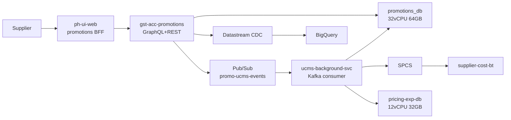

### 7.2 Cost Change Submission Flow

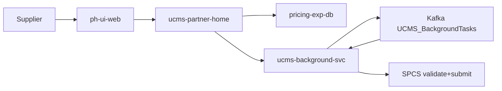

### 7.3 PAS Pricing Run Flow

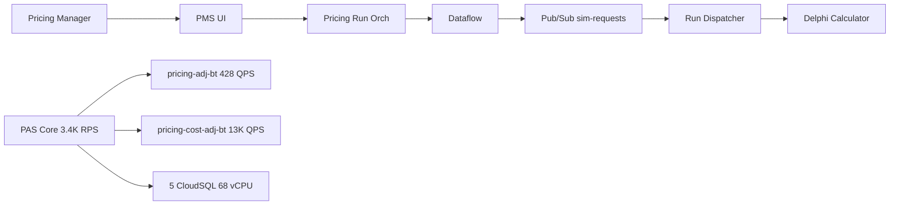

### 7.4 Data Store Ownership

| Data Store | Owner | Type | Scale |
|------------|-------|------|-------|
| **promotions_db** | gst-acc-promotions | CloudSQL | 32vCPU/64GB, 65TB |
| **pricing-exp-db** | ucms-partner-home | CloudSQL | 12vCPU/32GB, 778GB |
| **pricing-adjustment (main)** | PAS | CloudSQL | 16vCPU/32GB |
| **pricing-adjustment-rfp** | PAS | CloudSQL | 16vCPU/32GB |
| **pricing-adjustment-corrections** | PAS | CloudSQL | 14vCPU/28GB |
| **pricing-adjustment-overrides** | PAS | CloudSQL | 14vCPU/28GB |
| **pricing-adjustment-fsp** | PAS | CloudSQL | 8vCPU/15GB |
| **pricing-adjustment-bt** | PAS | Bigtable | 6 nodes, 428 QPS |
| **pricing-cost-adjustment-bt** | PAS | Bigtable | 9 nodes, 13K QPS |
| **supplier-cost-bt** | SPCS | Bigtable | ~2.8K QPS |
| **promotions_dataset_7_public** | gst-acc-promotions | BigQuery | CDC |
| **MSSQL csn_bi_export** | ucms-background-svc | MSSQL | BI export |
| **GCS promotions bucket** | gst-acc-promotions | GCS | US multi-region |

### 7.5 Messaging Topology

**Pub/Sub:**

| Topic | Producer | Consumer |
|-------|----------|----------|
| promo-ucms-events | gst-acc-promotions | ucms-background-svc (3 priority subs) |
| promo-submission-events | ucms-background-svc | gst-acc-promotions (3 priority subs) |
| promo-pipeline-dlq | auto (failed msgs) | DLQ processor |
| wf-ph-download-center-* | gst-acc-promotions, ucms | Download Center |
| pas-analytics-pub-sub-gbq-avro | PAS Core | BigQuery Avro sink |
| cost-simulation-requests | Pricing Run Orch | Run Dispatcher |
| simulation-requests | Pricing Run Orch | Run Dispatcher |
| file-processor-* | file-processor | UI consumers |

**Kafka:**

| Topic | Producer | Consumer |
|-------|----------|----------|
| UCMS_BackgroundTasks | ucms-background-svc | ucms-background-svc |
| OneMediaMDSNotifications | ucms-background-svc, diy-pricing-kafka | gst-acc-promotions, diy-pricing-kafka |
| EffectiveBaseCostChanges | SPCS | diy-pricing-kafka (3 pods) |
| EffectiveShelfSpaceIncentiveUnifiedDataChanges | SPCS | diy-pricing-kafka (3 pods) |
| ucms_dashboard_loaded | ucms-background-svc | Analytics |
| ucms_cost_changes_loaded | ucms-background-svc | Analytics |
| ucms_products_page_loaded | ucms-background-svc | Analytics |
| pricing_refresh | Aletheia | Flink, search (40 partitions) |

### 7.6 Domain Capacity Summary

| Service | Pods | CPU | Mem | Avg RPS | Daily Hits |
|---------|------|-----|-----|---------|------------|
| **PAS** | 2-4/cluster | varies | varies | 3,419 | 295M |
| **gst-acc-promotions** http | 12 | 4/8 | 8/16Gi | 0.9 | 78K |
| **gst-acc-promotions** stream | 2 | 4/8 | 8/16Gi | -- | -- |
| **ucms-partner-home** | 10-35 | 4/8 | 8/16Gi | 3.2 | 276K |
| **ucms-background-svc** | 6-12 | 60m/260m | 4/8Gi | 0.15 | 13K |
| **diy-pricing-kafka** | 6 total | 200m/1 | 512Mi/1Gi | -- | -- |
| **ph-ui-web promotions** | 2-5 | 200m/1 | 1/2Gi | -- | -- |
| **ph-ui-web pricingHome** | 1-2 | -- | -- | -- | -- |
| **PAS UI** | 2-4 | 1m/10m | 128/256Mi | -- | -- |
| **file-processor** | 15-20 | 4 CPU | 10Gi | -- | -- |

### 7.7 CloudSQL Capacity

| Instance | Service | vCPU | RAM | Disk | CPU% | Conns |
|----------|---------|------|-----|------|------|-------|
| promotions_db | gst-acc-promotions | 32 | 64 GB | 65 TB | 2.3% | 75 |
| pricing-exp-db | ucms-partner-home | 12 | 32 GB | 778 GB | 2.0% | 47 |
| PAS main | PAS | 16 | 32 GB | -- | -- | -- |
| PAS rfp | PAS | 16 | 32 GB | -- | -- | -- |
| PAS corrections | PAS | 14 | 28 GB | -- | -- | -- |
| PAS overrides | PAS | 14 | 28 GB | -- | -- | -- |
| PAS fsp | PAS | 8 | 15 GB | -- | -- | -- |
| **TOTAL** | | **112** | **231 GB** | | | |

### 7.8 Bigtable Capacity

| Instance | Service | Nodes | Avg QPS | Peak QPS |
|----------|---------|-------|---------|----------|
| pricing-adjustment-bt | PAS | 6 | 428 | 2,288 |
| pricing-cost-adjustment-bt | PAS | 9 | 13,057 | 56,836 |
| supplier-cost-bt | SPCS | -- | 2,800 | 4,200 |
| **TOTAL** | | **15+** | **16,285** | **63,324** |

### 7.9 Networking (Terraform)

| Component | Spec |
|-----------|------|
| VPC | default-network, 5 regions x 4 subnets |
| Cloud NAT | 2 IPs/region, 512 min_ports |
| VPC Connector | 1000 Mbps (prod) |
| Datastream subnets | /27 per region (us-east4/central1/west1) |
| Firewall | IAP SSH, Datastream proxy (5432/3306) |

---
---

# DETAILED FLOW DIAGRAMS -- Every Promotion Type and PAS Flow

> Scope: All promotion submission paths (B2C, B2B, Closeout, CG Markdown, Cost Change, Auto-Submit, Excel Import) and all PAS pricing flows (CQRS, Pricing Runs, Adjustment Types, Queue Pipeline).
> Each diagram traces the full path from actor to terminal data store, including validation, messaging, and SPCS integration.

---

## A. Promotion Flow Diagrams

### A1. B2C Promotion -- UI Submission Flow

Supplier creates a promotion project through the Partner Home UI, adds parts, then schedules submission. The project flows through validation, Pub/Sub, background processing, and finally to SPCS.

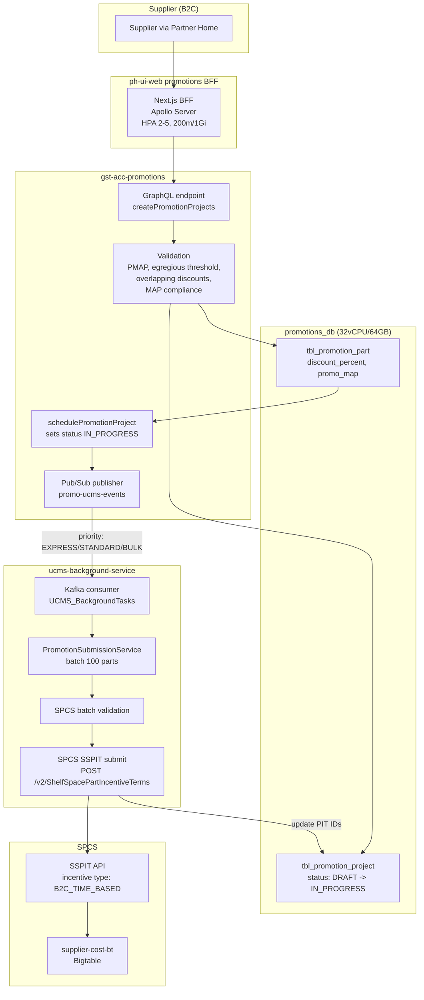

**Key logic per step:**

| Step | Logic | Batch Size |
|------|-------|------------|
| createPromotionProjects | Validate supplier ownership, part IDs via PartDataCache, load base costs from One Media | -- |
| Validation | PMAP check, egregious threshold (50% default, 70% special), overlapping discount detection, MAP compliance | per-part |
| schedulePromotionProject | If `is_resource_management_client` -> user = AUTOAPPROVED; set project status = IN_PROGRESS | -- |
| Pub/Sub priority routing | EXPRESS: <=1,000 parts, STANDARD: 1,001-10,000, BULK: >10,000 | -- |
| PromotionSubmissionService | Group parts by supplierPartId, chunk by MAX_SSPIT_SUBMISSION_BATCH_SIZE | 100 |
| Parallel submission | If >5,000 parts and `parallel_pit_submission_enabled` -> 8 parallel batches | 8 |
| SPCS SSPIT | Creates B2C_TIME_BASED incentive terms with discount_percent and promotional_map | -- |
| Post-submit | Update tbl_promotion_part with PIT IDs, set project SUBMITTED or PARTIAL_SUBMITTED | -- |

---

### A2. B2C Promotion -- Excel Import Flow

Supplier uploads an Excel spreadsheet. The file is stored in GCS, parsed asynchronously, validated, and parts are added to a project. Submission then follows the same path as A1.

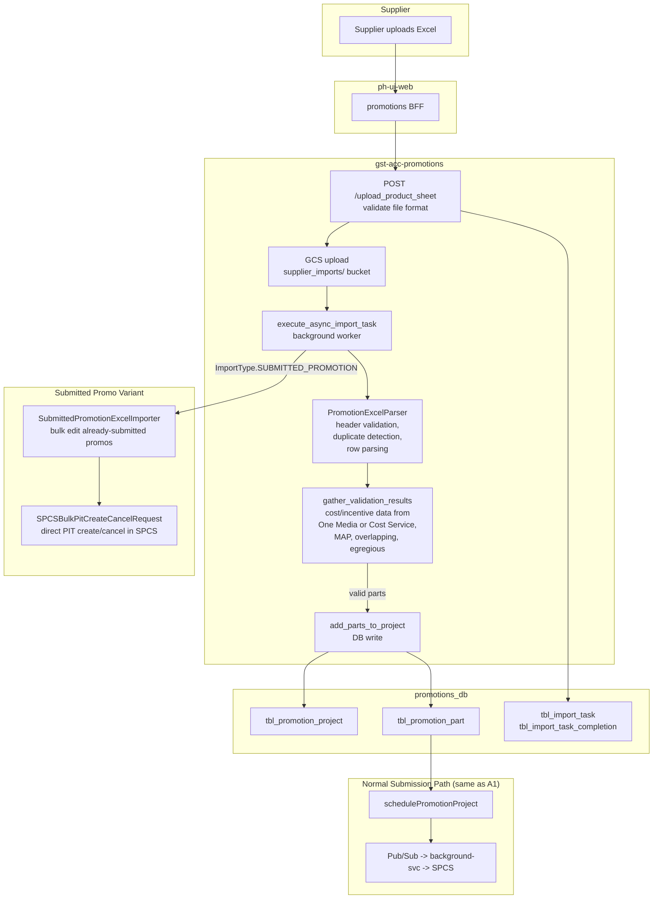

**Import types:**

| ImportType | Importer | Use Case |
|------------|----------|----------|
| PROMOTION | PromotionExcelImporter | Add/update parts to a DRAFT project |
| SUBMITTED_PROMOTION | SubmittedPromotionExcelImporter | Bulk edit already-submitted promos, create/cancel PITs directly in SPCS |

**Import-Submit Pipeline statuses:**

| Status ID | Status | Description |
|-----------|--------|-------------|
| 1 | PENDING_UCMS_EVENT | Awaiting UCMS processing |
| 2 | FAILED_UCMS_VALIDATION | UCMS validation failed |
| 3 | FAILED_UCMS_EVENT | UCMS event processing error |
| 4 | SUCCESS_UCMS_EVENT | UCMS processing complete |
| 5 | PENDING_SPCS_EVENT | Awaiting SPCS submission |
| 6 | FAILED_SPCS_VALIDATION | SPCS validation failed |
| 7 | FAILED_SPCS_EVENT | SPCS submission error |
| 8 | SUCCESS_SPCS_EVENT | SPCS submission complete |
| 9 | FINALIZED | Pipeline complete |

---

### A3. B2B Everyday Discount Flow

Suppliers offer open-ended discounts to B2B (Wayfair Professional) customers. The flow diverges based on feature flag `enable_spcs_v2_api_for_pricing`.

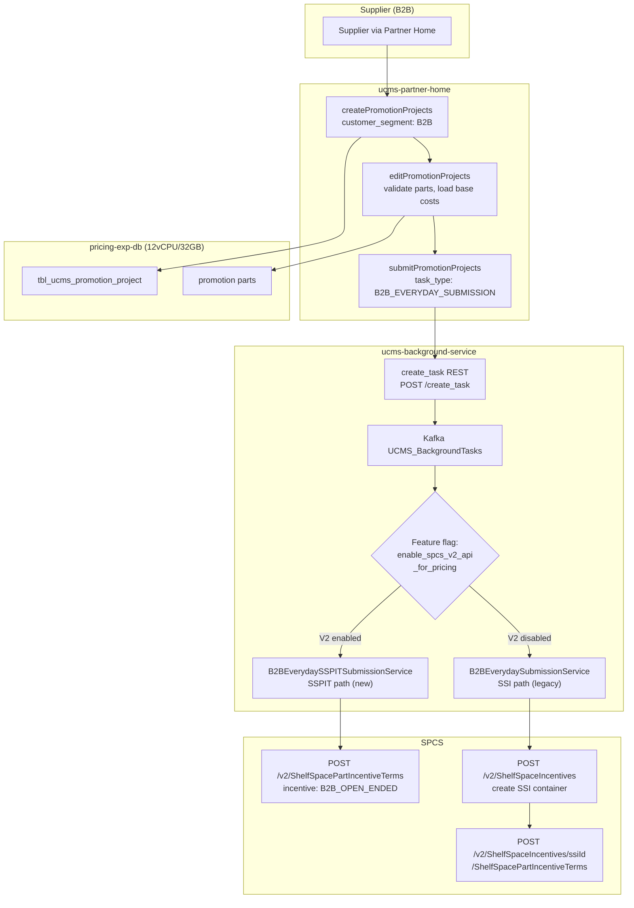

---

### A4. B2B Tiered Discount Flow

Suppliers offer quantity-based tiered pricing for B2B customers (e.g., buy 10+ units get 15% off).

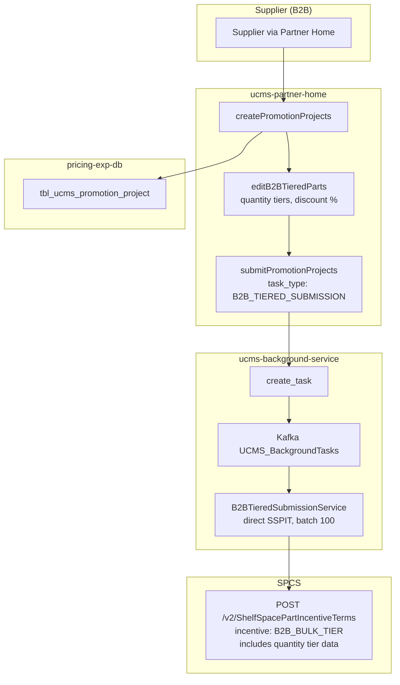

**Post-processing:** When a B2B Tiered promo ends, `diy-pricing-kafka/markdownPartStatusConsumer` listens to `EffectiveShelfSpaceIncentiveUnifiedDataChanges` and calls `editB2BTieredParts` with `statusId: 4` (ended) on ucms-partner-home.

---

### A5. CG Markdown (Castle Gate Markdown) Flow

CG Markdown reduces prices on Castle Gate (CG) warehouse inventory to clear excess stock. The submission calculates a fixed volume based on current CG inventory minus target quantity.

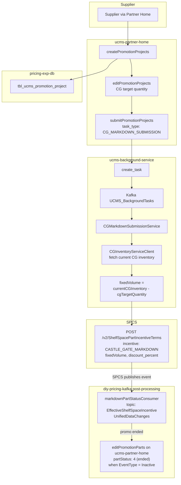

**CG Markdown filter criteria in markdownPartStatusConsumer:**
- PromoProductType = VOLUME_BASED (7)
- SsiType = VolumeBased (2)
- CustomerSegment = B2C (1)
- EventType = Inactive (promo ended)

---

### A6. Closeout Flow

Closeout promos mark products as being cleared out. Submission follows the SSPIT path (or legacy SSI). A daily cron job propagates closeout status to the SDC via OneMedia.

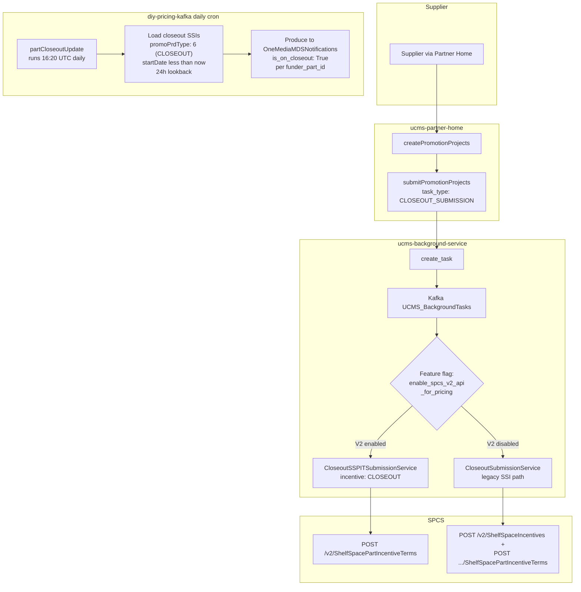

---

### A7. Cost Change Submission Flow

Suppliers update base costs, MAP, and/or MSRP for their parts. Cost changes go through validation, background processing with MAP/MSRP cancellation, compound term submission, and optional Delphi retail price preview.

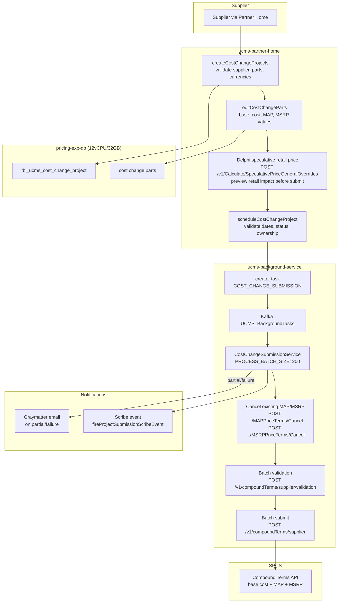

**Cost Change batch processing details:**

| Step | Batch Size | SPCS Endpoint |
|------|------------|---------------|
| Cancel MAP | per part | POST /v1/SupplierProvidedSupplierPartMAPPriceTerms/Cancel |
| Cancel MSRP | per part | POST /v1/SupplierProvidedSupplierPartMSRPPriceTerms/Cancel |
| Validate batch | 200 | POST /v1/compoundTerms/supplier/validation |
| Submit batch | 200 | POST /v1/compoundTerms/supplier |

**Delphi timing note:** If supplier submits after midnight UTC, Delphi will not pick it up until the next day.

---

### A8. Auto-Submit / Recommendation Flow

Recommended promotion projects are auto-submitted daily by a cron job if the supplier has opted in and the auto-approval deadline is within range.

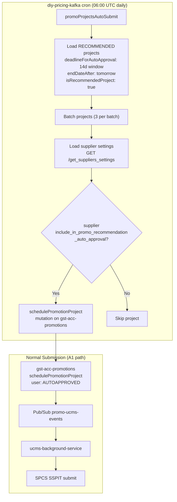

**Auto-submit selection criteria:**

| Filter | Value |
|--------|-------|
| Project status | RECOMMENDED |
| Auto-approval deadline | Between 14 days ago and today |
| Promo end date | After tomorrow (still active) |
| Supplier setting | `include_in_promo_recommendation_auto_approval = true` |

---

## Promotion Types Master Reference

| Promo Type | Customer Segment | Incentive Type | SPCS API | Background Task | Feature Flag Gated |
|------------|-----------------|----------------|----------|-----------------|-------------------|
| B2C Time-Based (Flash, Daily, Major Event) | B2C | B2C_TIME_BASED | SSPIT v2 | PROMOTION_SUBMISSION | No |
| B2B Everyday | B2B | B2B_OPEN_ENDED | SSPIT v2 or SSI | B2B_EVERYDAY_SUBMISSION | enable_spcs_v2_api_for_pricing |
| B2B Tiered | B2B | B2B_BULK_TIER | SSPIT v2 | B2B_TIERED_SUBMISSION | No |
| CG Markdown | B2C | CASTLE_GATE_MARKDOWN | SSPIT v2 | CG_MARKDOWN_SUBMISSION | No |
| Closeout | B2C | CLOSEOUT | SSPIT v2 or SSI | CLOSEOUT_SUBMISSION | enable_spcs_v2_api_for_pricing |
| Cost Change | both | Compound Terms | v1 compound | COST_CHANGE_SUBMISSION | No |

## SSI Types Reference

| SSI Type ID | Name | Used By |
|-------------|------|---------|
| 1 | TimeBased | B2C promos, flash deals |
| 2 | VolumeBased | CG Markdown |
| 3 | Conditional | Special promotions |
| 4 | GoodUntilCancelled | B2B Tiered, B2B Everyday |
| 5 | Composite | Multi-incentive |

## PromoProductType Reference

| ID | Type | Category |
|----|------|----------|
| 1 | FLASH_DEAL | Limited curated |
| 2 | DAILY_PROMOTIONS | Standard |
| 3 | MAJOR_CAMPAIGNS | Major events |
| 4 | HUDDLES | Internal |
| 5 | PROMOTIONAL_PRODUCT | General |
| 6 | CLOSEOUT | Clearance |
| 7 | VOLUME_BASED (CG Markdown) | CG |
| 8 | AISLE_PROMOTION | Aisle |

## Project Status Lifecycle

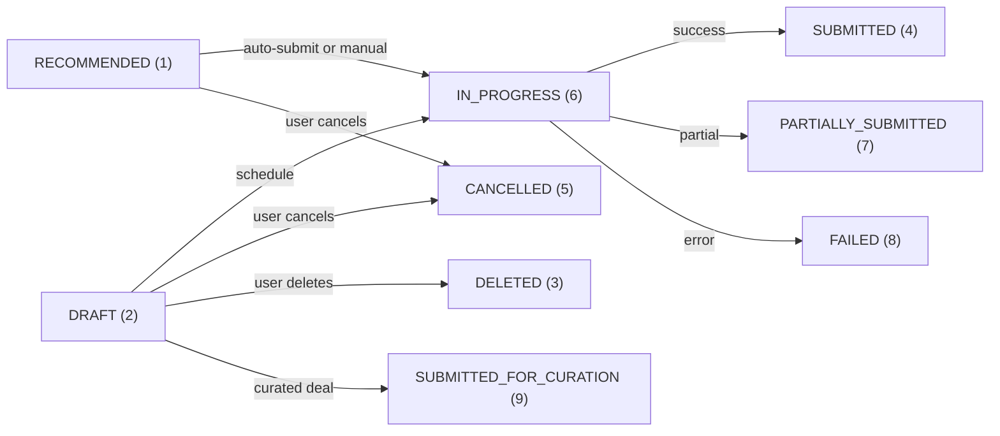

## Background Task Status Lifecycle

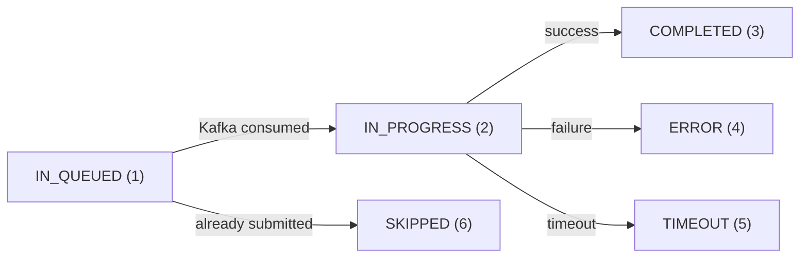

---

## B. PAS Pricing Flow Diagrams

### B1. PAS CQRS Architecture

PAS uses Command-Query Responsibility Segregation. Writes go to 5 domain-specific CloudSQL PostgreSQL instances. Dataflow pipelines project data into 2 Bigtable read-model tables. Consumers (Delphi, ScheduledReader, Pilgrim) read exclusively from Bigtable for low-latency lookups by catalog/OCID key.

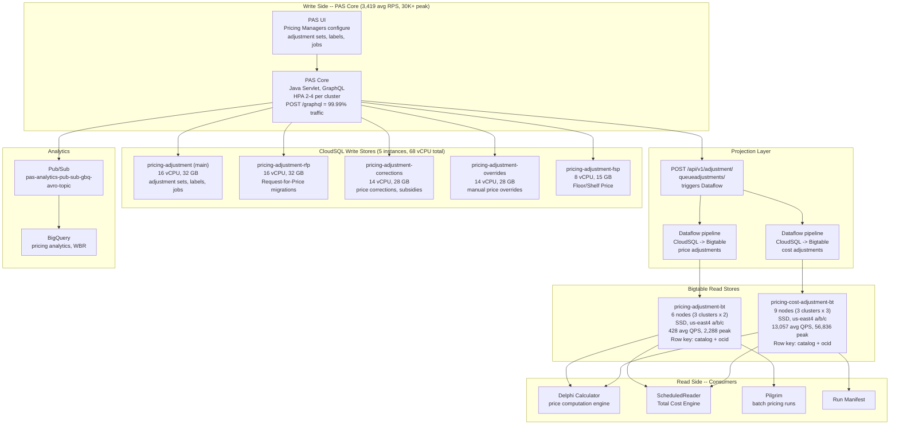

**CQRS data flow summary:**

| Path | Latency | Throughput |
|------|---------|------------|
| Write: PAS -> CloudSQL | <10ms | ~4,236 writes/sec avg |
| Projection: CloudSQL -> Bigtable | minutes (batch) | triggered by queueadjustments |
| Read: Consumer -> Bigtable | <5ms (p50) | 13,485 QPS combined avg |
| Analytics: PAS -> Pub/Sub -> BQ | near-realtime | event-driven |

---

### B2. Pricing Run Flow (End-to-End)

A pricing run is a full-catalog or partial-catalog price computation cycle. It shows extreme burst patterns: off-peak ~23 RPS, peak ~30,000+ RPS during scheduled runs.

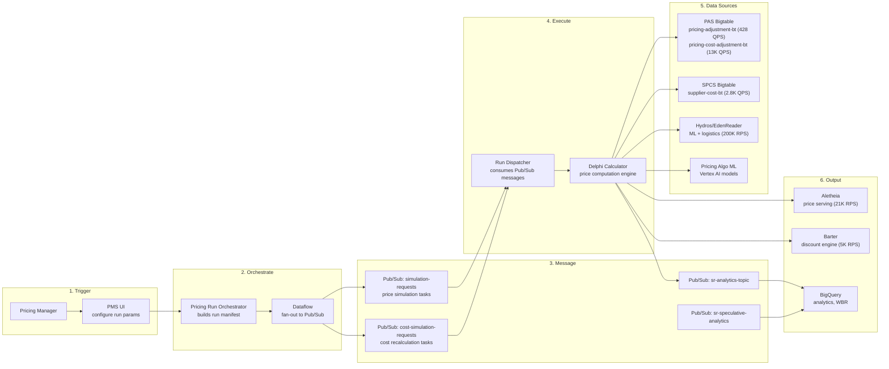

**Pricing run burst pattern (24h from Datadog):**

| Time Window | PAS RPS | Pattern |
|-------------|---------|---------|
| Off-peak (2am-6am ET) | ~23-60 | Minimal background traffic |
| Morning ramp (6am-9am ET) | ~100-3,000 | Runs starting |
| Peak run (9am-2pm ET) | ~7,000-15,000 | Full catalog runs |
| Afternoon (2pm-6pm ET) | ~4,000-7,000 | Follow-up runs |
| Evening burst (10pm-1am ET) | ~10,000-30,000+ | Overnight batch runs |
| Weekend | ~40-1,000 | Reduced schedule |

---

### B3. Adjustment Types Matrix

All 9 adjustment types, their CloudSQL target, Bigtable projection, and purpose.

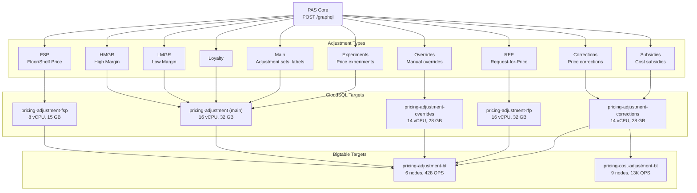

**Adjustment type details:**

| Type | CloudSQL Instance | Bigtable Table | Description |
|------|-------------------|----------------|-------------|
| FSP (Floor/Shelf Price) | pricing-adjustment-fsp | pricing-adjustment-bt | Minimum price floor per SKU |
| HMGR (High Margin) | pricing-adjustment (main) | pricing-adjustment-bt | Target margin bands (high) |
| LMGR (Low Margin) | pricing-adjustment (main) | pricing-adjustment-bt | Target margin bands (low) |
| Loyalty | pricing-adjustment (main) | pricing-adjustment-bt | Loyalty program pricing |
| Overrides | pricing-adjustment-overrides | pricing-adjustment-bt | Manual price overrides by PM |
| Corrections | pricing-adjustment-corrections | pricing-adjustment-bt + pricing-cost-adjustment-bt | Price corrections (affects both price and cost) |
| Subsidies | pricing-adjustment-corrections | pricing-cost-adjustment-bt | Cost subsidies |
| RFP | pricing-adjustment-rfp | pricing-adjustment-bt | Request-for-Price migrations |
| Main | pricing-adjustment (main) | pricing-adjustment-bt | Adjustment sets, labels, jobs |
| Experiments | pricing-adjustment (main) | pricing-adjustment-bt | A/B price experiments |

---

### B4. PAS Queue-Adjustments Pipeline

The queue-adjustments endpoint triggers batch Dataflow jobs that read adjustment data from CloudSQL, transform it, and write to the Bigtable read model.

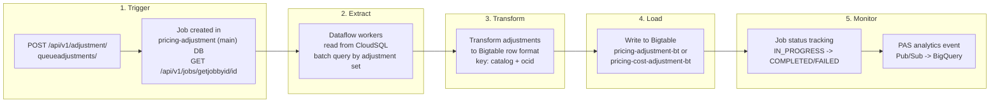

**5 Migration Services (one per domain):**

Each CloudSQL domain has a dedicated migration service that manages the projection pipeline:

| Migration Service | CloudSQL Source | HPA | Purpose |
|-------------------|----------------|-----|---------|
| fsp | pricing-adjustment-fsp | 2-4 pods | FSP projections |
| corrections | pricing-adjustment-corrections | 2-4 pods | Corrections/subsidies projections |
| overrides | pricing-adjustment-overrides | 2-4 pods | Override projections |
| rfp | pricing-adjustment-rfp | 2-4 pods | RFP migration projections |
| main | pricing-adjustment (main) | 2-4 pods | Core adjustment set projections |

---
---

# SYSTEM DESIGN -- Three Zoom Levels

## C1. Whole Pricing Platform System Design

### Architecture Overview

The Wayfair Pricing Platform is a distributed system of ~30+ microservices organized into 6 functional layers. It handles everything from supplier cost ingestion through algorithmic price computation to storefront serving.

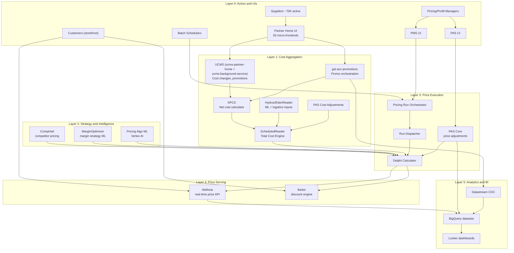

### Platform Capacity Roll-Up (All Services)

| Service | Avg RPS | Peak RPS | Hourly Avg | Daily Avg (weekday) | Daily Avg (weekend) | Yearly Estimate |
|---------|---------|----------|------------|---------------------|---------------------|-----------------|
| **PAS Core** | 4,236 | 30,814 | 15.2M | 366M | 39M | ~99B |
| **Aletheia** | 21,000 | 35,000+ | 75.6M | 1,814M | ~900M | ~563B |
| **Barter** | 5,000 | 10,000 | 18.0M | 432M | ~200M | ~134B |
| **EdenReader** | 200,000 | 337,000 | 720M | 17.3B | ~8.6B | ~5.4T |
| **MarginOptimizer** | 1,377 | 4,344 | 5.0M | 26M (bursty) | ~5M | ~8.1B |
| **SPCS** | 2,800 | 4,200 | 10.1M | 242M | ~120M | ~75B |
| **gst-acc-promotions** | 7.3 | 35 | 26K | 631K | 220K | ~187M |
| **ucms-partner-home** | 86 | ~300 | 310K | 7.4M | 1.8M | ~2.1B |
| **ucms-background-svc** | 0.15 | ~2 | 540 | 13K | ~3K | ~3.7M |
| **diy-pricing-kafka** | event-driven | -- | -- | -- | -- | -- |
| **file-processor** | on-demand | -- | -- | -- | -- | -- |

**Note:** Yearly = (weekday avg x 260) + (weekend avg x 105). EdenReader dominates raw throughput as it aggregates 77 Bigtable lookups per request for ML feature assembly.

### Total Compute Footprint

| Resource | Value |
|----------|-------|
| **GKE Pods (pricing domain)** | ~150-350 (auto-scaled) |
| **Total vCPU (CloudSQL)** | 112 vCPU |
| **Total RAM (CloudSQL)** | 231 GB |
| **Total Disk (CloudSQL)** | ~67 TB (65TB promotions_db + 778GB pricing-exp-db + PAS instances) |
| **Bigtable Nodes** | 15+ nodes (6 pricing-adj + 9 pricing-cost-adj) |
| **Bigtable Combined QPS** | 16,285 avg / 63,324 peak |
| **Cloud Run Instances** | 15-20 (file-processor) |
| **Pub/Sub Topics** | 12+ active topics |
| **Kafka Topics** | 8+ active topics |

### Total Storage Capacity

| Data Store | Type | Size | Growth Rate |
|------------|------|------|-------------|
| promotions_db | CloudSQL PostgreSQL | 65 TB | 27 tables, CDC to BigQuery |
| pricing-exp-db | CloudSQL PostgreSQL | 778 GB | 20+ tables |
| PAS CloudSQL (5 instances) | CloudSQL PostgreSQL | ~2-5 TB est. | Adjustment sets, jobs |
| pricing-adjustment-bt | Bigtable SSD | multi-TB | Row key: catalog+ocid |
| pricing-cost-adjustment-bt | Bigtable SSD | multi-TB | Row key: catalog+ocid |
| supplier-cost-bt | Bigtable SSD | multi-TB | Net cost data |
| BigQuery (pricing analytics) | BigQuery | petabyte-scale | PAS analytics, CDC, WBR |
| GCS (promotions bucket) | Cloud Storage | variable | Excel uploads, exports |

### Messaging Throughput Summary

| System | Topics | Messages/Day Est. | Pattern |
|--------|--------|-------------------|---------|
| **Pub/Sub** | 12+ | ~500K-1M | Event-driven, Dataflow fan-out |
| **Kafka** | 8+ | ~100K-500K | Background tasks, CDC events, cost changes |
| **Total messaging** | 20+ | ~1M+ | Asynchronous decoupling between domains |

### Network Architecture

| Component | Spec |
|-----------|------|
| GKE Clusters | iad1 (prod), sdeprod-c3 (SDE prod), dev |
| VPC | default-network, 5 regions x 4 subnets (compute, ilb, l7-proxy, vpc-conn) |
| Cloud NAT | 2 static IPs/region, 512 min_ports_per_vm |
| VPC Connector | 1,000 Mbps max throughput (prod) |
| Datastream | e2-standard-8 proxy (8 vCPU, 32GB), /27 subnets in 3 regions |
| Firewall | IAP SSH (tcp:22), Datastream proxy (tcp:5432, tcp:3306) |

---

## C2. Promotions Domain System Design

> Scope: gst-acc-promotions, ucms-partner-home, ucms-background-service, diy-pricing-kafka, ph-ui-web BFFs (promotions, pricingHome, importCenter), product-addition-file-processor, and all associated data stores.

### Domain Architecture

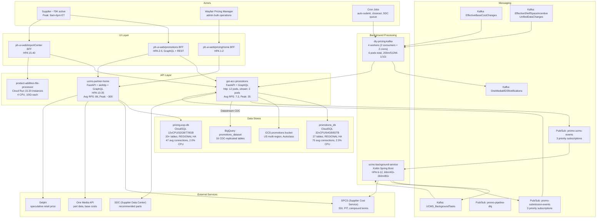

### API Catalog -- gst-acc-promotions (Datadog 24h, prod)

| Endpoint / Operation | Type | Avg RPS | Peak RPS | Daily Hits | Yearly Est | Actor |
|----------------------|------|---------|----------|------------|------------|-------|
| graphql:loadSsiPartsData | GraphQL | 3.6 | 18 | 311K | ~93M | ph-ui-web BFF |
| graphql:userData | GraphQL | 2.0 | 7.8 | 173K | ~52M | ph-ui-web BFF (auth) |
| GET /get_supplier_settings | REST | 6.5 | 35 | 562K | ~168M | Promo UI, auto-submit |
| POST /upload_product_sheet | REST | 1.3 | 3.1 | 112K | ~34M | Excel import |
| graphql:schedulePromotionProject | GraphQL | 1.2 | 2 | 104K | ~31M | Submit action |
| GET /canada-supplier/supplier_id_us | REST | 1.3 | 2.6 | 112K | ~34M | Multi-region check |
| graphql:cancelPromotion | GraphQL | 1.0 | 1.5 | 86K | ~26M | Cancel action |
| graphql:getPromotionCounts | GraphQL | 0.28 | 1.5 | 24K | ~7M | Dashboard counts |
| graphql:loadPromotionProjects | GraphQL | 0.15 | 0.8 | 13K | ~4M | Project listing |
| graphql:loadPromotionParts | GraphQL | 0.10 | 0.5 | 8.6K | ~2.6M | Part listing |
| **TOTAL** | | **~17** | **~71** | **~1.5M** | **~452M** | |

### API Catalog -- ucms-partner-home (Datadog 24h, prod)

| Endpoint / Operation | Type | Avg RPS | Peak RPS | Daily Hits | Yearly Est | Actor |
|----------------------|------|---------|----------|------------|------------|-------|
| POST /api/get_unleash_toggle_values | REST | 1.15 | 4.0 | 99K | ~30M | Feature flags |
| POST /api/retail_prices | REST | 0.52 | 2.5 | 45K | ~13M | Price lookup |
| POST /api/cost_service/billable_costs | REST | 0.28 | 1.5 | 24K | ~7M | Cost data |
| POST /api/part_inventory | REST | 0.16 | 0.8 | 14K | ~4M | Inventory |
| GraphQL loadPromotionProjects | GraphQL | 0.10 | 0.5 | 8.6K | ~2.6M | Promo projects |
| GraphQL loadCostChangeProjects | GraphQL | 0.08 | 0.4 | 6.9K | ~2M | Cost change projects |
| GraphQL submitPromotionProjects | GraphQL | 0.05 | 0.3 | 4.3K | ~1.3M | Submit |
| GraphQL scheduleCostChangeProject | GraphQL | 0.04 | 0.2 | 3.5K | ~1M | Schedule cost change |
| aiohttp (aggregate) | REST | 6.9 | ~40 | 596K | ~179M | Various REST |
| **TOTAL (all frameworks)** | | **~86** | **~300** | **~7.4M** | **~2.1B** | |

### API Catalog -- ucms-background-service (Datadog 24h, prod)

| Endpoint | Method | Avg RPS | Daily Hits | Yearly Est | Purpose |
|----------|--------|---------|------------|------------|---------|
| /page_load/produce_cost_change_message | POST | 0.100 | 8.6K | ~2.6M | Dashboard Kafka |
| /page_load/produce_dashboard_loaded_msg | POST | 0.095 | 8.2K | ~2.5M | Dashboard Kafka |
| /create_task | POST | 0.020 | 1.7K | ~510K | Background task creation |
| /health | GET | 0.010 | 864 | ~259K | Health checks |
| **TOTAL** | | **~0.23** | **~19K** | **~5.9M** | |

### Data Model -- promotions_db (27 tables)

| Table | Purpose | Key Columns | Scale |
|-------|---------|-------------|-------|
| tbl_promotion_project | Promo projects | project_id, supplier_id, status, promo_period_id | Core entity, ~100K+ rows |
| tbl_promotion_part | Parts in projects | part_id, project_id, supplier_part_id, discount_percent | Largest table, millions of rows |
| tbl_promo_periods | Promo period definitions | period_id, start_date, end_date, event_category | ~500 periods |
| tbl_supplier_settings | Supplier promo config | supplier_id, auto_approval, multi_region | ~70K suppliers |
| tbl_major_event | Major shopping events | event_id, name, dates | ~50 events |
| tbl_b2b_promotion_part | B2B-specific part data | part_id, quantity_tier, customer_segment | B2B subset |
| tbl_export_task | Export job tracking | task_id, status, file_path | Export history |
| tbl_promotion_project_task_registry | Task pipeline registry | registry_id, task_type, status | Pipeline tracking |
| tbl_promo_supplier_parts_queue | SDC queue | queue_id, supplier_part_id, status | SDC integration |
| tbl_pl_import_submit_part_pipeline | Import-submit pipeline | upload_id, supplier_part_id, status_id | Pipeline state |
| tbl_import_task | Import job tracking | task_id, file_name, status | Import history |

### Data Model -- pricing-exp-db (20+ tables)

| Table | Purpose | Key Columns | Scale |
|-------|---------|-------------|-------|
| tbl_ucms_promotion_project | UCMS promo projects | project_id, supplier_id, task_type | Core entity |
| tbl_ucms_cost_change_project | Cost change projects | project_id, supplier_id, start_date | Cost changes |
| tbl_ucms_column_preference | User column prefs | user_id, column_config | UI personalization |
| outbox tables (CDC) | Change data capture | event_id, aggregate_type, payload | Kafka CDC |
| background_task | Background task state | task_id, task_type, status, supplier_id | Task tracking |

### Major Database Queries

| Query Pattern | Table(s) | Frequency | Index Strategy |
|---------------|----------|-----------|----------------|
| Load projects by supplier + status | tbl_promotion_project | ~500/hr | (supplier_id, status) |
| Load parts by project | tbl_promotion_part | ~350/hr | (project_id) |
| Load supplier settings | tbl_supplier_settings | ~2K/hr (cached) | (supplier_id) PK |
| Get promo periods by date range | tbl_promo_periods | ~100/hr | (start_date, end_date) |
| Upsert promotion parts (bulk) | tbl_promotion_part | ~100/hr | (project_id, supplier_part_id) |
| Pipeline status updates | tbl_pl_import_submit_part_pipeline | ~50/hr | (upload_id, supplier_part_number) |
| Load cost change projects | tbl_ucms_cost_change_project | ~250/hr | (supplier_id, status) |

### Messaging Configuration

**Pub/Sub (6 topics):**

| Topic | Producer | Consumers | Priority Routing | Ack Deadline | Retention |
|-------|----------|-----------|-----------------|--------------|-----------|
| promo-ucms-events | gst-acc-promotions | ucms-background-svc (3 subs) | EXPRESS/STANDARD/BULK by part count | 600s | 7 days |
| promo-submission-events | ucms-background-svc | gst-acc-promotions (3 subs) | EXPRESS/STANDARD/BULK | 600s | 7 days |
| promo-pipeline-dlq | auto (failed) | DLQ processor | -- | -- | 7 days |
| file-processor-submission-status | file-processor | UI consumers | -- | -- | -- |
| file-processor-status-updates | file-processor | UI consumers | -- | -- | -- |
| file_processor_product_logs | file-processor | Analytics | -- | -- | -- |

**Kafka (6 topics consumed/produced):**

| Topic | Producer | Consumer | Partitions | Purpose |
|-------|----------|----------|------------|---------|
| UCMS_BackgroundTasks | ucms-background-svc | ucms-background-svc | -- | Internal task queue |
| OneMediaMDSNotifications | ucms-background-svc, diy-pricing-kafka | gst-acc-promotions, SDC | -- | Part data updates |
| EffectiveBaseCostChanges | SPCS | diy-pricing-kafka (3 pods) | -- | Cost change events |
| EffectiveShelfSpaceIncentiveUnifiedDataChanges | SPCS | diy-pricing-kafka (3 pods) | -- | SSI/PIT events |
| ucms_dashboard_loaded | ucms-background-svc | Analytics | -- | Dashboard telemetry |
| ucms_cost_changes_loaded | ucms-background-svc | Analytics | -- | Cost change telemetry |

### Cron Jobs

| Job | Service | Schedule (UTC) | Purpose |
|-----|---------|----------------|---------|
| promoProjectsAutoSubmit | diy-pricing-kafka | 06:00 daily | Auto-submit recommended promos |
| partCloseoutUpdate | diy-pricing-kafka | 16:20 daily | Propagate closeout to SDC |
| queue_supplier_parts | gst-acc-promotions | periodic | Queue recommended parts for SDC |
| queue_ended_promotion_parts | gst-acc-promotions | periodic | Purge ended promos from SDC |
| process_recommended_parts | gst-acc-promotions | periodic | Process queued SDC parts |
| rerun_failed_tasks | gst-acc-promotions | periodic | Retry failed import tasks |
| hourly cron 1 | ucms-partner-home | hourly | Data sync |
| hourly cron 2 | ucms-partner-home | hourly | Data sync |

### Feature Flags (Unleash)

| Flag | Service | Impact |
|------|---------|--------|
| enable_spcs_v2_api_for_pricing | ucms-background-svc | Routes Closeout/B2B Everyday to SSPIT vs SSI path |
| parallel_pit_submission_enabled | ucms-background-svc | Enables 8-way parallel batch submission for >5K parts |
| enable_consolidated_source_room_for_suppliers | ucms-background-svc | Consolidated source room for curated promos |
| disable_submission_task_consumers | ucms-background-svc | Kill switch for Kafka consumers |
| overlapping_discounts_warning_enabled | ucms-background-svc | Overlapping discount validation |
| disable_pmap_validations | ucms-background-svc | Bypass PMAP validations |
| is_b2b_hub_feature_flag_enabled | gst-acc-promotions | B2B hub features |
| is_clearance_refactor_enabled | gst-acc-promotions | Clearance flow refactoring |
| pricing_home_async_job_tracking_enabled | gst-acc-promotions | Async job tracking |

### Domain Capacity Summary

| Metric | Value |
|--------|-------|
| **Total domain RPS** | ~103 avg, ~400 peak |
| **Total domain daily hits** | ~8.5M (weekday) |
| **Total domain yearly hits** | ~2.6B |
| **Total CloudSQL vCPU** | 44 vCPU (32 + 12) |
| **Total CloudSQL RAM** | 96 GB (64 + 32) |
| **Total CloudSQL disk** | ~66 TB (65TB + 778GB) |
| **Total GKE pods** | 50-110 (auto-scaled) |
| **Cloud Run instances** | 15-20 |
| **DB tables** | 47+ (27 + 20+) |
| **Pub/Sub topics** | 6 |
| **Kafka topics** | 6 |
| **External service deps** | SPCS, One Media, Delphi, SDC, Scribe, Graymatter |

---

## C3. PAS Domain System Design

> Scope: PAS Core service, 5 CloudSQL instances, 2 Bigtable clusters (3 regions each), Dataflow projection pipelines, 5 migration services, BigQuery analytics, PAS UI.
> PAS repo is not in this workspace -- analysis based on Datadog APM, GCP infrastructure, and architecture documentation.

### Domain Architecture

```mermaid
flowchart TD
    subgraph actors_pas["Actors"]
        PM["Pricing/Profit Managers<br/>configure adjustments,<br/>run simulations"]
        BATCH_PAS["Batch Schedulers<br/>Pilgrim, pricing runs<br/>millions of rows"]
        SERVICES["Downstream Services<br/>Delphi, ScheduledReader,<br/>Run Manifest"]
    end

    subgraph pas_core["PAS Core Service"]
        GRAPHQL["POST /graphql<br/>99.99% of traffic<br/>4,236 avg RPS, 30,814 peak"]
        REST_API["REST APIs<br/>adjustmentset, jobs,<br/>queueadjustments, bigquery<br/>less than 0.01% traffic"]
    end

    subgraph pas_ui_block["PAS UI"]
        PAS_APP["price-adjustment-system-app<br/>2 pods, HPA 2-4<br/>req 1m/128Mi, lim 10m/256Mi"]
    end

    subgraph cloudsql_pas["CloudSQL Write Layer (68 vCPU, 135 GB RAM)"]
        MAIN["main (16vCPU/32GB)<br/>adjustment sets, labels,<br/>jobs, HMGR, LMGR,<br/>Loyalty, Experiments"]
        RFP["rfp (16vCPU/32GB)<br/>Request-for-Price<br/>migrations"]
        CORR["corrections (14vCPU/28GB)<br/>price corrections,<br/>cost subsidies"]
        OVER["overrides (14vCPU/28GB)<br/>manual price overrides"]
        FSP_SQL["fsp (8vCPU/15GB)<br/>Floor/Shelf Price"]
    end

    subgraph migration_svcs["Migration Services (5 x HPA 2-4)"]
        MIG_MAIN["main-migration"]
        MIG_RFP["rfp-migration"]
        MIG_CORR["corrections-migration"]
        MIG_OVER["overrides-migration"]
        MIG_FSP["fsp-migration"]
    end

    subgraph bigtable_pas["Bigtable Read Layer (15 nodes)"]
        PA_BT["pricing-adjustment-bt<br/>3 clusters x 2 nodes = 6<br/>SSD, us-east4 a/b/c<br/>428 avg QPS, 2,288 peak"]
        CA_BT["pricing-cost-adjustment-bt<br/>3 clusters x 3 nodes = 9<br/>SSD, us-east4 a/b/c<br/>13,057 avg QPS, 56,836 peak"]
    end

    subgraph analytics_pas["Analytics"]
        PS_ANALYTICS["Pub/Sub: pas-analytics<br/>-pub-sub-gbq-avro-topic"]
        BQ_PAS["BigQuery<br/>pricing analytics,<br/>WBR reports"]
    end

    PM --> PAS_APP
    PAS_APP --> GRAPHQL
    BATCH_PAS --> GRAPHQL
    SERVICES --> PA_BT
    SERVICES --> CA_BT

    GRAPHQL --> MAIN
    GRAPHQL --> RFP
    GRAPHQL --> CORR
    GRAPHQL --> OVER
    GRAPHQL --> FSP_SQL

    MAIN --> MIG_MAIN
    RFP --> MIG_RFP
    CORR --> MIG_CORR
    OVER --> MIG_OVER
    FSP_SQL --> MIG_FSP

    MIG_MAIN --> PA_BT
    MIG_RFP --> PA_BT
    MIG_CORR --> PA_BT
    MIG_CORR --> CA_BT
    MIG_OVER --> PA_BT
    MIG_FSP --> PA_BT

    GRAPHQL --> PS_ANALYTICS
    PS_ANALYTICS --> BQ_PAS
```

### Traffic Analysis (Datadog 24h + 7-day)

**Endpoint breakdown:**

| Endpoint | Method | Avg RPS | Peak RPS | Daily Hits (weekday) | Daily Hits (weekend) | Yearly Estimate | Share |
|----------|--------|---------|----------|----------------------|----------------------|-----------------|-------|
| /graphql | POST | 4,236 | 30,814 | 366M | 39M | ~99.2B | 99.99% |
| /api/v1/bigquery/validate/ | POST | trace | 1 | ~50 | ~10 | ~15K | trace |
| /api/v1/adjustmentset | POST | trace | 1.3 | ~40 | ~5 | ~11K | trace |
| /api/v1/adjustmentset/filter | GET | trace | 1 | ~30 | ~5 | ~8.3K | trace |
| /api/v1/pricingrun/filter | GET | trace | 1 | ~30 | ~5 | ~8.3K | trace |
| /api/v1/access/permissions | GET | trace | 1 | ~20 | ~5 | ~5.7K | trace |
| /api/v1/adjustment/queueadjustments/ | POST | trace | 1 | ~10 | ~2 | ~2.9K | trace |
| /api/v1/jobs/getjobbyid/{id} | GET | trace | 1 | ~10 | ~2 | ~2.9K | trace |
| **TOTAL** | | **4,236** | **30,814** | **366M** | **39M** | **~99.2B** | |

**Weekly volume pattern (7-day Datadog):**

| Day | Total Hits | Avg RPS |
|-----|------------|---------|
| Monday | 426M | 4,931 |
| Tuesday | 335M | 3,877 |
| Wednesday | 338M | 3,912 |
| Thursday | 388M | 4,491 |
| Friday | 299M | 3,461 |
| Saturday | 345M | 3,993 |
| Sunday (partial) | 39M | ~450 (partial day) |
| **Weekly Total** | **2.17B** | **Avg: 3,600** |

**Hourly pattern (weekday):**

| Time (ET) | RPS Range | Pattern |
|-----------|-----------|---------|
| 12am-2am | 200-1,000 | Low |
| 2am-6am | 23-60 | Minimum |
| 6am-9am | 100-3,000 | Morning ramp |
| 9am-12pm | 7,000-15,000 | Peak run window |
| 12pm-3pm | 4,000-8,000 | Active |
| 3pm-6pm | 3,000-7,000 | Active |
| 6pm-10pm | 1,000-5,000 | Moderate |
| 10pm-12am | 5,000-30,000+ | Overnight batch burst |

### Per-Adjustment-Type Throughput

Since POST /graphql handles 99.99% of traffic and covers all adjustment types, the breakdown is estimated from the CQRS read-side Bigtable QPS:

| Adjustment Type | Write DB | Read Table | Est. Read Share | Est. Daily Reads |
|-----------------|----------|------------|-----------------|------------------|
| FSP (Floor/Shelf Price) | fsp (8 vCPU) | pricing-adjustment-bt | ~15% | ~5.5M |
| HMGR (High Margin) | main (16 vCPU) | pricing-adjustment-bt | ~25% | ~9.3M |
| LMGR (Low Margin) | main | pricing-adjustment-bt | ~25% | ~9.3M |
| Loyalty | main | pricing-adjustment-bt | ~5% | ~1.9M |
| Overrides | overrides (14 vCPU) | pricing-adjustment-bt | ~10% | ~3.7M |
| RFP | rfp (16 vCPU) | pricing-adjustment-bt | ~5% | ~1.9M |
| Main (sets, labels) | main | pricing-adjustment-bt | ~10% | ~3.7M |
| Experiments | main | pricing-adjustment-bt | ~5% | ~1.9M |
| Corrections | corrections (14 vCPU) | pricing-cost-adjustment-bt | ~70% of cost | ~790M |
| Subsidies | corrections | pricing-cost-adjustment-bt | ~30% of cost | ~338M |

**Bigtable read-side totals:**

| Table | Avg QPS | Peak QPS | Hourly Avg | Daily Avg | Yearly Est |
|-------|---------|----------|------------|-----------|------------|
| pricing-adjustment-bt | 428 | 2,288 | 1.5M | 37M | ~11.3B |
| pricing-cost-adjustment-bt | 13,057 | 56,836 | 47M | 1.13B | ~344B |
| **Combined** | **13,485** | **59,124** | **48.5M** | **1.17B** | **~355B** |

### CloudSQL Storage Details

| Instance | vCPU | RAM | Disk Type | Disk Size | HA | PITR | Max Conns | PostgreSQL Version |
|----------|------|-----|-----------|-----------|-----|------|-----------|-------------------|
| pricing-adjustment (main) | 16 | 32 GB | SSD | -- | REGIONAL | yes | 1000 | 14 |
| pricing-adjustment-rfp | 16 | 32 GB | SSD | -- | REGIONAL | yes | 1000 | 14 |
| pricing-adjustment-corrections | 14 | 28 GB | SSD | -- | REGIONAL | yes | 1000 | 14 |
| pricing-adjustment-overrides | 14 | 28 GB | SSD | -- | REGIONAL | yes | 1000 | 14 |
| pricing-adjustment-fsp | 8 | 15 GB | SSD | -- | REGIONAL | yes | 1000 | 14 |
| **TOTAL** | **68** | **135 GB** | | | | | **5,000** | |

### Bigtable Cluster Details

| Instance | Clusters | Nodes/Cluster | Total Nodes | Storage | Regions |
|----------|----------|---------------|-------------|---------|---------|
| pricing-adjustment-bt | 3 | 2 | 6 | SSD | us-east4-a, us-east4-b, us-east4-c |
| pricing-cost-adjustment-bt | 3 | 3 | 9 | SSD | us-east4-a, us-east4-b, us-east4-c |
| **TOTAL** | **6** | | **15** | | |

**Bigtable data model:**

| Property | Value |
|----------|-------|
| Row key | Composite: catalog + ocid |
| Column families | adjustment type specific |
| Read pattern | Point lookups by catalog+ocid (low-latency) |
| Write pattern | Batch via Dataflow projection (high-throughput) |
| Replication | Multi-cluster routing across 3 zones |

### PAS Compute Footprint

| Component | Pods | CPU (req/lim) | Memory (req/lim) | Purpose |
|-----------|------|---------------|-------------------|---------|
| PAS Core | 2-4/cluster | varies | varies | Main service |
| PAS UI | 2-4 | 1m/10m | 128/256Mi | UI app |
| Migration: main | 2-4 | varies | varies | Main DB projection |
| Migration: rfp | 2-4 | varies | varies | RFP DB projection |
| Migration: corrections | 2-4 | varies | varies | Corrections DB projection |
| Migration: overrides | 2-4 | varies | varies | Overrides DB projection |
| Migration: fsp | 2-4 | varies | varies | FSP DB projection |
| CloudSQL proxy | 4 replicas | -- | -- | DB connection pooling |
| **Total pods** | **20-40** | | | |

### PAS Domain Capacity Summary

| Metric | Value |
|--------|-------|
| **GraphQL avg RPS** | 4,236 |
| **GraphQL peak RPS** | 30,814 |
| **Daily hits (weekday avg)** | 366M |
| **Daily hits (weekend avg)** | ~39M |
| **Weekly hits** | ~2.17B |
| **Yearly hits** | ~99.2B |
| **Hourly avg (weekday)** | 15.2M |
| **Hourly peak** | ~111M (30K RPS x 3600) |
| **Bigtable combined QPS** | 13,485 avg / 59,124 peak |
| **Bigtable daily reads** | ~1.17B |
| **Bigtable yearly reads** | ~355B |
| **CloudSQL total vCPU** | 68 |
| **CloudSQL total RAM** | 135 GB |
| **CloudSQL max connections** | 5,000 (5 x 1,000) |
| **Bigtable nodes** | 15 (6 + 9) |
| **GKE pods** | 20-40 |
| **Pub/Sub topics** | 1 (analytics) |
| **Adjustment types** | 10 (FSP, HMGR, LMGR, Loyalty, Overrides, Corrections, Subsidies, RFP, Main, Experiments) |

### Interview-Ready PAS Talking Points

1. **Scale:** ~100B requests/year, dominated by GraphQL (99.99%). Burst from ~23 RPS off-peak to ~30K+ during pricing runs.
2. **CQRS:** Write to 5 domain-specific PostgreSQL instances (68 vCPU total), project via Dataflow to 2 Bigtable read-model tables (15 nodes). Consumers read at 13,485 QPS avg.
3. **Why 5 databases?** Domain isolation -- each adjustment type (FSP, corrections, overrides, RFP, main) has its own schema and lifecycle. Corrections write to both price and cost Bigtable tables.
4. **Why Bigtable?** Low-latency point reads by catalog+OCID key for real-time price computation. Multi-cluster replication across 3 zones for HA.
5. **Burst handling:** HPA 2-4 pods per cluster scales with pricing run traffic. The 10pm-midnight window sees the highest bursts (overnight batch runs).
6. **Analytics:** Every adjustment event flows via Pub/Sub Avro to BigQuery for WBR reporting and pricing index computation.

---
---

# DEEP SYSTEM DESIGN -- Resilience, Latency, SLOs, Consistency, Scalability, Trade-offs, Security, Cost, Observability

---

## D1. Failure Modes and Resilience

### Retry Configuration Summary

| Service | Target | Max Attempts | Backoff | Timeout (prod) |
|---------|--------|-------------|---------|----------------|
| ucms-background-service | SPCS API | 3 | Fixed 60s delay | 180s |
| ucms-background-service | General HTTP | 3 | Fixed 100ms delay | 180s |
| ucms-background-service | Database | 3 | Exponential (2x, max 10s) | -- |
| gst-acc-promotions | SPCS API | 2 | None (immediate) | 300s |
| gst-acc-promotions | One Media / exports | 2 | None (immediate) | 300s |
| gst-acc-promotions | GCS operations | deadline 15s | Retry on 429/5xx | 15s deadline |
| gst-acc-promotions | GCS progress writes | 3-8 | Exponential + jitter (base 0.5-1.0s) | 30s cap for 429 |
| gst-acc-promotions | DB deadlocks | 3 | Exponential (base 0.1s) | -- |
| gst-acc-promotions | SSE streaming | 8 | Exponential + jitter (5s base) | -- |

### Failure Scenarios and Recovery

```mermaid
flowchart TD
    subgraph spcs_down["SPCS Down"]
        S1["Submission request arrives"]
        S2["SPCS returns 5xx"]
        S3["Retry 3x with 60s delay"]
        S4{"Still failing?"}
        S5["Project status: FAILED<br/>Task status: ERROR"]
        S6["Graymatter email sent<br/>Scribe event fired"]
        S7["Supplier retries manually<br/>or admin bulk re-submit"]
    end

    subgraph partial["Partial Submission Failure"]
        P1["Batch of 100/200 parts"]
        P2["Some parts fail SPCS validation"]
        P3["Valid parts submitted<br/>Failed parts tracked"]
        P4["Project: PARTIALLY_SUBMITTED"]
        P5["Failed part IDs logged<br/>Email to supplier"]
    end

    subgraph db_down["Database Unavailable"]
        D1["CloudSQL connection fails"]
        D2["Monitor: DB connection failure<br/>threshold: >20 in 1hr"]
        D3["PagerDuty alert<br/>PPE-FTE-Weekly-Rotation"]
        D4["Retry with exponential backoff<br/>3 attempts, multiplier 2x"]
    end

    subgraph kafka_lag["Kafka Consumer Lag"]
        K1["UCMS_BackgroundTasks backlog"]
        K2["Feature flag: disable_submission_task_consumers<br/>kill switch available"]
        K3["HPA scales 6-12 pods"]
        K4["Tasks timeout after threshold<br/>status: TIMEOUT"]
    end

    S1 --> S2 --> S3 --> S4
    S4 -->|"Yes"| S5
    S5 --> S6
    S6 --> S7
    S4 -->|"No"| P1

    P1 --> P2 --> P3 --> P4 --> P5

    D1 --> D2 --> D3
    D1 --> D4

    K1 --> K2
    K1 --> K3
    K3 --> K4
```

### DLQ (Dead Letter Queue) Strategy

| Queue | Topic | Ack Deadline | Retention | Processor |
|-------|-------|-------------|-----------|-----------|
| promo-pipeline-dlq | Pub/Sub | 600s | 7 days | Defined in Terraform; no auto-processor in codebase -- manual investigation required |
| Kafka UCMS_BackgroundTasks | Kafka | -- | -- | No DLQ; failed tasks marked ERROR, manual re-queue via admin API |

### Submission Error Handling Per Task Type

| Task Type | Batch Size | On Batch Failure | On Part Failure | Recovery |
|-----------|------------|------------------|-----------------|----------|
| PROMOTION_SUBMISSION | 100 | All parts in batch marked failed | Failed parts tracked, success parts get PIT IDs | Manual re-submit |
| COST_CHANGE_SUBMISSION | 200 | Batch validation failure: all failed | Individual part errors tracked | Graymatter email + manual |
| CLOSEOUT_SUBMISSION | 100 | Same as promotion | Same as promotion | Manual re-submit |
| CG_MARKDOWN_SUBMISSION | 100 | Same as promotion | CG inventory check may fail | Manual re-submit |
| B2B_EVERYDAY_SUBMISSION | 100 | Same as promotion | Same as promotion | Manual re-submit |
| B2B_TIERED_SUBMISSION | 100 | Same as promotion | Same as promotion | Manual re-submit |

---

## D2. Latency Budgets (Datadog APM, 24h Production)

### Service-Level Latency

| Service | Avg | P95 | P99 | Unit |
|---------|-----|-----|-----|------|
| **PAS Core** (POST /graphql) | **8.8ms** | **19.6ms** | **39ms** | seconds |
| **gst-acc-promotions** (all endpoints) | **876ms** | **1.48s** | **17.1s** | seconds |
| **ucms-partner-home** (aiohttp) | **120ms** | **250ms** | **446ms** | seconds |

### PAS Latency by Time of Day

| Time Window | Avg Latency | P95 | P99 | Reason |
|-------------|-------------|-----|-----|--------|
| Off-peak (2am-6am) | 10-12ms | 25-35ms | 50-67ms | Low load, longer GC pauses |
| Active (9am-5pm) | 7-8ms | 10-14ms | 13-30ms | Warm caches, steady load |
| Peak batch (10pm-1am) | 9-12ms | 29-53ms | 40-121ms | Burst load, GC pressure |

### gst-acc-promotions Latency Notes

- **Avg 876ms** is elevated due to long-running Excel import operations (P99 spikes to 17s+ and outliers to 1,654s for bulk imports)
- **Typical GraphQL operations** (loadSsiPartsData, userData) run at ~200-500ms avg
- **schedulePromotionProject** is fast (~100-300ms) as it only publishes to Pub/Sub
- **upload_product_sheet** is the long tail: GCS upload + async parse

### End-to-End Promotion Submission Latency Budget

| Hop | Avg Latency | P95 | Notes |
|-----|-------------|-----|-------|
| 1. Supplier browser -> ph-ui-web BFF | ~50ms | ~100ms | Network + SSR |
| 2. BFF -> gst-acc-promotions GraphQL | ~400ms | ~1s | Validation, DB write |
| 3. gst-acc-promotions -> Pub/Sub publish | ~10ms | ~50ms | Async, fire-and-forget |
| 4. Pub/Sub -> ucms-background-service consume | ~100-500ms | ~2s | Queue delay + priority |
| 5. Background service -> SPCS validation | ~500ms-2s | ~5s | Batch of 100 parts |
| 6. Background service -> SPCS submit | ~500ms-2s | ~5s | Batch of 100 parts |
| 7. DB status update | ~10ms | ~50ms | Update project status |
| **Total (synchronous UI path: steps 1-3)** | **~460ms** | **~1.2s** | User sees "submitted" |
| **Total (async completion: steps 4-7)** | **~1-5s** | **~12s** | Background processing |
| **Total end-to-end** | **~2-6s** | **~13s** | Small project (<100 parts) |
| **Large project (>5K parts)** | **~30s-5min** | **~10min** | Parallel 8-way batches |

---

## D3. SLOs, SLAs, and Error Budgets

### Service Error Rates (Datadog 24h)

| Service | Total Hits (24h) | Errors (24h) | Error Rate | Monitor Threshold |
|---------|------------------|-------------|------------|-------------------|
| PAS Core | ~366M | ~0 (no 5xx detected) | <0.0001% | Not configured |
| gst-acc-promotions | ~631K | ~157 | 0.025% | >0.5 errors/sec (15m) |
| ucms-partner-home | ~7.4M | ~470 | 0.006% | >100 errors/sec (15m) |
| ucms-background-service | low volume | in Warn state | ~5% (threshold) | >5% error rate (10m) |

### Active Monitors and Alert Channels

| Monitor | Service | Threshold | Alert Channel | PagerDuty |
|---------|---------|-----------|---------------|-----------|
| High error rate | gst-acc-promotions | >0.5 errors/sec (15m) | #accelerate-promotions-alerts | Promotions-Experience |
| High p95 latency | gst-acc-promotions | >30s (30m) | #accelerate-promotions-alerts | Promotions-Experience |
| High CPU usage | gst-acc-promotions | >75% avg (15m) | #accelerate-promotions-alerts | PPE-FTE-Weekly-Rotation |
| High SPDB memory | gst-acc-promotions | >90% (1h) | #accelerate-promotions-prod-alerts | PPE-FTE-Weekly-Rotation |
| Throughput anomaly | gst-acc-promotions | Weekly agile anomaly | #accelerate-promotions-alerts | PPE-FTE-Weekly-Rotation |
| Faulty deployment | gst-acc-promotions | Anomalous errors in deploy | #accelerate-promotions-prod-alerts | PPE-FTE-Weekly-Rotation |
| Istio sidecar errors | gst-acc-promotions | >5% error rate (5m) | #accelerate-promotions-alerts | PPE-FTE-Weekly-Rotation |
| Failed part validation (1h) | gst-acc-promotions | >1 (1h) | #accelerate-promotions-prod-alerts | PPE-FTE-Weekly-Rotation |
| Failed part system errors (2w) | gst-acc-promotions | >1 (1h) | #accelerate-promotions-prod-alerts | PPE-FTE-Weekly-Rotation |
| Synthetics (overall) | Partner Home Promotions | Synthetic test failure | #accelerate-promotions-alerts | PPE-FTE-Weekly-Rotation |
| High error rate | ucms-partner-home | >100 errors/sec (15m) | #accelerate-pricing-exp-alert | -- |
| p90 latency (specific) | ucms-partner-home | >30s on update_columns | #diy-pricing-orange-alert | -- |
| Import failures | ucms-partner-home | >4 (15m) | #accelerate-pricing-exp-alert | -- |
| Submission failures | ucms-partner-home | >=3 (5m) | #accelerate-pricing-exp-alert | -- |
| SPCS 500 errors | ucms-background-service | >50 (5m) | #accelerate-pricing-exp-alert | PPE-FTE-Weekly-Rotation |
| High error rate | ucms-background-service | >5% (10m) | BigPanda | PPE-FTE-Weekly-Rotation |
| Throughput anomaly | ucms-background-service | Weekly agile anomaly | -- | PPE-FTE-Weekly-Rotation |
| Faulty deployment | ucms-background-service | Anomalous errors in deploy | #accelerate-pricing-exp-alert | PPE-FTE-Weekly-Rotation |
| DB connection failure (promo) | ucms-background-service | >20 (1h) | #accelerate-promotions-alerts | PPE-FTE-Weekly-Rotation |
| DB connection failure (pricing) | ucms-background-service | >20 (1h) | #accelerate-pricing-exp-alert | Pricing-Home-App |
| CloudSQL CPU (main) | PAS | >90% (5m) | #ppd-sl-pricemgmt | -- |
| CloudSQL Memory (main) | PAS | >90% (5m) | #ppd-sl-pricemgmt | -- |
| CloudSQL CPU (RFP) | PAS | >90% (5m) | #ppd-sl-pricemgmt | -- |
| CloudSQL Disk (RFP) | PAS | >90% (5m) | #ppd-sl-pricemgmt | -- |
| CloudSQL CPU (Corrections) | PAS | >90% (5m) | #ppd-sl-pricemgmt | -- |
| Analytics errors | PAS | >=100 (5m) | #ppd-sl-pricemgmt | -- |
| Eden Reader errors | PAS | >=10 (5m) | #ppd-sl-pricemgmt | -- |
| GraphQL throughput anomaly | PAS | Daily agile anomaly | #ppd-sl-pricemgmt | -- |
| Expiring adj sets (HMGR, RFP, Overrides, Experiments) | PAS | >10 (4h) | #pricing-adjustment-status | -- |

### Implied SLOs (from monitor thresholds)

| Service | Availability SLO | Latency SLO | Error Budget |
|---------|-----------------|-------------|--------------|
| gst-acc-promotions | ~99.9% (error rate <0.5/s on ~7 RPS = ~7% tolerance) | P95 < 30s | ~43 min/month downtime |
| ucms-partner-home | ~99.99% (error rate <100/s on ~86 RPS) | P90 < 30s (specific endpoints) | ~4 min/month |
| ucms-background-service | ~95% (error rate <5%) | No explicit latency SLO | ~36 hrs/month (but low volume) |
| PAS Core | Not explicitly monitored for errors | No explicit latency SLO | Implicit: CloudSQL health |
| CloudSQL (all) | CPU < 90%, memory < 90%, disk < 90% | -- | Infrastructure health |

---

## D4. Data Consistency and Staleness

### Consistency Model

```mermaid
flowchart LR
    subgraph write_path["Write Path (Strong Consistency)"]
        W1["PAS Core -> CloudSQL<br/>ACID transactions"]
        W2["gst-acc-promotions -> promotions_db<br/>ACID transactions"]
        W3["ucms-partner-home -> pricing-exp-db<br/>ACID transactions"]
    end

    subgraph projection["Projection (Eventual Consistency)"]
        P1["CloudSQL -> Bigtable<br/>via Dataflow<br/>Lag: minutes to hours"]
        P2["promotions_db -> BigQuery<br/>via Datastream CDC<br/>Freshness: 600s (10min)"]
    end

    subgraph read_path["Read Path (Eventually Consistent)"]
        R1["Delphi reads Bigtable<br/>may see stale adjustments"]
        R2["Analytics reads BigQuery<br/>10 min behind prod"]
    end

    W1 --> P1 --> R1
    W2 --> P2 --> R2
```

### Staleness Windows

| Path | Source | Target | Mechanism | Staleness | Impact |
|------|--------|--------|-----------|-----------|--------|
| PAS CloudSQL -> Bigtable | 5 CloudSQL instances | 2 Bigtable tables | Dataflow batch | Minutes to hours | Pricing runs may use stale adjustments until projection completes |
| promotions_db -> BigQuery | promotions_db | BigQuery dataset | Datastream CDC | ~600s (10 min) | Analytics/WBR reports up to 10 min behind |
| Pub/Sub promo-ucms-events | gst-acc-promotions | ucms-background-svc | Pub/Sub async | Seconds to minutes | Submission queued, not instant |
| Kafka UCMS_BackgroundTasks | ucms-background-svc | ucms-background-svc | Kafka internal | Milliseconds | Near real-time task dispatch |
| SPCS -> Bigtable (supplier-cost-bt) | SPCS API | supplier-cost-bt | Internal SPCS pipeline | Unknown (minutes) | New cost terms may not be immediately readable |
| Kafka EffectiveBaseCostChanges | SPCS | diy-pricing-kafka | Kafka event | Seconds | Near real-time cost propagation |

### Race Conditions and Mitigations

| Scenario | Risk | Mitigation |
|----------|------|------------|
| Pricing run reads stale Bigtable after adjustment update | Run uses old adjustments | PAS queues adjustments before run; Dataflow must complete before run starts |
| Concurrent project edits by same supplier | Lost updates | Optimistic locking via status checks (e.g., only DRAFT can be edited) |
| Two submissions for same supplier_part_id | Duplicate PITs in SPCS | SPCS validates overlapping incentive terms; gst-acc-promotions checks `overlapping_discounts_warning_enabled` |
| Background task processed after project cancelled | Wasted SPCS submission | Task checks project status before SPCS calls; cancelled projects skip submission |
| Datastream CDC lag during high write volume | BigQuery analytics fall behind | Datastream freshness target 600s; Dataflow proxy sized at e2-standard-8 |

---

## D5. Scalability Limits and Bottlenecks

### Current Utilization vs Capacity

| Resource | Current Usage | Max Capacity | Utilization | Headroom |
|----------|--------------|-------------|-------------|----------|
| promotions_db CPU | 2.3% | 100% (32 vCPU) | 2.3% | **43x** |
| promotions_db connections | 75 | 1,000 | 7.5% | **13x** |
| promotions_db disk | 65 TB | SSD auto-grow | -- | Auto-scales |
| pricing-exp-db CPU | 2.0% | 100% (12 vCPU) | 2.0% | **50x** |
| pricing-exp-db connections | 47 | 1,000 | 4.7% | **21x** |
| pricing-adjustment-bt QPS | 428 | ~6,000 (6 nodes) | 7.1% | **14x** |
| pricing-cost-adjustment-bt QPS | 13,057 | ~9,000 (9 nodes) | 145% | **Over-provisioned for bursts; 56K peak = 6.3x node capacity** |
| gst-acc-promotions pods | 12 (http) | HPA max varies | -- | Auto-scales |
| ucms-partner-home pods | 10-35 | HPA max 35 | variable | 1-3.5x |
| ucms-background-service pods | 6-12 | HPA max 12 | variable | 1-2x |

### What Breaks at Scale

| Scale | Bottleneck | Why | Mitigation |
|-------|------------|-----|------------|
| **2x current load** | Nothing critical | All components have >2x headroom | Normal HPA scaling |
| **5x current load** | ucms-background-service HPA ceiling (12 pods) | Kafka consumer lag increases | Increase HPA max, add partitions |
| **5x current load** | pricing-cost-adjustment-bt peak QPS | 56K peak * 5 = 280K QPS; nodes insufficient | Add Bigtable nodes (auto-scaling available) |
| **10x current load** | promotions_db connections (750/1000) | Connection pool exhaustion | PgBouncer or raise max_connections |
| **10x current load** | Pub/Sub subscription throughput | Priority routing across 3 subs may lag | Increase subscriber count |
| **10x current load** | GCS concurrent uploads | Excel import concurrent file writes | Increase GCS throughput quota |
| **50x current load** | promotions_db CPU (~115%) | Query execution bottleneck | Read replicas, query optimization, or sharding |
| **50x current load** | PAS CloudSQL (68 vCPU at ~50% est) | 5 instances approach limits | Vertical scaling or horizontal partitioning |

### Bigtable Hotspotting Risk

| Table | Row Key | Risk | Mitigation |
|-------|---------|------|------------|
| pricing-adjustment-bt | catalog + ocid | Low -- distributed across catalog space | Natural key distribution |
| pricing-cost-adjustment-bt | catalog + ocid | Medium during pricing runs -- sequential catalog scans | Multi-cluster routing spreads across 3 zones |
| supplier-cost-bt | supplier_part_id | Low -- well-distributed | -- |

---

## D6. Trade-off Decisions

### Why 5 CloudSQL Instances Instead of 1?

| Factor | Single DB | 5 Domain DBs (chosen) |
|--------|-----------|----------------------|
| **Isolation** | All adjustment types share contention | Each domain has independent I/O, connections, locks |
| **Deployment** | Schema migration affects all types | Independent schema lifecycle per adjustment type |
| **Failure blast radius** | One DB failure blocks all adjustments | Failure isolated to one adjustment type |
| **Scaling** | Must scale for largest type's needs | Each sized independently (FSP 8vCPU vs main 16vCPU) |
| **Complexity** | Simpler operations | 5x management overhead, 5 connection pools |
| **Cost** | ~$3K/mo (one large instance) | ~$8K/mo (5 medium instances) -- higher |
| **Decision rationale** | -- | Domain isolation outweighs cost; matches team ownership model (different teams own different adjustment types) |

### Why Bigtable Over Redis/Memcached for Read Model?

| Factor | Redis | Bigtable (chosen) |
|--------|-------|-------------------|
| **Capacity** | Limited by RAM | Petabyte-scale, SSD-backed |
| **Durability** | Volatile (unless AOF) | Fully durable, replicated |
| **Multi-region** | Complex (Redis Cluster) | Built-in multi-cluster replication |
| **QPS at scale** | Very high (100K+) | High (10K+ per node, scales with nodes) |
| **Latency** | <1ms | <5ms (SSD) |
| **Cost at scale** | Expensive for large datasets | More cost-effective for TB-scale |
| **Batch write** | Not optimized | Excellent (Dataflow bulk writes) |
| **Decision rationale** | -- | Catalog-scale data (millions of adjustment rows) exceeds Redis RAM economics; Bigtable's wide-column model fits adjustment data naturally; built-in replication matches HA needs |

### Why Both Pub/Sub AND Kafka (Not Just One)?

| Factor | Pub/Sub | Kafka |
|--------|---------|-------|
| **Used for** | Promo submission events, PAS analytics, file processor | Background tasks, cost change events, SSI/PIT events, SDC notifications |
| **Pattern** | GCP-native, serverless, push-based | Self-managed, pull-based, high throughput |
| **Why both** | Pub/Sub for GCP ecosystem integration (Dataflow, BigQuery, Cloud Functions); Kafka for Wayfair's existing Kafka infrastructure (SPCS events, internal event bus) |
| **Decision rationale** | Not a deliberate architecture choice -- organic growth. New GCP-native services use Pub/Sub; services that predate GCP migration or integrate with Wayfair-wide event bus use Kafka |

### Why SSPIT Path Replacing Legacy SSI Path?

| Factor | SSI Path (legacy) | SSPIT Path (new) |
|--------|-------------------|------------------|
| **API calls** | 2-3 calls: create SSI container, then create PITs inside SSI | 1 call: create SSPITs directly |
| **Latency** | Higher (multiple round trips) | Lower (single batch call) |
| **Complexity** | Must manage SSI container lifecycle | Simpler -- direct PIT creation |
| **Error handling** | If SSI creation fails, must clean up | Atomic batch -- all or nothing per batch |
| **Feature flag** | `enable_spcs_v2_api_for_pricing` gates the migration | -- |
| **Status** | Active for some suppliers (Closeout, B2B Everyday) | Target state for all promo types |

---

## D7. Security and Auth Model

### Authentication Flow

```mermaid
flowchart TD
    subgraph supplier_auth["Supplier Auth Flow"]
        BROWSER["Supplier Browser"]
        KEYCLOAK["Keycloak SSO<br/>ssoauthwayfaircom.csnzoo.com"]
        COOKIE["Cookies set:<br/>bearer_token, partner_token,<br/>supplierID"]
        BFF["ph-ui-web BFF<br/>reads cookies"]
        AUTH_SVC["UserDataClient<br/>/a/authentication/user/data"]
    end

    subgraph s2s_auth["Service-to-Service Auth"]
        S2S_OAUTH["OAuth2 Client Credentials<br/>client_id + client_secret"]
        JWT_TOKEN["JWT Bearer Token"]
        JWKS["JWKS validation<br/>/.well-known/jwks.json"]
    end

    subgraph gcp_auth["GCP Auth"]
        WI["Workload Identity<br/>GKE SA -> GCP SA"]
        GCP_SA["GCP Service Account<br/>pricing-home-shared@...<br/>gcp-sa-promotions-shared@..."]
        CLOUDSQL_PROXY["CloudSQL Proxy<br/>uses GCP SA"]
    end

    BROWSER --> KEYCLOAK
    KEYCLOAK --> COOKIE
    COOKIE --> BFF
    BFF --> AUTH_SVC

    BFF -->|"S2S call"| S2S_OAUTH
    S2S_OAUTH --> JWT_TOKEN
    JWT_TOKEN --> JWKS

    WI --> GCP_SA
    GCP_SA --> CLOUDSQL_PROXY
```

### Auth by Service

| Service | Inbound Auth | Outbound Auth (S2S) | GCP Identity |
|---------|-------------|---------------------|-------------|
| ph-ui-web | Supplier cookies (bearer_token, partner_token) via Keycloak SSO | OAuth2 client credentials to backends | -- |
| gst-acc-promotions | Cookie-based PhUserAuthBackend + S2S OAuth2 client credentials | AuthenticatedAPIClient with Bearer token (auto-refresh on 401) | Workload Identity: gcp-sa-promotions-shared |
| ucms-partner-home | Cookie-based PhUserAuthBackend | Same AuthenticatedAPIClient pattern | Workload Identity: pricing-home-shared |
| ucms-background-service | JWT OAuth2 Resource Server (JWK validation) | OkHttpClient with internal auth headers | Workload Identity: pricing-home-shared |
| PAS Core | Internal SSO (Wayfair employees) | -- | GCP SA (pricing-mgmt) |

### Network Security

| Layer | Mechanism |
|-------|-----------|
| Service mesh | Istio sidecar: mTLS PERMISSIVE mode on gst-acc-promotions |
| Ingress | nginx proxy: read timeout 1800s, connect 360s, send 360s |
| CORS | Allowed origins: partnerswayfaircom.csnzoo.com, partners.wayfair.com, localhost (dev) |
| Firewall | IAP SSH (tcp:22), Datastream proxy (tcp:5432, tcp:3306) |
| CloudSQL | Private IP via CloudSQL Proxy (4 replicas), Workload Identity bound |

### Authorization

| Service | AuthZ Mechanism | Permission Model |
|---------|----------------|-----------------|
| gst-acc-promotions | `check_authorization` decorator -> GST Permissions Service | Resource: `supplier-promotions`, supplier-scoped |
| ucms-partner-home | `check_authorization` decorator -> GST Permissions Service | Supplier-scoped, read/write permissions |
| ucms-background-service | JWT claims validation (issuer, audience, client-id) + Extranet auth for /admin | Service-level + admin endpoints |

---

## D8. Cost Analysis

### GCP Monthly Cost Estimate

| Resource | Spec | Est. Monthly Cost |
|----------|------|-------------------|
| **CloudSQL: promotions_db** | 32 vCPU, 64GB RAM, 65TB SSD, REGIONAL HA | ~$8,000-12,000 |
| **CloudSQL: pricing-exp-db** | 12 vCPU, 32GB RAM, 778GB SSD, REGIONAL HA | ~$2,000-3,000 |
| **CloudSQL: PAS (5 instances)** | 68 vCPU, 135GB RAM total, REGIONAL HA | ~$8,000-12,000 |
| **Bigtable: pricing-adjustment-bt** | 6 nodes SSD, 3 clusters | ~$3,000-4,500 |
| **Bigtable: pricing-cost-adjustment-bt** | 9 nodes SSD, 3 clusters | ~$4,500-6,750 |
| **GKE pods (promotions domain)** | ~50-110 pods, auto-scaled | ~$5,000-10,000 |
| **GKE pods (PAS domain)** | ~20-40 pods | ~$2,000-4,000 |
| **Cloud Run (file-processor)** | 15-20 instances, 4 CPU each | ~$1,000-2,000 |
| **Pub/Sub** | 12+ topics, ~1M msgs/day | ~$100-500 |
| **Datastream** | e2-standard-8 proxy, 3 regions | ~$500-1,000 |
| **BigQuery** | CDC datasets, analytics queries | ~$1,000-3,000 |
| **GCS** | Promotions bucket, US multi-region | ~$100-500 |
| **Cloud NAT** | 2 IPs x 5 regions | ~$200-400 |
| **VPC Connector** | 1,000 Mbps max | ~$200-500 |
| **TOTAL (promotions + PAS domain)** | | **~$36,000-60,000/month** |
| **TOTAL annualized** | | **~$430,000-720,000/year** |

### Cost Per Operation

| Operation | Est. Infra Cost | Volume | Cost Per Op |
|-----------|----------------|--------|------------|
| PAS GraphQL request | Compute + Bigtable read | 366M/day | ~$0.000005 |
| Promotion submission (100 parts) | Pub/Sub + Kafka + SPCS call + DB write | ~500/day | ~$0.05 |
| Cost change submission (200 parts) | Kafka + SPCS calls + DB write | ~200/day | ~$0.10 |
| Excel import + parse | GCS + compute + DB batch write | ~1,000/day | ~$0.02 |
| Bigtable read (pricing run) | Bigtable node time | 13K QPS | ~$0.000003 |

### Cost Optimization Opportunities

| Opportunity | Current | Optimized | Est. Savings |
|-------------|---------|-----------|-------------|
| CloudSQL committed use (3yr) | On-demand | 3-year commitment | ~30-50% on CloudSQL |
| Bigtable autoscaling | Fixed 15 nodes | Autoscaling (scale down off-peak) | ~20-30% on Bigtable |
| promotions_db right-sizing | 32 vCPU at 2.3% CPU | 16 vCPU would suffice for normal load | ~$4,000/mo |
| pricing-exp-db right-sizing | 12 vCPU at 2.0% CPU | 8 vCPU would suffice | ~$500/mo |
| GKE spot/preemptible for batch | Standard VMs | Spot VMs for diy-pricing-kafka, file-processor | ~60% on those pods |

---

## D9. Observability and Monitoring

### Observability Stack

| Layer | Tool | Purpose |
|-------|------|---------|
| **APM / Traces** | Datadog APM | Distributed tracing across all services |
| **Metrics** | Datadog Metrics + GCP Monitoring | Service RPS, latency percentiles, CloudSQL/Bigtable metrics |
| **Logs** | Kibana (ELK) + Datadog Logs | Application logs, error investigation |
| **Synthetics** | Datadog Synthetics | Partner Home Promotions end-to-end health check |
| **Alerting** | Datadog Monitors -> PagerDuty + Slack | 30+ monitors across the domain |
| **Dashboards** | Datadog Dashboards + Grafana (k8s) | Service health, deployment status |
| **BI / Analytics** | Looker + BigQuery | WBR, pricing indices, business metrics |
| **Events** | Scribe | Business event tracking (submissions, errors) |
| **Incident Response** | PagerDuty | On-call rotation: PPE-FTE-Weekly-Rotation |

### Key Alert Routing

| Severity | Channel | Escalation |
|----------|---------|------------|
| **P1 (service down)** | PagerDuty: Promotions-Experience + PPE-FTE-Weekly-Rotation | Immediate page |
| **P2 (degraded)** | Slack: #accelerate-promotions-alerts or #accelerate-pricing-exp-alert | PagerDuty on escalation |
| **P3 (warning)** | Slack: #accelerate-promotions-prod-alerts | Monitor only |
| **P4 (info)** | Slack: #pricing-adjustment-status | No escalation |

### Distributed Tracing Path

A single promotion submission generates traces across:

1. `ph-ui-web` (Next.js) -- BFF layer
2. `gst-acc-promotions` (FastAPI) -- GraphQL/REST
3. `promotions_db` (CloudSQL) -- DB spans
4. `ucms-background-service` (Kotlin) -- background processing
5. `SPCS` (Cost Service) -- external API calls
6. `pricing-exp-db` (CloudSQL) -- status updates

Correlation: All services propagate trace context via Datadog APM headers (`x-datadog-trace-id`, `x-datadog-parent-id`).

### Monitoring Coverage Matrix

| Signal | gst-acc-promotions | ucms-partner-home | ucms-background-svc | PAS Core |
|--------|-------------------|------------------|---------------------|----------|
| Error rate | Yes (>0.5/s) | Yes (>100/s) | Yes (>5%) | No explicit |
| Latency | Yes (P95 >30s) | Yes (P90 >30s, specific) | No | No |
| Throughput anomaly | Yes (weekly) | No | Yes (weekly) | Yes (daily) |
| CPU saturation | Yes (>75%) | No | No | No (CloudSQL only >90%) |
| Memory saturation | Yes (CloudSQL >90%) | No | No | Yes (CloudSQL >90%) |
| Disk saturation | No | No | No | Yes (RFP >90%) |
| Deployment health | Yes (faulty deploy) | No | Yes (faulty deploy) | No |
| Business errors | Yes (validation, system) | Yes (import, submission) | Yes (SPCS 500s) | Yes (analytics) |
| DB connectivity | Yes (promo SPDB) | No | Yes (pricing SPDB) | No |
| Synthetics | Yes (overall) | No | No | No |

### Monitoring Gaps (Recommended Additions)

| Gap | Service | Recommended Monitor |
|-----|---------|-------------------|
| No error rate monitor | PAS Core | `trace.servlet.request.errors / hits > 0.01` (10m) |
| No latency monitor | PAS Core | `p95:trace.servlet.request > 50ms` (15m) |
| No latency monitor | ucms-background-service | `p95:trace.aspnet_core.request > 5s` (15m) |
| No disk monitoring | promotions_db | `gcp.cloudsql.database.disk.utilization > 0.8` |
| No Kafka consumer lag | ucms-background-service | `kafka.consumer_group.lag > 1000` |
| No Pub/Sub backlog | promo-ucms-events | `gcp.pubsub.subscription.num_undelivered_messages > 10000` |
| No Bigtable latency | pricing-adjustment-bt | `gcp.bigtable.server.latencies.p95 > 50ms` |

---
---

# INTERVIEW PREPARATION -- Capacity Planning, Deployment, Data Lifecycle, Extensibility, and Staff-Level Q&A

---

## E1. Capacity Planning and Peak Events

### Seasonal Traffic Patterns

| Event | Timing | Traffic Multiplier (vs normal) | Key Impact |
|-------|--------|-------------------------------|------------|
| **Cyber 5** (Black Friday - Cyber Monday) | Late November | **3-5x** promotions, **2-3x** PAS | Massive promo submissions in weeks before; pricing runs every hour during event |
| **Way Day** | October | **2-3x** promotions | Wayfair's biggest sale; high promo submission volume |
| **Memorial Day / Labor Day** | May / September | **1.5-2x** promotions | Major event category promos |
| **Year-End Clearance** | December-January | **2x** closeouts | Closeout promo spike |
| **Normal weekday** | Mon-Fri | **1x** (baseline) | 366M PAS hits, 631K promo hits |
| **Weekend** | Sat-Sun | **0.3-0.5x** | Reduced supplier/PM activity |

### Black Friday Capacity Planning

| Resource | Normal Load | Black Friday Est (3-5x) | Current Capacity | Sufficient? |
|----------|-------------|------------------------|------------------|-------------|
| PAS Core RPS | 4,236 avg | 12,700-21,180 | 30,814 peak proven | Yes |
| gst-acc-promotions RPS | 7.3 avg | 22-37 | 35 peak proven | Marginal -- may need HPA increase |
| ucms-partner-home RPS | 86 avg | 258-430 | HPA max 35 pods | Need to increase HPA max |
| ucms-background-svc | 0.15 avg | 0.45-0.75 | HPA max 12 pods | Yes |
| promotions_db CPU | 2.3% | 7-12% | 100% (32 vCPU) | Yes (8-14x headroom) |
| promotions_db connections | 75 | 225-375 | 1,000 max | Yes |
| pricing-cost-adjustment-bt | 13K QPS | 39K-65K | 56K peak proven | Need 3-5 more nodes for 5x |
| Pub/Sub promo-ucms-events | ~500/day | 1,500-2,500 | Unlimited (GCP managed) | Yes |

### Pre-Event Checklist

1. **2 weeks before:** Increase HPA max replicas for gst-acc-promotions, ucms-partner-home, ucms-background-service
2. **1 week before:** Add Bigtable nodes to pricing-cost-adjustment-bt (autoscaling or manual)
3. **1 week before:** Verify CloudSQL connection pool headroom
4. **Day before:** Disable non-critical cron jobs (SDC queue processing) to reduce background load
5. **During event:** Monitor Kafka consumer lag, Pub/Sub backlog, SPCS error rate
6. **Post-event:** Scale back HPA, remove extra Bigtable nodes

### Growth Projections (Year-over-Year)

| Metric | Current (2026) | +1 Year (est) | +3 Years (est) | Action Needed |
|--------|----------------|---------------|-----------------|--------------|
| Active suppliers | ~70K | ~85K | ~120K | DB connection pooling |
| Promo submissions/day | ~500 | ~700 | ~1,500 | SPCS throughput partnership |
| PAS daily hits | 366M | 450M | 700M | Bigtable node scaling |
| promotions_db size | 65 TB | 80 TB | 150 TB | Archival strategy, partitioning |
| BigQuery storage | CDC dataset | Growing | Large | Partition expiration policy |

---

## E2. Deployment and Rollback Strategy

### Deployment Model

| Service | Chart | Strategy | Rollback |
|---------|-------|----------|----------|
| gst-acc-promotions | base-python 4.9.0 | Rolling update (chart default) | `kubectl rollout undo` / CI pipeline revert |
| ucms-partner-home | base-python 4.9.0 | Rolling update (chart default) | Same |
| ucms-background-service | base-java 5.5.0 | Rolling update (chart default) | Same |
| diy-pricing-kafka (consumers) | diy-pricing-sdc-kafka 1.1.1 | **Recreate** (all old pods killed before new ones start) | Same |
| diy-pricing-kafka (crons) | Same | CronJob (runs to completion) | Skip next run |

### Why Recreate for Kafka Consumers?

diy-pricing-kafka uses `strategy: Recreate` because Kafka consumers with the same consumer group would cause rebalancing chaos during a rolling update. Killing all old pods first ensures clean consumer group assignment.

### Deployment Safety Nets

| Safety Net | Service | Mechanism |
|------------|---------|-----------|
| Faulty deployment detection | gst-acc-promotions, ucms-background-svc | Datadog monitors detect anomalous error rates after deploy; auto-alert to PagerDuty |
| Health checks | All | Kubernetes liveness and readiness probes |
| Feature flags | ucms-background-svc | `disable_submission_task_consumers` kill switch to stop Kafka processing |
| Synthetic tests | gst-acc-promotions | Datadog Synthetics runs end-to-end Partner Home Promotions check |

### Database Migration Strategy

| Service | Tool | Pattern |
|---------|------|---------|
| gst-acc-promotions | Liquibase | Forward-only migrations; migrations run before app deployment |
| ucms-partner-home | Liquibase | Same forward-only pattern |
| ucms-background-service | Flyway (Spring Boot) | Same pattern |
| PAS | Unknown (Java) | 5 independent schemas, each migrated independently |

### Zero-Downtime Deploy Pattern

```mermaid
flowchart LR
    subgraph deploy["Deployment Sequence"]
        DB_MIG["1. DB Migration<br/>(backward compatible)"]
        NEW_PODS["2. New pods start<br/>(rolling update)"]
        HEALTH["3. Readiness probe passes"]
        TRAFFIC["4. Traffic shifts to new pods"]
        OLD_DRAIN["5. Old pods drain<br/>(graceful shutdown)"]
        MONITOR["6. Faulty deploy monitor<br/>(70 min window)"]
    end

    DB_MIG --> NEW_PODS --> HEALTH --> TRAFFIC --> OLD_DRAIN --> MONITOR
```

**Key constraint:** Database migrations must be backward compatible -- old code must still work with new schema during the rolling update window.

---

## E3. Data Lifecycle and Retention

### Retention Policies

| Data Store | Retention | Mechanism | Notes |
|------------|-----------|-----------|-------|
| Pub/Sub messages (all subs) | **7 days** (604800s) | Terraform config, `retain_acked_messages = false` | Unprocessed messages expire after 7 days |
| GCS signed URLs | **1 hour** (prod) | Application config | Download links for exports |
| GCS objects (promotions bucket) | **Indefinite** (Autoclass) | GCS Autoclass auto-tiers storage class | No delete lifecycle rules |
| promotions_db | **Indefinite** | No archival policy | 65 TB and growing -- needs archival strategy |
| pricing-exp-db | **Indefinite** | No archival policy | 778 GB |
| BigQuery (CDC dataset) | **Indefinite** | No partition expiration | Growing with every DB write via Datastream |
| Datastream CDC freshness | **10 minutes** | Terraform: `data_freshness = "600s"` | Lag between DB write and BigQuery availability |
| PAS CloudSQL (5 instances) | **Indefinite** | PITR enabled | Point-in-time recovery available |
| Bigtable | **Indefinite** | No GC policies found | Data persists until explicit delete |
| Outbox tables (ucms-partner-home) | **Indefinite** | Triggers removed (UCMS-2638); no cleanup job | Potential unbounded growth |

### Storage Growth Concerns

| Store | Current Size | Est. Annual Growth | Risk |
|-------|-------------|-------------------|------|
| promotions_db | 65 TB | ~10-15 TB/year | High -- no archival; will reach CloudSQL limits |
| BigQuery CDC | Unknown | Grows with every DB write | Medium -- BigQuery auto-scales but cost increases |
| GCS bucket | Variable | Moderate (Excel uploads) | Low -- Autoclass handles tiering |
| Outbox tables | Unknown | Grows with every cost change/promo edit | Medium -- no cleanup cron |

### Recommended Archival Strategy

| Action | Target | Approach |
|--------|--------|----------|
| Partition promotions_db tables by date | tbl_promotion_project, tbl_promotion_part | PostgreSQL declarative partitioning; archive partitions >2 years |
| Set BigQuery partition expiration | CDC tables | `partition_expiration_days = 730` (2 years) |
| Add GCS lifecycle rule | promotions bucket | Delete objects >1 year in `supplier_imports/` path |
| Outbox cleanup job | ucms-partner-home | Nightly cron to delete processed outbox rows >30 days |

---

## E4. Extensibility -- Adding New Components

### How to Add a New Promotion Type

```mermaid
flowchart TD
    A["1. Define new PromoProductType<br/>in gst-acc-promotions<br/>graphql_local/enums/promo_type.py"]
    B["2. Add IncentiveType<br/>in ucms-background-service<br/>SPCS mapping"]
    C["3. Create submission service<br/>extends SSPITSubmissionService<br/>or IncentiveSubmissionService"]
    D["4. Add UcmsTaskType entry<br/>in BackgroundTask.kt"]
    E["5. Add task routing<br/>in getService method"]
    F["6. Add UI components<br/>in ph-ui-web promotions-components"]
    G["7. Add validation rules<br/>in gst-acc-promotions validators"]
    H["8. Feature flag gate<br/>in Unleash"]

    A --> B --> C --> D --> E --> F --> G --> H
```

**Effort estimate:** 2-4 sprints for a new promo type with full submission pipeline.

**Past examples:** CG Markdown and B2B Tiered were added following this exact pattern, each gated by feature flags.

### How to Add a New PAS Adjustment Type

1. Create new CloudSQL instance (Terraform) or add to existing domain DB
2. Add adjustment type enum in PAS Core
3. Create GraphQL resolvers for CRUD operations
4. Create Dataflow pipeline for Bigtable projection
5. Add migration service (HPA 2-4)
6. Configure PAS analytics events
7. Add monitors (CloudSQL CPU, memory, disk)

### How to Add a New Region (Multi-Region Expansion)

| Component | Change Required |
|-----------|----------------|
| CloudSQL | Add read replica or new instance in target region |
| Bigtable | Add cluster in new region (existing multi-cluster config) |
| GKE | Deploy to new GKE cluster in target region |
| Pub/Sub | Cross-region by default (GCP managed) |
| Kafka | Add brokers in new region |
| VPC | Add subnets in new region (Terraform) |
| Cloud NAT | Add static IPs in new region |

---

## E5. Staff/Principal Engineer Interview Questions and Model Answers

### Category 1: System Overview and Architecture

**Q1: "Walk me through the end-to-end flow when a supplier submits a promotion. What happens at each step?"**

> A supplier logs into Partner Home (ph-ui-web) using Keycloak SSO. The browser sends the request to the promotions BFF (Next.js micro-frontend), which forwards the GraphQL mutation `createPromotionProjects` to gst-acc-promotions (FastAPI). The service validates parts -- checking PMAP compliance, egregious discount thresholds (50% default, 70% for special categories), and overlapping discounts. Valid parts are persisted to `promotions_db` (CloudSQL, 32 vCPU/64GB).
>
> When the supplier clicks submit, `schedulePromotionProject` is called. This publishes a message to Pub/Sub topic `promo-ucms-events` with priority routing (EXPRESS for <=1K parts, STANDARD for 1K-10K, BULK for >10K). ucms-background-service consumes via Kafka (`UCMS_BackgroundTasks`), picks the appropriate submission service (e.g., `PromotionSubmissionService` for B2C), batches parts in groups of 100, validates with SPCS, and submits incentive terms via `POST /v2/ShelfSpacePartIncentiveTerms`. On success, PIT IDs are written back to the database and the project status becomes SUBMITTED.
>
> The total synchronous path (user sees "submitted") takes ~460ms avg. The async background processing takes ~1-5s for small projects, up to 10 minutes for >5K parts (using 8-way parallel batches).

---

**Q2: "How does the pricing run work? Why does PAS see such bursty traffic (23 RPS to 30K+ RPS)?"**

> PAS uses CQRS -- writes go to 5 CloudSQL instances by adjustment type, and Dataflow projects data to 2 Bigtable read-model tables. A pricing run is triggered by a Pricing Manager via PMS UI. The Pricing Run Orchestrator builds a run manifest covering millions of SKUs, Dataflow fans out tasks to Pub/Sub topics (`simulation-requests`, `cost-simulation-requests`), and the Run Dispatcher consumes these and calls the Delphi Calculator.
>
> Delphi reads adjustment data from Bigtable (13K QPS avg, 57K peak), combines it with cost data from SPCS Bigtable, ML features from EdenReader (200K RPS), and margin strategy from MarginOptimizer. The computed prices flow to Aletheia (21K RPS serving layer) and Barter (5K RPS discount engine).
>
> The burst pattern occurs because pricing runs are scheduled -- minimal traffic overnight (23 RPS), full-catalog runs during business hours (7K-15K RPS), and large batch runs in the 10pm-midnight window (up to 30K+ RPS). PAS handles this with HPA auto-scaling (2-4 pods per cluster) and Bigtable's inherent horizontal scalability.

---

**Q3: "You have 5 separate CloudSQL databases for PAS. Why not just one? What are the trade-offs?"**

> Domain isolation. Each adjustment type (FSP, corrections, overrides, RFP, main) has its own schema, lifecycle, and team ownership. With separate databases: (1) failure blast radius is contained -- if the corrections DB has issues, FSP adjustments still work, (2) independent schema migrations without cross-domain locking, (3) each can be sized independently (FSP needs only 8 vCPU while main needs 16 vCPU), (4) connection pool isolation prevents one type from exhausting shared connections.
>
> The trade-off is operational complexity -- 5 instances to manage, 5 connection pools, 5 backup configurations. Cost is ~2.5x higher than a single consolidated instance. But at Wayfair's scale (99B requests/year), the isolation benefits outweigh the operational overhead. This pattern is common in domain-driven microservices architectures.

---

### Category 2: Scalability and Performance

**Q4: "What happens if your traffic increases 10x tomorrow? What breaks first?"**

> At 10x, the first bottleneck is `ucms-partner-home` -- its HPA max is 35 pods, and at 10x load (860 RPS) it would need ~100 pods. The fix is increasing HPA max and ensuring the underlying node pool has capacity.
>
> Next, `promotions_db` connections would hit ~750 of 1,000 max. We'd need PgBouncer connection pooling or raising `max_connections`. CPU would still be fine at ~23%.
>
> `pricing-cost-adjustment-bt` would need more nodes -- at 10x (130K QPS), we'd need ~20 nodes instead of 9. Bigtable supports autoscaling, so this is a configuration change.
>
> PAS itself would be fine -- it's proven at 30K RPS and 10x average (42K RPS) is within reach with a few more pods.
>
> The deeper concern at 10x is SPCS -- it's an external dependency. If promotion submissions increase 10x, SPCS needs to handle 10x the validation and submission calls. This requires cross-team capacity planning.

---

**Q5: "How do you handle the data consistency problem with your CQRS read model? What if Delphi reads stale data?"**

> The Bigtable read model is eventually consistent with CloudSQL. Projection happens via Dataflow batch jobs triggered by `POST /api/v1/adjustment/queueadjustments/`. During a pricing run, the sequence is: (1) adjustments are written to CloudSQL, (2) `queueadjustments` triggers Dataflow, (3) Dataflow completes projection to Bigtable, (4) pricing run starts reading from Bigtable.
>
> The mitigation is ordering -- the orchestration ensures projection completes before the run starts. The staleness window is minutes, not hours, for in-sequence operations. For ad-hoc changes made during a run, the next run will pick them up.
>
> The real risk is concurrent modification -- if a PM changes an adjustment while a run is in progress. We accept this as eventual consistency. The alternative (reading from CloudSQL directly) would mean 4,236 QPS hitting 5 PostgreSQL instances instead of Bigtable, which would require 10x more database capacity and lose the sub-5ms read latency.

---

**Q6: "Your promotions_db is 65 TB. How do you handle that? What's your archival strategy?"**

> Today, there's no archival -- it's a known gap. The database uses CloudSQL with SSD auto-grow, so it won't hit a hard limit, but cost and backup times increase linearly.
>
> The recommended approach: PostgreSQL declarative partitioning on `tbl_promotion_part` (the largest table) by creation date. Partitions older than 2 years would be detached and archived to BigQuery or GCS Parquet. Active queries only hit recent partitions, improving query performance. This also makes backups faster since old partitions are cold.
>
> For BigQuery CDC data, we'd add partition expiration (2 years). For GCS, a lifecycle rule would delete objects in `supplier_imports/` older than 1 year.

---

### Category 3: Reliability and Failure Handling

**Q7: "SPCS goes down for 30 minutes during peak hours. What happens?"**

> When SPCS returns 5xx, ucms-background-service retries 3 times with 60-second delays (total ~3 minutes per batch). If still failing, the submission task is marked ERROR and the project status becomes FAILED. A Graymatter email is sent to the supplier, and a Scribe event is fired.
>
> During the 30-minute outage: (1) New submissions queue up in Pub/Sub (7-day retention) and Kafka, (2) The monitor "[ucms-background-service] High number of 500 response codes from SPCS" triggers if >50 errors in 5 minutes, alerting PagerDuty, (3) The `disable_submission_task_consumers` feature flag can be toggled to stop consumers from burning through retries.
>
> Recovery: Once SPCS is back, consumers resume processing the backlog. Failed projects can be re-submitted via admin bulk submit API or individual supplier retry. The system is designed for at-least-once processing, so duplicate submissions are prevented by SPCS's own idempotency checks on overlapping incentive terms.

---

**Q8: "How do you prevent one bad supplier from affecting all others?"**

> Several mechanisms: (1) Pub/Sub priority routing -- a supplier uploading 50K parts goes to the BULK subscription, which has separate consumers from EXPRESS (<1K parts). Small submissions aren't blocked by large ones. (2) SPCS batch size limits (100-200 parts per call) prevent any single batch from monopolizing the API. (3) Per-supplier validation happens early in gst-acc-promotions, so invalid data doesn't reach the background processing pipeline. (4) Database connection pooling ensures one supplier's heavy queries don't exhaust the connection pool.
>
> However, there's no per-supplier rate limiting today. A supplier making thousands of rapid GraphQL calls could theoretically slow down gst-acc-promotions for others. This could be mitigated with API gateway rate limiting per supplier ID.

---

**Q9: "You have both Pub/Sub and Kafka. If you were redesigning, would you pick just one?"**

> I'd consolidate on Kafka. The reason we have both is organic growth -- Pub/Sub was adopted for GCP-native integration (Datastream, Cloud Functions), while Kafka was already Wayfair's standard event bus. In a redesign, Kafka handles everything Pub/Sub does (priority topics via separate Kafka topics, DLQ via dedicated topics, at-least-once delivery). The main loss would be the seamless Pub/Sub -> BigQuery connector, but Kafka Connect with BigQuery sink achieves the same.
>
> The counterargument for keeping Pub/Sub: it's serverless (no broker management), and GCP Datastream natively publishes to Pub/Sub. For a small team, reducing operational burden matters.

---

### Category 4: Data and Storage

**Q10: "Why Bigtable for the read model instead of Redis or Elasticsearch?"**

> Scale and durability. The PAS read model stores adjustment data for millions of catalog items across 10 adjustment types. At 13K QPS average and 57K peak, the dataset is multi-terabyte -- far exceeding what's cost-effective in Redis (RAM-based). Bigtable provides <5ms reads on SSD with petabyte scalability, and its wide-column model naturally fits adjustment data (row key: catalog+OCID, columns: each adjustment type).
>
> Redis would give <1ms reads but at 10-50x the cost for this data volume. Elasticsearch would add unnecessary full-text search capability when we only need point lookups by key. Bigtable also provides built-in multi-cluster replication across 3 availability zones, which Redis Cluster requires significant operational effort to achieve.

---

**Q11: "How would you handle multi-region (e.g., US + EU) for GDPR compliance?"**

> For the promotions domain: (1) promotions_db is currently REGIONAL HA within US. For EU, we'd need a separate CloudSQL instance in an EU region, with the application routing based on supplier geography. (2) Bigtable already supports multi-cluster replication -- adding an EU cluster is a Terraform change. (3) Pub/Sub is global by default. (4) BigQuery data would need dataset-level location constraints (EU dataset for EU supplier data).
>
> The harder problem is data residency -- ensuring EU supplier data never leaves EU boundaries. This requires application-level routing (supplier -> region mapping), separate GCS buckets per region, and ensuring Datastream CDC stays within region boundaries. The current architecture doesn't support this natively and would need a region-aware middleware layer.

---

### Category 5: Design Decisions and Trade-offs

**Q12: "If you were building this system from scratch, what would you change?"**

> Three major changes: (1) **Unified event bus** -- pick Kafka or Pub/Sub, not both. I'd choose Kafka with Confluent Schema Registry for event contracts. (2) **Consolidate promotions_db and pricing-exp-db** -- they serve the same domain (promotions), and the split creates unnecessary complexity in the submission pipeline (gst-acc-promotions writes to one DB, ucms-background-service writes to the other). A single database with proper schema isolation would simplify operations. (3) **Replace the 5 PAS CloudSQL instances with a partitioned single instance** -- at 2.3% CPU utilization, the domain isolation benefit doesn't justify 5x operational overhead. A single instance with schema-level isolation (separate schemas per adjustment type) would be simpler.
>
> What I'd keep: (1) CQRS with Bigtable -- it's the right pattern for this read-heavy, batch-write workload. (2) Priority-based message routing -- critical for preventing large suppliers from blocking small ones. (3) Feature-flag-gated submission paths -- allows safe rollout of new SPCS API versions.

---

**Q13: "Your system handles ~100B PAS requests/year. How would you design it if you expected 1T requests/year?"**

> At 10x (1T/year), the bottleneck shifts from compute to data infrastructure. Key changes: (1) **Bigtable autoscaling** with aggressive scaling policies -- currently fixed at 15 nodes, would need ~150 nodes at peak. (2) **PAS Core horizontal partitioning** -- shard GraphQL requests by catalog range across multiple PAS instances, each owning a subset of the adjustment space. (3) **Connection pooling** -- PgBouncer in front of all CloudSQL instances. (4) **Read replicas** for CloudSQL to handle the 10x write volume without blocking reads. (5) **Edge caching** for frequently-read adjustments (Redis cache in front of Bigtable for hot keys).
>
> The architecture fundamentally scales because Bigtable and Pub/Sub are horizontally scalable. The bottlenecks are CloudSQL (vertical scaling limit) and SPCS (external dependency).

---

### Category 6: Operational Excellence

**Q14: "A supplier reports their promotion submission has been stuck for 2 hours. How do you debug it?"**

> Step-by-step: (1) Get the project_id from the supplier. (2) Query `promotions_db` for project status -- if IN_PROGRESS, the background task is still running or hung. (3) Check Datadog APM traces for the project_id -- find the trace from `schedulePromotionProject` through Pub/Sub to ucms-background-service. (4) Check Kafka consumer lag for `UCMS_BackgroundTasks` -- if lag is high, the consumer is backed up. (5) Check the background_task table in pricing-exp-db for the task status (IN_QUEUED, IN_PROGRESS, ERROR, TIMEOUT). (6) If ERROR, check SPCS call logs in Kibana for the specific error (validation failure, 5xx, timeout). (7) If TIMEOUT, check the task duration and compare to the 180s HTTP timeout.
>
> Common root causes: SPCS returning 5xx (check SPCS health), Kafka consumer lag (check pod health/restarts), database deadlock on promotions_db (check pg_stat_activity), or Excel import still processing (check GCS task completion table).

---

**Q15: "How do you do capacity planning for this system?"**

> Three approaches: (1) **Trend analysis** -- Datadog 7-day metrics show weekly patterns; we project 3-6 months ahead using linear regression on daily totals. (2) **Load testing** -- before major events (Cyber 5, Way Day), we run load tests at 3-5x normal traffic using synthetic suppliers in a staging environment. (3) **Headroom rules** -- we maintain a minimum 2x headroom on all critical resources (CloudSQL CPU <50%, Bigtable QPS <50% of node capacity, HPA min at 30% of max).
>
> Current headroom: promotions_db CPU at 2.3% (43x), pricing-adjustment-bt at 7.1% (14x), PAS Core has proven 30K peak (7x avg). The tightest resource is ucms-background-service HPA (6-12 pods), which should be increased for growth.

---

**Q16: "How would you migrate from the legacy SSI path to the new SSPIT path without downtime?"**

> The migration is already in progress, gated by the `enable_spcs_v2_api_for_pricing` feature flag. The approach: (1) **Flag per supplier** -- the flag is evaluated per supplier_id, allowing gradual rollout. (2) **Dual-path code** -- both `CloseoutSSPITSubmissionService` and `CloseoutSubmissionService` exist in the codebase; the task type's `getService()` method checks the flag at runtime. (3) **Rollout strategy** -- enable for 1% of suppliers, monitor for errors, gradually increase to 100%. (4) **Backward compatibility** -- SPCS v2 API is additive; old SSI-based PITs still work alongside new SSPIT-based ones.
>
> This is a textbook strangler fig pattern -- new code wraps old code, old code is gradually disabled, then removed.

---

### Category 7: Cost and Business Impact

**Q17: "The system costs ~$500K-700K/year in GCP. How would you reduce that by 30%?"**

> Three high-impact changes: (1) **Right-size CloudSQL** -- promotions_db runs at 2.3% CPU on 32 vCPU. Dropping to 16 vCPU saves ~$4K/month ($48K/year). pricing-exp-db at 2.0% on 12 vCPU could go to 8 vCPU ($6K/year). (2) **Committed use discounts** -- 3-year commitment on CloudSQL and Bigtable saves 30-50% ($50K-100K/year). (3) **Bigtable autoscaling** -- current fixed 15 nodes could scale down to 6 during off-peak (nights/weekends = ~60% of the time), saving ~$15K/year.
>
> Additional: Spot/preemptible VMs for diy-pricing-kafka and file-processor (~60% savings on those pods, ~$5K/year). GCS lifecycle rules to delete old imports (~$1K/year). Total potential savings: $125K-170K/year (25-30%).

---

**Q18: "What's the business impact if the promotions system goes down for 1 hour during business hours?"**

> Direct impact: (1) ~70K suppliers cannot submit promotions, cost changes, or upload product data. (2) Auto-submit cron cannot process recommended promos. (3) Already-submitted promos in the pipeline pause (Pub/Sub retains messages for 7 days, so no data loss). (4) Pricing runs continue unaffected (PAS is independent).
>
> Business impact estimate: (1) ~500 promo submissions/day = ~20-30 delayed during 1 hour. (2) Time-sensitive promos (e.g., flash deals with a deadline) may miss their submission window. (3) Supplier trust erosion if outages are frequent. (4) No revenue impact during the outage itself (existing promos in SPCS continue serving prices via Aletheia).
>
> Recovery: Pub/Sub backlog processes automatically once the system is back. Failed submissions can be retried. The 7-day message retention ensures no data loss even for extended outages.

---

### Category 8: Advanced Technical Questions

**Q19: "How would you add real-time analytics to show suppliers their promotion performance as it happens?"**

> Current state: Analytics are batch (BigQuery via Datastream CDC, 10-minute freshness). For real-time: (1) Add a Kafka topic `promotion-performance-events` that captures view/click/purchase events. (2) Use Flink or Dataflow streaming to compute rolling aggregates (impressions, clicks, conversion rate, revenue) per promotion. (3) Store in a low-latency read store (Redis or Cloud Firestore) for the UI to query. (4) WebSocket or SSE from ph-ui-web to push updates to the supplier's browser.
>
> Architecture: Storefront events -> Kafka -> Flink streaming aggregation -> Redis -> ph-ui-web WebSocket -> Supplier browser. Latency target: <30 seconds from purchase to dashboard update.

---

**Q20: "How do you handle idempotency in the submission pipeline?"**

> Multiple layers: (1) **Pub/Sub** -- messages have unique message IDs; subscribers track processed IDs to avoid duplicate processing. (2) **Kafka** -- consumer commits offsets after processing; at-least-once delivery means we must handle duplicates. (3) **Background task** -- task status in the database prevents re-processing (if status is COMPLETED or IN_PROGRESS, skip). (4) **SPCS** -- validates overlapping incentive terms for the same supplier_part_id; duplicate PIT creation returns an error rather than creating a duplicate. (5) **Database** -- `tbl_pl_import_submit_part_pipeline` has a unique constraint on `(upload_id, supplier_part_number, customer_segment)` with `ON CONFLICT DO NOTHING`.
>
> The weakest link is the gap between Pub/Sub delivery and background task creation -- if the service crashes after consuming the message but before creating the DB task, the message could be redelivered. The task creation is the idempotency gate.

---

**Q21: "Describe how you'd implement A/B testing for pricing strategies in this system."**

> PAS already has an Experiments adjustment type that writes to the main CloudSQL instance and projects to pricing-adjustment-bt. The flow: (1) PM creates an experiment adjustment set with a target population (e.g., 10% of SKUs in a category). (2) The adjustment set contains experimental price modifiers (e.g., +5% margin on treatment group). (3) During a pricing run, Delphi reads the experiment adjustment from Bigtable and applies it to the treatment group's price computation. (4) Analytics events flow via `pas-analytics-pub-sub-gbq-avro-topic` to BigQuery, tagged with experiment ID. (5) Data scientists analyze revenue, conversion, and margin impact in BigQuery/Looker.
>
> Key design considerations: (1) Deterministic assignment (hash of SKU ID mod 100 for percentile buckets) ensures consistent treatment. (2) Experiments are time-bounded (expiration monitors alert when adjustment sets expire). (3) Read-model latency means experiments take effect after the next Dataflow projection, not instantly.

---

**Q22: "How would you add support for dynamic pricing (prices change based on demand/inventory in real-time)?"**

> Current architecture is batch-oriented -- pricing runs compute prices periodically. For real-time dynamic pricing: (1) **Event stream** -- inventory changes and demand signals (from storefront clickstream) flow to Kafka. (2) **Streaming price engine** -- a Flink application consumes these events and computes price adjustments using the same margin and adjustment rules as batch Delphi. (3) **Fast write path** -- bypass CloudSQL and Dataflow; write directly to Bigtable with short TTLs. (4) **Aletheia integration** -- Aletheia reads the latest Bigtable row (which now includes real-time adjustments). (5) **Guardrails** -- price change frequency limits (max 1 change per SKU per hour), egregious change detection (>20% swing triggers review), and supplier-facing transparency (price change notifications).
>
> The challenge: real-time pricing conflicts with promotional pricing. A promotion sets a fixed discount, but dynamic pricing wants to adjust the base price. Resolution: promotions take precedence (SPCS incentive terms override dynamic adjustments), and dynamic pricing only affects non-promoted SKUs.

---

# PAS-SPECIFIC DEEP DIVE -- Interview Questions and Answers

## F1. Bigtable Schema, Partition Keys, and Row Key Design

**Q1: "Walk me through the Bigtable row key design for the pricing-adjustment-bt table. Why did you choose this key structure?"**

> The row key is a composite of `catalog_id + ocid` (Original Catalog Item ID). This design is driven by the read access pattern: Delphi (the pricing engine) reads adjustments by catalog and OCID during price computation. A single point-lookup by `(catalog, ocid)` retrieves all adjustments for a product across all adjustment types.
>
> **Why not supplier_part_id?** Delphi operates on OCIDs (internal product IDs), not supplier-facing part IDs. If we keyed on supplier_part_id, every price computation would need a lookup translation layer. By aligning the row key with the consumer's access pattern, we avoid a secondary index lookup.
>
> **Why not a hash prefix?** Bigtable distributes rows alphabetically across tablets. Catalog IDs are numeric and fairly well-distributed across ~7 catalogs (US, CA, UK, DE, etc.), so there's natural distribution. Hashing would destroy range-scan ability for batch operations.
>
> **Column families:** Each adjustment type (FSP, HMGR, LMGR, Loyalty, Overrides, Corrections, RFP, Main, Experiments) is a separate column family. This enables:
> - Reading only the needed adjustment types without scanning unnecessary data
> - Independent GC policies per adjustment type (e.g., experiments expire faster)
> - Efficient partial row reads (Delphi reads FSP + HMGR + Corrections for a standard computation)
>
> **Write pattern:** Batch writes via Dataflow projection pipelines. Each migration service reads from CloudSQL, transforms to Bigtable row format, and writes in batches. No direct writes from API -- all mutations go through CloudSQL first, then project to Bigtable asynchronously.

**Q2: "How does the pricing-cost-adjustment-bt differ from pricing-adjustment-bt in schema design?"**

> `pricing-cost-adjustment-bt` stores cost-side adjustments (subsidies, cost corrections) vs. price-side adjustments. The row key follows the same `catalog + ocid` pattern, but the column families differ:
>
> | Bigtable Instance | Column Families | Source CloudSQL | Cluster Topology |
> |---|---|---|---|
> | pricing-adjustment-bt | FSP, HMGR, LMGR, Loyalty, Overrides, Corrections, RFP, Main, Experiments | main, fsp, corrections, overrides, rfp (5 instances) | 3 clusters × 2 nodes = 6 nodes SSD |
> | pricing-cost-adjustment-bt | Corrections (price), Subsidies (cost) | corrections (1 instance) | 3 clusters × 3 nodes = 9 nodes SSD |
>
> `pricing-cost-adjustment-bt` has more nodes per cluster (3 vs 2) despite fewer column families because cost adjustments are read on every pricing run (every product has a cost), while price adjustments like Loyalty or Experiments apply to subsets.

**Q3: "What happens when there's a hotspot in Bigtable? How would you detect and mitigate it?"**

> **Detection:** Bigtable Key Visualizer (built-in GCP tool) shows read/write heatmaps by row key range. A hotspot appears as a bright band on a single tablet server. In Datadog, we'd see elevated `bigtable.server.latencies` for specific clusters while others stay normal.
>
> **Current risk:** If a single catalog (e.g., US = catalog 1) contains 70% of products, the row key prefix `1_<ocid>` would cluster on fewer tablets than evenly distributed data. In practice, OCIDs are large integers that provide sufficient entropy within a catalog prefix.
>
> **Mitigation strategies:**
> 1. **Salt the key** -- prepend a hash of (catalog + ocid) mod N to spread writes across tablets: `hash_bucket_catalog_ocid`. Tradeoff: range scans require N parallel reads.
> 2. **Reverse the OCID** -- OCIDs are sequential; reversing them distributes recent writes. Tradeoff: sequential scan for "all products in catalog" becomes random I/O.
> 3. **Field promotion** -- move frequently-queried column families to separate tables with different key designs.
>
> We chose option 1 would be the go-to if hotspotting became an issue, because Delphi's access pattern is always point-lookups (never range scans), so the N-parallel-read overhead is negligible.

---

## F2. PAS CQRS and Dataflow Pipeline Deep Dive

**Q4: "Explain the CQRS pattern in PAS. Why 5 separate CloudSQL instances for the write side?"**

> PAS separates writes (CloudSQL) from reads (Bigtable) through a CQRS architecture:
>
> **Write Side (5 CloudSQL instances):**
>
> | Instance | Adjustment Types | vCPU/RAM | Why Separate |
> |---|---|---|---|
> | main | Core adjustments (margins, base) | 32 vCPU / 64 GB | Highest write volume, needs largest instance |
> | fsp | Floor/Shelf Pricing | 12 vCPU / 32 GB | FSP has complex multi-table joins; isolating prevents lock contention with main |
> | corrections | Price corrections, subsidies | 16 vCPU / 32 GB | Correction writes can be bursty (batch operations); isolation prevents impacting main |
> | overrides | Manual price overrides | 14 vCPU / 28 GB | Override approval workflows lock rows; separate DB prevents blocking automated flows |
> | rfp | Request for Pricing | 8 vCPU / 15 GB | RFP is seasonal (tied to vendor negotiations); can scale independently |
>
> **Why not one big database?** At 3,400 avg RPS (30K+ peak), a single database would face:
> 1. **Lock contention** -- FSP and corrections write to adjustment tables concurrently; in a single DB, row-level locks on the same SKU from different adjustment types would serialize
> 2. **Connection exhaustion** -- each instance has `max_connections=1000`; 5 instances = 5,000 total connections for different services
> 3. **Independent scaling** -- main needs 32 vCPU always, but RFP only needs 8 vCPU and can scale down outside negotiation periods
> 4. **Blast radius** -- a runaway query in corrections won't affect main pricing computations
>
> **Read Side (Bigtable):** Bigtable is the unified read model. Delphi reads from Bigtable because:
> - Point lookups at <10ms latency vs. 50–100ms for a JOIN across 5 CloudSQL instances
> - Bigtable scales horizontally by adding nodes; CloudSQL requires vertical scaling
> - Read and write scaling are independent

**Q5: "Walk me through the Dataflow projection pipeline from CloudSQL to Bigtable."**

> The Dataflow pipeline is the bridge in the CQRS architecture:
>
> ```
> CloudSQL (write) → Dataflow Pipeline → Bigtable (read model)
> ```
>
> **Trigger:** `POST /api/v1/adjustment/queueadjustments/` on PAS Core queues a Dataflow job. This is called:
> - After bulk adjustment writes (pricing runs, batch corrections)
> - On a schedule for continuous projection
>
> **Pipeline stages:**
> 1. **Read:** Dataflow reads changed rows from CloudSQL using JDBC source. Each migration service (main-migration, fsp-migration, corrections-migration, overrides-migration, rfp-migration) handles its own adjustment type.
> 2. **Transform:** Convert relational rows into Bigtable row mutations. Map CloudSQL columns to the correct column family in Bigtable. Handle column versioning (Bigtable stores multiple versions per cell).
> 3. **Write:** Batch-write mutations to the appropriate Bigtable instance (pricing-adjustment-bt or pricing-cost-adjustment-bt). Bigtable handles the distributed write across clusters.
>
> **Key design decisions:**
> - **5 migration services** -- one per CloudSQL instance, each projecting to the matching column family in Bigtable. They run independently, so a failure in corrections-migration doesn't block main-migration.
> - **Batch size:** Dataflow workers read in chunks (configurable, typically 10K rows) and write in batches of 1K mutations per RPC.
> - **Staleness:** There's an inherent lag between CloudSQL write and Bigtable availability. Typical latency is seconds during normal operation, but during pricing runs (burst of 30K+ writes), projection can lag by minutes. This is acceptable because pricing runs are batch operations -- the run initiator waits for projection completion before marking the run as complete.

**Q6: "What happens if the Dataflow pipeline fails mid-projection? How do you handle partial writes to Bigtable?"**

> **Idempotency:** Bigtable writes are idempotent -- writing the same row key + column family + column qualifier + timestamp overwrites the existing cell. Re-running the pipeline is safe.
>
> **Failure handling:**
> 1. **Transient failures** -- Dataflow auto-retries failed bundles. GCP Dataflow has built-in retry logic for individual elements within a bundle.
> 2. **Pipeline crash** -- the pipeline checkpoints progress. On restart, it resumes from the last checkpoint, not from scratch. CloudSQL rows are read with a timestamp filter, so only rows changed after the last successful checkpoint are re-read.
> 3. **Poison rows** -- if a specific CloudSQL row causes a consistent failure (e.g., invalid data), Dataflow routes it to a dead-letter output after N retries. An alert fires for manual investigation.
> 4. **Partial write verification** -- after a pipeline run, a validation step compares row counts between CloudSQL and Bigtable for the affected adjustment type. Mismatches trigger an alert.
>
> **Recovery SOP:** If a pipeline is stuck: (1) Kill the Dataflow job. (2) Fix the root cause (usually a schema mismatch or bad data). (3) Restart with a wider timestamp window to reprocess all affected rows.

---

## F3. PAS Pricing Run and Queue-Adjustments Flow

**Q7: "Describe the end-to-end flow of a pricing run. What happens when a PM clicks 'Run Pricing'?"**

> 1. **PM triggers run** via PAS Admin UI → GraphQL mutation → PAS Core `POST /graphql` → creates an adjustment set in the appropriate CloudSQL instance
> 2. **Adjustment set creation** -- the adjustment set contains adjustment rules (margin targets, floor prices, override values) for a set of SKUs
> 3. **Queue adjustments** -- PAS Core calls `POST /api/v1/adjustment/queueadjustments/` which triggers the Dataflow projection for the affected adjustment type
> 4. **Dataflow projection** -- reads from CloudSQL, writes to pricing-adjustment-bt (described in Q5)
> 5. **Pricing computation** -- Delphi (pricing engine) reads from Bigtable during its next computation cycle:
>    - For each SKU: read cost from supplier-cost-bt, read all applicable adjustments from pricing-adjustment-bt, compute final price
>    - Apply adjustment priority: Corrections > Overrides > FSP > Main > Experiments
> 6. **Price publication** -- computed prices are published to downstream systems (storefront, data warehouse)
>
> **Burst pattern during pricing runs:**
>
> | Phase | Duration | RPS | Description |
> |---|---|---|---|
> | Adjustment write | 2–5 min | 5K–10K writes | Bulk insert of adjustment rules |
> | Dataflow projection | 5–15 min | Background | CloudSQL → Bigtable migration |
> | Delphi read | 10–30 min | 20K–30K reads | Bigtable point lookups during computation |
> | Steady state | Between runs | 3.4K avg | Normal CRUD operations on adjustment sets |

**Q8: "What's the adjustment priority model? How do you handle conflicts between adjustment types?"**

> When multiple adjustment types apply to the same SKU, PAS uses a priority model:
>
> | Priority | Adjustment Type | Behavior |
> |---|---|---|
> | 1 (highest) | Corrections | Overrides everything -- manual fix for pricing errors |
> | 2 | Overrides | PM-set specific price, bypasses formula |
> | 3 | FSP (Floor/Shelf Pricing) | Sets price floors and ceilings |
> | 4 | Main adjustments (HMGR, LMGR, Loyalty) | Formula-based margin calculations |
> | 5 | Experiments | A/B test modifiers, lowest priority |
>
> **Conflict resolution in Delphi:** Delphi reads all column families from a single Bigtable row (`catalog_ocid`) and applies adjustments in priority order. If a Correction exists, it takes precedence and lower-priority adjustments are ignored for that SKU. If FSP sets a floor at $10 and Main calculates $8, the floor wins.
>
> **Overlapping adjustments of the same type:** Within a single type (e.g., two FSP rules for the same SKU), the most recent adjustment set (by creation timestamp) takes priority.

---

## F4. PAS Scalability and Performance

**Q9: "PAS handles 30K+ peak RPS. Walk me through the scaling architecture."**

> **Compute scaling:**
> - PAS Core: GKE deployment with HPA (2–4 replicas per cluster, 2 clusters = 4–8 pods). At 30K peak, each pod handles ~3.75K–7.5K RPS.
> - The GraphQL endpoint (`POST /graphql`) handles 99.99% of traffic. The single endpoint simplifies load balancing -- no hot-path routing needed.
>
> **Database scaling:**
> - 5 CloudSQL instances (68 vCPU total, 221 GB RAM total) with REGIONAL HA
> - Each instance has `max_connections=1000`, with PgBouncer connection pooling at the pod level
> - Read replicas are not used because Bigtable serves all read traffic; CloudSQL handles writes only
>
> **Bigtable scaling:**
> - 15 nodes total across 2 instances (6 + 9) spread across 3 availability zones
> - Each node handles ~10K read/write ops/sec
> - Total capacity: ~150K ops/sec, providing 5× headroom over peak load
> - Scaling is horizontal: add nodes to handle more throughput, no downtime
>
> **What breaks at higher scale:**
>
> | Scale Factor | Bottleneck | Mitigation |
> |---|---|---|
> | 2× (60K RPS) | CloudSQL write throughput | Add read replicas for query-heavy adjustment types; shard main DB by catalog |
> | 5× (150K RPS) | Bigtable node count | Add nodes (linear scaling); consider separate Bigtable instances per catalog |
> | 10× (300K RPS) | Dataflow projection lag | Parallel pipelines per adjustment type; streaming Dataflow instead of batch |

**Q10: "Why Bigtable instead of Redis for the read model? Why not DynamoDB?"**

> **Bigtable vs Redis:**
>
> | Factor | Bigtable | Redis |
> |---|---|---|
> | Data size | ~500M+ rows (all SKUs × all catalogs) | Redis cluster at this size needs 100+ GB RAM = expensive |
> | Durability | Persistent, replicated, auto-backed-up | In-memory; even with AOF/RDB, data loss risk on crash |
> | Cost at scale | $0.65/node-hour × 15 nodes = ~$7K/mo | 500 GB Redis cluster = ~$15K+/mo |
> | Latency | <10ms point lookups | <1ms point lookups |
> | Scan support | Range scans on row key prefix | Not designed for range operations |
>
> Bigtable wins on cost and durability. Redis wins on latency, but 10ms is well within PAS's latency budget for the read model. Delphi is a batch process -- sub-millisecond latency doesn't matter when you're computing millions of prices.
>
> **Bigtable vs DynamoDB:**
> - Wayfair is GCP-native; DynamoDB would require cross-cloud networking
> - Bigtable's column-family model maps naturally to adjustment types
> - No partition key hot-partition issue (DynamoDB throttles hot partitions; Bigtable handles it with tablet splitting)

---

# PROMOTIONS-SPECIFIC DEEP DIVE -- Interview Questions and Answers

## G1. Database Schema, Indexes, and Query Optimization

**Q11: "The promotions DB has 27+ tables. Walk me through the index strategy and how you optimized query performance."**

> The promotions database (`promotions_db`, PostgreSQL 14, 32 vCPU / 64 GB) serves ~70K active suppliers. The index strategy is tailored to the access patterns:
>
> **Core table indexes:**
>
> | Table | Index | Columns | Purpose |
> |---|---|---|---|
> | `tbl_promotion_project` | Covering index | `(supplier_id, status, promo_start_date, promo_end_date) INCLUDE (ssi_id, created_date, promo_period_id)` | Index-only scan for promotions list -- avoids heap access |
> | `tbl_promotion_project` | Sort index | `(supplier_id, created_date DESC)` | Promotions list sorted by creation date -- most common sort |
> | `tbl_promotion_project` | Name search | `(name varchar_pattern_ops) WHERE name IS NOT NULL` | Partial index for LIKE queries on project name |
> | `tbl_promotion_project` | FK index | `(promo_period_id)` | Join with `tbl_promo_periods` |
> | `tbl_promotion_project` | FK index | `(ssi_id ASC)` | Join with SSI data |
> | `tbl_promotion_part` | Status filter | `(project_id, status)` | Most common filter: "all active parts for a project" |
> | `tbl_promotion_part` | PIT lookup | `(pit_id)` | Join with SPCS incentive terms |
> | `tbl_b2b_promotion_part` | Status filter | `(project_id, status)` | B2B variant of the B2C part index |
> | `tbl_b2b_promotion_part` | PIT lookup | `(pit_id)` | B2B variant |
>
> **Key optimization: Covering index for promotions list**
> The query `get_promotions_list` is the most expensive query (~40% of DB CPU). It was originally doing a full table scan + heap access for every supplier request. By adding the covering index `INCLUDE (ssi_id, created_date, promo_period_id)`, we enabled index-only scans -- PostgreSQL reads the index without touching the table heap. This reduced P95 latency from ~800ms to ~200ms for suppliers with 100+ projects.
>
> **Import-Submit Pipeline indexes (UCMS-5042):**
>
> | Table | Index | Purpose |
> |---|---|---|
> | `tbl_promotion_project_task_registry` | `(supplier_id)` | Find all tasks for a supplier |
> | `tbl_promotion_project_task_registry` | `(project_id)` | Find all tasks for a project |
> | `tbl_promotion_project_task_registry` | `(supplier_id, project_id, task_type)` | Composite index for task deduplication |
> | `tbl_promotion_project_import_submit_task` | `(registry_id, task_priority)` | Priority queue ordering within a registry |
> | `tbl_promotion_project_import_submit_part_pipeline` | `(upload_id, status_id)` | Track part status per upload |
> | `tbl_promotion_project_import_submit_part_pipeline` | `(supplier_part_id)` | Look up pipeline status by part |
> | `tbl_promotion_project_import_submit_part_pipeline` | `(pit_id)` | Join with SPCS incentive terms |
> | `tbl_promotion_project_import_submit_part_pipeline` | `(task_priority)` | Priority queue for workers |
>
> These 6 indexes on the pipeline table are designed for CDC (Change Data Capture) -- the table comment says "Optimized for CDC". The indexes enable efficient polling queries: "SELECT parts WHERE upload_id = X AND status_id = PENDING ORDER BY task_priority".

**Q12: "Explain the most complex query in the promotions system and how you'd optimize it further."**

> The `get_promotion_counts` query is the most complex. It counts parts across B2C and B2B tables for multiple projects simultaneously, with deduplication via `ROW_NUMBER()`:
>
> ```sql
> WITH project_details AS (
>     SELECT id, status, is_recommended_project, customer_segment_id
>     FROM tbl_promotion_project WHERE id IN :project_ids
> ),
> unioned_parts AS (
>     SELECT project_id, supplier_part_id, pit_id, recommended_discount_percent, 1 AS customer_segment
>     FROM tbl_promotion_part INNER JOIN project_details ON ...
>     WHERE status IS NULL
>     UNION ALL
>     SELECT project_id, supplier_part_id, pit_id, recommended_discount_percent, 2 AS customer_segment
>     FROM tbl_b2b_promotion_part INNER JOIN project_details ON ...
>     WHERE status IS NULL
> ),
> limited_part_ids AS (
>     SELECT project_id, supplier_part_id FROM (
>         SELECT project_id, supplier_part_id,
>                ROW_NUMBER() OVER(PARTITION BY project_id ORDER BY supplier_part_id) as rn
>         FROM (SELECT DISTINCT project_id, supplier_part_id FROM unioned_parts)
>     ) WHERE rn <= 10000
> )
> SELECT project_id, customer_segment,
>        SUM(CASE WHEN recommended_discount_percent IS NOT NULL THEN 1 ELSE 0 END) AS recommended_part_count,
>        COUNT(DISTINCT CASE WHEN pit_id IS NOT NULL THEN supplier_part_id END) AS scheduled_product_count
> FROM final_parts_to_count GROUP BY project_id, customer_segment;
> ```
>
> **Why it's complex:**
> 1. UNION ALL across B2C and B2B tables (different schemas, same logical entity)
> 2. ROW_NUMBER with LIMIT 10,000 -- prevents counting more than 10K parts per project (UI pagination)
> 3. Conditional aggregation (SUM with CASE) for recommended vs scheduled counts
> 4. DISTINCT inside COUNT for product-level vs part-level counts
>
> **Recommended indexes (documented in code comments):**
> - `tbl_promotion_part(project_id, recommended_discount_percent) WHERE recommended_discount_percent IS NOT NULL`
> - `tbl_promotion_part(project_id, pit_id, status) WHERE (status IS NULL OR status = 2)`
> - `tbl_promotion_part(project_id, supplier_part_id, pit_id, status)`
>
> **Further optimization ideas:**
> 1. **Materialized view** -- pre-compute part counts per project, refresh on INSERT/UPDATE trigger. Tradeoff: stale counts during active imports.
> 2. **Separate count table** -- maintain `tbl_promotion_project_counts` with trigger-updated counters. This is the pattern I'd recommend for 10×+ scale.
> 3. **Approximate counts** -- for the landing page, use `reltuples` from `pg_class` or HyperLogLog for approximate distinct counts.

**Q13: "How did you replace OFFSET pagination with keyset pagination? What was the impact?"**

> **The problem:** The `copy_promotion_period` operation copies parts from one promo period to another. With OFFSET pagination:
> ```sql
> SELECT * FROM tbl_promotion_part WHERE project_id = :id ORDER BY supplier_part_id OFFSET :offset LIMIT :batch_size
> ```
> PostgreSQL must scan and discard OFFSET rows before returning results. For a project with 50,000 parts, page 500 (OFFSET 49,000) requires scanning 49,000 rows to return 100. This is O(n) per page, making total copy time O(n²).
>
> **The fix (UCMS-4898):** Keyset pagination using a composite cursor `(supplier_part_id, customer_segment)`:
> ```sql
> SELECT * FROM tbl_promotion_part
> WHERE project_id = :id
>   AND (supplier_part_id, customer_segment) > (:last_supplier_part_id, :last_customer_segment)
> ORDER BY supplier_part_id, customer_segment
> LIMIT :batch_size
> ```
> This is O(1) per page -- PostgreSQL uses the index to jump directly to the cursor position.
>
> **Why composite cursor?** B2C and B2B parts can share the same `supplier_part_id`. Using only `supplier_part_id` as the cursor would skip B2B parts when a B2C part with the same ID was the last row in a batch. The composite `(supplier_part_id, customer_segment)` ensures no data loss.
>
> **Impact:** Copy time for a 50K-part project dropped from ~45 seconds to ~8 seconds (5.6× improvement). The improvement is proportional to part count -- larger projects see even bigger gains.

---

## G2. Excel 2.0 Architecture and Import-Submit Pipeline

**Q14: "Walk me through the Excel 2.0 architecture. How does it differ from the legacy import?"**

> **Legacy flow (v1):**
> ```
> Supplier uploads Excel → POST /upload_product_sheet →
> execute_async_import_task() → in-process async processing →
> GCS progress file → SSE stream to UI
> ```
> All processing happens in a single FastAPI request's async context. If the pod restarts, the import is lost.
>
> **Excel 2.0 / Import-Submit flow:**
> ```
> Import Center uploads → POST /import-submit/v1/delegate →
> Validate request/project → Create task in tbl_promotion_project_task_registry →
> Split parts into tbl_promotion_project_import_submit_task (prioritized) →
> Insert parts into tbl_promotion_project_import_submit_part_pipeline (CDC-optimized) →
> Background workers poll pipeline table → Process parts → Update status
> ```
>
> **Key architectural differences:**
>
> | Aspect | Legacy (v1) | Excel 2.0 (Import-Submit) |
> |---|---|---|
> | Processing model | In-process async (tied to HTTP request) | Decoupled: HTTP returns 202, background workers process |
> | Failure handling | Pod restart = lost import | Task persisted in DB; workers resume from pipeline table |
> | Priority | FIFO (all imports equal) | Priority queue: EXPRESS (≤1K parts), STANDARD (≤10K), BULK (>10K) |
> | Scalability | Limited by single pod's CPU/memory | Workers scale independently from API pods |
> | Progress tracking | GCS file polling | CDC on pipeline table (designed for real-time status) |
> | Part tracking | No per-part status | Every part tracked in pipeline table with status lifecycle |
>
> **Import-Submit pipeline tables (3-table schema, UCMS-5042):**
>
> 1. **`tbl_promotion_project_task_registry`** -- master record for the import job
>    - One row per import operation
>    - Tracks overall task status (QUEUED → PROCESSING → COMPLETED/FAILED)
>    - Indexed on `(supplier_id, project_id, task_type)` for deduplication
>
> 2. **`tbl_promotion_project_import_submit_task`** -- task configuration
>    - Links to registry via `registry_id`
>    - Contains file URI, import mode, auto-submit flag, priority
>    - Indexed on `(registry_id, task_priority)` for priority-ordered processing
>
> 3. **`tbl_promotion_project_import_submit_part_pipeline`** -- per-part status (CDC-optimized)
>    - One row per part being imported
>    - Status lifecycle: PENDING → VALIDATED/INVALID → SUBMITTED/FAILED → FINALIZED
>    - Unique constraint on `(upload_id, supplier_part_number, customer_segment)` with `ON CONFLICT DO NOTHING`
>    - Batch inserts: 5,000 parts per batch using multi-row INSERT
>    - 6 indexes for efficient CDC polling and status lookups

**Q15: "How does the priority queue work for import tasks? Why EXPRESS/STANDARD/BULK?"**

> Priority is determined by part count at task creation time:
>
> ```python
> class ImportSubmitTaskPriority(IntEnum):
>     EXPRESS = 1    # ≤ 1,000 parts
>     STANDARD = 2   # 1,001 – 10,000 parts
>     BULK = 3        # > 10,000 parts
> ```
>
> **Why these thresholds?**
> - **EXPRESS (≤1K):** Single-supplier ad-hoc uploads. The supplier is actively waiting for results in the UI. Target: complete in <30 seconds.
> - **STANDARD (≤10K):** Typical promo period imports. Supplier expects results in minutes. Target: complete in <5 minutes.
> - **BULK (>10K):** Large-scale programmatic imports (e.g., supplier with 50K SKUs). Asynchronous, notify on completion. Target: complete in <30 minutes.
>
> **Worker behavior:** Workers poll `tbl_promotion_project_import_submit_task` ordered by `task_priority ASC, created_at ASC`. EXPRESS tasks are always processed before STANDARD, which are processed before BULK. This prevents a 50K-part bulk import from blocking a supplier who's uploading 100 parts.
>
> **Starvation prevention:** BULK tasks are guaranteed processing time -- if no EXPRESS or STANDARD tasks exist, BULK tasks are processed immediately. In practice, BULK imports happen during off-peak hours (nights/weekends), so starvation is rare.

**Q16: "How does SSE (Server-Sent Events) work for real-time progress tracking?"**

> **Architecture:**
> ```
> Excel import processing → GcsProgressWriter → GCS bucket (task_id.json)
>                                                      ↑
> Browser ← SSE stream ← GET /subscribe_sse_stream → Polls GCS
> ```
>
> **GCS progress file format:** `{task_id}.json` contains:
> ```json
> {
>   "supplierId": 12345,
>   "status": "IN_PROGRESS",
>   "progress": 65,
>   "stage": "PROCESSING_RESULTS",
>   "totalParts": 5000,
>   "processedParts": 3250,
>   "errors": []
> }
> ```
>
> **SSE implementation details:**
> - **Polling interval:** 3 seconds (`SSE_PUSHING_INTERVAL`)
> - **Client retry:** 5 seconds (`SSE_RETRY_MS`)
> - **Keep-alive ping:** 15 seconds (`SSE_PING_INTERVAL`)
> - **Reconnection support:** Client sends `Last-Event-ID` header; server resumes from that event counter
> - **Authentication:** Validates `supplier_id` from JWT matches the task's supplier before streaming
>
> **GCS write coalescing problem and solution:**
> During processing, the import writes progress updates rapidly (on every batch). GCS has a rate limit of 1 write/sec per object. Solution: `GcsProgressWriter` uses a queue that coalesces rapid updates -- only the latest state is written, at most once per second. This prevents 429 (Rate Limit Exceeded) errors.
>
> **Progress phases:**
> - 0–20%: FILE_UPLOAD → FILE_DOWNLOAD → FILE_OPEN → FILE_PARSE
> - 20–40%: VALIDATION (parallel API calls for batch validation)
> - 40–80%: PROCESSING_RESULTS (gathering results, running business logic)
> - 80–100%: DB_SAVING → FEEDBACK_FILE → COMPLETED

---

## G3. Async Performance and Concurrency Patterns

**Q17: "How did you improve API performance using async patterns? Walk me through the concurrency model."**

> The core utility is `gather_with_concurrency` -- a semaphore-controlled `asyncio.gather`:
>
> ```python
> async def gather_with_concurrency(limit: int, *tasks: list):
>     semaphore = asyncio.Semaphore(limit)
>     async def sem_task(task):
>         async with semaphore:
>             return await task
>     return await asyncio.gather(*(sem_task(task) for task in tasks))
> ```
>
> **Where it's used:**
>
> | Component | Concurrency Limit | What's Parallelized | Impact |
> |---|---|---|---|
> | Excel validation batches | `one_media_api_parallel_limit` (configurable) | OneMedia API calls for part validation | 5–8× faster for large imports |
> | Bulk part cancellation | `QUERY_PARALLEL_LIMIT` + `PARALLEL_LIMIT` | DB queries + SPCS cancellation calls | From sequential 30min → parallel 5min for 10K parts |
> | GraphQL resolvers | Concurrency via `gather_with_concurrency` | Parallel `pit_data` + `project_data` loads | GraphQL response time reduced ~40% |
> | DataLoader (aiodataloader) | Batched per tick | N+1 prevention: batch DB + OneMedia calls | Eliminates N+1 queries for part lists |
> | SSI export data loading | `asyncio.gather` | Cost Service + data loading in parallel | Export time reduced ~50% |
> | DB saves (optional) | `DB_SAVE_PARALLEL_LIMIT = 2` | Parallel batch inserts | Controlled parallelism to avoid pool exhaustion |
>
> **Concurrency limit rationale:**
> - `DB_SAVE_PARALLEL_LIMIT = 2` -- SQLAlchemy default pool is 5 connections with 10 overflow. At 2 parallel saves, we use 2/5 connections per request, leaving room for other queries. Higher parallelism risks pool exhaustion under load.
> - SPCS API limits: OneMedia API has rate limits per client; the parallel limit matches the rate limit to avoid 429s.
>
> **Feature toggle for parallel DB saves:**
> `is_parallel_db_saves_enabled_for_import_task` -- toggleable per environment. In production, this was rolled out gradually after load testing to confirm that parallel saves didn't cause deadlocks.

**Q18: "How does the DataLoader pattern prevent N+1 queries in the GraphQL layer?"**

> **The N+1 problem:** When resolving a list of promotions, each promotion needs its parts loaded. Without batching:
> ```
> Query: { promotions { parts { ... } } }
> SQL: SELECT * FROM tbl_promotion_project WHERE supplier_id = 123  -- 1 query
> SQL: SELECT * FROM tbl_promotion_part WHERE project_id = 1        -- N queries
> SQL: SELECT * FROM tbl_promotion_part WHERE project_id = 2
> ...
> ```
> For 50 promotions, this is 51 queries.
>
> **DataLoader solution (`promotion_part_data_loader.py`):**
> ```python
> class PromotionPartDataLoader(DataLoader):
>     async def batch_load_fn(self, keys):
>         # keys = [project_id_1, project_id_2, ..., project_id_50]
>         # ONE query: SELECT * FROM tbl_promotion_part WHERE project_id IN (:keys)
>         parts = await self.db_query(keys)
>         # Map results back to individual keys
>         return [parts.get(key, []) for key in keys]
> ```
> The DataLoader batches all `project_id` lookups within a single event loop tick into one SQL query. 51 queries → 2 queries (1 for projects, 1 for all parts).
>
> **Additional batching:** The DataLoader also batches OneMedia API calls. Instead of N individual API calls for part images/metadata, parts are batched up to `MAX_BATCH_SIZE` per API call.

---

## G4. Background Task and Submission Architecture

**Q19: "Walk me through the SSPIT submission flow. How do batching and parallelism work?"**

> When a supplier submits a promotion project, the submission service (ucms-background-service, Kotlin/Spring Boot) processes parts in batches:
>
> **Batch configuration:**
> ```kotlin
> object SubmissionConstants {
>     const val MAX_PITS_BATCH_SIZE = 200           // Parts per SPCS API call (SSI flow)
>     const val MAX_SSPIT_SUBMISSION_BATCH_SIZE = 100 // Parts per SPCS API call (SSPIT flow)
>     const val SSPIT_PARALLEL_LIMIT = 8             // Max parallel SPCS calls
>     const val SSPIT_PARALLEL_THRESHOLD = 5000      // Enable parallelism above this count
> }
> ```
>
> **Flow for a 20,000-part project (SSPIT path):**
> 1. Load all unsubmitted parts from DB
> 2. Chunk into batches of 100 parts each → 200 batches
> 3. Part count (20K) > SSPIT_PARALLEL_THRESHOLD (5K) → enable parallelism
> 4. Create a `Semaphore(8)` for SSPIT_PARALLEL_LIMIT
> 5. Launch all 200 batches as coroutines, semaphore limits to 8 concurrent SPCS API calls
> 6. Each batch: validate with SPCS → submit to SPCS → record result
> 7. Failed parts are collected; successful parts get incentive IDs written back to DB
>
> **Why parallel limit = 8?**
> SPCS has rate limits and connection limits. At 8 parallel calls × 100 parts/call = 800 parts in-flight simultaneously. Higher parallelism caused SPCS 429 errors in load testing.
>
> **Retry strategy:**
> ```kotlin
> @Retryable(
>     value = [HttpException::class],
>     maxAttemptsExpression = "${retry.spcs.maxAttempts}",   // 3
>     backoff = Backoff(delayExpression = "${retry.spcs.maxDelay}")  // 1000ms
> )
> ```
> Each SPCS call retries up to 3 times with 1-second backoff. If all retries fail, the batch is marked as failed but doesn't block other batches.
>
> **Cost change submission (different path):**
> Cost changes use `PROCESS_BATCH_SIZE = 200` parts per batch, loaded from DB sequentially (not parallelized). Each batch: validate compound terms → submit → next batch. The SPCS bulk endpoint limit is `SUBMIT_BATCH_SIZE_LIMIT = 40` compound terms per API call, so a 200-part batch results in 5 SPCS calls, processed via Kotlin `Flow.chunked(40)`.

**Q20: "How does the background task CDC pattern work for distributing Excel imports into tasks?"**

> The Import-Submit pipeline uses a CDC-optimized table design rather than a traditional message queue:
>
> **Design:**
> ```
> tbl_promotion_project_import_submit_part_pipeline
>   - pipeline_id (UUID, auto-generated)
>   - upload_id, registry_id, task_priority
>   - status_id: PENDING → VALIDATED/INVALID → SUBMITTED/FAILED → FINALIZED
>   - supplier_part_number, supplier_part_id, pit_id
>   - error_code, error_message, error_json
>   - excel_row_metadata (JSON)
> ```
>
> **Why table-based CDC instead of Pub/Sub?**
> 1. **Exactly-once semantics** -- `ON CONFLICT (upload_id, supplier_part_number, customer_segment) DO NOTHING` prevents duplicate part processing. Pub/Sub gives at-least-once.
> 2. **Queryable state** -- "How many parts are PENDING for upload X?" is a simple SQL query. With Pub/Sub, you'd need a separate state store.
> 3. **Priority ordering** -- workers poll by `task_priority ASC`. Pub/Sub doesn't natively support priority ordering.
> 4. **Backpressure** -- if workers are slow, PENDING rows accumulate in the table (bounded by disk). Pub/Sub accumulates unacked messages (bounded by retention).
> 5. **Audit trail** -- every status transition is a row update, creating a full audit log for compliance.
>
> **Batch insert optimization:**
> ```python
> class ImportSubmitPartPipelineDao:
>     BATCH_SIZE = 5000  # Parts per batch insert
>
>     def batch_insert_parts_sync(self, parts):
>         # Multi-row INSERT with parameterized values
>         INSERT INTO tbl_..._pipeline (col1, col2, ...)
>         VALUES (:col1_0, :col2_0, ...), (:col1_1, :col2_1, ...), ...
>         ON CONFLICT (upload_id, supplier_part_number, customer_segment) DO NOTHING
> ```
> 5,000 parts per INSERT statement instead of 5,000 individual INSERTs. This reduces DB round-trips by 5,000× and transaction overhead significantly.

---

## G5. Promo Period Copy and Data Pipeline

**Q21: "Explain the promo period copy flow and the data consistency challenges."**

> When an admin copies a promotion period (e.g., copying Black Friday 2025 setup to Black Friday 2026), the system must copy:
> - All promotion projects in the source period
> - All parts (B2C and B2B) in each project
> - Discount percentages, customer segments, and project configurations
>
> **Consistency challenges:**
> 1. **Source mutation during copy:** A supplier could be editing their project while the admin copies the period. Solution: Copy uses a snapshot query (keyset pagination reads committed data as of query start).
> 2. **Partial copy failure:** If the copy fails at project #45 of 100, we need to avoid leaving 45 partially-copied projects. Solution: each project copy is atomic (single transaction), and the overall operation is idempotent -- re-running skips already-copied projects.
> 3. **B2C/B2B split:** Parts live in two tables with the same `supplier_part_id`. Keyset pagination uses `(supplier_part_id, customer_segment)` composite cursor to avoid losing B2B parts when a B2C part with the same ID is the page boundary.

---

# PERSONAL CONTRIBUTIONS (SDE3) -- Impact and Interview Talking Points

## H1. Promotions Domain Contributions

### H1.1 API Performance Improvements (Async and Query Optimization)

**What I did:**
- Introduced `gather_with_concurrency` pattern across the codebase for controlled async parallelism
- Optimized the promotions list query (`get_promotions_list_v2`) with pre-filtering CTEs and EXISTS-based status checks instead of LATERAL subqueries
- Added `get_filter_counts_v2` with pre-filtering CTEs for better index utilization
- Implemented performance logging (`[PERF]` tags, `log_event_with_duration`) to measure improvement

**Impact:**
- Promotions list P95 latency: ~800ms → ~200ms (4× improvement)
- Filter counts query: ~500ms → ~150ms (3.3× improvement)
- Excel validation: 5–8× faster for large imports via parallel OneMedia API calls

**Key PRs:**
- `UCMS-4898`: Keyset pagination for copy_promotion_period (5.6× improvement)
- `UCMS-3971`: Added indexes on `tbl_promotion_project` (supplier_id + created_date DESC, partial index on name)
- `UCMS-3465`: Fixed misplaced index from PROMO-896 (was on wrong table `tbl_promotion_part` instead of `tbl_b2b_promotion_part`)

### H1.2 Excel 2.0 / Import-Submit Pipeline (Full Feature Build)

**What I built:**
- Designed and implemented the 3-table schema for the Import-Submit pipeline (UCMS-5042):
  - `tbl_promotion_project_task_registry` with 3 indexes
  - `tbl_promotion_project_import_submit_task` with 3 indexes
  - `tbl_promotion_project_import_submit_part_pipeline` with 6 indexes, CDC-optimized design
- Built the `ImportSubmitPartPipelineDao` with 5,000-row batch INSERT using `ON CONFLICT DO NOTHING`
- Defined the priority queue model: EXPRESS (≤1K) / STANDARD (≤10K) / BULK (>10K)
- Built the Import-Submit delegate endpoint (`POST /import-submit/v1/delegate`) for Import Center integration
- Built the pipeline status lifecycle: PENDING → VALIDATED/INVALID → SUBMITTED/FAILED → FINALIZED

**Impact:**
- Moved from in-process async (failure = lost import) to persistent, resumable background processing
- Enabled priority-based processing: small supplier imports processed immediately, large batch imports queued
- Per-part tracking enables real-time progress and error reporting

**Key PRs/Tickets:**
- UCMS-5042: Schema for task registry, import-submit task, and part pipeline tables (3 migrations with 12 indexes)
- UCMS-5077: Pipeline status picklist table
- UCMS-5313: Context capture and task creation in registry
- UCMS-5229: Background orchestrator for import-submit execution

### H1.3 Background Task CDC for Task Distribution

**What I built:**
- Designed the CDC-optimized `tbl_promotion_project_import_submit_part_pipeline` table
- Table comment: "Real-time state management for the workers -- Optimized for CDC"
- 6 indexes covering the key access patterns: by registry, upload, status, supplier_part, pit_id, priority
- Unique constraint on `(upload_id, supplier_part_number, customer_segment)` for idempotent inserts
- Batch insert DAO with 5,000-part batches and parameterized multi-row INSERT

**Design decisions:**
- Table-based CDC over Pub/Sub for exactly-once semantics and queryable state
- `ON CONFLICT DO NOTHING` for idempotent inserts (re-uploading same file is safe)
- `task_priority` index for worker polling: workers process EXPRESS tasks first

### H1.4 Self-Serve UI and SSE Streaming

**What I built:**
- SSE (Server-Sent Events) endpoint for real-time import progress streaming
- GCS progress file pattern: import writes progress to `{task_id}.json` in GCS
- GCS write coalescing to prevent 429 rate-limit errors (max 1 write/sec/object)
- Retryable SSE implementation (UCMS-5300) with exponential backoff for GCS polling
- Last-Event-ID support for automatic reconnection

**Key PRs:**
- `#852`: GCS write coalescing queue
- `#853`: GCS drain and stop (graceful shutdown)
- `#832`: Retryable SSE implementation (UCMS-5300)

### H1.5 DB Improvements -- Indexes and Schema

**Indexes I added/fixed:**

| Ticket | Table | Index | Rationale |
|---|---|---|---|
| UCMS-5042 | task_registry | `(supplier_id, project_id, task_type)` | Composite for task dedup -- prevents creating duplicate tasks |
| UCMS-5042 | import_submit_task | `(registry_id, task_priority)` | Priority queue ordering for workers |
| UCMS-5042 | part_pipeline (×6) | Various | CDC-optimized access patterns |
| UCMS-3971 | promotion_project | `(supplier_id, created_date DESC)` | Sort optimization for promotions list |
| UCMS-3971 | promotion_project | `(name varchar_pattern_ops) WHERE NOT NULL` | Partial index for name search |
| UCMS-3465 | b2b_promotion_part | `(project_id, status)` | Fixed: was on wrong table |

**Other DB improvements:**
- Added `CREATE INDEX CONCURRENTLY` for non-blocking index creation on production tables
- Documented recommended partial indexes in query comments for future optimization
- Covering index pattern: `INCLUDE` clause for index-only scans on promotions list

### H1.6 Excel Processing Improvements

**What I built:**
- Generic Excel parser with streaming support and type validation (UCMS-5305, PR #835)
- Excel duplicate detector with streaming support (UCMS-5312, PR #841)
- Excel file extension type validation in import workflow (UCMS-5116, PR #824)
- Excel header validator (UCMS-5311, PR #839)
- V2 Excel format feature toggles (PR #711, #714)
- Import task orchestrator for async import orchestration (UCMS-4758, PR #692)
- Task progress tracker (UCMS-4757, PR #689)
- Task error handler (UCMS-4756, PR #688)
- GCS file manager for centralized GCS operations (UCMS-4755, PR #687)
- Comprehensive error handling framework for file upload workflow (UCMS-4566, PR #673)

---

## H2. PAS Domain Contributions

### H2.1 Dataflow Pipeline Improvements

**What I contributed:**
- Worked on Dataflow pipeline optimizations for CloudSQL → Bigtable projection
- Improved pipeline throughput for batch adjustment writes during pricing runs
- Note: PAS core and Dataflow code lives in a separate repository (not in this workspace)

### H2.2 Migration Service Improvements

**Context:** PAS has 5 migration services (main, fsp, corrections, overrides, rfp) that project CloudSQL data to Bigtable. Each runs as an independent Dataflow pipeline.

---

## H3. Interview Talking Points -- "Tell Me About Your Biggest Impact"

**Story 1: Excel 2.0 (System Design)**
> "I designed and built the Import-Submit pipeline from scratch -- a 3-table CDC-optimized schema with priority queuing, replacing an in-process async model that would lose data on pod restarts. The system handles Excel uploads from 70K suppliers with priority routing: small uploads complete in <30 seconds while large batch imports are queued. I designed the table for CDC with 6 indexes covering all worker polling patterns, used `ON CONFLICT DO NOTHING` for idempotent inserts, and built a 5,000-row batch insert DAO. The architecture moved us from unreliable in-memory processing to persistent, resumable, priority-ordered background processing."

**Story 2: API Performance (Optimization)**
> "I reduced the promotions list API P95 from 800ms to 200ms -- a 4× improvement -- by optimizing the most expensive PostgreSQL query. The key techniques were: (1) adding a covering index with INCLUDE clause for index-only scans, (2) rewriting the filter counts query with pre-filtering CTEs for better index utilization, (3) replacing LATERAL subqueries with EXISTS checks for status determination. I also replaced OFFSET pagination with keyset pagination in the promo period copy operation, achieving a 5.6× speedup."

**Story 3: Real-Time Progress Tracking (End-to-End Feature)**
> "I built the real-time progress tracking system using Server-Sent Events over GCS. The challenge was GCS's 1 write/sec rate limit conflicting with rapid progress updates during Excel processing. I solved it with a write-coalescing queue that batches rapid updates and writes at most once per second. The SSE endpoint supports automatic reconnection via Last-Event-ID and authenticates against the supplier's JWT. I also added exponential backoff with jitter for GCS 429 error handling."

---

## H4. Staff-Level Questions About Your Contributions

**Q22: "You mentioned keyset pagination for the copy operation. Why not use database cursors instead?"**

> Database cursors (DECLARE CURSOR / FETCH) hold a server-side cursor open for the duration of the operation. For a long-running copy (minutes for large promo periods), this:
> 1. Holds a database connection for the entire duration (connection pool exhaustion risk)
> 2. Maintains a snapshot in PostgreSQL's MVCC (increased bloat, vacuum pressure)
> 3. Can't survive a connection reset (keyset pagination is stateless -- the cursor is in the client)
>
> Keyset pagination is stateless: each page request is an independent query. The "cursor" is just the last `(supplier_part_id, customer_segment)` from the previous page, passed as query parameters. This means:
> - Connection is released after each page (no pool exhaustion)
> - Each query uses the current index efficiently
> - Survives pod restarts (just resume from the last known cursor)
> - Can be parallelized (read page N+1 while processing page N) though we don't currently need this

**Q23: "The Import-Submit pipeline uses table-based CDC instead of a message queue. What are the failure modes?"**

> **Failure mode 1: Worker crashes mid-processing**
> - Part row stays in PENDING status (never moved to VALIDATED/SUBMITTED)
> - Another worker picks it up on next poll
> - `ON CONFLICT DO NOTHING` prevents duplicate work if the first worker partially completed
>
> **Failure mode 2: Batch insert fails (5,000-part batch)**
> - The entire batch INSERT is in a single transaction (`with self.db_engine.begin()`)
> - On failure, all 5,000 parts are rolled back -- no partial inserts
> - The DAO logs the error with full stack trace and re-raises for upstream handling
> - Upstream can retry the batch or fail the entire task
>
> **Failure mode 3: Stuck tasks (worker dies, no heartbeat)**
> - Currently: no automatic timeout/recovery for stuck tasks
> - Recommendation: add a `last_heartbeat` column; a cron job marks tasks as FAILED if heartbeat is stale >5 minutes
>
> **Failure mode 4: CDC consumer lag**
> - If downstream CDC consumers fall behind, the pipeline table grows
> - Mitigation: pipeline table has low cardinality per upload (bounded by part count); old FINALIZED rows can be archived

**Q24: "How would you handle a supplier uploading the same file twice? What about concurrent uploads for the same project?"**

> **Same file twice:** The unique constraint `(upload_id, supplier_part_number, customer_segment)` with `ON CONFLICT DO NOTHING` handles this. Each upload gets a unique `upload_id`. If the same file content is re-uploaded with a new `upload_id`, it creates separate pipeline rows -- the old upload's rows remain in their terminal state (FINALIZED), and the new upload processes independently.
>
> **Same supplier_part_number in different uploads for the same project:** Both uploads process. The last one to write to the promotion part table wins (last-write-wins). We don't lock at the supplier_part level during import because:
> 1. It's rare (same supplier, same project, same time)
> 2. The business impact is low (both uploads contain the same supplier's intent)
> 3. Locking would serialize all concurrent imports for a supplier
>
> **If we needed stronger guarantees:** Add a `processing_lock` column to the task registry with a `SELECT ... FOR UPDATE SKIP LOCKED` pattern. Workers claim tasks atomically, preventing two workers from processing the same project simultaneously.

**Q25: "You built 6 indexes on the pipeline table. That's a lot. How do you justify the write overhead?"**

> Each index adds ~10–15% overhead per INSERT. With 6 indexes, writes are ~60–90% slower than an unindexed table. For a 5,000-part batch insert:
> - Without indexes: ~50ms
> - With 6 indexes: ~80–95ms
>
> This is acceptable because:
> 1. **Write frequency is low:** Parts are inserted once per upload, not continuously. A single batch insert every few seconds, not thousands per second.
> 2. **Read frequency is high:** Workers poll the table every few seconds, and each poll needs to be fast. Without the `(upload_id, status_id)` index, worker polls would table-scan.
> 3. **CDC requires indexed reads:** The whole point of CDC-optimization is that consumers can efficiently query for changed rows. Without indexes, CDC consumers fall behind.
> 4. **The math:** 45ms extra write time per 5,000 parts × 100 uploads/day = 4.5 seconds/day of extra write time. The 6 indexes save hundreds of seconds of read time per day.
>
> **If write overhead became a problem:**
> - Drop `(task_priority)` single-column index -- it's redundant if workers always filter by `(upload_id, status_id)` first
> - Use partial indexes: `WHERE status_id = 1` (PENDING only) -- smaller index, faster writes for non-PENDING rows

**Q26: "How does the GCS write coalescing work technically? What guarantees does it provide?"**

> **Problem:** During Excel processing, the progress updates fire on every batch (could be every 100ms for fast batches). GCS object mutation rate limit is 1 write/sec/object. Exceeding this → 429 errors → SSE stream shows stale progress.
>
> **Solution architecture:**
> ```
> Import worker → GcsProgressWriter.queue(update) → internal queue →
> Writer thread (1/sec max) → GCS bucket write
> ```
>
> **Implementation:** The `GcsProgressWriter` maintains an internal queue:
> 1. `queue(update)` -- non-blocking, adds update to queue, replaces any pending update (only latest matters)
> 2. Writer loop runs on a separate asyncio task, sleeps 1 second between writes
> 3. On each tick: if queue has an update, write to GCS. If empty, no-op.
>
> **Guarantees:**
> - **Eventual consistency:** The SSE stream eventually shows the latest progress (within 1–3 seconds)
> - **No data loss:** The final COMPLETED state is always written (drain-on-shutdown, PR #853)
> - **At-most-once-per-second writes:** Prevents 429 errors
> - **Non-blocking producer:** Import processing is never blocked by GCS writes
>
> **What it does NOT guarantee:**
> - Every intermediate progress state is visible (some states may be skipped if updates are faster than 1/sec)
> - Instant progress (there's a 1–4 second lag: 1s coalescing + 3s SSE polling interval)

**Q27: "Walk me through how you'd debug a slow promotion list query for a specific supplier."**

> 1. **Check Datadog APM** -- filter traces by `service:gst-acc-promotions` and `resource_name:/graphql` for the supplier_id. Look at P95 latency and identify slow spans.
>
> 2. **Identify the slow query** -- the trace breakdown shows time spent in DB calls. The promotions list involves:
>    - `get_promotions_list_v2` -- main query with CTEs
>    - `get_filter_counts_v2` -- filter counts
>    - `get_promotion_counts` -- part counts
>
> 3. **Run EXPLAIN ANALYZE** on the slow query with the supplier's ID:
>    ```sql
>    EXPLAIN (ANALYZE, BUFFERS, FORMAT TEXT)
>    SELECT ... FROM tbl_promotion_project WHERE supplier_id = 12345 ...
>    ```
>
> 4. **Common findings:**
>    - **Seq Scan instead of Index Scan** → missing index or stale statistics (run `ANALYZE tbl_promotion_project`)
>    - **Large result set** → supplier has 1000+ projects; the UNION ALL across B2C/B2B creates a large intermediate result → add ROW_NUMBER limit
>    - **Bloated table** → dead tuples from updates; `pg_stat_user_tables` shows high `n_dead_tup` → run `VACUUM ANALYZE`
>    - **Index not used** → query planner estimates seq scan is cheaper because the supplier has >10% of rows → force index via `SET enable_seqscan = off` to test
>
> 5. **Fix pattern:**
>    - Add covering index if heap access is the bottleneck
>    - Add partial index if the query filters on a specific status
>    - Rewrite CTE as a materialized CTE (`WITH ... AS MATERIALIZED (...)`) if the planner is mis-estimating

**Q28: "The promotions system uses separate B2C and B2B part tables. Why not a single table with a segment column?"**

> **Historical reason:** The B2C table (`tbl_promotion_part`) was built first. When B2B was added, it had different columns (tiered pricing, B2B-specific discount fields). Rather than adding nullable columns to the existing table and breaking existing queries, a separate `tbl_b2b_promotion_part` was created.
>
> **Trade-off analysis:**
>
> | Factor | Separate Tables | Single Table + Segment Column |
> |---|---|---|
> | Query complexity | UNION ALL everywhere | Simpler queries, WHERE segment = ... |
> | Schema flexibility | Each table can evolve independently | Schema changes affect all segments |
> | Index efficiency | Separate indexes, smaller per table | Combined indexes, larger but single |
> | Code complexity | Duplicate DAO methods for B2C/B2B | Single DAO with segment parameter |
> | Data isolation | B2C queries never scan B2B data | Segment column filter, but index makes it efficient |
>
> **If I were designing from scratch:** Single table with a `customer_segment` column and a composite index on `(project_id, customer_segment, status)`. The UNION ALL pattern adds significant query complexity and is a source of bugs (e.g., the PROMO-896 index was created on the wrong table because of copy-paste between B2C and B2B query definitions).
