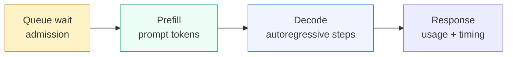
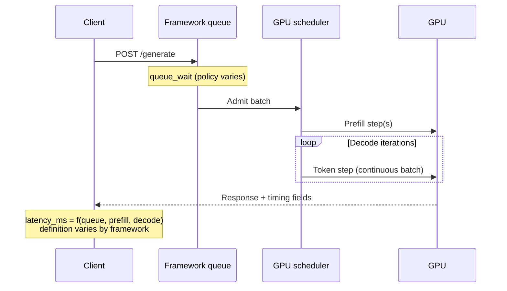
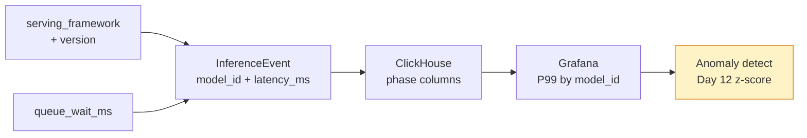

# Day 11 — AI Learning blog plan

**Workstream:** A3 · AI Learning (Profile)  
**Status:** Plan mode only — no HTML until user says `approve ai` / `implement ai` / `publish AI`.  
**Calendar day:** 11 of N · Saturday  
**Code dependency:** OSS-01 (VictoriaMetrics or Vector.dev first PR — informs how you read upstream queue/batch code)

---

## 1. Post metadata

| Field | Value |
|-------|--------|
| **Title (H1 / plan anchor)** | Day 11 — Serving Frameworks Compared as Queue Schedulers |
| **Public title format** | **Day 10 of Learning LLM Inference — Serving Frameworks Compared as Queue Schedulers** |
| **Subtitle** | vLLM vs TGI vs Ollama — scheduling policies, not logos |
| **Public kicker** | **Day 10 of N** (calendar day 11 → AI series index **N − 1**; 0-based) |
| **`ai.day_index` (filename + kicker)** | **10** — **not** 11 (`plan.json` drift; fix in admin § below) |
| **Format ID** | `patterns` — framework comparison essay; hook = queue model before benchmark score ([`docs/BLOG-FORMAT-MIX.md`](../BLOG-FORMAT-MIX.md); hint in [`data/blog-format-hints.json`](../../data/blog-format-hints.json) day `"11"`) |
| **Series** | `ai-learning` → `Profile/blog/series/ai-learning/` |
| **Slug / filename** | `day-10-serving-frameworks-queue-schedulers.html` |
| **Target HTML** | `Profile/blog/series/ai-learning/day-10-serving-frameworks-queue-schedulers.html` |
| **Canonical URL** | `https://akshantvats.github.io/Profile/blog/series/ai-learning/day-10-serving-frameworks-queue-schedulers.html` |
| **Hook (weave in cold open, not subtitle)** | Ask **"what's the queue model?"** before **"what's the benchmark score?"** |
| **Bridge (to today's code)** | OSS reading tonight (VM/Vector) is the same skill as reading vLLM/TGI scheduler source — name the queue before trusting latency. |
| **Daily Thread (verbatim — weave once in prose)** | Anomaly detection on model_id latency is only trustworthy if you understand how each serving framework reports time (OSS reading informs that). |
| **Word target** | 1,200–1,600 (patterns essay; shorter than Day 2 deep-dive) |
| **Mermaid** | **2–3 diagrams** (queue taxonomy + request lifecycle comparison + observability decomposition) |
| **Tags** | `AI Learning · 10 of N`, `LLM inference`, `vLLM`, `TGI`, `Ollama`, `Scheduling`, `Observability` |
| **`published_time`** | `2026-05-27` (adjust on ship; must be **newest** in AI Learning series) |
| **Sibling Experience post** | Reading VictoriaMetrics Source at 11pm — OSS as Interview Prep (**Experience 10 of N**) |

### Why `patterns` (not `deep-dive`)

- Topic is **synthesized comparison** across three stacks — not one mechanism developed end-to-end.
- Day 10 AI (`day-9-gpu-memory-management.html`) was **`deep-dive`** on VRAM tenants; today contrasts **policies**, not paging math.
- Day 12 AI (semantic cache) will be **`design`** — keep today's frame comparative, not tradeoff-table-only.

### Numbering fix (authoritative)

| Source | Wrong | Correct on calendar day 11 |
|--------|-------|----------------------------|
| `plan.json` → `ai.day_index` | `11` | **`10`** |
| HTML filename | `day-11-*` | **`day-10-serving-frameworks-queue-schedulers.html`** |
| Sidebar / `series-index.json` kicker | `Day 11 of N` | **`Day 10 of N`** |

Published AI posts already through **`day-9-gpu-memory-management.html`** (kicker Day 9 of N). Today adds index **10**.

---

## 2. Outline

Each H2 is a section in final HTML. Bullets are talking points — develop in prose, not listicle headers.

### H2 — The benchmark table lied (cold open)

- Scene: comparing vLLM vs TGI vs Ollama from a README throughput number — then watching **queue wait** dominate P99 while GPU sat idle (or the reverse: GPU saturated, queue flat).
- Thesis: **Serving frameworks are queue schedulers with different admission policies** — logos and tokens/sec tables hide that.
- Hook verbatim: before "what's the benchmark score?", ask **"what's the queue model?"** (FCFS? prefill-first? single-slot local?).
- One sentence Daily Thread weave (not a labeled block).
- **No** faux pager duty; **no** "textbooks teach X, production teaches Y" template.

### H2 — Prefill and decode are two queues wearing one jacket

- Callback **Day 1** (`day-1-kv-cache-memory-bandwidth.html`): prefill = parallel scan; decode = serial, memory-bandwidth-bound.
- Callback **Day 3** (`day-3-token-budgets-cost-structure.html`): `prefill_latency_ms` + `decode_latency_ms` should sum to explainable `latency_ms` — if the framework folds queue wait into "latency", your z-score lies.
- Define **phases** for the rest of the post:

| Phase | Scheduler question | Dominant resource |
|-------|-------------------|-------------------|
| **Queue wait** | Admission policy — when does work enter the GPU? | CPU / socket backlog |
| **Prefill** | Batch formation — how many prompt tokens per step? | Compute + HBM bandwidth |
| **Decode** | Slot policy — continuous batching or static batch? | KV cache + memory bandwidth |

- Pullquote candidate: *"Total latency is a sum of queue disciplines — not a single number the framework prints."*



### H2 — Continuous batching is the scheduler default (callback Day 2)

- Callback **Day 2** (`day-2-continuous-batching-vllm.html`): static batching = request-granularity bubbles; continuous batching = **decode-iteration** granularity; needs `queue_wait_ms`, `slot_id`, phase splits in observability.
- One paragraph only — do **not** re-teach PagedAttention or OS scheduler analogy (link Day 2).
- Bridge: **vLLM and modern TGI** assume continuous batching as the throughput path; **Ollama** often optimizes for **single-user simplicity** over multi-tenant slot packing.
- Forward constraint for comparison table: batching column = **static vs continuous vs hybrid (prefill/decode split)**.

### H2 — GPU memory sets the batch ceiling (callback Day 9)

- Callback **Day 9** (`day-9-gpu-memory-management.html`): four VRAM tenants (weights, activations, KV cache, overhead); **batch-size cliff** when KV cache exhausts headroom.
- Scheduler implication: a framework may **admit** requests until KV pressure triggers **preemption, swap, or reject** — different policies, same cliff.
- Tie: `batch_size_current`, `kv_cache_bytes` (proposed Day 9 fields) explain **why** two frameworks with "same continuous batching" diverge under long-context RAG (Day 8 retrieval fan-in).
- **Do not** repeat OOM-at-batch=4 narrative — one sentence + link.

### H2 — Three frameworks, three queue philosophies

Introduce comparison frame before the table:

- **vLLM** — production GPU server; scheduler-centric; continuous batching + PagedAttention; prefill/decode scheduling policies evolve by version (**verify on release notes**).
- **TGI (Text Generation Inference)** — Hugging Face server; Rust/Python boundary; continuous batching in current lines; strong **transformers** ecosystem defaults.
- **Ollama** — local/dev-first; simpler queue (often **one model loaded**, sequential or lightly parallel requests); GGUF/quantization path; not apples-to-apples on multi-tenant throughput benchmarks.

**DS analogy (required — one extended bridge):**

| Inference serving | Distributed systems parallel |
|-------------------|------------------------------|
| Request admission queue | **Kafka consumer lag** — work accepted vs work processed |
| Prefill batch formation | **Micro-batch flush** — size vs latency tradeoff |
| Continuous decode slots | **Goroutine / thread pool** with work stealing between short vs long tasks |
| KV cache memory ceiling | **Partition disk / buffer pool** — admission stops when headroom gone |
| Framework-reported `latency_ms` | **Client RTT** — may include queue wait the server never labels |

Develop in prose: at Delivery Hero scale, comparing OSRM instances by QPS without **queue depth + timeout policy** was meaningless — same mistake with vLLM vs Ollama bench charts.



### H2 — Comparison table (framework × queue × batching × memory)

**Primary table for the post** — render as HTML `<table>` in prose section (not screenshot).

| Dimension | **vLLM** | **TGI** | **Ollama** |
|-----------|----------|---------|------------|
| **Primary queue model** | Central scheduler queue; multi-request admission to GPU worker pool | Server request queue + internal batch queue; router optional in multi-GPU setups | Local process queue; typically **one loaded model** per runner; dev-oriented |
| **Admission / fairness** | Configurable scheduling (FCFS, priority classes in advanced configs); prefill/decode **chunked** scheduling in recent versions | Queue + batch builder; policy via server args / env | Mostly FIFO per model; less explicit fairness tuning |
| **Batching strategy** | **Continuous batching** default path; iteration-level decode; static batch legacy | **Continuous batching** (modern); static batch for older paths | Simpler batching; continuous features **version-dependent** — often **throughput-not-first** |
| **Memory / KV model** | **PagedAttention**; dynamic KV blocks; strong multi-tenant packing | Paged / flash attention integrations; model-dependent | GGUF weights; KV in process RAM/VRAM; **lower overhead, lower packing density** |
| **What `latency_ms` tends to include** | Server-side generate time; **may exclude** client/network unless instrumented end-to-end | Similar server-side focus; OpenTelemetry hooks in some deployments | Localhost-heavy; often feels "fast" because **no network queue** — misleading vs datacenter vLLM |
| **Observability maturity** | Prometheus metrics, scheduler stats in recent releases | HF metrics / OTel patterns | Minimal production metrics; **not** your LensAI cardinality target |
| **When to choose (honest)** | Multi-tenant GPU serving, throughput SLOs | HF model zoo, standardized server | Laptop / edge dev, single-user |

Footnote row under table: *All rows are policy summaries — verify against the version you deploy; this post is about **questions**, not vendor benchmarks.*

Secondary mini-table — **questions before trusting a benchmark**:

| Ask first | Why |
|-----------|-----|
| Concurrent clients? | Single-client Ollama vs 32-stream vLLM |
| Prompt length distribution? | Prefill-heavy RAG vs short chat |
| Output cap (`max_tokens`)? | Decode slot occupancy (Day 2) |
| KV / context length? | Memory cliff (Day 9) |
| Metric definition? | Queue included or not |

### H2 — What production metrics still miss

- Synthesize **patterns** lesson: benchmarks measure **one queue discipline**; production mixes tenants, context lengths, and model swaps.
- Cross-link Experience 10 (chaos) lightly: killing a broker exposed **which timers included retry wait** — frameworks do the same with queue vs GPU time.
- Name **failure modes** without incident narrative:
  - **Hidden queue growth** — GPU util looks fine (Day 9 `gpu_utilization_pct` vs queue depth decoupling from Day 2).
  - **Prefill storms** — RAG Day 8 retrieval + long prompts starve decode slots.
  - **False SLO green** — `latency_ms` at framework boundary excludes admission wait.

### H2 — LensAI bridge — `model_id` × latency you can trust

**Dedicated bridge paragraph (also expand to attr-box + proposed fields):**

Today's `InferenceEvent` in `infra-ai-streaming` already carries **`model_id`**, **`latency_ms`**, and optional **`prefill_latency_ms` / `decode_latency_ms`** (see [`ingest.rs`](https://github.com/akshantvats/infra-ai-streaming/blob/main/ingestion/src/handlers/ingest.rs)). That is necessary but not sufficient for cross-framework comparison: **`latency_ms` without `serving_framework` and queue-phase splits is a cardinality-friendly lie.**

Producers must attach:

1. **`model_id`** — rate card + anomaly baseline key (Day 3).
2. **`latency_ms`** — end-to-end **client-observed** or explicitly labeled **server-generate** (pick one convention per tenant).
3. **`prefill_latency_ms` + `decode_latency_ms`** — phase split (Day 1–2).
4. **Proposed for Day 10 post** (schema design — not necessarily shipped in code today):

| Field | Type | Why |
|-------|------|-----|
| `serving_framework` | String | `vllm` / `tgi` / `ollama` / `openai` — **do not** infer from `model_id` alone |
| `framework_version` | String | Scheduler behavior changes release-to-release |
| `queue_wait_ms` | u32 | Admission wait — Day 2 observability gap |
| `batch_size_at_start` | u16 | Admission snapshot — ties to Day 9 cliff |
| `scheduler_policy` | String | e.g. `continuous`, `static`, `unknown` — optional low-cardinality enum |

**Anomaly detection rule (preview Day 12 G-09):** z-score on `latency_ms` **per `model_id`** only works if `serving_framework` and phase fields are stable. Mixing Ollama local timings with vLLM cluster timings in one `model_id` series is the same bug as aggregating P99 across **shards** without labels — Experience 5 cardinality lesson applies to **time semantics**.



Constraint echo Day 3: **`queue_wait_ms + prefill_latency_ms + decode_latency_ms ≈ latency_ms`** (within noise) — if not, the framework is hiding a phase.

### H2 — Takeaway — read the scheduler, then the benchmark

- Punchline: **Framework choice is queue discipline choice** — vLLM, TGI, and Ollama differ less in "model quality" than in **admission, batching, and memory packing**.
- Humble scope: not claiming datacenter benchmarks; patterns for **LensAI producers** and **OSS reading** tonight.
- Forward tease Day 11 calendar / Day 12 AI index: semantic cache (exact vs ANN) — false positives land in the **same operational queue** as latency anomalies (plan thread for day 12).
- Sibling link: Experience 10 OSS reading post — same Daily Thread.

---

## 3. Comparison table (copy-ready for HTML)

Use §2 table **"Comparison table (framework × queue × batching × memory)"** as the canonical content. In HTML:

- `<h2 id="comparison">` or `id="framework-table"`
- Full-width `.prose table` matching Day 3 / Day 9 style
- Optional `attr-box.mine` for "questions before benchmark" mini-table

---

## 4. LensAI bridge paragraph (draft spine — for chat approval)

> LensAI ingests **`model_id`** and **`latency_ms`** on every event so finance and SLO dashboards can roll up by tenant. That only works if every producer agrees what **`latency_ms` measures**. vLLM's server timer, TGI's generate span, and Ollama's local process timing are **three different queue models** — not interchangeable under one `model_id`. Before Day 12's z-score on inference latency, producers should emit **`serving_framework`**, **`queue_wait_ms`**, and the **prefill/decode split** we already sketched on Day 2 and Day 3. Otherwise anomaly detection does not find model regression — it finds **framework migration**.

Expand with proposed fields table in §2.

---

## 5. Gold reference posts (Profile repo)

Read **full prose** from primary before drafting; skim secondary for HTML shell.

| Priority | Format | Path | Emulate |
|----------|--------|------|---------|
| **Primary (patterns tone)** | `patterns` | `blog/series/experience/ten-thousand-concurrent-requests-eks-patterns-delivery-hero.html` | Synthesized patterns, comparison tables, "questions before metrics" — **replace infra incident with scheduler comparison** |
| **Primary (AI voice)** | `deep-dive` | `blog/series/ai-learning/day-2-continuous-batching-vllm.html` | Queue/slot vocabulary, observability field list, Mermaid sequence — **do not duplicate batching tutorial** |
| **Secondary (memory callback)** | `deep-dive` | `blog/series/ai-learning/day-9-gpu-memory-management.html` | VRAM tenant table, proposed schema fields, attr-box pattern |
| **Secondary (schema / cost)** | `deep-dive` | `blog/series/ai-learning/day-3-token-budgets-cost-structure.html` | `InferenceEvent` field table, sum-to-total discipline |
| **HTML shell** | latest | `blog/series/ai-learning/day-9-gpu-memory-management.html` | Newest AI post — nav, cover, sidebar, Mermaid init, footer |

**Canonical base:** `https://akshantvats.github.io/Profile/blog/series/ai-learning/`

**Upstream docs (footnotes — verify at draft time):**

| Source | URL | Use |
|--------|-----|-----|
| vLLM scheduling / continuous batching | https://docs.vllm.ai/ | Queue + batching claims |
| TGI architecture | https://huggingface.co/docs/text-generation-inference/ | Server queue model |
| Ollama | https://github.com/ollama/ollama/blob/main/docs/faq.md | Local serving limits |

---

## 6. HTML + `series-index.json` checklist

Authoritative detail: [`blog/NEW-POST-CHECKLIST.md`](https://github.com/akshantvats/Profile/blob/main/blog/NEW-POST-CHECKLIST.md).

### Create post

- [ ] Branch: `docs/day-10-serving-frameworks-queue-schedulers` (or `feat/` if bundling cover script) off updated Profile `main`
- [ ] File: `blog/series/ai-learning/day-10-serving-frameworks-queue-schedulers.html`
- [ ] Copy structure from **Day 9** HTML (newest): nav, hero, `post-cover-wrap`, grid, TOC sidebar, Mermaid, author footer
- [ ] `#series-nav-mount` **`data-series-slug="ai-learning"`**
- [ ] Include `series-nav-dynamic.js` (same relative path as siblings)

### `<head>` required

- [ ] `<title>`: `Day 10 — Serving Frameworks Compared as Queue Schedulers (Learning LLM Inference) — Akshant Sharma`
- [ ] `og:title`: `Day 10 of Learning LLM Inference — Serving Frameworks Compared as Queue Schedulers`
- [ ] `meta description` + `og:description`: queue model before benchmark; vLLM vs TGI vs Ollama; LensAI `model_id` latency semantics
- [ ] `og:url`: canonical HTTPS URL (see §1)
- [ ] `og:image` + `twitter:image`: `https://akshantvats.github.io/Profile/blog/assets/og/day-10-serving-frameworks-queue-schedulers.png`
- [ ] `og:image:width` **1200**, `og:image:height` **630**
- [ ] `twitter:card` = `summary_large_image`
- [ ] `article:published_time` = **2026-05-27** (or actual ship date; **newest** in series)

### Body required

- [ ] Hero tag: `AI Learning · 10 of N` (matches kicker — **not** calendar day 11)
- [ ] Subtitle from plan: *vLLM vs TGI vs Ollama — scheduling policies, not logos*
- [ ] On-page cover after `</header>`:

```html
<div class="post-cover-wrap">
<figure class="post-cover">
  
</figure>
</div>
```

- [ ] `.post-meta` read time (~10–12 min)
- [ ] Mermaid: 2–3 diagrams (§2)
- [ ] Thread sentence + link to Experience 10 post (replace `TBD` before merge if Experience ships second)
- [ ] Cross-links to Day 2, Day 3, Day 9 (canonical URLs); no `file://`, `localhost`, `plans/drafts`

### Update `blog/series-index.json`

- [ ] Add entry **first** in `ai-learning.posts[]`:

```json
{
  "href": "blog/series/ai-learning/day-10-serving-frameworks-queue-schedulers.html",
  "kicker": "Day 10 of N",
  "title": "Serving Frameworks Compared as Queue Schedulers",
  "desc": "Ask the queue model before the benchmark score — vLLM vs TGI vs Ollama on admission, continuous batching, and KV memory, and why LensAI needs serving_framework on model_id latency."
}
```

- [ ] Kicker **Day 10 of N** matches hero tag, filename index **10**, and fixed `plan.json` `ai.day_index`

### Voice / format gates

- [ ] `patterns` smell test: synthesizes **3 frameworks + LensAI schema** — not a single-mechanism tutorial
- [ ] DS analogy section present (§2)
- [ ] No Daily Thread / OSS-01 / ticket IDs in body prose
- [ ] Verify vendor claims against docs footnotes — "verify on your version" hedge where needed

---

## 7. Cover / OG steps

**Slug:** `day-10-serving-frameworks-queue-schedulers`

### Preferred workflow (Profile repo)

```bash
cd /Users/akshant/Desktop/Github/Profile

# 1) Optional: content-aware prompt from draft HTML
python3 scripts/generate_covers_from_content.py --print-prompts

# 2) Save generated art → scripts/cover_generated/day-10-serving-frameworks-queue-schedulers.png
#    Motif: three parallel queues feeding one GPU; dark infra aesthetic

# 3) Register slug in scripts/generate_blog_covers.py SERIES_LABEL:
#    "day-10-serving-frameworks-queue-schedulers": "AI LEARNING SERIES",

python3 scripts/generate_blog_covers.py --from-content
# Or: python3 scripts/generate_blog_covers.py --rich
```

### Outputs (both required)

- `blog/assets/covers/day-10-serving-frameworks-queue-schedulers.png`
- `blog/assets/og/day-10-serving-frameworks-queue-schedulers.png`

### Cover rules

- **1200×630** PNG
- Badge: **`AI LEARNING SERIES`** + post title headline only
- **No** `Day 10 of N` on the PNG

### Preview

```bash
cd /Users/akshant/Desktop/Github/Profile
python3 -m http.server 8765
# Open: http://localhost:8765/blog/series/ai-learning/day-10-serving-frameworks-queue-schedulers.html
```

After Pages deploy: LinkedIn Post Inspector on `og:image` URL.

---

## 8. Definition of done

### Phase 1 (this document)

- [x] Plan written for user review
- [ ] User explicitly approves draft outline/prose in chat before HTML

### Phase 3 (implementation — after `approve ai` / `publish AI`)

- [ ] Chat draft: full prose + Mermaid source + comparison table
- [ ] User approves draft (CHECKLIST Phase 2 gate)
- [ ] HTML file matches Day 9 shell; **`Day 10 of N`** consistent everywhere
- [ ] Cover PNG in `covers/` + `og/`; `generate_blog_covers.py` SERIES_LABEL updated
- [ ] `series-index.json` updated; post sorts first on blog index
- [ ] Local preview verified by user (`http.server` **8765**)
- [ ] Sibling Experience 10 post linked with live canonical URL (no permanent `TBD`)
- [ ] User sign-off: **"approved — push and open PR"** before Profile push
- [ ] After Pages deploy: hard-refresh canonical URL + OG re-scrape

### Out of scope for A3 alone

- OSS-01 PR content (code agent) — footnote URL when available
- Experience 10 HTML (A2 workstream)
- Plan repo admin (§ below) — orchestration at day close unless user asks earlier

---

## Plan repo admin — day 11 close-out

Run when calendar day 11 ships (or morning pre-flight if user wants plan site current). **Local plan repo only — do not push to public remotes.**

### 1. Fix `data/plan.json`

| Day | Field | Action |
|-----|-------|--------|
| **9** | `status` | `"done"` |
| **10** | `status` | `"done"` |
| **11** | `status` | `"today"` (during day) → `"done"` at EOD |
| **11** | `ai.day_index` | **`10`** (was `11` — numbering drift) |

Optional consistency pass (known drift — fix when touching file):

- Day 9 `ai.day_index` should be **8** (published `day-8-rag-*`)
- Day 10 `ai.day_index` should be **9** (published `day-9-gpu-memory-*`)

Do **not** rename published Profile HTML; fix **`plan.json` forward** per CHECKLIST.

### 2. Bump `data/current-day.json`

```json
{ "current_day": 11 }
```

(Morning of day 11; at EOD bump to **12** when marking day 11 `done`.)

### 3. Regenerate plan site

```bash
cd /Users/akshant/Desktop/github/akshant-150-day-plan
python3 generate_plan.py
```

Confirm `index.html` row 11 = `today` (or `done` after close-out).

### 4. Commit (plan repo, local)

```bash
git add data/plan.json data/current-day.json docs/daily-plans/day-11-AI-LEARNING.md
git commit -m "$(cat <<'EOF'
docs(plan): add Day 11 AI Learning blog plan

Serving-frameworks comparison (Day 10 of N); fix ai.day_index drift
and document plan-site close-out for calendar day 11.
EOF
)"
```

---

## Cross-links (canonical — for implementation)

| Target | URL |
|--------|-----|
| AI Day 2 (continuous batching) | `https://akshantvats.github.io/Profile/blog/series/ai-learning/day-2-continuous-batching-vllm.html` |
| AI Day 3 (token / latency fields) | `https://akshantvats.github.io/Profile/blog/series/ai-learning/day-3-token-budgets-cost-structure.html` |
| AI Day 9 (GPU memory / batch cliff) | `https://akshantvats.github.io/Profile/blog/series/ai-learning/day-9-gpu-memory-management.html` |
| Experience 10 (OSS reading) | `https://akshantvats.github.io/Profile/blog/series/experience/reading-victoriametrics-source-oss-interview-prep.html` *(when live)* |
| infra-ai-streaming ingest schema | `https://github.com/akshantvats/infra-ai-streaming/blob/main/ingestion/src/handlers/ingest.rs` |

**Body sibling links (max 2):** Experience 10 + one prior AI day (Day 2 or Day 9). Others → footnote row.

---

*Plan artifact — local `akshant-150-day-plan` — Phase 1 only until user approves implementation.*
