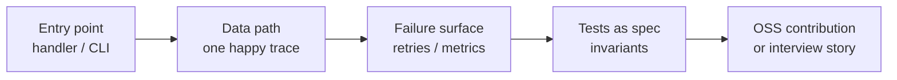
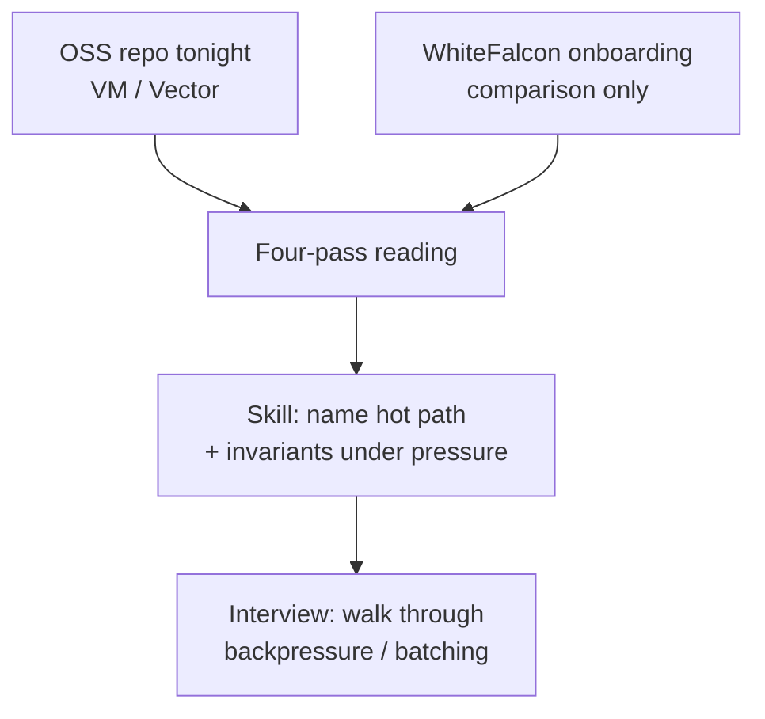
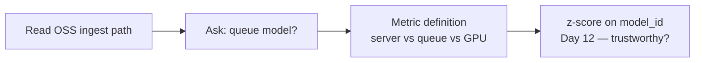

# Day 11 — Experience blog plan

**Workstream:** A2 · Experience (Profile)  
**Status:** Plan mode only — no HTML until user says `approve experience` / `implement experience`.  
**Calendar day:** 11 of N · Saturday  
**Code dependency:** OSS-01 (VictoriaMetrics or Vector.dev first PR — doc fix, benchmark, or reproducible bug report)

---

## 1. Post metadata

| Field | Value |
|-------|--------|
| **Title** | Reading VictoriaMetrics Source at 11pm — OSS as Interview Prep |
| **Subtitle** | What production Rust teaches that tutorials skip |
| **Public kicker** | **Experience 10 of N** (calendar day 11 → series index **N − 1**; 1-based) |
| **Format ID** | `patterns` — synthesized reading habits, not a postmortem ([`docs/BLOG-FORMAT-MIX.md`](../BLOG-FORMAT-MIX.md); hint in [`data/blog-format-hints.json`](../../data/blog-format-hints.json) day `"11"`) |
| **Series** | `experience` → `Profile/blog/series/experience/` |
| **Slug / filename** | `reading-victoriametrics-source-oss-interview-prep.html` |
| **Target HTML** | `Profile/blog/series/experience/reading-victoriametrics-source-oss-interview-prep.html` |
| **Canonical URL** | `https://akshantvats.github.io/Profile/blog/series/experience/reading-victoriametrics-source-oss-interview-prep.html` |
| **Bridge (to today's code)** | Today's OSS PR is practice for reading Agoda-scale codebases under time pressure — the skill transfers directly. |
| **Daily Thread (verbatim — weave once in prose)** | Anomaly detection on model_id latency is only trustworthy if you understand how each serving framework reports time (OSS reading informs that). |
| **Word target** | 1,400–1,800 |
| **Mermaid** | **2–3 diagrams** (reading workflow + production-Rust checklist + optional bridge to latency semantics) |
| **Tags** | `Experience Series · 10 of N`, `Open Source`, `Rust`, `VictoriaMetrics`, `Interview Prep`, `Observability` |
| **published_time** | `2026-05-23` (adjust on ship; must be **newest** in Experience series) |
| **Sibling AI post** | Day 11 — Serving Frameworks Compared as Queue Schedulers (`ai.day_index`: 10 on calendar day 11) |

### Why `patterns` (not `incident`)

- Day 10 Experience (`we-killed-redpanda-on-purpose-…`) is **`incident`** with evidence — do not stack another outage narrative.
- Topic is **OSS reading methodology** and transferable codebase literacy — fits **Lessons / patterns essay** in BLOG-FORMAT-MIX.
- Opening scene is **study-at-11pm**, not pager duty.

---

## 2. Outline

Each H2 is a section in the final HTML. Bullets are talking points, not copy-paste headers.

### H2 — The question interviews actually ask

- Cold open: **11pm, laptop, VictoriaMetrics repo** — not an alert, a deliberate study session before tomorrow's OSS PR (OSS-01).
- Thesis: Staff interviews rarely ask "did you read the docs?" — they ask **"walk me through how this system handles backpressure / batching / failure."** You cannot answer that from tutorials alone.
- One sentence bridge: the same muscle I used onboarding to **WhiteFalcon** (Agoda's Rust + Kafka TSDB) applies to any production codebase — find the hot path, name the invariants, ignore the rest until you need it.
- **No** "textbooks teach X, production teaches Y" template; **no** fake on-call page.

### H2 — A repeatable OSS reading pattern (four passes)

- **Pass 1 — Entry point:** `main`, HTTP handler, or the issue/PR file named in OSS-01. What request or config triggers work?
- **Pass 2 — Data path:** follow one sample write/read (ingest → buffer → flush → storage). Stop at the first `batch`, `channel`, or `sync.Pool` — that's where production Rust differs from hello-world.
- **Pass 3 — Failure surface:** `unwrap` vs `?`, retry loops, circuit breakers, metric names on error paths. Tutorials hide these; interviews probe them.
- **Pass 4 — Tests as spec:** `_test.go` / `*_test.rs` / integration fixtures — what the authors consider invariant.
- Table: **Tutorial focus vs production focus** (error handling, allocation, concurrency boundaries, observability hooks).



### H2 — What VictoriaMetrics (or Vector) teaches in one evening

- Anchor on **today's actual OSS target** — prefer VictoriaMetrics if OSS-01 lands there; Vector.dev is acceptable per ticket.
- Concrete file/function names **only from what you actually read during OSS-01** — do not invent VM internals.
- Likely themes (verify in source): **batch ingestion**, **low-allocation hot paths**, **label/cardinality discipline** — tie lightly to Experience 5 (RoaringBitmap/cardinality) without re-explaining that post.
- Short code fence: **real snippet** from upstream (≤15 lines) with link to GitHub line — not pseudocode dressed as production.
- Attribution: **I am reading as a contributor**, not claiming I built VictoriaMetrics.

### H2 — Same skill, Agoda scale (comparison only)

- **Agoda / WhiteFalcon** as **comparison anchor only** — resume-backed: 1.5T events/day TSDB, Rust + Kafka + Ceph, Apr–Sep 2024 Sr. SWE on core infra ([`docs/context/resume-extracted.md`](../context/resume-extracted.md)).
- Personal scope: cross-tier query work, cardinality indexing, compression — **not** "I owned the entire TSDB."
- Pattern transfer: onboarding to a million-line Rust codebase = **same four passes**, tighter time box, more `grep` and fewer Stack Overflow answers.
- **Do not** invent WhiteFalcon service topology, team names, or incident timelines not in resume or shipped Experience posts.
- One cross-link max in body to [`building-tsdb-at-agoda.html`](https://akshantvats.github.io/Profile/blog/series/experience/building-tsdb-at-agoda.html) (Experience 1).



### H2 — OSS PR as interview artifact

- OSS-01 deliverable: doc example, benchmark, or **reproducible bug report** — all count; link PR URL in footnote after merge (placeholder `TBD` in draft).
- Why recruiters/hiring managers care: shows **you can navigate unfamiliar code**, write a minimal repro, and accept review feedback — closer to day-one Staff work than LeetCode alone.
- Honest scope: first contribution may be small; the post is about **process**, not claiming maintainer status.
- Bridge to **infra-ai-streaming**: reading VM/Vector ingestion patterns informs how we instrument **model_id × tenant_id** latency without trusting framework-default timers blindly.

### H2 — Reading list for latency you can trust

- Setup for **tomorrow's anomaly detection** (G-09 on day 12) without implementing it today.
- Thread link: z-score on `model_id` latency fails if **prefill vs decode**, queue wait, or batching is folded into one number — OSS reading + AI Day 11 queue models are prerequisites.
- Table: **What to ask of any serving stack** before trusting its latency metric (queue model, phase split, batch boundary, client vs server clock).
- Forward-link to AI Learning Day 11 post (canonical URL when live; `TBD` in draft if not yet published).



### H2 — What I still get wrong

- Humble close: reading ≠ owning; small PRs ≠ architecture authority; VM/Vector != WhiteFalcon.
- One punchline (patterns posts end with insight, not summary): **Interview prep is codebase literacy under a clock** — OSS is the gym, production employers are the game.
- Optional footnote block: OSS PR link, infra-ai-streaming README, Experience 5 cardinality post.

---

## 3. Voice / tone rules

| Dimension | Target for Day 11 |
|-----------|-------------------|
| **Frame** | `patterns` essay — synthesized habits, one study scene, multiple employers as **comparison** |
| **POV** | **I** for reading sessions, OSS PR, interview prep; **we** only for Agoda team context with attribution box |
| **Opening** | Scene: late-night source reading, concrete repo name — **not** pager, **not** outage |
| **Authority** | Staff engineer explaining **how to read**, not performing heroics; cite real file paths from OSS-01 only |
| **Agoda** | Scale (1.5T/day) as **comparison** to illustrate transfer — label team vs personal scope in attr-box |
| **Rhythm** | Mix short lines at hooks with medium explanatory paragraphs; avoid listicle "5 tips" headers |
| **Analogies** | One extended bridge: **codebase reading ≈ tracing a request through unfamiliar infra** — develop once, return in closing |
| **Numbers** | OSS repo stats only if verifiable (GitHub stars, release notes); Agoda metrics from resume/public posts only |
| **Closings** | Reflection + honest limit — no engagement bait |

### Format-specific MUST (patterns)

- Synthesize **2+ contexts** (OSS tonight + Agoda onboarding comparison + tomorrow's latency trust).
- Include at least **one table** (tutorial vs production, or latency-trust checklist).
- **2–3 mermaid** diagrams — workflow / comparison, not outage timeline.

### Format-specific MUST NOT

- Do **not** open with incident/postmortem template (Day 10 owns that).
- Do **not** use Day 07 plan's "open with incident" rule — overridden by `patterns` format here.

---

## 4. What NOT to write

- **Fake outage** — no Redpanda/Kafka broker death, no "dashboard went red at 11pm" unless quoting Day 10 with explicit cross-reference.
- **Faux pager duty** — no "got paged", "SEV-1", "war room", "2am bridge" for this post.
- **Invented employer topology** — no new WhiteFalcon microservices, team reorgs, or Agoda incidents not in resume or published Experience posts.
- **VictoriaMetrics internals fiction** — no made-up function names, performance numbers, or architecture unless read in OSS-01 session.
- **Maintainer cosplay** — do not imply VM/Vector core authorship; contributor/l reader scope only.
- **Daily Thread / ticket IDs in body** — no `OSS-01`, `G-09`, `plans/drafts` in prose (PR link in footnote OK).
- **Listicle tone** — no "7 things production Rust teaches"; use narrative sections above.
- **Duplicate Day 10 chaos narrative** — link Experience 9 if rebalance/freshness is relevant; do not retell 47-minute gap story.
- **Hardcode 150** in public kickers — **Experience 10 of N** only.

---

## 5. Gold reference posts (Profile repo)

Read **full prose** from the primary gold post before drafting; skim secondary for HTML shell.

| Priority | Format | Path | Emulate |
|----------|--------|------|---------|
| **Primary** | `patterns` | `blog/series/experience/ten-thousand-concurrent-requests-eks-patterns-delivery-hero.html` | Synthesized patterns, tables, attr-boxes, bridge to today's stack — **but replace incident cold open with study scene** |
| **Secondary** | `feature` / arc | `blog/series/experience/building-tsdb-at-agoda.html` | WhiteFalcon scope boundaries, team vs mine boxes, Agoda comparison tone |
| **HTML shell** | latest | `blog/series/experience/we-killed-redpanda-on-purpose-chaos-as-commit-message.html` | Newest Experience post — copy nav, cover wrap, Mermaid init, footer, `series-nav-dynamic.js` |
| **Avoid emulating** | `incident` | `we-killed-redpanda-on-purpose-chaos-as-commit-message.html` | Structure/timeline — topic already served on day 10 |

**Canonical base:** `https://akshantvats.github.io/Profile/blog/series/experience/`

---

## 6. Context files to read before drafting

| File | Repo | Purpose |
|------|------|---------|
| [`data/plan.json`](../../data/plan.json) day 11 | plan | `experience`, `code` (OSS-01), `thread`, `ai` |
| [`data/blog-format-hints.json`](../../data/blog-format-hints.json) `"11"` | plan | Confirms `patterns` / no faux pager |
| [`docs/BLOG-FORMAT-MIX.md`](../BLOG-FORMAT-MIX.md) | plan | Format ID + patterns structure |
| [`docs/context/README.md`](../context/README.md) | plan | Mandatory pre-flight |
| [`docs/context/resume-extracted.md`](../context/resume-extracted.md) | plan | Agoda dates, WhiteFalcon scope, metrics labeling |
| [`CHECKLIST.md`](../../CHECKLIST.md) § Blog numbering | plan | Experience **(N−1) of N** |
| [`blog/NEW-POST-CHECKLIST.md`](https://github.com/akshantvats/Profile/blob/main/blog/NEW-POST-CHECKLIST.md) | Profile | Publish mechanics |
| **OSS-01 PR / local clone** | infra / upstream | Real file paths, snippet, PR URL for footnote |
| **VictoriaMetrics or Vector.dev** `good-first-issue` | upstream | Confirm contribution target matches prose |
| [`blog/series-index.json`](https://github.com/akshantvats/Profile/blob/main/blog/series-index.json) | Profile | Current newest = Experience 9 → today adds 10 |

**Not required for this post:** `delivery-hero-rider-tracking-system.md`, `pricing-system-architecture.md` (no DH/Wayfair topology in scope).

---

## 7. HTML checklist

Use [`blog/NEW-POST-CHECKLIST.md`](https://github.com/akshantvats/Profile/blob/main/blog/NEW-POST-CHECKLIST.md) as authoritative detail.

### Create post

- [ ] Branch: `docs/reading-victoriametrics-oss-interview-prep` (or `feat/` if bundling cover script tweak) off updated Profile `main`
- [ ] File: `blog/series/experience/reading-victoriametrics-source-oss-interview-prep.html`
- [ ] Copy structure from **Experience 9** HTML (newest): nav, hero, `post-cover-wrap`, grid, TOC sidebar, Mermaid, author footer
- [ ] `#series-nav-mount` **`data-series-slug="experience"`**
- [ ] Include `series-nav-dynamic.js` (same relative path as siblings)

### `<head>` required

- [ ] `<title>` + `og:title` — full post title
- [ ] `meta description` + `og:description` — excerpt for cards (OSS reading + interview prep angle)
- [ ] `og:url` — canonical HTTPS URL (see metadata above)
- [ ] `og:image` + `twitter:image` — `https://akshantvats.github.io/Profile/blog/assets/og/reading-victoriametrics-source-oss-interview-prep.png`
- [ ] `og:image:width` **1200**, `og:image:height` **630**
- [ ] `twitter:card` = `summary_large_image`
- [ ] `article:published_time` = **2026-05-23** (or actual ship date; **latest** in Experience series)

### Body required

- [ ] Hero tag: `Experience Series · 10 of N` (matches kicker — **not** calendar day 11)
- [ ] Subtitle from plan: *What production Rust teaches that tutorials skip*
- [ ] On-page cover after `</header>`:

```html
<div class="post-cover-wrap">
<figure class="post-cover">
  
</figure>
</div>
```

- [ ] `.post-meta` read time (~11–13 min)
- [ ] Mermaid blocks validated locally
- [ ] Thread sentence + link to AI Day 11 post (replace `TBD` before merge)
- [ ] Cross-links: canonical `https://akshantvats.github.io/Profile/...` only — no `file://`, `localhost`, `plans/drafts`

### Update `blog/series-index.json`

- [ ] Add entry **first** in `experience.posts[]`:

```json
{
  "href": "blog/series/experience/reading-victoriametrics-source-oss-interview-prep.html",
  "kicker": "Experience 10 of N",
  "title": "Reading VictoriaMetrics Source at 11pm — OSS as Interview Prep",
  "desc": "Four-pass OSS reading for Staff interviews: VictoriaMetrics/Vector hot paths, what production Rust teaches, Agoda WhiteFalcon comparison, and why latency metrics need a queue model first."
}
```

- [ ] No `addedAt` field
- [ ] Kicker **Experience 10 of N** matches hero tag and sidebar

---

## 8. Cover generation

**Slug:** `reading-victoriametrics-source-oss-interview-prep`

### Preferred workflow (Profile repo)

```bash
cd /Users/akshant/Desktop/Github/Profile

# 1) Optional: content-aware prompt from draft HTML
python3 scripts/generate_covers_from_content.py --print-prompts

# 2) Save generated art → scripts/cover_generated/reading-victoriametrics-source-oss-interview-prep.png
#    (GenerateImage or manual — dark infra aesthetic, code + metrics motif)

# 3) Register slug in scripts/generate_blog_covers.py SERIES_LABEL:
#    "reading-victoriametrics-source-oss-interview-prep": "EXPERIENCE SERIES",

python3 scripts/generate_blog_covers.py --from-content
# Or if using rich fallback:
python3 scripts/generate_blog_covers.py --rich
```

### Outputs (both required)

- `blog/assets/covers/reading-victoriametrics-source-oss-interview-prep.png`
- `blog/assets/og/reading-victoriametrics-source-oss-interview-prep.png`

### Cover rules

- **1200×630** PNG
- Badge: **`EXPERIENCE SERIES`** + post title headline only
- **No** `Experience 10 of N` on the PNG

---

## 9. Preview command

From Profile repo root:

```bash
cd /Users/akshant/Desktop/Github/Profile
python3 -m http.server 8765
```

**Open:**

- Post: `http://localhost:8765/blog/series/experience/reading-victoriametrics-source-oss-interview-prep.html`
- Series nav: confirm sidebar shows **Experience 10 of N** at top
- All posts index: `http://localhost:8765/blog/index.html`

**Pass criteria:**

- Mermaid renders (2–3 diagrams)
- Cover loads from `../../assets/covers/...`
- Theme toggle works
- No console errors on `series-nav-dynamic.js`
- Viewport `< 820px` hides sidebar gracefully

---

## 10. Definition of done

### Phase 1 (this document)

- [x] Plan approved by user
- [ ] User explicitly approves draft outline/prose in chat before HTML

### Phase 3 (implementation — after `approve experience`)

- [ ] OSS-01 complete — real upstream paths / PR URL available for footnote
- [ ] Draft prose passes **§3 voice** and **§4 what NOT to write** review
- [ ] HTML file in `blog/series/experience/` matches gold shell
- [ ] **`Experience 10 of N`** consistent: hero tag, meta line, `series-index.json` kicker
- [ ] Cover PNG in `covers/` + `og/`; `generate_blog_covers.py` SERIES_LABEL updated
- [ ] `series-index.json` updated; post sorts first on blog index by `published_time`
- [ ] Local preview (`http.server` **8765**) verified by user
- [ ] Sibling AI Day 11 post linked with live canonical URL (or ship Experience after AI — no permanent `TBD`)
- [ ] User sign-off: **"approved — push and open PR"** (or equivalent) before push
- [ ] Profile PR opened; after Pages deploy: hard-refresh canonical URL + LinkedIn Post Inspector for `og:image`

### Out of scope for this workstream

- Marking `plan.json` day 11 `done` (end-of-day orchestration)
- AI Learning Day 11 HTML (separate agent / approval)
- Pushing plan repo to any remote (local-only repo)

---

## Cross-links (canonical — for implementation)

| Target | URL |
|--------|-----|
| Experience 1 (Agoda arc) | `https://akshantvats.github.io/Profile/blog/series/experience/building-tsdb-at-agoda.html` |
| Experience 5 (cardinality) | `https://akshantvats.github.io/Profile/blog/series/experience/cardinality-is-the-silent-killer-roaringbitmap-lessons.html` |
| Experience 9 (chaos — cite only, don't retell) | `https://akshantvats.github.io/Profile/blog/series/experience/we-killed-redpanda-on-purpose-chaos-as-commit-message.html` |
| AI Day 11 (queue schedulers) | `https://akshantvats.github.io/Profile/blog/series/ai-learning/day-11-serving-frameworks-queue-schedulers.html` *(confirm filename when AI plan lands)* |
| infra-ai-streaming | `https://github.com/akshantvats/infra-ai-streaming` |
| OSS-01 PR | `TBD` — replace after merge |

**Body sibling links (max 2):** AI Day 11 + Experience 1 (or Experience 5 if cardinality tie-in is stronger). Others → footnote block.

---

## Draft smell test (pre-ship)

- [ ] Opening paragraph could **not** be swapped into Day 10 chaos post without edits
- [ ] At least one **attr-box** (team vs mine) for Agoda comparison scope
- [ ] Every VM/Vector claim traceable to OSS-01 reading notes or upstream docs
- [ ] No paragraph reads like CHECKLIST.md or a PR description
- [ ] Closing line is a standalone insight, not "in this post we covered…"
