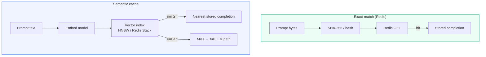
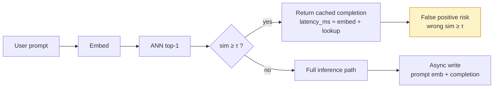
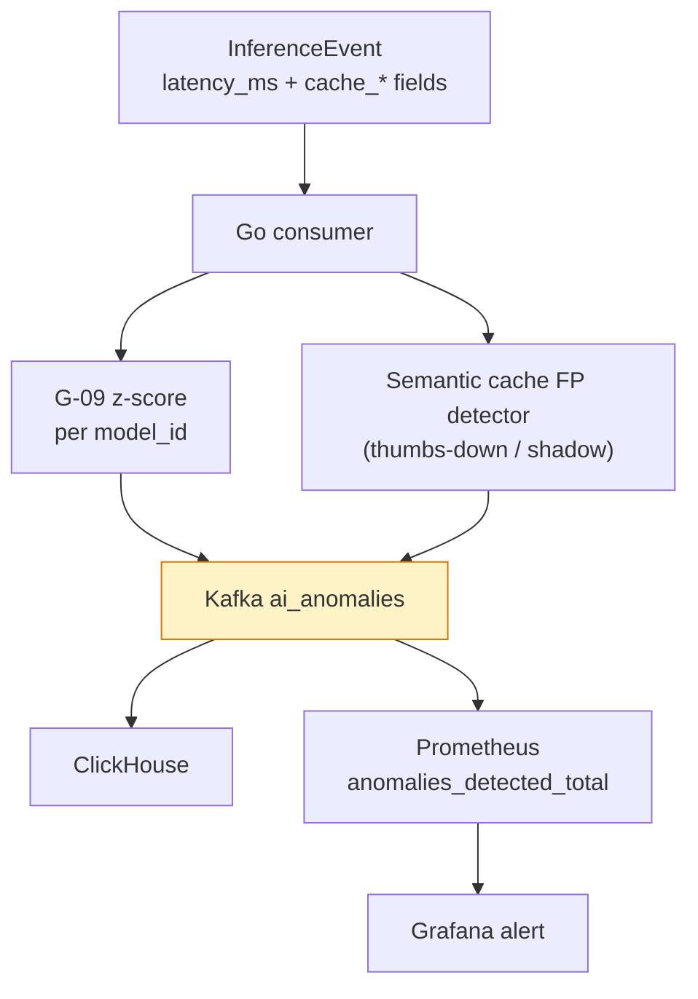

# Day 12 — AI Learning blog plan

**Workstream:** A3 · AI Learning (Profile)  
**Status:** Plan mode only — no HTML until user says `approve ai` / `implement ai` / `publish AI`.  
**Calendar day:** 12 of N · Sunday  
**Code dependency:** G-09 (z-score anomaly on `model_id` latency in Go consumer — exact rules upstream; semantic cache false positives downstream)

---

## 1. Post metadata

| Field | Value |
|-------|--------|
| **Title (H1 / plan anchor)** | Day 12 — Semantic Caching vs Exact-Match Redis |
| **Public title format** | **Day 11 of Learning LLM Inference — Semantic Caching vs Exact-Match Redis** |
| **Subtitle** | Embeddings as cache keys — false positive risk as SLA |
| **Public kicker** | **Day 11 of N** (calendar day 12 → AI series index **N − 1**; 0-based) |
| **`ai.day_index` (filename + kicker)** | **11** — **not** 12 (`plan.json` drift; fix in admin § below) |
| **Format ID** | `design` — cache architecture tradeoff essay; hook = ANN threshold as tail-latency SLO ([`docs/BLOG-FORMAT-MIX.md`](../BLOG-FORMAT-MIX.md); hint in [`data/blog-format-hints.json`](../../data/blog-format-hints.json) day `"12"`) |
| **Series** | `ai-learning` → `Profile/blog/series/ai-learning/` |
| **Slug / filename** | `day-11-semantic-caching-vs-exact-match-redis.html` |
| **Target HTML** | `Profile/blog/series/ai-learning/day-11-semantic-caching-vs-exact-match-redis.html` |
| **Canonical URL** | `https://akshantvats.github.io/Profile/blog/series/ai-learning/day-11-semantic-caching-vs-exact-match-redis.html` |
| **Hook (weave in cold open, not subtitle)** | A semantic cache hit is **approximate nearest neighbor with business consequences** — tune the similarity threshold like a tail-latency SLO. |
| **Bridge (to today's code)** | G-09's z-score on `latency_ms` per `model_id` is an **exact rule** on a numeric series; semantic cache is the **fuzzy rule** that must land in the same anomalies operational queue when it misfires. |
| **Daily Thread (verbatim — weave once in prose)** | The anomalies topic is where exact rules end — semantic cache false positives will land in the same operational queue. |
| **Word target** | 1,300–1,700 (`design` essay with options table + one mechanism deep enough to ship schema fields) |
| **Mermaid** | **2–3 diagrams** (cache lookup paths + threshold tradeoff + LensAI anomalies fan-in) |
| **Tags** | `AI Learning · 11 of N`, `LLM inference`, `Semantic cache`, `Redis`, `Embeddings`, `ANN`, `Observability` |
| **`published_time`** | `2026-05-28` (adjust on ship; must be **newest** in AI Learning series) |
| **Sibling Experience post** | OTA at Scale — At-Least-Once Is a Feature, Not a Bug (**Experience 11 of N**) |

### Why `design` (not `deep-dive` or `patterns`)

- Topic is **architecture choice**: exact-match Redis vs embedding-index semantic cache — options table → decision → rejected alternatives → consequences.
- Day 10 AI was **`patterns`** (framework comparison); Day 7 was **`deep-dive`** on provider prefix caching. Today contrasts **two cache key philosophies**, not one mechanism end-to-end.
- Day 13 AI (embeddings as time-series IDs) will be **`deep-dive`** — keep today's frame tradeoff-first, not ANN index internals.

### Numbering fix (authoritative)

| Source | Wrong | Correct on calendar day 12 |
|--------|-------|----------------------------|
| `plan.json` → `ai.day_index` | `12` | **`11`** |
| HTML filename | `day-12-*` | **`day-11-semantic-caching-vs-exact-match-redis.html`** |
| Sidebar / `series-index.json` kicker | `Day 12 of N` | **`Day 11 of N`** |

Published AI posts already through **`day-10-serving-frameworks-queue-schedulers.html`** (kicker Day 10 of N). Today adds index **11**.

---

## 2. Outline

Each H2 is a section in final HTML. Bullets are talking points — develop in prose, not listicle headers.

### H2 — The cache hit that was wrong (cold open)

- Scene: Redis exact-match cache returned a response in 4 ms — but the user question was **semantically different** from the stored prompt. Finance saw a "win"; product saw a wrong answer with high confidence.
- Thesis: **Semantic cache hit = ANN lookup with business consequences** — not a free latency optimization.
- Hook verbatim: tune similarity threshold **like a tail-latency SLO**, not like a ML leaderboard metric.
- One sentence Daily Thread weave (not a labeled block): exact z-score rules upstream; fuzzy cache rules downstream — both need an **anomalies queue**.
- **No** faux pager duty; **no** "Redis is dead" hot take.

### H2 — Three cache layers — do not conflate them

- Callback **Day 7** (`day-7-prompt-caching-infrastructure-layer.html`): **provider prefix cache** — byte-exact hash of prompt prefix on the API vendor's fleet; tiers on input pricing.
- Callback **Day 1** (`day-1-kv-cache-memory-bandwidth.html`): **session KV cache** — per-request decode state in GPU VRAM.
- **Today's layer:** **application semantic cache** — store `(prompt embedding → completion)` or `(prompt embedding → retrieval bundle)` in **your** infra (Redis + vector index), keyed by **meaning**, not bytes.

| Layer | Key | Hit condition | False positive mode |
|-------|-----|---------------|---------------------|
| Session KV (Day 1) | Token positions in one request | Same decode path | N/A (deterministic) |
| Provider prefix (Day 7) | Byte hash of prefix | Byte-identical prefix | Serializer drift (Day 7 lesson) |
| **Semantic app cache (Day 11)** | Embedding vector | cosine ≥ threshold | **Wrong answer, fast** |

Pullquote candidate: *"Exact caches fail on drift; semantic caches fail on similarity — pick your failure mode."*



### H2 — Exact-match Redis — when bytes are the contract

- **Mechanism:** `SET cache_key = hash(normalize(prompt) + model_id + temperature + …)` → JSON completion blob; TTL + LRU eviction.
- **Strengths:** Zero false positives (if normalization is correct); predictable latency; trivial audit ("this key matched these bytes").
- **Weaknesses:** Near-duplicate prompts miss; RAG context ordering (Day 8) breaks byte identity; multilingual paraphrase = 0% hit rate.
- **DS analogy (required — one extended bridge):**

| Exact Redis cache | Distributed systems parallel |
|-------------------|------------------------------|
| Cache key = content hash | **Content-addressable blob store** — same bytes, same object |
| Normalization pipeline | **Schema registry + canonical JSON** — Day 7 key-order lesson |
| TTL eviction | **Kafka retention** — stale answers expire |
| Miss → origin | **Cache-aside** on LLM gateway |

Develop in prose: at Wayfair, SKU visibility caches keyed on **canonical offer identity** worked; caches keyed on raw supplier JSON strings did not — semantic equivalence ≠ byte equivalence (callback Day 7).

- **When to choose:** Deterministic routing (Day 5), low paraphrase variance, compliance requires reproducible answers, cost sensitivity on **known-identical** traffic (support macros, fixed tool schemas).

### H2 — Semantic cache — embeddings as keys

- **Mechanism:** embed incoming prompt (same `embedding_model_id` as index — Day 8); ANN search top-1; if `similarity ≥ τ`, return stored completion without LLM call.
- **Index choices (high level — defer HNSW internals to Day 13):**

| Backend | Ops profile | Notes |
|---------|-------------|-------|
| Redis Stack / RediSearch vector | Colocated with existing Redis; good for &lt;1M entries | Same blast radius as rate-limit Redis |
| Dedicated vector DB (Qdrant, pgvector) | Write-heavy index rebuild | Strong metadata filters per tenant |
| In-process HNSW (RAG index reuse) | Lowest latency if already embedded for retrieval | Couples cache to retrieval pipeline |

- **False positive = SLA event:** wrong medical/finance/legal answer at 10 ms looks like success in latency dashboards — same class of "green metric, wrong decision" as Experience 4 quarantine lesson.
- **Threshold τ is not accuracy@k:** it is **maximum acceptable wrong-answer rate × business cost** — tune like P99 latency budget, not offline eval alone.



### H2 — Options table — exact vs semantic vs hybrid

**Primary table for the post** — render as HTML `<table>` in prose section.

| Dimension | **Exact-match Redis** | **Semantic (embedding) cache** | **Hybrid (recommended default)** |
|-----------|----------------------|--------------------------------|----------------------------------|
| **Key** | Hash of normalized bytes + routing attrs | Embedding vector + metadata filters | Exact key first; semantic on miss |
| **Hit rate driver** | Repeat identical prompts | Paraphrase + near-duplicates | Sum of both paths |
| **False positive risk** | None (if normalization correct) | **Non-zero** — tunable via τ | Bounded — semantic path only |
| **Invalidation** | TTL; version bump on `model_id` / prompt template | Re-embed on model change; index rebuild | Both — version `cache_schema_v` |
| **Latency on hit** | Sub-ms Redis RTT | Embed + ANN (ms– tens ms) | Best of whichever hits |
| **Observability** | `cache_hit`, `cache_key_hash` | `cache_hit`, `similarity_score`, `τ` | Split metrics per path |
| **Cost accounting** | Saved LLM $ obvious | Saved LLM $ **minus** embed cost **minus** FP remediation | Needs per-path line items (Day 3) |
| **When rejected alone** | Paraphrase-heavy chat | Compliance-only exact replay | Extra complexity — worth it at scale |

Footnote: *Hybrid is not "use both and hope" — define **exact path for deterministic traffic**, semantic path for long-tail paraphrase, and **never** semantic-only for regulated exact-replay flows.*

Secondary mini-table — **threshold tuning knobs**:

| Knob | Effect |
|------|--------|
| Raise τ | Fewer hits, fewer false positives |
| Add metadata filter (`tenant_id`, `model_id`, tool schema version) | Shrinks ANN search space — cardinality discipline |
| Require exact match on tool-call JSON suffix | Hybrid guardrail |
| Shadow mode (log would-be hits, don't serve) | Calibrate τ before production |

### H2 — False positive risk as operational SLA

- Define **FP rate budget** the way SRE defines error budget: e.g. "≤0.1% of semantic hits may be human-verified wrong."
- **Detection paths** (not all implemented Day 12 — schema design today):
  - User thumbs-down / regeneration signal
  - Downstream task failure (tool parse error spike)
  - **Human review sample** on high-similarity band just below τ (gray zone)
- Callback **Day 5** (`day-5-sampling-deterministic-routing.html`): deterministic hash routing for eval — semantic cache breaks determinism unless you **exclude** eval traffic or key on `trace_id` bucket.
- Callback **Day 3**: `cost_usd` must reflect **avoided** vs **actual** tokens — semantic hit should emit `cache_hit=true`, `llm_tokens_saved`, `embedding_cost_usd`.

Pullquote: *"A semantic cache optimizes dollars and milliseconds; a false positive spends trust — price both."*

### H2 — LensAI bridge — exact anomalies meet fuzzy cache events

**Dedicated bridge paragraph (expand to attr-box + G-09 alignment):**

Today's **G-09** code ships **exact rules** on numeric telemetry: z-score on `latency_ms` per `model_id`, sliding window **100 points**, flag when **>3σ**, emit to Kafka **`ai_anomalies`** topic, increment **`anomalies_detected_total`**, wire Grafana alert. That pipeline catches **statistical drift** — framework migration (Day 10), batch cliff (Day 9), retrieval inflation (Day 8).

Semantic cache false positives are **qualitative anomalies** — latency looks great, correctness does not. They belong in the **same operational queue** (`ai_anomalies` or sibling topic) with a different `anomaly_type`, not buried in support tickets.

**G-09 implementation sketch (for prose accuracy — verify in repo at draft time):**

| Component | Behavior |
|-----------|----------|
| Window | Per-`model_id` sliding buffer, last **100** `latency_ms` samples |
| Stat | Mean μ, std σ; z = `(x − μ) / σ` |
| Flag | z **> 3** (or σ = 0 guard — warm-up skip) |
| Emit | JSON anomaly event → **`ai_anomalies`** Kafka topic |
| Metrics | Prometheus **`anomalies_detected_total{model_id, type="latency_zscore"}`** |
| Alert | Grafana rule on rate increase |

**Proposed semantic-cache fields for `InferenceEvent` (schema design — ship in blog, code optional):**

| Field | Type | Why |
|-------|------|-----|
| `cache_layer` | String | `exact_redis` / `semantic` / `provider_prefix` / `none` |
| `cache_hit` | bool | Distinguish miss path for cost and latency |
| `cache_similarity_score` | f32 | ANN cosine — only on semantic path |
| `cache_threshold` | f32 | τ at decision time — auditability |
| `cache_key_hash` | String | Exact path fingerprint (low cardinality prefix ok) |
| `llm_tokens_saved` | u32 | Counterfactual tokens not billed |
| `anomaly_type` | String | `latency_zscore` / `semantic_cache_fp` / … — shared downstream |

**Unified anomalies fan-in:**



Bridge sentence for draft spine: *Exact z-score on latency catches **slow wrong**; semantic cache monitoring catches **fast wrong** — LensAI's anomalies topic is where both land so on-call does not split brain across Redis logs and Grafana P99.*

Constraint echo Day 8: **`retrieval_latency_ms + generate_latency_ms ≈ latency_ms`** still applies; on semantic hit, `generate_latency_ms ≈ 0` but **`embedding_latency_ms`** must appear or the sum lies.

### H2 — Takeaway — pick your failure mode deliberately

- Punchline: **Exact Redis when bytes are the contract; semantic cache when paraphrase is the traffic; hybrid when you need both — and never ship semantic cache without a false-positive budget wired to the same anomalies queue as G-09.**
- Humble scope: not prescribing a vendor; design questions for LensAI gateway producers.
- Forward tease Day 12 calendar / Day 13 AI index: embeddings as dense time-series IDs — HNSW under write load (plan thread).
- Sibling link: Experience 11 OTA / at-least-once — edge filtering before poison enters aggregates (Walmart bridge from plan).

---

## 3. Comparison table (copy-ready for HTML)

Use §2 table **"Options table — exact vs semantic vs hybrid"** as canonical content. In HTML:

- `<h2 id="comparison">` or `id="cache-options"`
- Full-width `.prose table` matching Day 7 / Day 10 style
- Optional `attr-box.mine` for threshold tuning mini-table

---

## 4. LensAI bridge paragraph (draft spine — for chat approval)

> G-09's z-score on **`latency_ms` per `model_id`** is an exact rule: 100-sample window, three-sigma flag, **`ai_anomalies`** topic, **`anomalies_detected_total`**. It catches statistical latency drift — the kind Day 10 warned about when `serving_framework` mixes under one key. Semantic cache is the fuzzy rule on the other side of the gateway: approximate nearest neighbor above threshold τ returns a completion without an LLM call. The failure mode is not slow — it is **wrong at 10 ms**. LensAI should emit **`cache_layer`**, **`cache_similarity_score`**, and route confirmed false positives into the **same anomalies operational queue** as G-09, with `anomaly_type=semantic_cache_fp`. Exact and fuzzy anomalies belong in one on-call stream — not separate Redis logs and Grafana P99.

Expand with proposed fields table in §2.

---

## 5. Gold reference posts (Profile repo)

Read **full prose** from primary before drafting; skim secondary for HTML shell.

| Priority | Format | Path | Emulate |
|----------|--------|------|---------|
| **Primary (design tone)** | `design` | `blog/series/ai-learning/day-7-prompt-caching-infrastructure-layer.html` | Cache layer taxonomy, provider vs app cache, `InferenceEvent` fields, options framing — **extend to semantic / Redis** |
| **Primary (tradeoff table)** | `design` | `blog/series/experience/supplier-apis-and-token-buckets-wayfair-circuit-breaker.html` | Options → decision → rejected alternatives table rhythm |
| **Secondary (AI voice)** | `patterns` | `blog/series/ai-learning/day-10-serving-frameworks-queue-schedulers.html` | LensAI bridge + attr-box proposed fields; Mermaid fan-in |
| **Secondary (RAG / embed callback)** | `deep-dive` | `blog/series/ai-learning/day-8-rag-as-infra-pipeline.html` | Embedding model versioning, retrieval score thresholds |
| **HTML shell** | latest | `blog/series/ai-learning/day-10-serving-frameworks-queue-schedulers.html` | Newest AI post — nav, cover, sidebar, Mermaid init, footer |

**Canonical base:** `https://akshantvats.github.io/Profile/blog/series/ai-learning/`

**Upstream docs (footnotes — verify at draft time):**

| Source | URL | Use |
|--------|-----|-----|
| Redis Stack vector search | https://redis.io/docs/latest/develop/get-started/vector-database/ | Semantic cache backend option |
| GPTCache / semantic cache patterns | https://github.com/zilliztech/GPTCache | Industry pattern reference (not endorsement) |
| Anthropic prompt caching (contrast) | https://docs.anthropic.com/en/docs/build-with-claude/prompt-caching | Exact prefix layer vs app semantic |

---

## 6. HTML + `series-index.json` checklist

Authoritative detail: [`blog/NEW-POST-CHECKLIST.md`](https://github.com/akshantvats/Profile/blob/main/blog/NEW-POST-CHECKLIST.md).

### Create post

- [ ] Branch: `docs/day-11-semantic-caching-vs-exact-match-redis` (or `feat/` if bundling cover script) off updated Profile `main`
- [ ] File: `blog/series/ai-learning/day-11-semantic-caching-vs-exact-match-redis.html`
- [ ] Copy structure from **Day 10** HTML (newest): nav, hero, `post-cover-wrap`, grid, TOC sidebar, Mermaid, author footer
- [ ] `#series-nav-mount` **`data-series-slug="ai-learning"`**
- [ ] Include `series-nav-dynamic.js` (same relative path as siblings)

### `<head>` required

- [ ] `<title>`: `Day 11 — Semantic Caching vs Exact-Match Redis (Learning LLM Inference) — Akshant Sharma`
- [ ] `og:title`: `Day 11 of Learning LLM Inference — Semantic Caching vs Exact-Match Redis`
- [ ] `meta description` + `og:description`: exact Redis vs embedding ANN cache keys; false positive SLA; G-09 anomalies queue bridge
- [ ] `og:url`: canonical HTTPS URL (see §1)
- [ ] `og:image` + `twitter:image`: `https://akshantvats.github.io/Profile/blog/assets/og/day-11-semantic-caching-vs-exact-match-redis.png`
- [ ] `og:image:width` **1200**, `og:image:height` **630**
- [ ] `twitter:card` = `summary_large_image`
- [ ] `article:published_time` = **2026-05-28** (or actual ship date; **newest** in series)

### Body required

- [ ] Hero tag: `AI Learning · 11 of N` (matches kicker — **not** calendar day 12)
- [ ] Subtitle from plan: *Embeddings as cache keys — false positive risk as SLA*
- [ ] On-page cover after `</header>`:

```html
<div class="post-cover-wrap">
<figure class="post-cover">
  
</figure>
</div>
```

- [ ] `.post-meta` read time (~11–13 min)
- [ ] Mermaid: 2–3 diagrams (§2)
- [ ] Thread sentence + link to Experience 11 post (replace `TBD` before merge if Experience ships second)
- [ ] Cross-links to Day 3, Day 7, Day 8, Day 10 (canonical URLs); no `file://`, `localhost`, `plans/drafts`, **no G-09 ticket ID in body**

### Update `blog/series-index.json`

- [ ] Add entry **first** in `ai-learning.posts[]`:

```json
{
  "href": "blog/series/ai-learning/day-11-semantic-caching-vs-exact-match-redis.html",
  "kicker": "Day 11 of N",
  "title": "Semantic Caching vs Exact-Match Redis",
  "desc": "Exact Redis when bytes are the contract; semantic cache when paraphrase is the traffic — tune ANN threshold like tail latency and wire false positives into the same anomalies queue as z-score latency detection."
}
```

- [ ] Kicker **Day 11 of N** matches hero tag, filename index **11**, and fixed `plan.json` `ai.day_index`

### Voice / format gates

- [ ] `design` smell test: options table → decision → hybrid recommendation — not a single-vendor tutorial
- [ ] DS analogy section present (§2 exact Redis)
- [ ] No Daily Thread / G-09 / ticket IDs in body prose (infra bridge describes behavior, not ticket labels)
- [ ] Distinguish three cache layers (Day 1 / Day 7 / Day 11) without re-teaching KV math

---

## 7. Cover / OG steps

**Slug:** `day-11-semantic-caching-vs-exact-match-redis`

### Preferred workflow (Profile repo)

```bash
cd /Users/akshant/Desktop/Github/Profile

# 1) Optional: content-aware prompt from draft HTML
python3 scripts/generate_covers_from_content.py --print-prompts

# 2) Save generated art → scripts/cover_generated/day-11-semantic-caching-vs-exact-match-redis.png
#    Motif: split path — exact hash key (green) vs embedding vector ANN (blue); shared anomalies sink

# 3) Register slug in scripts/generate_blog_covers.py SERIES_LABEL:
#    "day-11-semantic-caching-vs-exact-match-redis": "AI LEARNING SERIES",

python3 scripts/generate_blog_covers.py --from-content
# Or: python3 scripts/generate_blog_covers.py --rich
```

### Outputs (both required)

- `blog/assets/covers/day-11-semantic-caching-vs-exact-match-redis.png`
- `blog/assets/og/day-11-semantic-caching-vs-exact-match-redis.png`

### Cover rules

- **1200×630** PNG
- Badge: **`AI LEARNING SERIES`** + post title headline only
- **No** `Day 11 of N` on the PNG

### Preview

```bash
cd /Users/akshant/Desktop/Github/Profile
python3 -m http.server 8765
# Open: http://localhost:8765/blog/series/ai-learning/day-11-semantic-caching-vs-exact-match-redis.html
```

After Pages deploy: LinkedIn Post Inspector on `og:image` URL.

---

## 8. Definition of done

### Phase 1 (this document)

- [x] Plan written for user review
- [ ] User explicitly approves draft outline/prose in chat before HTML

### Phase 3 (implementation — after `approve ai` / `publish AI`)

- [ ] Chat draft: full prose + Mermaid source + options table
- [ ] User approves draft (CHECKLIST Phase 2 gate)
- [ ] HTML file matches Day 10 shell; **`Day 11 of N`** consistent everywhere
- [ ] Cover PNG in `covers/` + `og/`; `generate_blog_covers.py` SERIES_LABEL updated
- [ ] `series-index.json` updated; post sorts first on blog index
- [ ] Local preview verified by user (`http.server` **8765**)
- [ ] Sibling Experience 11 post linked with live canonical URL (no permanent `TBD`)
- [ ] G-09 behavior verified against `infra-ai-streaming` repo before publishing bridge paragraph
- [ ] User sign-off: **"approved — push and open PR"** before Profile push
- [ ] After Pages deploy: hard-refresh canonical URL + OG re-scrape

### Out of scope for A3 alone

- G-09 Go implementation (code agent / A1) — footnote repo link when merged
- Experience 11 HTML (A2 workstream)
- Plan repo admin (§ below) — orchestration at day close unless user asks earlier

---

## Plan repo admin — day 11 close-out → day 12 pre-flight

Run when calendar day 11 ships (morning of day 12, or EOD day 11). **Local plan repo only — do not push to public remotes.**

### 1. Fix `data/plan.json`

| Day | Field | Action |
|-----|-------|--------|
| **10** | `status` | `"done"` (if not already) |
| **11** | `status` | `"today"` during day 11 → **`"done"`** at close-out |
| **12** | `status` | **`"today"`** at start of calendar day 12 |
| **12** | `ai.day_index` | **`11`** (was `12` — numbering drift) |

Optional consistency pass (known drift — fix when touching file):

- Day 9 `ai.day_index` should be **8** (published `day-8-rag-*`)
- Day 10 `ai.day_index` should be **9** (published `day-9-gpu-memory-*`)
- Day 11 `ai.day_index` should be **10** (published `day-10-serving-frameworks-*`)

Do **not** rename published Profile HTML; fix **`plan.json` forward** per CHECKLIST.

### 2. Bump `data/current-day.json`

```json
{ "current_day": 12 }
```

(Morning of calendar day 12 — after day 11 marked `done`.)

### 3. Regenerate plan site

```bash
cd /Users/akshant/Desktop/github/akshant-150-day-plan
python3 generate_plan.py
```

Confirm `index.html` row 12 = `today`; row 11 = `done`.

### 4. Commit (plan repo, local)

```bash
git add data/plan.json data/current-day.json docs/daily-plans/day-12-AI-LEARNING.md
git commit -m "$(cat <<'EOF'
docs(plan): add Day 12 AI Learning blog plan

Semantic cache vs exact Redis (Day 11 of N); document G-09 anomalies
bridge and plan-site close-out for calendar day 11 → 12.
EOF
)"
```

**Note:** Admin commit may **include** `plan.json` + `current-day.json` status bumps if user runs close-out in same session; this Phase 1 commit is **plan doc only** unless close-out is executed.

---

## Cross-links (canonical — for implementation)

| Target | URL |
|--------|-----|
| AI Day 3 (token / cost fields) | `https://akshantvats.github.io/Profile/blog/series/ai-learning/day-3-token-budgets-cost-structure.html` |
| AI Day 7 (provider prefix cache) | `https://akshantvats.github.io/Profile/blog/series/ai-learning/day-7-prompt-caching-infrastructure-layer.html` |
| AI Day 8 (RAG / embedding model) | `https://akshantvats.github.io/Profile/blog/series/ai-learning/day-8-rag-as-infra-pipeline.html` |
| AI Day 10 (framework latency semantics) | `https://akshantvats.github.io/Profile/blog/series/ai-learning/day-10-serving-frameworks-queue-schedulers.html` |
| Experience 11 (OTA / at-least-once) | `https://akshantvats.github.io/Profile/blog/series/experience/ota-at-scale-at-least-once-is-a-feature.html` *(when live)* |
| infra-ai-streaming ingest schema | `https://github.com/akshantvats/infra-ai-streaming/blob/main/ingestion/src/handlers/ingest.rs` |

**Body sibling links (max 2):** Experience 11 + one prior AI day (Day 7 or Day 10). Others → footnote row.

---

*Plan artifact — local `akshant-150-day-plan` — Phase 1 only until user approves implementation.*
