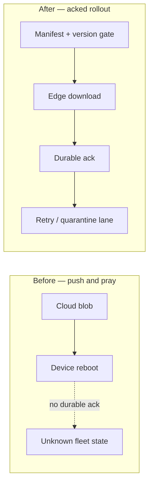
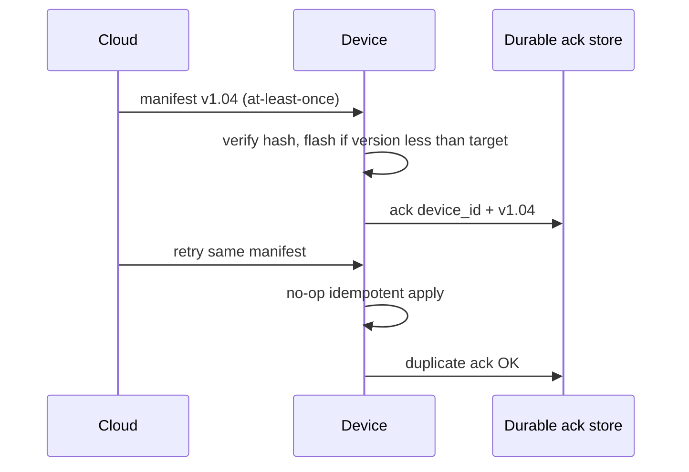
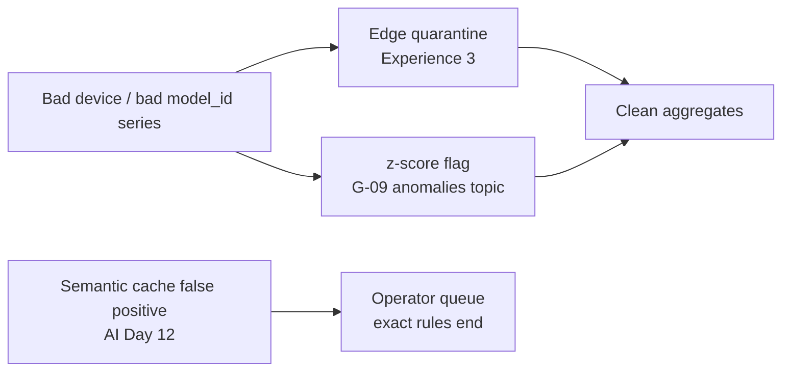

# Day 12 — Experience blog plan

**Workstream:** A2 · Experience (Profile)  
**Status:** Plan mode only — no HTML until user says `approve experience` / `implement experience`.  
**Calendar day:** 12 of N · Sunday  
**Code dependency:** Ticket G-09 — z-score anomaly detection in Go consumer (`ai_anomalies` topic, Prometheus counter, Grafana alert)

---

## 1. Post metadata

| Field | Value |
|-------|--------|
| **Title** | OTA at Scale — At-Least-Once Is a Feature, Not a Bug |
| **Subtitle** | Walmart · firmware · Kafka offsets in disguise |
| **Public kicker** | **Experience 11 of N** (calendar day 12 → series index **N − 1**; 1-based) |
| **Format ID** | `rollout` — migration / delivery semantics lesson, not a pager-duty post ([`docs/BLOG-FORMAT-MIX.md`](../BLOG-FORMAT-MIX.md); hint in [`data/blog-format-hints.json`](../../data/blog-format-hints.json) day `"12"`) |
| **Series** | `experience` → `Profile/blog/series/experience/` |
| **Slug / filename** | `ota-at-scale-at-least-once-is-a-feature.html` |
| **Target HTML** | `Profile/blog/series/experience/ota-at-scale-at-least-once-is-a-feature.html` |
| **Canonical URL** | `https://akshantvats.github.io/Profile/blog/series/experience/ota-at-scale-at-least-once-is-a-feature.html` |
| **Bridge (to today's code)** | z-score anomaly detection is edge filtering moved upstream — catch the bad device before it poisons aggregates. |
| **Daily Thread (verbatim — weave once in prose)** | The anomalies topic is where exact rules end — semantic cache false positives will land in the same operational queue. |
| **Word target** | 1,500–1,900 |
| **Mermaid** | **2–3 diagrams** (OTA topology before/after + at-least-once ack flow + bridge to upstream anomaly filtering) |
| **Tags** | `Experience Series · 11 of N`, `Walmart`, `IoT`, `OTA`, `At-Least-Once`, `Azure IoT Hub`, `Kafka` |
| **published_time** | `2026-05-24` (adjust on ship; must be **newest** in Experience series) |
| **Sibling AI post** | Day 12 — Semantic Caching vs Exact-Match Redis (`ai.day_index`: 12 on calendar day 12) |

### Why `rollout` (not `incident`)

- Day 10 Experience is **`incident`** (chaos rebalance gap); Day 11 is **`patterns`** (OSS reading). Stacking another outage narrative would blur the archive.
- Topic is **OTA delivery semantics under intermittent networks** — before/after topology, idempotent apply, metrics that proved rollout success. Fits **Rollout / migration lesson** in BLOG-FORMAT-MIX.
- Hint `"12"` explicitly: *Walmart OTA / at-least-once — migration lesson*.
- Opening scene is **firmware rollout constraint**, not pager duty.

---

## 2. Outline

Each H2 is a section in the final HTML. Bullets are talking points, not copy-paste headers.

### H2 — The problem textbooks mislabel

- Cold open: **millions of devices, intermittent Wi‑Fi/cellular, firmware image must land eventually** — not a broker death, a delivery-design problem.
- Thesis: **exactly-once OTA to edge hardware is a fiction**; the engineering question is whether duplicate delivery is **safe** (idempotent apply) or **poisonous** (wrong version applied twice with side effects).
- One sentence bridge: the same mental model I use for **Kafka consumer offsets** today — commit after side effects are safe, not after the packet arrived.
- **No** "dashboard went red"; **no** SEV template.

### H2 — Before and after: push OTA vs staged, acked rollout

- **Before (naive):** cloud pushes image → device reboots on first HTTP 200 → no durable ack → silent partial fleet.
- **After (WeIoT pattern):** staged manifest, version gate, durable device ack, retry with backoff, quarantine lane for devices that fail N times.
- Table: **Push-and-pray vs acked rollout** (visibility, rollback, blast radius, network tolerance).
- Resume anchor only: **WeIoT SmartBuildings**, Aug 2018 – May 2021, 7M+ sensors, Azure IoT Hub + Stream Analytics ([`docs/context/resume-extracted.md`](../context/resume-extracted.md)).
- **Do not** invent Azure service names, DPS tiers, or team org charts beyond resume + Experience 3 (IoT failure modes).



### H2 — At-least-once is a feature when apply is idempotent

- Explain **at-least-once** without apologizing: duplicates are cheaper than **lost** firmware on a refrigeration controller.
- **Idempotency keys in disguise:** device_id + target_version + image hash — apply once per unique triple, ignore replays.
- **Kafka offsets analogy (develop once):** consumer commits offset **after** idempotent write; OTA acks after **verified flash** — same ordering invariant, different transport.
- Short attr-box: **team** = platform-wide WeIoT OTA framework; **mine** = ingestion + rollout pipeline contributions (label honestly from resume — architected ingestion layer; OTA framework on resume bullet — do not claim sole authorship of entire OTA stack).
- Cross-link **Experience 3** once: silent wrong telemetry + identity discipline — OTA is where version drift becomes a data-plane bug ([`seven-million-iot-sensors-failure-modes.html`](https://akshantvats.github.io/Profile/blog/series/experience/seven-million-iot-sensors-failure-modes.html)).



### H2 — Intermittent networks change the SLO

- SLO shift: from **"all devices updated in 1 hour"** to **"99.9% fleet on target version within 72h; remainder quarantined"**.
- Metrics that proved rollout (name categories, not invented numbers unless user confirms): **ack rate by region**, **stuck-on-version count**, **quarantine depth**, **median time-to-ack under flaky RSSI**.
- Rollback plan: **manifest pointer revert** + block bad version at edge gateway — not "restore from backup" hand-waving.
- Honest limit: intermittent network ≠ infinite retry storm — cap retries, alert on quarantine growth.

### H2 — Edge filtering upstream (bridge to today's code)

- **Experience 3** put quarantine **at the edge** for poison telemetry; **G-09 today** moves statistical filtering **upstream of aggregates** — z-score on inference latency per `model_id` (sliding window 100, flag if >3σ).
- Same operational shape: **bad actor isolated before rollups lie** — device quarantine vs `ai_anomalies` Kafka topic.
- Thread weave (once): exact rules (version gates, deterministic Redis keys) end where **approximate** rules begin — semantic cache false positives and z-score flags both land in an **operator queue**, not a boolean pass/fail.
- Table: **Exact gate vs statistical gate** (OTA version match, Redis key hit, z-score threshold, semantic similarity threshold).
- Forward-link to AI Day 12 post (canonical URL when live; `TBD` in draft if not yet published).



### H2 — What I'd ship differently now

- Humble close: Azure IoT Hub era tooling ≠ today's Kafka-native stack; lessons transfer, components don't.
- One punchline (rollout posts end with operational insight): **Treat OTA like a consumer group with a poison-message lane** — at-least-once is only a bug when apply isn't idempotent.
- Footnote block: infra-ai-streaming README, Experience 3 link, AI Day 12 link when live.

---

## 3. Voice / tone rules

| Dimension | Target for Day 12 |
|-----------|-------------------|
| **Frame** | `rollout` — before/after topology, delivery semantics, verification metrics |
| **POV** | **I** for design choices and lessons; **we** for WeIoT platform work with attr-box scope |
| **Opening** | Scene: firmware fleet under flaky networks — **not** pager, **not** chaos test |
| **Authority** | Staff engineer explaining **delivery guarantees**, not war-story heroics |
| **Walmart** | Resume-backed: 7M+ sensors, OTA framework bullet, Azure IoT Hub — label team vs personal scope |
| **Rhythm** | Problem → topology change → idempotency → metrics → bridge; avoid timeline-of-outage prose |
| **Analogies** | **Kafka offsets ≈ OTA ack ordering** — develop once in §2–§3, return in closing |
| **Numbers** | Resume metrics + categories of rollout metrics; no invented "47% fleet bricked" unless sourced |
| **Closings** | Rollback/limit reflection — no engagement bait |

### Format-specific MUST (rollout)

- **Before/after** topology (diagram + table).
- **Rollback or quarantine** path named explicitly.
- **Metrics that proved success** (even as metric *categories* if exact dashboards aren't public).
- **2–3 mermaid** diagrams — topology / sequence / bridge, not incident timeline.

### Format-specific MUST NOT

- Do **not** open with incident/postmortem template (Day 10 owns chaos evidence).
- Do **not** retell Experience 3 failure-mode stories (spoofed device_id, refrigeration rollups) — **one cross-link max**.

---

## 4. What NOT to write

- **Fake outage** — no "firmware bricked 30% of stores", "SEV-1 OTA", "2am bridge" unless user provides sourced incident.
- **Invented Azure topology** — no new IoT Hub shards, DPS instances, or Stream Analytics job names not in resume/context.
- **Duplicate Experience 3** — no second essay on poison telemetry, cert rotation half-states, or device_id spoofing (cite + move on).
- **Exactly-once cosplay** — do not claim exactly-once OTA to edge; thesis is the opposite.
- **Wayfair pricing detail** — at-least-once Kafka patterns from [`pricing-system-architecture.md`](../context/pricing-system-architecture.md) are **analogy only** if mentioned; this post is **Walmart OTA**, not Delphi/Aletheia rollout (that's Experience 8).
- **Daily Thread / ticket IDs in body** — no `G-09`, `Ticket G-09`, `plans/drafts` in prose (repo/README links in footnote OK).
- **G-09 implementation dump** — bridge to z-score conceptually; no Go code paste from consumer (CODE agent owns that).
- **Hardcode 150** in public kickers — **Experience 11 of N** only.

---

## 5. Gold reference posts (Profile repo)

Read **full prose** from the primary gold post before drafting; skim secondary for HTML shell.

| Priority | Format | Path | Emulate |
|----------|--------|------|---------|
| **Primary** | `rollout` | `blog/series/experience/delphi-aletheia-feed-sub-second-price-visibility.html` | Before/after topology, phased rollout, verification metrics, attr-boxes — **swap Wayfair pricing for Walmart OTA** |
| **Secondary** | `deep-dive` / failure modes | `blog/series/experience/seven-million-iot-sensors-failure-modes.html` | Walmart voice, IoT scale, edge quarantine concept — **do not reuse opening or failure-mode sections** |
| **HTML shell** | latest | `blog/series/experience/reading-victoriametrics-source-oss-interview-prep.html` | Newest Experience post — `blog-diagrams.css` / `blog-diagrams.js`, cover wrap, `series-nav-dynamic.js` |
| **Avoid emulating** | `incident` | `we-killed-redpanda-on-purpose-chaos-as-commit-message.html` | Timeline/blameless postmortem structure |

**Canonical base:** `https://akshantvats.github.io/Profile/blog/series/experience/`

---

## 6. Context files to read before drafting

| File | Repo | Purpose |
|------|------|---------|
| [`data/plan.json`](../../data/plan.json) day 12 | plan | `experience`, `code` (G-09), `thread`, `ai` |
| [`data/blog-format-hints.json`](../../data/blog-format-hints.json) `"12"` | plan | Confirms `rollout` / OTA-at-least-once |
| [`docs/BLOG-FORMAT-MIX.md`](../BLOG-FORMAT-MIX.md) | plan | Format ID + rollout structure |
| [`docs/context/README.md`](../context/README.md) | plan | Mandatory pre-flight — **Walmart → resume** |
| [`docs/context/resume-extracted.md`](../context/resume-extracted.md) | plan | WeIoT dates, 7M+ sensors, OTA framework bullet, Azure IoT Hub |
| [`CHECKLIST.md`](../../CHECKLIST.md) § Blog numbering | plan | Experience **(N−1) of N** |
| [`blog/NEW-POST-CHECKLIST.md`](https://github.com/akshantvats/Profile/blob/main/blog/NEW-POST-CHECKLIST.md) | Profile | Publish mechanics |
| [`blog/series/experience/seven-million-iot-sensors-failure-modes.html`](https://akshantvats.github.io/Profile/blog/series/experience/seven-million-iot-sensors-failure-modes.html) | Profile | Prior Walmart post — cross-link only |
| [`blog/series-index.json`](https://github.com/akshantvats/Profile/blob/main/blog/series-index.json) | Profile | Current newest = Experience 10 → today adds **11** |
| **G-09 branch / README** | infra-ai-streaming | Anomaly topic name, metric names for accurate bridge (read only; don't paste ticket IDs in prose) |

**Not required for this post:** `delivery-hero-rider-tracking-system.md`, full `pricing-system-architecture.md` (unless brief at-least-once analogy).

---

## 7. HTML checklist

Use [`blog/NEW-POST-CHECKLIST.md`](https://github.com/akshantvats/Profile/blob/main/blog/NEW-POST-CHECKLIST.md) as authoritative detail.

### Create post

- [ ] Branch: `docs/ota-at-scale-at-least-once` (or `feat/` if bundling cover script tweak) off updated Profile `main`
- [ ] File: `blog/series/experience/ota-at-scale-at-least-once-is-a-feature.html`
- [ ] Copy structure from **Experience 10** HTML (newest): nav, hero, `post-cover-wrap`, grid, TOC sidebar, Mermaid, author footer
- [ ] `#series-nav-mount` **`data-series-slug="experience"`**
- [ ] Include `series-nav-dynamic.js` (same relative path as siblings)

### `<head>` required

- [ ] `<title>` + `og:title` — full post title
- [ ] `meta description` + `og:description` — excerpt for cards (OTA + at-least-once + idempotent apply angle)
- [ ] `og:url` — canonical HTTPS URL (see metadata above)
- [ ] `og:image` + `twitter:image` — `https://akshantvats.github.io/Profile/blog/assets/og/ota-at-scale-at-least-once-is-a-feature.png`
- [ ] `og:image:width` **1200**, `og:image:height` **630**
- [ ] `twitter:card` = `summary_large_image`
- [ ] `article:published_time` = **2026-05-24** (or actual ship date; **latest** in Experience series)

### Body required

- [ ] Hero tag: `Experience Series · 11 of N` (matches kicker — **not** calendar day 12)
- [ ] Subtitle from plan: *Walmart · firmware · Kafka offsets in disguise*
- [ ] On-page cover after `</header>`:

```html
<div class="post-cover-wrap">
<figure class="post-cover">
  
</figure>
</div>
```

- [ ] `.post-meta` read time (~12–14 min)
- [ ] Mermaid blocks validated locally
- [ ] Thread sentence + link to AI Day 12 post (replace `TBD` before merge)
- [ ] Cross-links: canonical `https://akshantvats.github.io/Profile/...` only — no `file://`, `localhost`, `plans/drafts`

### Update `blog/series-index.json`

- [ ] Add entry **first** in `experience.posts[]`:

```json
{
  "href": "blog/series/experience/ota-at-scale-at-least-once-is-a-feature.html",
  "kicker": "Experience 11 of N",
  "title": "OTA at Scale — At-Least-Once Is a Feature, Not a Bug",
  "desc": "Walmart WeIoT OTA under flaky networks: idempotent firmware apply, durable acks as Kafka offsets in disguise, quarantine lanes, and why z-score anomaly detection is edge filtering moved upstream."
}
```

- [ ] No `addedAt` field
- [ ] Kicker **Experience 11 of N** matches hero tag and sidebar

---

## 8. Cover generation

**Slug:** `ota-at-scale-at-least-once-is-a-feature`

### Preferred workflow (Profile repo)

```bash
cd /Users/akshant/Desktop/Github/Profile

# 1) Optional: content-aware prompt from draft HTML
python3 scripts/generate_covers_from_content.py --print-prompts

# 2) Save generated art → scripts/cover_generated/ota-at-scale-at-least-once-is-a-feature.png
#    (GenerateImage or manual — dark infra aesthetic, edge devices + firmware motif)

# 3) Register slug in scripts/generate_blog_covers.py SERIES_LABEL:
#    "ota-at-scale-at-least-once-is-a-feature": "EXPERIENCE SERIES",

python3 scripts/generate_blog_covers.py --from-content
# Or if using rich fallback:
python3 scripts/generate_blog_covers.py --rich
```

### Outputs (both required)

- `blog/assets/covers/ota-at-scale-at-least-once-is-a-feature.png`
- `blog/assets/og/ota-at-scale-at-least-once-is-a-feature.png`

### Cover rules

- **1200×630** PNG
- Badge: **`EXPERIENCE SERIES`** + post title headline only
- **No** `Experience 11 of N` on the PNG

---

## 9. blog-diagrams.css / blog-diagrams.js (theme-aware Mermaid)

Use the **shared diagram stack** from Experience 10 — do not inline one-off Mermaid theme init unless shell regression forces it.

### In `<head>` (after post-specific inline CSS or alongside it)

```html
<link rel="stylesheet" href="../../assets/blog-diagrams.css">
```

`blog-diagrams.css` supplies `.prose .mermaid` surface styling (border, padding, overflow) that tracks light/dark surfaces.

### Before `</body>` (order matters)

```html
<script src="https://cdn.jsdelivr.net/npm/mermaid@10/dist/mermaid.min.js"></script>
<script src="../../assets/blog-diagrams.js"></script>
<script src="../../series-nav-dynamic.js"></script>
```

`blog-diagrams.js`:

- Reads `data-theme` on `<html>` and picks **neutral** (light) vs **dark** Mermaid theme variables.
- Re-renders diagrams on `#theme-toggle` click so edges/labels stay readable after theme switch.
- Call pattern: load mermaid CDN → load `blog-diagrams.js` (auto-init) → no duplicate `mermaid.initialize` in post unless debugging.

### Authoring rules for diagrams

- Wrap each diagram: `<pre class="mermaid">…</pre>` inside `.prose`.
- Prefer `flowchart` / `sequenceDiagram` — avoid `classDiagram` unless necessary.
- Keep node labels short (line breaks with `\n` OK) — long labels break mobile overflow.
- **Preview both themes** before ship: toggle dark mode, confirm no white boxes or invisible edge labels.

---

## 10. Preview command

From Profile repo root:

```bash
cd /Users/akshant/Desktop/Github/Profile
python3 -m http.server 8765
```

**Open:**

- Post: `http://localhost:8765/blog/series/experience/ota-at-scale-at-least-once-is-a-feature.html`
- Series nav: confirm sidebar shows **Experience 11 of N** at top
- All posts index: `http://localhost:8765/blog/index.html`

**Pass criteria:**

- Mermaid renders in **light and dark** (2–3 diagrams; theme toggle re-render)
- Cover loads from `../../assets/covers/...`
- No console errors on `blog-diagrams.js` or `series-nav-dynamic.js`
- Viewport `< 820px` hides sidebar gracefully

---

## 11. Definition of done

### Phase 1 (this document)

- [x] Plan written
- [ ] User explicitly approves draft outline/prose in chat before HTML

### Phase 3 (implementation — after `approve experience`)

- [ ] G-09 merged or stubbed enough to name anomaly topic + metric accurately in bridge paragraph
- [ ] Draft prose passes **§3 voice** and **§4 what NOT to write** review
- [ ] HTML file in `blog/series/experience/` matches gold shell + **`blog-diagrams.css` / `blog-diagrams.js`**
- [ ] **`Experience 11 of N`** consistent: hero tag, meta line, `series-index.json` kicker
- [ ] Cover PNG in `covers/` + `og/`; `generate_blog_covers.py` SERIES_LABEL updated
- [ ] `series-index.json` updated; post sorts first on blog index by `published_time`
- [ ] Local preview (`http.server` **8765**) verified in both themes
- [ ] Sibling AI Day 12 post linked with live canonical URL (or ship Experience after AI — no permanent `TBD`)
- [ ] User sign-off: **"approved — push and open PR"** (or equivalent) before push
- [ ] Profile PR opened; after Pages deploy: hard-refresh canonical URL + LinkedIn Post Inspector for `og:image`

### Out of scope for this workstream

- Marking `plan.json` day 12 `done` (end-of-day orchestration)
- AI Learning Day 12 HTML (separate agent / approval)
- G-09 Go consumer implementation (CODE workstream)
- Pushing plan repo to any remote (local-only repo)

---

## Cross-links (canonical — for implementation)

| Target | URL |
|--------|-----|
| Experience 3 (Walmart IoT — cite only) | `https://akshantvats.github.io/Profile/blog/series/experience/seven-million-iot-sensors-failure-modes.html` |
| Experience 8 (rollout tone reference) | `https://akshantvats.github.io/Profile/blog/series/experience/delphi-aletheia-feed-sub-second-price-visibility.html` |
| Experience 10 (HTML shell) | `https://akshantvats.github.io/Profile/blog/series/experience/reading-victoriametrics-source-oss-interview-prep.html` |
| AI Day 12 (semantic cache) | `https://akshantvats.github.io/Profile/blog/series/ai-learning/day-12-semantic-caching-vs-exact-match-redis.html` *(confirm filename when AI plan lands)* |
| infra-ai-streaming | `https://github.com/akshantvats/infra-ai-streaming` |

**Body sibling links (max 2):** AI Day 12 + Experience 3. Experience 8 → footnote if needed.

---

## Draft smell test (pre-ship)

- [ ] Opening paragraph could **not** be swapped into Day 10 chaos post or Day 11 OSS-reading post without edits
- [ ] At least one **attr-box** (team vs mine) for WeIoT OTA scope
- [ ] Before/after table present; rollback/quarantine path named
- [ ] Experience 3 referenced **once** — no duplicated failure-mode essay
- [ ] Kafka-offset analogy appears **twice** (setup + closing), not scattered as throwaway
- [ ] No paragraph reads like CHECKLIST.md or a PR description
- [ ] Mermaid readable in dark mode after theme toggle
