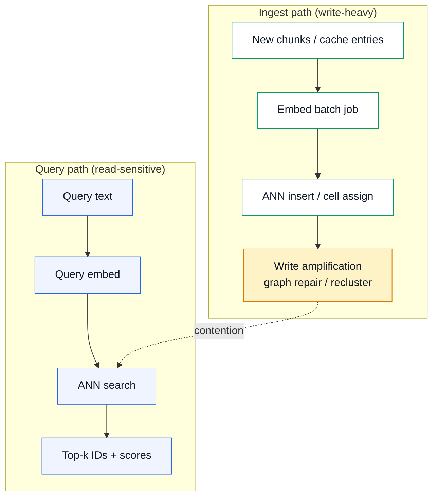
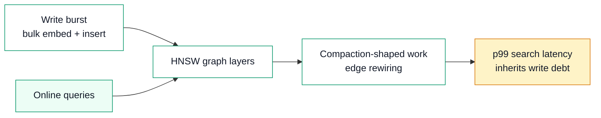
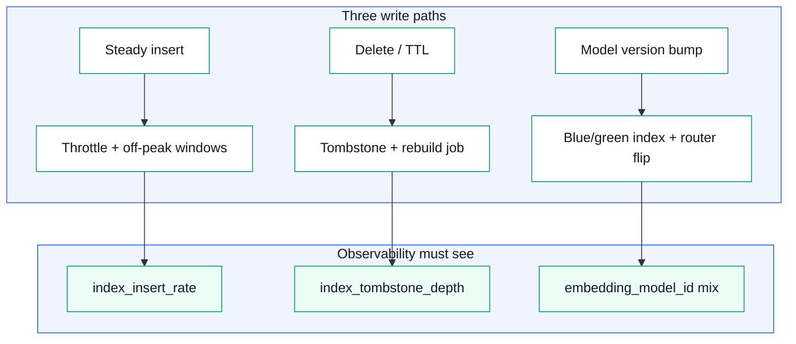

# Day 13 — AI Learning blog plan

**Workstream:** A3 · AI Learning (Profile)  
**Status:** Plan mode — full draft for user review; no HTML until `approve ai` / `implement ai` / `publish AI`.  
**Calendar day:** 13 of N · Monday  
**Code dependency:** Week 2 README polish (infra-ai-streaming hiring artifact); semantic cache + RAG embedding paths from Days 11–8

---

## Part A — Plan metadata

| Field | Value |
|-------|--------|
| **Title (H1 / plan anchor)** | Day 12 — Embeddings as Dense Time-Series IDs |
| **Public title format** | **Day 12 of Learning LLM Inference — Embeddings as Dense Time-Series IDs** |
| **Subtitle** | Vectors are just high-dimensional series with ANN indexes |
| **Public kicker** | **Day 12 of N** (calendar day 13 → AI series index **N − 1**) |
| **`ai.day_index` (filename + kicker)** | **12** |
| **Format ID** | `deep-dive` ([`docs/BLOG-FORMAT-MIX.md`](../BLOG-FORMAT-MIX.md); hint in [`data/blog-format-hints.json`](../../data/blog-format-hints.json) day `"13"`) |
| **Series** | `ai-learning` → `Profile/blog/series/ai-learning/` |
| **Slug / filename** | `day-12-embeddings-as-dense-time-series-ids.html` |
| **Target HTML** | `Profile/blog/series/ai-learning/day-12-embeddings-as-dense-time-series-ids.html` |
| **Canonical URL** | `https://akshantvats.github.io/Profile/blog/series/ai-learning/day-12-embeddings-as-dense-time-series-ids.html` |
| **Hook (weave in opening, not subtitle)** | HNSW under write load feels like SSTable compaction under read pressure — you've already ops'd this class of problem. |
| **Bridge (to today's code)** | Week-2 README documents the ingestion pipeline; embedding index ops belong in the same “design decisions + benchmarks + chaos” section as Kafka lag and ClickHouse flush — not as ML footnotes. |
| **Daily Thread (verbatim — weave once)** | Week-2 README closes infra-ai-streaming; tomorrow ebpf-llm-tracer extends observability to apps that will never install your SDK. |
| **Word target** | 1,500–2,500 (production draft below ≈ **2,050** words in Part B body) |
| **Mermaid** | **3 diagrams** (classDef `pipeline` / `exact` / `semantic` + accent per [`blog/DIAGRAM-STYLE.md`](https://github.com/akshantvats/Profile/blob/main/blog/DIAGRAM-STYLE.md)) |
| **Tags** | `AI Learning · 12 of N`, `Embeddings`, `HNSW`, `Vector index`, `ANN`, `LensAI` |
| **`published_time`** | `2026-05-29` (adjust on ship; newest in AI Learning series) |
| **Sibling Experience post** | Two Weeks, One README — Hiring Committees Scroll (Experience 12 of N) |

### Implementation checklist (pre-ship)

- [ ] User approves Part B prose in chat
- [ ] HTML from Day 11 shell + diagram verify script entry
- [ ] Cover PNG 1200×630 (`covers/` + `og/`)
- [ ] `series-index.json` first entry with kicker **Day 12 of N**
- [ ] Cross-links: Day 8 RAG, Day 11 semantic cache (body + footnotes)
- [ ] No employer AI product attribution; TSDB/Kafka parallels only for infra

### Cover prompt

**Slug:** `day-12-embeddings-as-dense-time-series-ids`  
**Motif:** High-dimensional point cloud morphing into a time-series strip (metric IDs on Y, dimensions on X); HNSW graph layer overlay in green; amber “write amplification” burst on insert path. Badge: **AI LEARNING SERIES** + title headline only — **no** “Day 12 of N” on PNG.

```bash
cd /Users/akshant/Desktop/Github/Profile
python3 scripts/generate_blog_covers.py --from-content  # after HTML draft exists
```

---

## Part B — FULL BLOG DRAFT

> **Voice note for implementer:** Paste sections below into HTML `<article class="prose">`. H2 `id` attributes suggested in parentheses. Reader-facing headings only.

---

### Opening

The on-call page said retrieval p99 was fine. Vector search was returning in eight milliseconds. What was red was **index build lag**: new document batches were landing faster than the HNSW graph could absorb inserts, and query latency had started to **variance-spike** right after every ingest job — not because reads got slower in isolation, but because reads were competing with a compaction-shaped write storm you never put on the dashboard.

That pattern is familiar if you've operated a time-series store at scale. Writes batch up; the storage engine reorganizes structures so reads stay fast; for a window after ingest, **read tail latency inherits write debt**. Embedding indexes are the same species of system. A float vector is not a metaphor — it is a **dense time-series sample** where the "timestamps" are fixed feature dimensions and the "series ID" is whatever business key you attach at the edge: `chunk_id`, `prompt_hash`, `tenant_id`, or the cache entry from yesterday's semantic layer.

Yesterday's post treated embeddings as **cache keys** — approximate nearest neighbor with a similarity threshold tuned like tail latency. The RAG post treated them as **pipeline fuel** — embed once, version immutably, pick HNSW or IVF for the corpus. Today is the layer underneath both: **what an embedding is operationally**, why ANN indexes behave like storage engines, and which fields you need in observability so "vector search is fast" does not become a lie the first time ingest outruns graph maintenance.

---

## The embedding is an ID, not a summary

A common onboarding mistake is to describe embeddings as "meaning compressed into numbers." That framing hides the operational contract. In production, an embedding functions as a **high-cardinality identifier in a metric space**: two texts that should retrieve together land near each other; texts that should not, land far apart. You do not query the vector for interpretability — you query it for **membership** in a neighborhood.

That is structurally the same job a time-series database does with `(series_id, timestamp, value)` tuples, except the value tuple is 768–1536 floats and "closeness" is cosine distance or dot product instead of calendar time.

| Concept | Time-series / metrics plane | Embedding / vector plane |
|---------|----------------------------|---------------------------|
| **Series identity** | `metric_name` + label set (`tenant`, `host`, …) | `chunk_id` / `doc_id` + metadata filters |
| **Observation** | Sample at `t` | Vector in ℝᵈ |
| **Query** | Range scan / aggregation over `t` | ANN: top-k neighbors by distance |
| **Cardinality risk** | Label explosion | Unbounded chunks + per-tenant indexes |
| **Schema change** | Rename / relabel breaks continuity | **New embedding model** invalidates the space |

The last row is the one teams underestimate. Changing `embedding_model_id` is not a config tweak — it is a **coordinate system migration**. Old vectors and new vectors are incomparable the same way two TSDB shards with different unit scales should never be averaged. Day 8 argued for versioning embeddings at ingest; Day 11 assumed the same model for cache lookup and index search. Today's rule is blunt: **one model version per index**, detect mixed versions in metadata, plan full re-embed + rebuild instead of incremental hope.

---

## ANN indexes are storage engines with recall knobs

Approximate nearest neighbor structures trade exactness for speed — like a covering index that occasionally returns the wrong row. The two engines you will actually operate are **HNSW** (hierarchical navigable small-world graph) and **IVF** (inverted file with Voronoi cells). Day 8 compared them for RAG capacity planning; here is the ops lens.

**HNSW** builds a multi-layer graph: sparse top layers for long jumps, dense bottom layer for local similarity. Inserts attach a node and wire edges subject to degree cap `M` and construction beam `efConstruction`. Queries expand a frontier controlled by `efSearch`. More edges and wider beams → better recall, more RAM, slower builds, more write amplification per insert.

**IVF** clusters vectors offline (or periodically), assigns each vector to a cell, and at query time probes the nearest `nprobe` cells. Cheaper memory, cheaper builds, but **recall depends on probe count** and cell quality degrades as data drifts — like partition pruning that goes stale until you rerun compaction.



Pullquote candidate: *"ANN recall is a tunable SLA — like choosing P99 over max — not a leaderboard score you set once in a notebook."*

---

## HNSW under write load — the SSTable compaction analogy

If you've run a large metrics or event store, you have seen **read amplification** after bulk load: LSM trees flush memtables, SSTables stack, compactions merge runs in the background, and meanwhile point reads pay extra IO. HNSW inserts rhyme with that shape.

Each new vector is a node that must find neighbors and possibly rewire existing edges to preserve small-world connectivity. Bulk ingest (nightly RAG refresh, semantic cache warmers, re-embed after model bump) is not O(1) per row — it is **graph maintenance at scale**. While maintenance runs, CPU and memory bandwidth contend with query traversals. p50 search can stay flat while **p99 spikes** — the same signature as TSDB compactions stealing disk headroom.

| Signal | TSDB / Kafka parallel | Vector index parallel |
|--------|----------------------|------------------------|
| Bulk backfill | Topic replay, lag spike | Nightly embed job + insert storm |
| Background merge | SSTable compaction | HNSW edge repair / IVF recluster |
| Read during merge | Higher P99 on range queries | Higher P99 on ANN after ingest |
| Capacity knob | Partition count, retention | `M`, `efConstruction`, shard count |
| "Fast enough" trap | Mean looks fine | p50 ANN fine, p99 awful post-ingest |

You already know how to ops this class: **separate write windows from peak query traffic**, throttle ingest concurrency, watch **tail** not mean, and put build/recall metrics next to query metrics — not in a Jupyter footer.



---

## Cardinality, sharding, and filters — the label-set problem

Vector indexes inherit **cardinality** failure modes from metrics systems. A single global index of every tenant's chunks sounds simple until one tenant's catalog is 10× the others and graph traversal hotspots skew recall. Metadata filters (`tenant_id`, `product_line`, `doc_type`) before ANN search are the vector equivalent of **label matchers** — they shrink the candidate set the same way `tenant_id` in a PromQL selector shrinks series fan-out.

Sharding choices mirror TSDB / Kafka partition design:

| Strategy | When it works | Failure mode |
|----------|---------------|--------------|
| **One global index** | Small corpus, uniform tenants | Hotspots, noisy neighbors across tenants |
| **Per-tenant shard** | Strong isolation, compliance | Operational shard count explosion |
| **Per-tenant index + router** | Medium scale SaaS | Router bugs → cross-tenant retrieval |
| **Hybrid: coarse shard + filter** | Large multi-tenant | Filter too weak → still hot |

Day 6 in the Experience series was about Prometheus label cardinality walls at Agoda scale — not about embeddings, but the discipline transfers: **cap dimensions you index**, push high-cardinality identity into controlled metadata, and never let "we'll filter in application code" substitute for index design.

For **semantic cache** (Day 11), cardinality is prompt paraphrase × tools × model version. For **RAG** (Day 8), it is chunk count × embedding version. Same storage engine, different ID namespaces — do not mix them in one graph without explicit `namespace` metadata.

---

## Distance metric, normalization, and score semantics

Cosine similarity, dot product, and L2 distance are not interchangeable UI labels — they change which neighbors are "near." Most text embedding APIs emit **L2-normalized** vectors where cosine and dot product rank identically; if your index assumes one metric and your scorer another, cache thresholds (`τ` from Day 11) and retrieval cutoffs drift silently.

Operational checklist:

1. **Freeze metric** in index config and in observability (`distance_metric` field).
2. **Store raw scores** on the query path (`retrieval_score_max` / `cache_similarity_score`) — do not only store boolean hit/miss.
3. **Calibrate thresholds per model version** — τ for `text-embedding-3-small` is not portable to a different dimensionality.

```python
# Illustrative: scores must be comparable within one model version + metric
event = {
    "embedding_model_id": "text-embedding-3-small@v1",
    "distance_metric": "cosine",
    "retrieval_score_max": 0.82,      # RAG path
    "cache_similarity_score": 0.91,   # semantic cache path (Day 11)
    "cache_threshold": 0.88,
}
```

---

## Write paths that actually hurt — inserts, deletes, model bumps

Three write operations show up in every mature deployment:

**Steady-state insert** — new chunks or cache entries between compactions. Tune batch size and concurrency so graph repair stays off the query critical path.

**Delete / TTL** — semantic cache entries expire; RAG docs deprecate. HNSW deletes are often **logical** (tombstone + periodic rebuild) because hard deletion is expensive — like TSDB tombstones until compaction reclaims space.

**Model bump** — full re-embed, index rebuild, dual-write window if you must serve during migration. This is a **blue/green index cutover**, not a rolling config change.



---

## Bridges — semantic cache and RAG revisited

**Day 11 — Semantic caching** treated the embedding as a **fuzzy key** into stored completions. The ANN threshold `τ` is a product SLA, not offline accuracy. Everything today about write amplification and p99 spikes applies directly: if your cache indexer rebuilds while lunch-traffic queries run, you will see **fast wrong answers** (bad τ) and **slow right misses** (contended graph) in the same dashboard — wire both to the anomalies queue Day 11 described alongside z-score latency rules.

**Day 8 — RAG pipeline** separated ingest-time embed/index from query-time retrieve. Today's addition: **ingest is the compaction scheduler**. Batch embed jobs should publish `index_build_latency_ms` and `vectors_inserted` the same way ClickHouse flush metrics publish batch duration — otherwise retrieval p99 is a lagging indicator.

| Path | Embedding role | Index stress | Dominant risk |
|------|----------------|-------------|---------------|
| RAG corpus (Day 8) | Chunk identity in knowledge base | Bulk nightly ingest | Recall collapse + retrieval p99 |
| Semantic cache (Day 11) | Paraphrase key for completions | Steady insert + TTL | False positive at low latency |
| Shared mistake | Mixed `embedding_model_id` | Single graph | Silent neighbor garbage |

---

## LensAI — index ops belong in InferenceEvent

`infra-ai-streaming` already carries token and cost fields; RAG fields were proposed on Day 8, cache fields on Day 11. For embedding **index operations**, add facts that separate **search** from **build**:

| Field | Type | Why |
|-------|------|-----|
| `embedding_model_id` | string | Coordinate system version (required everywhere) |
| `distance_metric` | string | `cosine` / `dot` / `l2` — audit threshold math |
| `index_type` | string | `hnsw` / `ivf` / `flat` |
| `index_shard_id` | string | Router target — low cardinality |
| `index_operation` | string | `query` / `insert` / `rebuild` |
| `ann_latency_ms` | u32 | Query-side ANN only |
| `index_build_latency_ms` | u32 | Ingest / rebuild jobs (off hot path but must exist) |
| `vectors_inserted` | u32 | Batch size for write storms |
| `ef_search` / `nprobe` | u16 | Recall knob at query time |
| `recall_at_k` | f32 | Optional offline probe sample — guardrail metric |

Week-2 README polish is the right surface for **design decisions**: why HNSW for sub-10M corpora, when to shard by `tenant_id`, how chaos tests replay bulk embed without poisoning demo Grafana. Hiring committees do not need "we use vectors" — they need **evidence you know write amplification exists**.

Constraint echo: on pure cache hits, `ann_latency_ms` may be zero while `embedding_latency_ms` (Day 11) dominates; on RAG misses, `retrieval_latency_ms` (Day 8) should approximate `embedding_latency_ms + ann_latency_ms`. If sums do not close, you are missing a stage.

---

## Takeaway

Embeddings are **dense series IDs** living inside ANN storage engines that inherit compaction, cardinality, and schema-migration semantics from the data plane you already run. HNSW under ingest load is not a GPU problem — it is **write amplification meeting read SLOs**. Operate it with the same instincts as TSDB compactions and Kafka replay: throttle writes, watch p99, version the coordinate system, and instrument build separately from search.

Pick HNSW when RAM fits and query p99 is the hero metric; pick IVF when the corpus outgrows memory and you can tune `nprobe` like partition fan-out. Never ship semantic cache or RAG without `embedding_model_id` and score fields — or you will tune thresholds on a dashboard that lies.

Tomorrow's arc moves observability to workloads that will never install your SDK (eBPF). Today's job is to make the vector layer **boring on call** — because "eight millisecond search" is only true when nobody is rebuilding the graph underneath you.

---

### Footnotes & cross-links (for HTML `footnote-row`)

| Target | URL |
|--------|-----|
| AI Day 8 — RAG as infra pipeline | `https://akshantvats.github.io/Profile/blog/series/ai-learning/day-8-rag-as-infra-pipeline.html` |
| AI Day 11 — Semantic caching vs Redis | `https://akshantvats.github.io/Profile/blog/series/ai-learning/day-11-semantic-caching-vs-exact-match-redis.html` |
| AI Day 6 — Quantization (vector quantization callback) | `https://akshantvats.github.io/Profile/blog/series/ai-learning/day-6-quantization-vs-compression-tradeoffs.html` |
| HNSW (Malkov & Yashunin) | `https://arxiv.org/abs/1603.09320` |
| FAISS IVF docs | `https://github.com/facebookresearch/faiss/wiki/Faiss-indexes` |

**Body sibling links (max 2):** Day 8 + Day 11 in prose; others footnote only.

---

## Part C — HTML implementation notes

Authoritative: [`blog/NEW-POST-CHECKLIST.md`](https://github.com/akshantvats/Profile/blob/main/blog/NEW-POST-CHECKLIST.md).

### Create post

- [ ] Branch: `feat/day-12-embeddings-as-dense-time-series-ids` off Profile `main`
- [ ] File: `blog/series/ai-learning/day-12-embeddings-as-dense-time-series-ids.html`
- [ ] Shell: copy **Day 11** (newest AI) — includes `blog-diagrams.css` + `blog-diagrams.js`
- [ ] `#series-nav-mount` **`data-series-slug="ai-learning"`**

### `<head>` required

- [ ] `<title>`: `Day 12 — Embeddings as Dense Time-Series IDs (Learning LLM Inference) — Akshant Sharma`
- [ ] `og:title`: `Day 12 of Learning LLM Inference — Embeddings as Dense Time-Series IDs`
- [ ] `meta description` + `og:description`: dense vectors as series IDs; HNSW write amplification; IVF ops; bridges to RAG + semantic cache
- [ ] `og:url`: canonical HTTPS (Part A)
- [ ] `og:image` + `twitter:image`: `.../blog/assets/og/day-12-embeddings-as-dense-time-series-ids.png`
- [ ] `og:image:width` **1200**, `og:image:height` **630**
- [ ] `article:published_time` = ship date (newest in series)

### Body required

- [ ] Hero tag: `AI Learning · 12 of N`
- [ ] Subtitle from plan (Part A)
- [ ] Cover after `</header>`:

```html
<div class="post-cover-wrap">
<figure class="post-cover">
  
</figure>
</div>
```

- [ ] `.post-meta` read time ~12–14 min
- [ ] **3** Mermaid blocks — classDef pattern from DIAGRAM-STYLE.md; register in verify script
- [ ] No Daily Thread label, ticket IDs, or `plans/drafts` paths in body

### `blog/series-index.json`

Add **first** in `ai-learning.posts[]`:

```json
{
  "href": "blog/series/ai-learning/day-12-embeddings-as-dense-time-series-ids.html",
  "kicker": "Day 12 of N",
  "title": "Embeddings as Dense Time-Series IDs",
  "desc": "Vectors are high-cardinality series in ANN storage engines — HNSW write amplification, IVF sharding, embedding model migrations, and observability fields that separate index build from search."
}
```

### `scripts/verify-blog-diagrams.mjs`

```javascript
{
  slug: 'day12',
  path: 'blog/series/ai-learning/day-12-embeddings-as-dense-time-series-ids.html',
  diagrams: 3,
  requiredClassDefs: ['pipeline', 'exact', 'semantic'],
}
```

Run: `node scripts/verify-blog-diagrams.mjs --slug day12` → exit **0**.

### `scripts/generate_blog_covers.py`

Add SERIES_LABEL entry: `"day-12-embeddings-as-dense-time-series-ids": "AI LEARNING SERIES",`

---

## Part D — Plan admin (calendar day 13 pre-flight)

**Local plan repo only — do not push remotes unless user asks.**

### `data/plan.json` updates

| Day | Field | Value |
|-----|-------|-------|
| **12** | `status` | `"done"` |
| **12** | `ai.day_index` | **`11`** (semantic cache shipped as Day 11 of N — fix drift) |
| **13** | `status` | `"today"` |
| **13** | `ai.day_index` | **`12`** (was `13`) |
| root | `current_day` | **`13`** |

### `data/current-day.json`

```json
{ "current_day": 13 }
```

### Regenerate plan site

```bash
cd /Users/akshant/Desktop/github/akshant-150-day-plan
python3 generate_plan.py
```

### Commit (plan repo)

```bash
git add data/plan.json data/current-day.json docs/daily-plans/day-13-AI-LEARNING.md
git commit -m "$(cat <<'EOF'
docs(plan): Day 13 AI Learning plan + embeddings deep-dive draft

Full blog draft for Day 12 of N (embeddings as dense time-series IDs);
advance plan to calendar day 13 with ai.day_index=12.
EOF
)"
```

---

*Plan artifact — `akshant-150-day-plan` — Phase 1 until user approves HTML implementation.*
