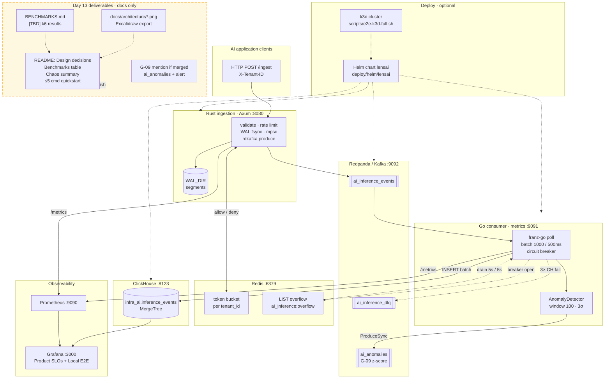

# Work Day 13 — Code / Infra (Week-2 README polish)

**Status:** Plan mode only — no implementation until user says `approve code`.

**Calendar day:** 13 of N · **Monday** · **LensAI** · repo: `infra-ai-streaming`

**Shared Daily Thread:** Week-2 README closes `infra-ai-streaming` for hiring committees; tomorrow `ebpf-llm-tracer` extends observability to apps that will never install your SDK.

**Plan source:** `data/plan.json` day 13 `code`:

> Week 2 README polish for infra-ai-streaming: Excalidraw architecture PNG, Design Decisions (3 tradeoffs), Benchmarks table, Chaos Testing summary, Getting Started under 5 commands. README should stand alone for hiring committees.

---

## 1. Ticket summary + acceptance criteria

### Ticket summary

**Week-2 README polish (docs-only)** — make the root `README.md` a self-contained hiring artifact: visual architecture, three explicit tradeoffs, honest benchmarks scaffold, chaos-at-a-glance, and a five-command quickstart. No new runtime features; align copy with shipped pipeline (WAL, Redpanda, Go consumer, ClickHouse, Redis overflow, Prometheus/Grafana, Helm/k3d) and **G-09** anomaly path if merged to `main`.

| In scope | Out of scope |
|----------|--------------|
| Excalidraw → PNG checked into `docs/` and linked from README | k6 load test execution or filling real benchmark numbers (placeholders OK) |
| README **Design decisions** — tighten existing (a)(b)(c) or reformat for scanability | New `load-test/k6-script.js` (backlog; cite in BENCHMARKS outline only) |
| New **`BENCHMARKS.md`** + summary table in README | Partition key `hash(tenant_id:model_id)` implementation |
| README **Chaos testing** summary → link `CHAOS.md` | Re-run full `chaos/run_chaos.sh` as deliverable |
| **Getting started** ≤ 5 copy-paste commands | Profile / plan repo HTML blogs |
| Mention **G-09** (`ai_anomalies`, `anomalies_detected_total`) if on `main` | Separate anomaly-detector binary |
| Optional: Grafana Product SLO screenshot if smoke already run | eBPF tracer repo (calendar day 14) |

### Acceptance criteria

| # | Criterion | Proof |
|---|-----------|--------|
| 1 | **Architecture PNG** in README (not only Mermaid) | `docs/architecture/lensai-pipeline.png` exists; README `` renders on GitHub |
| 2 | **Design decisions** — exactly **3** tradeoffs, each with problem → choice → consequence | README section matches `DESIGN.md` §2, §ClickHouse, §AP (no contradiction) |
| 3 | **`BENCHMARKS.md`** at repo root with Hardware / Methodology / Results / Reproduce sections | File committed; `[TBD]` where k6 not run |
| 4 | README **benchmarks** table mirrors BENCHMARKS results (or “TBD — see BENCHMARKS.md”) | Table visible above fold or in dedicated `## Benchmarks` |
| 5 | **Chaos summary** — 5 scenarios + link to `CHAOS.md` + optional `chaos/run_chaos.sh` one-liner | Reader sees matrix without opening 280-line runbook |
| 6 | **Getting started** ≤ **5** commands (clone → compose → consumer → ingest → verify) | Count commands in fenced block; no mandatory 3-terminal essay |
| 7 | **G-09** documented when merged | README + BENCHMARKS or observability bullet mentions `ai_anomalies`, z-score detector |
| 8 | **Honest status** unchanged | Still says pre-1.0 / targets not benchmarks until k6 fills numbers |
| 9 | **Regression** | `./scripts/test-ingestion.sh` and `./scripts/smoke-e2e.sh` still pass (docs-only PR) |
| 10 | **No scope creep** | No Go/Rust feature changes in same PR unless user splits |

---

## 2. LLD diagram (Mermaid)

**Legend:** Solid boxes = runtime components. **Dashed `Day13`** subgraph = documentation deliverables only (no new services).



**Component map (implementation paths):**

| Component | Tech | Key paths |
|-----------|------|-----------|
| Rust ingestion | Axum, Tokio, rdkafka | `ingestion/src/handlers/ingest.rs`, `wal/writer.rs`, `kafka/producer.rs` |
| Go consumer | franz-go, BatchWriter | `consumer/internal/kafka/reader.go`, `clickhouse/writer.go` |
| Anomaly (G-09) | z-score inline | `consumer/internal/anomaly/`, `kafka/anomalies.go` |
| Redpanda | Compose + Helm init | `deploy/redpanda/init-topics.sh` |
| ClickHouse | init DDL | `deploy/clickhouse/init.sql` |
| Redis | rate + overflow | `ingestion/…/token_bucket.rs`, `consumer/internal/redis/overflow.go` |
| Prometheus / Grafana | provisioning | `deploy/prometheus/`, `deploy/grafana/`, `dashboards/` |
| Helm / k3d | G-07 | `deploy/helm/lensai/`, `deploy/k3d/`, `scripts/e2e-k3d-full.sh` |

---

## 3. Implementation checklist

**Branch (infra-ai-streaming):** `docs/week2-readme-polish` (per [CHECKLIST.md](../../CHECKLIST.md) — descriptive, no `day-013-*`).

**Prerequisites**

1. [ ] `cd /Users/akshant/Desktop/github/infra-ai-streaming && git checkout main && git pull origin main`
2. [ ] Confirm G-09 on `main`: `grep -r ai_anomalies deploy/redpanda/init-topics.sh consumer/internal/anomaly/` — if only on feature branch, README says “anomaly detection (G-09, merging)” until merge
3. [ ] Plan repo: user approves this file → `approve code`

**Phase A — Assets (45 min)**

4. [ ] Export Excalidraw diagram (same topology as README Mermaid + `docs/ARCHITECTURE-AND-FLOWS.md` §1.1): clients → Rust → WAL → Redpanda → Go → ClickHouse; sidecars Redis, Prometheus, Grafana; dashed arrow for overflow + `ai_anomalies`
5. [ ] Save as `docs/architecture/lensai-pipeline.png` (and optional `.excalidraw` source in `docs/architecture/` if repo size OK)
6. [ ] Optional: capture `docs/screenshots/grafana-product-slo.png` after smoke (uncomment README image line)

**Phase B — BENCHMARKS.md (30 min)**

7. [ ] Create root `BENCHMARKS.md` from §5 outline below
8. [ ] Add `## Benchmarks` to README with table + link to full file

**Phase C — README restructure (1–1.5 h)**

9. [ ] Replace or supplement Mermaid block with PNG + keep Mermaid in collapsible detail or `docs/` link (hiring committees often prefer static image in README)
10. [ ] Verify **Design decisions** — three subsections (Rust ingest, ClickHouse vs Timescale, AP at edge); cross-check `DESIGN.md` §1–§2, §7
11. [ ] Add **Chaos testing** summary (§4 draft) after Features or before Roadmap
12. [ ] Replace verbose Getting started with **≤5 commands** block (§4 draft); move 3-terminal detail to `docs/dev-macos.md` / `CONTRIBUTING.md` links
13. [ ] Update honest line in **Target metrics** — point to `BENCHMARKS.md` instead of “not benchmarks yet” only
14. [ ] Add **Anomaly detection (G-09)** bullet under Features if merged: z-score → `ai_anomalies`, `anomalies_detected_total`, Grafana alert `consumer-latency-zscore-anomalies.yaml`
15. [ ] Trim duplicate CI/E2E tables if quickstart now links `CONTRIBUTING.md` + `docs/E2E-PROOF-K3D.md`

**Phase D — Cross-doc sync (20 min)**

16. [ ] `docs/ARCHITECTURE-AND-FLOWS.md` §2 — set G-09 / `ai_anomalies` to **Done** when on `main`; BENCHMARKS row → “scaffold in README”
17. [ ] `docs/PROJECT-STATUS.md` — one line: Week-2 README complete (date)
18. [ ] `CHAOS.md` — add back-link “Summary in README” at top (optional one line)

**Phase E — Proof + commit (30 min)**

19. [ ] Run proof commands (§7)
20. [ ] Commits:
    - `docs: add BENCHMARKS.md scaffold and architecture PNG`
    - `docs: week-2 README polish — chaos summary, quickstart, G-09`
21. [ ] **Do not push** until user sign-off

**Plan repo (this file)**

22. [ ] Commit in `akshant-150-day-plan`: `docs: day 13 code plan`

---

## 4. README section drafts

### 4.1 Architecture image (top of `## Architecture overview`)

```markdown
## Architecture overview

Ingestion is **AP-oriented**: accept and durably record quickly (WAL + Kafka), then make data **eventually consistent** in ClickHouse. The Go consumer batches writes, protects ClickHouse with a circuit breaker, spills to Redis when the analytical path is degraded, and runs **z-score latency anomaly detection** (G-09) to `ai_anomalies`.


*Full design:* [DESIGN.md](DESIGN.md) · *Flows & metrics:* [docs/ARCHITECTURE-AND-FLOWS.md](docs/ARCHITECTURE-AND-FLOWS.md)
```

*(Keep existing Mermaid in `docs/ARCHITECTURE-AND-FLOWS.md` or behind a `<details>` in README if you want both.)*

### 4.2 Design decisions (three tradeoffs — tighten existing copy)

```markdown
## Design decisions

| # | Decision | Why | Tradeoff |
|---|----------|-----|----------|
| **1** | **Rust for ingestion** | Bounded P99 on validate → WAL → produce; no GC pauses on the hot path | Slower iteration than Go for some teams |
| **2** | **ClickHouse over TimescaleDB** | OLAP-shaped rollups (`cost_usd`, tokens, P99 by `tenant_id` × `model_id`) at billions of rows | Not a general OLTP store; dedup/`FINAL` cost on reads |
| **3** | **AP over CP at the ingest edge** | WAL + Kafka before ClickHouse visibility; 202 after durable accept boundary | Analytics are **eventually consistent**; at-least-once → warehouse dedup |

Details: [DESIGN.md](DESIGN.md) §2 (CAP), §7 (query consistency), [CHAOS.md](CHAOS.md) (fail-open Redis).
```

### 4.3 Benchmarks table (README)

```markdown
## Benchmarks

Engineering targets: **1M events/min**, ingest **P99 &lt; 100 ms** (accept + WAL + enqueue boundary). Measured numbers come from k6 — see **[BENCHMARKS.md](BENCHMARKS.md)**.

| Scenario | VUs | Events/sec (target) | HTTP P99 | CH flush P99 | Max Kafka lag | Error rate |
|----------|-----|---------------------|----------|--------------|---------------|------------|
| Steady | 50 | ~5,000 | [TBD] | [TBD] | [TBD] | [TBD] |
| Stress | 200 | ~20,000 | [TBD] | [TBD] | [TBD] | [TBD] |

> **Honest:** `[TBD]` until `k6 run load-test/k6-script.js` (script planned; chaos `load-10k` is a partial signal). Last updated: YYYY-MM-DD.
```

### 4.4 Chaos testing summary

```markdown
## Chaos testing

Five failure modes are documented with local repro, metrics, and recovery in **[CHAOS.md](CHAOS.md)**. Automated scripts: `./chaos/run_chaos.sh` (`kill-redpanda`, `throttle-clickhouse`, `load-10k`).

| # | Scenario | Ingest | Consumer | Data loss | Key metric |
|---|----------|--------|----------|-----------|------------|
| 1 | Kafka down | 202 (WAL) | stalled | None (WAL replay) | `kafka_produce_errors_total` |
| 2 | ClickHouse down | 202 | breaker → Redis overflow | None (overflow/DLQ) | `circuit_breaker_state`, `redis_overflow_depth` |
| 3 | Redis down | 202 **fail-open** | normal | None (fairness lost) | `redis_rate_limit_degraded_total` |
| 4 | Ingest OOM/kill | down briefly | normal | None (WAL replay) | `wal_replay_events_total` |
| 5 | CH network partition | 202 | breaker, lag grows | None (replay) | `kafka_consumer_lag_events` |

**Philosophy:** fail-open on Redis is intentional; at-least-once with warehouse dedup; every failure emits Prometheus signal — see Grafana **Local E2E** (`/d/ai-inference-e2e-local`).
```

### 4.5 Getting started (≤ 5 commands)

```markdown
## Quick start (5 commands)

**Prerequisites:** Docker, Rust 1.86+, Go 1.22+, `cmake` ([dev-macos.md](docs/dev-macos.md)).

```bash
git clone https://github.com/AkshantVats/infra-ai-streaming.git && cd infra-ai-streaming
cp deploy/.env.example deploy/.env && docker compose --env-file deploy/.env -f deploy/docker-compose.yml up -d
(cd consumer && set -a && source ../deploy/.env && set +a && KAFKA_BROKERS=127.0.0.1:9092 go run ./cmd/consumer) &
set -a && source deploy/.env && set +a && cargo run -p ingestion
./scripts/smoke-e2e.sh
```

**Verify:** Prometheus http://localhost:9090/targets · Grafana http://localhost:3000 (`admin`/`admin`) · Product SLOs `/d/ai-inference-product` · optional `rpk topic consume ai_anomalies` after latency spike (G-09).

**Kubernetes:** `HELM_WAIT_TIMEOUT=2m ./scripts/e2e-k3d-full.sh` — [docs/E2E-PROOF-K3D.md](docs/E2E-PROOF-K3D.md).
```

### 4.6 G-09 mention (Features bullet — if merged)

```markdown
- **Latency anomalies (G-09):** Go consumer z-score on `latency_ms` per `tenant_id:model_id` (window 100, 3σ) → Kafka **`ai_anomalies`**; **`anomalies_detected_total`**; Grafana alert `consumer-latency-zscore-anomalies.yaml`.
```

---

## 5. BENCHMARKS.md outline (honest placeholder structure)

Create **`/Users/akshant/Desktop/github/infra-ai-streaming/BENCHMARKS.md`** with this skeleton:

```markdown
# Benchmarks — infra-ai-streaming

**Status:** Scaffold only. Numbers marked `[TBD]` until k6 load tests run on a documented machine. Do not treat targets in README as measured results.

## Hardware

| Field | Value |
|-------|--------|
| CPU | [TBD — e.g. Apple M1 Pro 10-core] |
| RAM | [TBD] |
| Disk | [TBD — SSD/NVMe] |
| OS | [TBD — macOS / Linux] |
| Broker / CH / Redis | Docker Compose (`deploy/docker-compose.yml`) |
| Ingestion + consumer | Native on host (`127.0.0.1:9092`) |

## Test methodology

| Parameter | Value |
|-----------|--------|
| Tool | k6 (`load-test/k6-script.js` — **planned**, not in tree yet) |
| Stages | ramp 0→50 VUs (30s), hold 50 VUs (2m), ramp 50→200 VUs (30s), hold 200 VUs (2m) |
| Batch per POST | 100 events |
| Tenants | 10 rotating `X-Tenant-ID` |
| Models | 5 (`gpt-4o`, `claude-sonnet`, `llama-3-70b`, `mistral-large`, `gemini-1.5-pro`) |
| Latency mix | 95% 50–2000 ms, 5% 5–10 s (exercises G-09 detector) |
| Partial signal today | `./chaos/run_chaos.sh load-10k` (throughput + lag, not HTTP P99) |

## Results

| Scenario | VUs | Events/sec | HTTP P50 | HTTP P99 | CH write lag (max) | Kafka lag (max) | Error rate |
|----------|-----|------------|----------|----------|--------------------|-----------------|------------|
| Steady | 50 | ~5,000 [TBD] | [TBD] ms | [TBD] ms | [TBD] ms | [TBD] | [TBD]% |
| Stress | 200 | ~20,000 [TBD] | [TBD] ms | [TBD] ms | [TBD] ms | [TBD] | [TBD]% |

**SLO reference:** ingest HTTP P99 **&lt; 100 ms** to accepted+durable boundary (WAL + enqueue), not ClickHouse visibility. See [docs/SLOs.md](docs/SLOs.md).

## Bottleneck analysis

| Load | Likely bottleneck | How to confirm |
|------|-------------------|----------------|
| 50 VUs | [TBD] | Grafana: `ingestion_latency_ms`, `clickhouse_flush_duration_seconds` |
| 200 VUs | [TBD] | `kafka_consumer_lag_events`, `backpressure_events_total` |

## Why not Prometheus for this workload?

At scale, `tenant_id × model_id × status` explodes series cardinality; cost/latency rollups need columnar scans. ClickHouse MVs pre-aggregate at insert time — see [DESIGN.md](DESIGN.md) §1.

## How to reproduce

1. `docker compose --env-file deploy/.env -f deploy/docker-compose.yml up -d`
2. `go run ./consumer/cmd/consumer` and `cargo run -p ingestion` (env from `deploy/.env`)
3. `k6 run load-test/k6-script.js` → `load-test/results.json`
4. Panels: Grafana Product SLOs; metrics on `:8080` and `:9091`

**Chaos throughput alternative (no k6 yet):**

```bash
./chaos/run_chaos.sh load-10k   # consumer BATCH_SIZE=5000 recommended
```

## Changelog

| Date | Change |
|------|--------|
| YYYY-MM-DD | Initial scaffold (Week 2, Day 13) |
```

---

## 6. Proof commands

### Docs-only sanity

```bash
cd /Users/akshant/Desktop/github/infra-ai-streaming
test -f docs/architecture/lensai-pipeline.png
test -f BENCHMARKS.md
grep -q "Chaos testing" README.md
grep -c '^```bash' README.md  # quickstart section: aim ≤1 fenced block with ≤5 logical commands
```

### Pipeline regression (unchanged behavior)

```bash
./scripts/test-ingestion.sh
cp deploy/.env.example deploy/.env
docker compose --env-file deploy/.env -f deploy/docker-compose.yml up -d
# Terminals or background consumer + ingestion, then:
./scripts/smoke-e2e.sh
```

### G-09 proof (if on branch under test)

```bash
curl -s http://localhost:9091/metrics | grep anomalies_detected_total
docker compose --env-file deploy/.env -f deploy/docker-compose.yml exec -T redpanda rpk topic list | grep ai_anomalies
```

### k3d (optional, not required for README PR)

```bash
HELM_WAIT_TIMEOUT=2m ./scripts/e2e-k3d-full.sh
# Evidence log: docs/E2E-PROOF-K3D.md
```

### Showcase block for user

Paste: PNG path in README render preview, BENCHMARKS.md TOC, chaos table row count = 5, quickstart command count ≤ 5, `smoke-e2e.sh` exit 0.

---

## 7. Definition of done

User can mark Day 13 code workstream complete when:

- [ ] This plan reviewed; user said **`approve code`**
- [ ] Branch `docs/week2-readme-polish` meets §1 acceptance table
- [ ] `BENCHMARKS.md` exists with `[TBD]` — no fabricated numbers
- [ ] README stands alone for a Staff infra panel (architecture image, 3 tradeoffs, benchmarks pointer, chaos summary, 5-command start)
- [ ] G-09 mentioned accurately (merged vs in-flight)
- [ ] `./scripts/smoke-e2e.sh` passes after doc edits
- [ ] Showcase pasted in chat
- [ ] User sign-off before **`git push`** / PR

**After approval → implementation:** Re-read this file; execute §3; do not rely on chat summary alone ([WORKFLOW.md](../../WORKFLOW.md)).

---

## 8. Time estimate + risks

| Item | Estimate |
|------|----------|
| Excalidraw + PNG export | 0.5–1 h |
| BENCHMARKS.md + README benchmarks section | 0.5 h |
| README restructure (chaos, quickstart, G-09) | 1–1.5 h |
| Cross-doc sync + proof | 0.5 h |
| **Total** | **2.5–4 h** |

| Risk | Mitigation |
|------|------------|
| **G-09 not on `main`** | Conditional README wording; merge day 12 PR first |
| **Fabricated benchmark numbers** | Strict `[TBD]`; link chaos `load-10k` as partial |
| **5-command quickstart hides WAL/Kafka nuance** | Link `docs/ARCHITECTURE-AND-FLOWS.md` + `CONTRIBUTING.md` |
| **PNG stale vs code** | Regenerate from same Mermaid source when pipeline changes |
| **Scope creep (k6 script in PR)** | Defer to backlog; only BENCHMARKS scaffold |

---

## 9. Out of scope

- **ebpf-llm-tracer** — calendar day 14
- **k6 script + CI benchmark job** — future day / Day 6 backlog in `docs/7-day-plan.md`
- **Experience / AI blogs** — separate approvals (`plan.json` day 13 AI: embeddings)
- **Plan repo push** — local only (except this plan file commit)
- **Profile HTML** — not in infra repo

---

## Cross-workstream dependencies

| Consumer | Needs from Day 13 code |
|----------|-------------------------|
| **Experience blog** | README screenshot paths; “proof beats promises” |
| **AI blog (embeddings)** | No code dependency; optional link to cardinality / ClickHouse |
| **Day 14 ebpf DESIGN** | README Kafka topic contract pointer |
| **Hiring / LinkedIn** | Single URL README as portfolio entry for LensAI |

**Freeze before Experience HTML:** final README anchor links; whether G-09 is merged; one Grafana screenshot filename.
