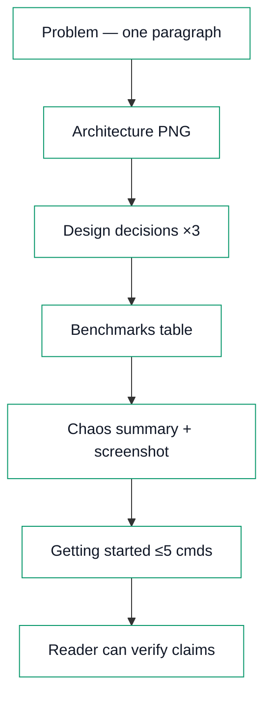
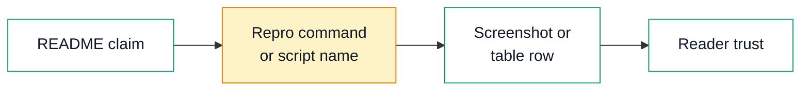
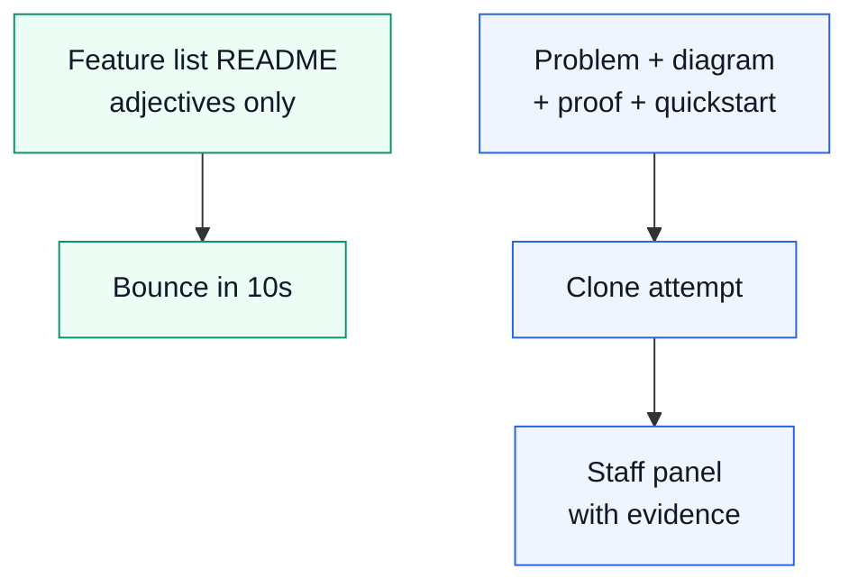

# Day 13 — Experience blog plan

**Workstream:** A2 · Experience (Profile)  
**Status:** Plan mode — full draft for user review; no HTML until `approve experience` / `implement experience`.  
**Calendar day:** 13 of N · Monday  
**Code dependency:** Week 2 README polish for `infra-ai-streaming` — architecture PNG, three design tradeoffs, benchmarks table, chaos summary, Getting Started under five commands.

---

## Part A — Plan metadata

| Field | Value |
|-------|--------|
| **Title** | Two Weeks, One README — What Hiring Committees Actually Scroll |
| **Subtitle** | Proof beats promises · screenshots > adjectives |
| **Public kicker** | **Experience 12 of N** (calendar day 13 → series index **N − 1**; 1-based) |
| **Format ID** | `feature` — shipped artifact narrative, not pager duty ([`docs/BLOG-FORMAT-MIX.md`](../BLOG-FORMAT-MIX.md); hint `"13"` in [`data/blog-format-hints.json`](../../data/blog-format-hints.json)) |
| **Series** | `experience` → `Profile/blog/series/experience/` |
| **Slug / filename** | `two-weeks-one-readme-hiring-committees-scroll.html` |
| **Target HTML** | `Profile/blog/series/experience/two-weeks-one-readme-hiring-committees-scroll.html` |
| **Canonical URL** | `https://akshantvats.github.io/Profile/blog/series/experience/two-weeks-one-readme-hiring-committees-scroll.html` |
| **Bridge (to today's code)** | README polish today is what I'd send a Staff panel instead of a slide deck — architecture, benchmarks, chaos, quickstart. |
| **Daily Thread (verbatim — weave once in prose)** | Week-2 README closes infra-ai-streaming; tomorrow ebpf-llm-tracer extends observability to apps that will never install your SDK. |
| **Word target** | 1,500–2,500 (Part B draft below) |
| **Mermaid** | **3 diagrams** — README anatomy · proof stack · hiring scroll test |
| **Tags** | `Experience Series · 12 of N`, `Open Source`, `Documentation`, `Hiring`, `LensAI`, `Observability` |
| **published_time** | `2026-05-28` (adjust on ship; must be **newest** in Experience series) |
| **Sibling AI post** | Day 13 — Embeddings as Dense Time-Series IDs (`ai.day_index`: 13 on calendar day 13) |

### Why `feature` (not `incident`)

- Days 10–12 were **`incident`**, **`patterns`**, and **`rollout`** — another outage frame would blur the archive.
- Topic is **closing a two-week build with a README that stands alone** — problem → constraints → build phases → verification. Fits **Feature / how we shipped** in BLOG-FORMAT-MIX.
- Opening scene is **a hiring manager scrolling GitHub at midnight**, not a pager.

### Gold references (read before HTML)

| Priority | Format | Path | Emulate |
|----------|--------|------|---------|
| **Primary** | `feature` | `blog/series/experience/building-tsdb-at-agoda.html` | Attr-boxes, stat callout, honest scope labels, mechanism-first prose |
| **Secondary** | `patterns` | `blog/series/experience/reading-victoriametrics-source-oss-interview-prep.html` | HTML shell, `blog-diagrams.css` / `blog-diagrams.js`, footnote row |
| **Tone** | `feature` | Experience 9 chaos post (evidence in docs, not vibes) | Chaos summary *as README section*, not timeline postmortem |

---

## Part B — FULL BLOG DRAFT

> **Copy source for HTML implementation.** Reader-facing H2 only. No ticket IDs, no plan labels, no faux incident. Employer names only where resume-backed.

---

**Experience Series · 12 of N**

# Two Weeks, One README — What Hiring Committees Actually Scroll

*Proof beats promises · screenshots > adjectives*

---

A Staff hiring loop gave me thirty minutes with a candidate's GitHub before the panel. I did not clone the repo. I did not read the CONTRIBUTING guide. I scrolled the README, clicked one diagram, skimmed for numbers, and checked whether `docker compose up` was a lie. That was the whole audition.

Two weeks into building [infra-ai-streaming](https://github.com/akshantvats/infra-ai-streaming) — ingestion, Kafka, ClickHouse, Grafana, chaos scripts, anomaly detection — the code could run. The README still read like a sprint backlog. Today I close that gap. Not because documentation is virtuous, but because **the README is the interview** for anyone who will never sit in the room with me.

<div class="stat-callout">
  <div class="stat-cell"><span class="stat-num">~10s</span><span class="stat-label">first scroll budget</span></div>
  <div class="stat-cell"><span class="stat-num">5</span><span class="stat-label">commands max quickstart</span></div>
  <div class="stat-cell"><span class="stat-num">3</span><span class="stat-label">design tradeoffs named</span></div>
  <div class="stat-cell"><span class="stat-num">1</span><span class="stat-label">architecture diagram</span></div>
</div>

## The ten-second scroll test

Hiring committees are not cruel. They are constrained. A senior loop might include six interviewers, three repos, and a packet due the night before. The README is the **only** artifact everyone sees without asking permission.

I think about the scroll test in four questions — the same four I use when reviewing internal design docs at scale:

1. **What problem does this solve?** One paragraph, no buzzwords. If I cannot restate it in my own words, the author does not understand it yet.
2. **What is the shape of the system?** A diagram I can screenshot into my notes. Not a logo slide. Boxes and arrows with data flow.
3. **What proof exists?** Benchmarks, chaos results, dashboard screenshots. Numbers with units. Not "highly scalable."
4. **Can I run it?** Copy-paste commands that work on a clean laptop. If quickstart fails, I assume production is worse.

Most READMEs fail at question three. They list features like a product marketing page — "real-time," "cloud-native," "AI-powered" — without evidence. Staff panels notice. They have read a thousand adjectives. They have not read a thousand **reproducible** benchmark tables.

<div class="pullquote"><p>A README is not a brochure. It is a compressed design review you leave behind when the meeting ends.</p></div>

This is not theory from a career blog. At Agoda I contributed to WhiteFalcon, a TSDB processing on the order of **1.5 trillion events per day**. The system’s indexing design was published on the Agoda engineering blog — diagrams, tradeoffs, cardinality math. That post did more hiring work than any internal slide deck I saw: it proved the team could **explain** what they built. At Wayfair I led engineers shipping a real-time pricing engine across **250k+ SKUs per supplier**; the documents that survived leadership review had the same shape — problem, topology, rejected options, verification. The README I ship today applies that pattern to a greenfield repo I own end to end.

## Anatomy of a README that earns a second look

After two weeks of code, infra-ai-streaming had the pieces a hiring reader expects — but scattered across `DESIGN.md`, `CHAOS.md`, Grafana JSON, and comments in compose files. The Week-2 README job is **assembly**, not invention: one scroll path from problem to proof.

I structure the top half in a fixed order. Recruiters and Staff engineers alike navigate it the same way:

| Section | What the reader learns | Failure mode |
|---------|------------------------|--------------|
| **Problem statement** | Why existing LLM observability breaks at multi-tenant scale | Starts with tech stack instead of pain |
| **Architecture diagram** | Ingest → bus → consumer → storage → dashboards | Mermaid only in a wiki nobody links |
| **Design decisions** | Three tradeoffs with rejected alternatives | "We chose Kafka because Kafka" |
| **Benchmarks** | Throughput, P99 ingest, consumer lag under load | No units, no hardware context |
| **Chaos summary** | What broke, what recovered, link to evidence | "We care about reliability" |
| **Getting started** | ≤5 commands to a working stack | Twelve steps and a prayer |

The architecture diagram is an Excalidraw PNG checked into the repo — not a live Mermaid block in the README alone. PNG survives GitHub mobile, LinkedIn previews, and PDF exports from hiring packets. Mermaid stays in `DESIGN.md` for editors who diff diagrams. Both serve different audiences.



<div class="attr-box mine">
  <div class="attr-label">My scope today</div>
  I own the README assembly for infra-ai-streaming — selecting which tradeoffs belong above the fold, exporting the diagram, and making the quickstart honest on a clean machine. The underlying ingestion pipeline, Helm charts, and chaos scripts were built across days 0–12; today is packaging for an external reader.
</div>

## Proof beats promises

Adjectives are cheap. Screenshots are expensive — they cost the time to run the test and capture the panel.

The benchmarks section gets a table, not a paragraph. Rows I include: events/sec sustained at demo load, ingestion P99, ClickHouse write batch latency, Kafka consumer lag under spike. Each row names **hardware context** (local compose vs k3d, vCPU count) so a reader can calibrate expectations. "10k events/sec" without saying "MacBook Pro M2, compose, single broker" is a different claim than "10k events/sec on a three-node k3d cluster." Staff engineers know the difference.

The chaos section summarizes what [`run_chaos.sh`](https://github.com/akshantvats/infra-ai-streaming) already proved — broker kill mid-ingest, slow ClickHouse with circuit breaker, load spike — with **one Grafana screenshot** per scenario. I wrote about the rebalance gap that chaos exposed in [Experience 9](https://akshantvats.github.io/Profile/blog/series/experience/we-killed-redpanda-on-purpose-chaos-as-commit-message.html); the README does not retell that post. It points to evidence: recovery time, zero-loss claim, watermark metric. A hiring reader should see **results**, not narrative.



This is the same discipline I applied reading VictoriaMetrics source for an OSS contribution ([Experience 10](https://akshantvats.github.io/Profile/blog/series/experience/reading-victoriametrics-source-oss-interview-prep.html)): production code proves its claims in tests and benchmarks, not in comments. A README should inherit that standard.

## Design decisions belong in the open

Feature lists answer **what**. Design decision sections answer **why not the obvious thing** — the part Staff interviews actually probe.

I include three tradeoffs for infra-ai-streaming, each in the same template: **context → options → choice → consequence**.

**1. Redpanda vs managed Kafka.** Context: local reproducibility for hiring reviewers vs production parity. Options: Redpanda in compose, managed Kafka, raw Kafka in k3d. Choice: Redpanda for zero-ops local path; Helm chart documents swap to Strimzi for prod-shaped deploys. Consequence: one less dependency for first clone; broker semantics differ slightly — called out explicitly.

**2. ClickHouse batch writer vs streaming insert.** Context: write amplification vs query freshness. Options: row-at-a-time insert, buffered batch with timeout, external buffer (Redis) on breaker open. Choice: batched insert with circuit breaker and Redis overflow — same pattern as tiered storage hot/cold boundaries I worked on at Agoda ([Experience 1](https://akshantvats.github.io/Profile/blog/series/experience/building-tsdb-at-agoda.html)). Consequence: sub-second dashboard freshness requires tuning batch window; documented in benchmarks.

**3. Cardinality limits on labels vs raw model IDs everywhere.** Context: `model_id × tenant_id × pod` can explode series count. Options: unlimited labels, allowlist, aggregate at ingest. Choice: bounded label set at ingest with rollups in ClickHouse for drill-down. Consequence: some per-pod views require trace lookup, not Prometheus — honest limit, not a footnote.

Tables beat prose for comparisons:

| Tradeoff | Rejected shortcut | Why it fails at Staff review |
|----------|-------------------|------------------------------|
| "Just use Datadog" | No self-hosted repro | Reviewer cannot verify; vendor lock-in unaddressed |
| "Mermaid in README only" | No PNG export | Mobile scroll breaks; diagram not citable in packet |
| "Docs later" | README stays scaffold | Two weeks of code invisible to hiring scroll |

<div class="attr-box team">
  <div class="attr-label">Pattern from Wayfair pricing work</div>
  Design reviews for the Delphi → Aletheia feed ([Experience 8](https://akshantvats.github.io/Profile/blog/series/experience/delphi-aletheia-feed-sub-second-price-visibility.html)) survived leadership because they named **rejected** batch shapes and showed verification metrics. The README tradeoff section is the same genre at repo scale — options table, decision, consequence — compressed for a stranger with ten seconds.
</div>

## Five commands or it doesn't count

The Getting Started section is a contract. I target **five commands or fewer** from clone to Grafana with data flowing:

1. Clone
2. Copy env template (if any secrets)
3. `docker compose up -d`
4. Run smoke ingest (script or curl one-liner)
5. Open Grafana URL with default dashboard

If step three pulls twelve images and step four requires a API key the reader does not have, the contract is broken. For a hiring artifact I accept demo API keys in `.env.example` with fake values that still exercise the pipeline — same as integration tests use canned fixtures.

At Delivery Hero, peak-load runbooks that worked during dinner rush had the same property: **minimum steps under stress**. The EKS patterns post ([Experience 7](https://akshantvats.github.io/Profile/blog/series/experience/ten-thousand-concurrent-requests-eks-patterns-delivery-hero.html)) was about operability at 10k concurrent requests; a README quickstart is operability at **zero prior context**. Count the commands. Delete anything that is not load-bearing.

Verification checklist I run before merging README polish:

- [ ] Fresh clone on a machine that never built the repo
- [ ] No undocumented env vars
- [ ] Grafana dashboard shows non-empty panels within 10 minutes
- [ ] Links to `DESIGN.md`, `CHAOS.md`, `OBSERVABILITY.md` work from GitHub render

## The README I'd send a Staff panel

Today’s code work is the packaging pass: Excalidraw architecture PNG, three tradeoffs, benchmarks table, chaos summary with screenshots, quickstart under five commands. The README should **stand alone** — a Staff panel member who never opens `consumer/main.go` should still understand what shipped, why it is shaped this way, and how to falsify my claims.

That is what I would attach instead of a slide deck. Slides hide the repo; the README *is* the repo’s public interface. Two weeks of LensAI platform work — ingest schema, dual Grafana dashboards, Helm HPA on consumer lag, z-score anomaly routing to an operator queue — compresses into one scroll path. The anomalies topic and semantic-cache false positives ([AI Day 12](https://akshantvats.github.io/Profile/blog/series/ai-learning/day-12-semantic-caching-vs-exact-match-redis.html)) belong in observability docs; the README links outward rather than duplicating every mechanism post.

Week-2 README closes infra-ai-streaming as a **reviewable artifact**. Tomorrow the work moves to [ebpf-llm-tracer](https://github.com/akshantvats/infra-ai-streaming) — observability for applications that will never install my SDK. Kernel probes and zero-instrumentation tracing are a different buyer story; today's README finishes the story for teams who *can* emit structured inference events. Platform repos need cross-links later; today is making this repo legible on its own.



## Takeaway

Hiring committees scroll. They do not grep. A two-week build that ends without a README worth scrolling is a build that **failed its second audience** — the engineers who will judge whether you ship complete systems.

The bar I use: **Would I send this link to a Staff panel instead of slides?** If the answer is no, the work is not done. Proof beats promises. Screenshots beat adjectives. Five honest commands beat a hundred features.

Tomorrow I start designing zero-SDK tracing. Today I make sure the streaming platform I already built can be **understood, run, and falsified** by someone who has never met me. That is the job.

---

**Footnotes (implementation — convert to `.footnote-row` in HTML)**

- infra-ai-streaming README: `https://github.com/akshantvats/infra-ai-streaming`
- Experience 1 (Agoda TSDB): `https://akshantvats.github.io/Profile/blog/series/experience/building-tsdb-at-agoda.html`
- Experience 7 (DH EKS): `https://akshantvats.github.io/Profile/blog/series/experience/ten-thousand-concurrent-requests-eks-patterns-delivery-hero.html`
- Experience 8 (Wayfair rollout): `https://akshantvats.github.io/Profile/blog/series/experience/delphi-aletheia-feed-sub-second-price-visibility.html`
- Experience 9 (chaos evidence): `https://akshantvats.github.io/Profile/blog/series/experience/we-killed-redpanda-on-purpose-chaos-as-commit-message.html`
- Experience 10 (OSS reading): `https://akshantvats.github.io/Profile/blog/series/experience/reading-victoriametrics-source-oss-interview-prep.html`
- AI Day 12 (semantic cache): `https://akshantvats.github.io/Profile/blog/series/ai-learning/day-12-semantic-caching-vs-exact-match-redis.html`
- AI Day 13 (embeddings / ANN): `TBD` — link when sibling post ships

**Body sibling links (max 2 in prose):** AI Day 12 + Experience 9. Others → footnote.

---

## Part C — HTML implementation notes

Use [`blog/NEW-POST-CHECKLIST.md`](https://github.com/akshantvats/Profile/blob/main/blog/NEW-POST-CHECKLIST.md) and [`blog/DIAGRAM-STYLE.md`](https://github.com/akshantvats/Profile/blob/main/blog/DIAGRAM-STYLE.md) as authoritative detail.

### Create post

- [ ] Branch: `docs/two-weeks-one-readme-hiring-committees` (or `feat/` if bundling cover) off updated Profile `main`
- [ ] File: `blog/series/experience/two-weeks-one-readme-hiring-committees-scroll.html`
- [ ] Copy structure from **Experience 11** HTML shell (`reading-victoriametrics-source-oss-interview-prep.html` or `ota-at-scale-at-least-once-is-a-feature.html` — newest with `blog-diagrams.css`)
- [ ] `#series-nav-mount` **`data-series-slug="experience"`**
- [ ] Include `series-nav-dynamic.js`

### `<head>` required

- [ ] `<title>` + `og:title` — full post title
- [ ] `meta description` + `og:description` — README-as-hiring-artifact angle (scroll test, proof stack, five-command quickstart)
- [ ] `og:url` — canonical HTTPS URL (see Part A)
- [ ] `og:image` + `twitter:image` — `https://akshantvats.github.io/Profile/blog/assets/og/two-weeks-one-readme-hiring-committees-scroll.png`
- [ ] `og:image:width` **1200**, `og:image:height` **630**
- [ ] `twitter:card` = `summary_large_image`
- [ ] `article:published_time` = **2026-05-28** (or actual ship date; **latest** in Experience series)
- [ ] `<link rel="stylesheet" href="../../assets/blog-diagrams.css">`

### Body required

- [ ] Hero tag: `Experience Series · 12 of N`
- [ ] Subtitle from plan: *Proof beats promises · screenshots > adjectives*
- [ ] On-page cover after `</header>`:

```html
<div class="post-cover-wrap">
<figure class="post-cover">
  
</figure>
</div>
```

- [ ] `.post-meta` read time (~13–15 min)
- [ ] Convert Part B HTML snippets (`stat-callout`, `attr-box`, `pullquote`) to match gold posts
- [ ] Three Mermaid blocks — validate with `node scripts/verify-blog-diagrams.mjs --slug two-weeks-one-readme-hiring-committees-scroll` after registering slug
- [ ] Thread sentence woven once in § "The README I'd send a Staff panel"
- [ ] No ticket IDs, no `plans/drafts` paths, no employer AI attribution in body

### Scripts (before `</body>`)

```html
<script src="https://cdn.jsdelivr.net/npm/mermaid@10/dist/mermaid.min.js"></script>
<script src="../../assets/blog-diagrams.js"></script>
<script src="../../series-nav-dynamic.js"></script>
```

### Update `blog/series-index.json`

- [ ] Add entry **first** in `experience.posts[]`:

```json
{
  "href": "blog/series/experience/two-weeks-one-readme-hiring-committees-scroll.html",
  "kicker": "Experience 12 of N",
  "title": "Two Weeks, One README — What Hiring Committees Actually Scroll",
  "desc": "The ten-second scroll test: architecture PNG, three design tradeoffs, benchmarks and chaos screenshots, five-command quickstart — packaging two weeks of infra-ai-streaming for Staff panels who will never clone the repo."
}
```

### Cover generation

```bash
cd /Users/akshant/Desktop/Github/Profile
python3 scripts/generate_covers_from_content.py --print-prompts
# Art → scripts/cover_generated/two-weeks-one-readme-hiring-committees-scroll.png
# Register slug in scripts/generate_blog_covers.py SERIES_LABEL
python3 scripts/generate_blog_covers.py --from-content
```

Outputs: `blog/assets/covers/two-weeks-one-readme-hiring-committees-scroll.png` and `blog/assets/og/...` (1200×630, badge **EXPERIENCE SERIES**, no kicker on PNG).

### Preview

```bash
cd /Users/akshant/Desktop/Github/Profile
python3 -m http.server 8765
# http://localhost:8765/blog/series/experience/two-weeks-one-readme-hiring-committees-scroll.html
```

Pass: Mermaid in light + dark; cover loads; sidebar **Experience 12 of N** at top; viewport `<820px` hides sidebar.

---

## Part D — Plan admin snippet

### Voice / MUST NOT (draft QA)

| MUST | MUST NOT |
|------|----------|
| `feature` frame: problem → packaging → verification | Faux incident, pager duty, SEV template |
| Attr-box for README scope (mine) + Wayfair pattern (team) | Invent employer AI tools or attribution |
| 3 Mermaid with gold `classDef` | Plan labels in H2 (`cold open`, `bridge to today`) |
| Thread woven once toward ebpf-llm-tracer | Ticket IDs, `G-*`, `plans/drafts` in prose |
| Bridge: README = Staff panel artifact | Retell Experience 9 chaos post — link only |
| **Experience 12 of N** kicker everywhere | Hardcode 150 in kickers |

### Cross-workstream dependencies

| Consumer | Needs from Day 13 code (README polish) |
|----------|------------------------------------------|
| **This post** | Final architecture PNG path; benchmark numbers with hardware context; chaos screenshot URLs; quickstart command list |
| **AI Day 13** | Independent — embeddings / ANN deep-dive |
| **Day 14 eBPF** | README cross-link placeholder OK until repo exists |

### Definition of done

**Phase 1 (this document)**

- [x] Full blog draft in Part B for user review
- [ ] User approves prose → `approve experience` for HTML phase

**Phase 3 (after approval)**

- [ ] README polish merged or stubbed enough for accurate benchmark/chaos references
- [ ] HTML + cover + `series-index.json` + diagram verify script
- [ ] Sibling AI Day 13 linked when live
- [ ] User sign-off before Profile push

### `plan.json` status (orchestrator — not this agent)

```json
{
  "day": 13,
  "experience_blog_draft": "docs/daily-plans/day-13-EXPERIENCE.md",
  "experience_slug": "two-weeks-one-readme-hiring-committees-scroll.html",
  "experience_kicker": "Experience 12 of N",
  "format": "feature"
}
```

Mark day 13 `done` only after code README polish + Experience HTML ship per end-of-day orchestration.

---

## Cross-links (canonical)

| Target | URL |
|--------|-----|
| Experience 1 (Agoda TSDB) | `https://akshantvats.github.io/Profile/blog/series/experience/building-tsdb-at-agoda.html` |
| Experience 7 (DH EKS) | `https://akshantvats.github.io/Profile/blog/series/experience/ten-thousand-concurrent-requests-eks-patterns-delivery-hero.html` |
| Experience 8 (Wayfair rollout) | `https://akshantvats.github.io/Profile/blog/series/experience/delphi-aletheia-feed-sub-second-price-visibility.html` |
| Experience 9 (chaos — cite only) | `https://akshantvats.github.io/Profile/blog/series/experience/we-killed-redpanda-on-purpose-chaos-as-commit-message.html` |
| Experience 10 (HTML shell) | `https://akshantvats.github.io/Profile/blog/series/experience/reading-victoriametrics-source-oss-interview-prep.html` |
| AI Day 12 | `https://akshantvats.github.io/Profile/blog/series/ai-learning/day-12-semantic-caching-vs-exact-match-redis.html` |
| infra-ai-streaming | `https://github.com/akshantvats/infra-ai-streaming` |

---

## Draft smell test (pre-ship)

- [ ] Opening could not swap into Day 10 chaos or Day 12 OTA post without edits
- [ ] At least two **attr-box** blocks (mine + team/Wayfair)
- [ ] Benchmarks + chaos + quickstart sections present with tables
- [ ] Experience 9 referenced once — no duplicated postmortem
- [ ] Thread + ebpf forward link in prose, not as H2 title
- [ ] No paragraph reads like CHECKLIST.md or a PR description
- [ ] Mermaid uses `classDef pipeline` / `exact` / `semantic` per DIAGRAM-STYLE.md
