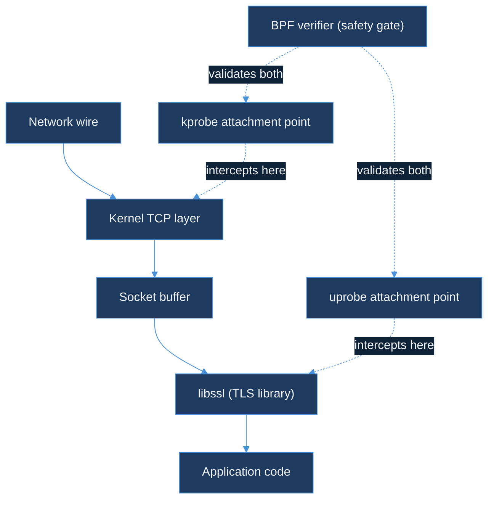

# AI Learning Blog Plan — Day 14

---

## Post Metadata

| Field | Value |
|---|---|
| Day | 14 of 150 |
| Series | ai-learning |
| Format | deep-dive |
| Title | Day 14 — eBPF for AI Infrastructure |
| Subtitle | Kernel probes vs SDK patches — when zero-instrumentation wins |
| Hook | Cilium proved network observability without app changes — LLM HTTP is the next syscall surface. |
| HTML filename | `ebpf-for-ai-infrastructure.html` |
| Slug | `ebpf-for-ai-infrastructure` |
| Cover image | `blog/assets/covers/ebpf-for-ai-infrastructure.png` |
| OG image | `blog/assets/og/ebpf-for-ai-infrastructure.png` |
| Word target | 2,800–3,400 words |
| Reading time | 14–17 minutes |

---

## Audience Framing

Senior backend/infra engineer. Knows Kafka, K8s, distributed tracing, has opinions on OTel. Has heard of eBPF from Cilium/Cloudflare but never written a BPF program.

**Translation device (use consistently):** kernel = event bus, kprobes = subscribers, BPF ring buffer = in-kernel queue, Go userspace agent = consumer group.

Walk away knowing:
1. eBPF intercepts kernel function calls at runtime — no kernel recompile
2. LLM API calls pass through TCP stack — visible to eBPF
3. SSL uprobe trick for HTTPS — well-trodden path via uprobe on libssl
4. eBPF vs SDK: breadth (eBPF, automatic coverage) vs depth (SDK, semantic context)
5. `ebpf-llm-tracer` DESIGN.md ships today

---

## Voice and Tone Reminders

- First person throughout
- Max 3 sentences per paragraph
- One physical/everyday analogy per major concept — not another software system
- Every section (except lede and diagrams) ends with a "so what" sentence
- "Here's what surprised me" — use once or twice, not in every section
- No bullet lists as prose substitute

---

## Section-by-Section Outline

### Lede (no heading)

Opening question: What if you could observe every LLM call in your fleet without touching a single line of application code? Not "without a heavy SDK" — without any change at all.

Fame reader frustration: monitoring tax is real. LLM clients heterogeneous — Python notebooks, Go microservices, Java batch jobs, bash scripts. SDK rollout compounds across 5 teams × 5 languages.

Thesis: eBPF intercepts at kernel layer. Every LLM API call passes through kernel's TCP stack regardless of language, framework, or whether application team agreed to instrument. That is the probe point.

Tone: someone who had a genuinely exciting realisation at 11pm, not sales copy.

---

### `<h2 id="monitoring-tax">` — The monitoring tax every infra team quietly pays

**P1:** SDK tax: language-specific library + code changes + deploy + agreement from app team. Monorepo with one team: negligible. 50-service platform with 5 teams, different CI pipelines, different opinions: significant.

**P2:** LLM clients heterogeneous by design. Python, Go, Java, bash/curl calling same OpenAI endpoint. No SDK covers all. Five separate rollout conversations.

**P3 ("Here's what surprised me"):** Issue is not SDK quality — OTel LLM semantic conventions are excellent. Issue is distribution. Logistics problem, not technology problem. Better libraries don't solve logistics.

**P4:** Alternative framing: unit of instrumentation is not the application process but the kernel. Kernel sees Python, Go, Java, curl identically. No language preference.

**Analogy:** Toll booth only on roads built after installation. eBPF = sensor embedded in the asphalt by the municipality, not each road builder.

**So-what:** "The question is not 'which SDK?' but 'where does every LLM call unavoidably pass through?' The answer is the kernel."

---

### `<h2 id="ebpf-in-one-sentence">` — eBPF: a kernel co-processor you program with tiny verified C

**P1 (verbatim anchor):** eBPF is a kernel co-processor that runs verified programs in response to system events — like attaching a trigger to the operating system itself.

**P2:** Break down each clause. "Kernel co-processor" — not module, not driver, runs in kernel address space but sandboxed. "Verified programs" — verifier reads every instruction, rejects crashes/infinite loops/OOB access. "System events" — every kernel function, every network packet, every file open.

**P3 — verifier analogy (building inspector):** Reviews blueprints before construction. Doesn't watch construction happen. Analyses plans upfront, stamps "safe" or rejects with violations. BPF that passes verifier = guaranteed not to crash kernel.

**P4:** Lifecycle: write C → compile to BPF bytecode (clang/LLVM) → load via `bpf()` syscall → verifier → JIT to native code → attach to event → fires on each event. Loading = milliseconds. No kernel recompile.

**P5:** Two probe types: kprobes (kernel function entry), kretprobes (kernel function return). Dynamic — named at load time, kernel patches jump instruction into function prologue at runtime. Tracepoints = stable pre-defined hooks.

**P6 — ring buffer (pneumatic tube analogy):** Bank teller (kernel) drops capsule in. Back office (userspace) receives it. Neither side blocks waiting for the other.

**kprobe analogy (sticky note):** Sticky note on specific page in government ledger. Clerk reaches page, reads note, executes instruction (record in side log), continues. Doesn't rewrite ledger.

**So-what:** "You can attach a probe to `tcp_sendmsg` — called when any process sends data over TCP — and observe every LLM API call on the host without modifying a single application."

---

### `<h2 id="cilium-proof">` — What Cilium already proved about zero-touch observability

**P1:** Cilium = evidence of concept, not a tool to adopt here. Production scale at Google, Datadog. eBPF provides L3/L4/L7 visibility without pod code changes. No sidecar. No language agent.

**P2:** Cilium Hubble decodes HTTP/1.1 and HTTP/2 headers from socket buffer. Reads raw bytes the kernel is about to send, parses as HTTP. Exact mechanism `ebpf-llm-tracer` uses for LLM-specific HTTP.

**P3 (honest caveat):** Cilium controls virtual network interface. `ebpf-llm-tracer` attaches at TCP socket layer directly. Same principle, different attachment point.

**So-what:** "Cilium proved the pattern is production-safe. The only question for LLM infrastructure is where to attach — answer: TCP socket layer every LLM call crosses."

---

### `<h2 id="llm-http-syscall-surface">` — Every LLM API call is just syscalls in a trench coat

**P1:** What happens under `openai.chat.completions.create()`: `connect()` syscall, `write()`/`sendmsg()` with request bytes, `read()`/`recvmsg()` as response streams. Every one passes through kernel.

**P2:** Kernel functions: `tcp_sendmsg` (write to TCP socket), `tcp_recvmsg`/`tcp_cleanup_rbuf` (deliver received data). Two sides of the LLM API call.

**P3:** HTTP/1.1 plaintext → raw HTTP bytes in tcp_sendmsg, directly parseable. HTTPS → ciphertext at tcp_sendmsg. Solution: uprobe `SSL_write`/`SSL_read` in `libssl.so` — userspace probe, fires at plaintext.

**P4 ("Here's what surprised me"):** Nearly every LLM observability tool claiming "zero code changes" does this SSL uprobe trick. Datadog APM, Odigos, Pixie — all hook `SSL_write`/`SSL_read`. Well-trodden, production-proven.

**P5:** Without SSL: model_id from URL path, request size, latency (connect to first byte), HTTP status. With SSL uprobe: full request JSON (messages, temperature), full response JSON (token counts, finish reason).

**Analogy (post office):** Every letter passes through sorting facility. Facility doesn't care: English/Mandarin, student/CEO. eBPF = sensor installed by infrastructure team in that facility, not by sender.

**So-what:** "Probe point for LLM observability is well-defined — TCP and TLS layers that every AI API call crosses, regardless of which library the application uses."

---

### `<h2 id="ebpf-vs-otel-tradeoff">` — Breadth vs depth: why eBPF and OpenTelemetry are not competitors

**P1:** Genuine tradeoff, not a contest. Both have irreplaceable strengths. Treating them as alternatives is the mistake — they are complementary layers.

**P2:** eBPF = breadth automatically. Every process on host covered when BPF program loads. New services, new languages, new containers — all included. Zero deploy.

**P3:** SDK/OTel = semantic depth. BPF sees 4,832 request bytes and 1,204 response bytes. OTel sees 127 prompt tokens, 43 completion tokens, 3 retries, cache_hit: false. Token counts not inferable from byte counts — LLM encoding variable-length.

**P4:** Right architecture: eBPF as floor (always on, zero config), SDK as upgrade path for teams needing fine-grained cost attribution.

**HTML table:**

| Dimension | eBPF (kernel probe) | OpenTelemetry SDK |
|---|---|---|
| Coverage | All processes, automatic | Only instrumented processes |
| Deploy requirement | Platform team only, once | Every application team |
| Token counts | Approximate | Exact (from API response JSON) |
| SSL/TLS | Requires uprobe on libssl | Native (in-process before encryption) |
| Language dependency | None | Language-specific SDK per runtime |
| Semantic context | Headers, path, status | Full request/response schema |
| Overhead | 1–3% CPU at high call rates | 0.5–2% per instrumented call |

**P5:** Deployment asymmetry decides for platform teams. Zero-deploy 1–3% often beats coordinating 12 teams over 6 weeks.

**So-what:** "'eBPF as the floor, OpenTelemetry as the ceiling' — automatic coverage everywhere, semantic depth where it matters most."

---

### `<h2 id="libbpf-co-re">` — libbpf, CO-RE, and why you don't need to recompile per kernel

**P1:** BCC compiles BPF C at runtime. Ships LLVM as dependency (~100MB). Excellent for dev, impractical for distribution.

**P2:** CO-RE = Compile Once Run Everywhere. libbpf + BTF (kernel struct layouts) + `bpf_core_read()`. Compile once on dev machine. Binary carries relocations. libbpf resolves against target kernel's BTF at load time. Works on any kernel with BTF (Linux 5.4+).

**P3:** For `ebpf-llm-tracer`: single Go binary embeds compiled BPF object file via `go:embed`. No LLVM on target. No compilation step. Load embedded BPF, resolve CO-RE relocations via bundled libbpf.

**So-what:** "CO-RE is what makes eBPF tools distributable as normal binaries — making `ebpf-llm-tracer` a platform tool rather than a developer toy."

---

### `<h2 id="ebpf-llm-tracer-design">` — How ebpf-llm-tracer works: probes, ring buffer, Go agent

**P1:** Goal: attach to TCP and SSL socket layers, extract LLM API metadata, emit to Kafka `ai_inference_events`, zero application changes.

**P2 — tcp_sendmsg kprobe:** Fires before data enters kernel send buffer. Reads first 512 bytes via `bpf_probe_read_user()`. Captures request line, Host, Content-Type, Authorization prefix, model_id from path. Copies to ring buffer with 4-tuple + nanosecond timestamp.

**P3 — SSL_write uprobe:** For HTTPS, fires with pointer to plaintext buffer — after application intent, before libssl encrypts. Full JSON request body available. Identify libssl.so at attach time by scanning `/proc/{pid}/maps`.

**P4 — SSL_read uprobe:** Symmetric to SSL_write. First 1,024 bytes of response = sufficient for HTTP headers + JSON usage stats (prompt_tokens, completion_tokens appear in first 512 bytes of non-streaming response).

**P5 — ring buffer to Go agent:** Events contain timestamp_ns, pid, src_port, dst_ip, event_type, data_len, data[]. Go agent reads via `ebpf.NewReader()`, assembles `LLMCallEvent` structs by correlating on pid + src_port, emits to Kafka as JSON.

**P6 — permissions:** CAP_BPF + CAP_NET_ADMIN. DaemonSet with scoped capabilities, not `privileged: true`. `sudo` or `--privileged` Docker for local spike.

**So-what:** "A DaemonSet that runs on every node, covers every LLM API call from every pod, feeds cost attribution into ClickHouse — with no involvement from application teams."

---

### `<h2 id="dark-fleet-use-case">` — Dark fleets, shared platforms, kernel-layer observability

**P1:** Dark fleet = services making LLM calls that aren't instrumented and can't easily be. Three scenarios: legacy services (short-staffed), third-party/COTS (can't modify), experimental/short-lived (Jupyter, ad-hoc scripts, batch jobs).

**P2:** LLM cost attribution: disciplined teams report accurately; undisciplined + experiments are invisible. eBPF fills the gap automatically, no per-team action.

**P3:** Multi-tenant SaaS: can't require every customer to instrument. eBPF DaemonSet on shared nodes captures every LLM API call for billing/quota enforcement. Kernel doesn't distinguish your code from customer code.

**So-what:** "eBPF-based LLM observability is the instrument of last resort that covers everyone who doesn't instrument — and that coverage is what makes cost attribution accurate rather than approximate."

---

### `<h2 id="architecture-diagram">` — The full picture: from syscall to ClickHouse


All 8 node labels ≤ 6 words ✓

---

### `<h2 id="probe-layer-diagram">` — Where each probe type lives in the stack



All 8 node labels ≤ 6 words ✓

---

### `<h2 id="closing">` — The kernel doesn't care what language your team writes in

**P1:** Return to opening question. Answer: eBPF DaemonSet probing TCP and TLS socket layers. Coverage automatic. Latency overhead bounded by verifier. Data lands in same ClickHouse as SDK-instrumented calls.

**P2:** What ships today: `ebpf-llm-tracer` DESIGN.md specifies all four probe points, ring buffer event schema, Go agent structure, Kafka output format.

**P3:** 150-day arc: Days 1–13 covered AI inference stack from application layer down. Day 14 goes below application entirely, to the kernel. Days 15+ build actual BPF programs.

**P4:** Personal reflection: most interesting realisation two weeks in is that AI infrastructure is fundamentally a distributed systems observability problem. LLM call = new database query. Kernel = new query planner telemetry hook. Same pattern: intercept at bottleneck, collect minimum signal, ship to queryable store.

**So-what:** "If you've ever set up distributed tracing for a microservices mesh, you already understand the shape of this problem — you just need to move the probe point one layer deeper."

---

## HTML Structure

- File: `blog/series/ai-learning/ebpf-for-ai-infrastructure.html` in `AkshantVats/Profile`
- Clone most recent AI Learning post HTML shell
- Replace: title, meta tags, cover image src, prose content, sidebar TOC, footer series navigator
- Keep: nav, CSS links, Mermaid script, footer boilerplate
- Mermaid diagrams in `<div class="mermaid">` tags
- div balance: count opens = closes; zero `</motion.div>`

---

## Cover Image Command

```bash
python3 .agent/generate_cover_dalle.py \
  --series ai-learning \
  --title "eBPF for AI Infrastructure" \
  --subtitle "Kernel probes vs SDK patches — zero-instrumentation wins" \
  --day 14 \
  --topic "eBPF kernel probes, LLM HTTP tracing, TCP socket layer, zero-instrumentation observability, Kafka telemetry" \
  --out /tmp/cover-day14-ai.png
```

Fallback: `python3 .agent/generate_cover.py` with same args. Log: "DALL-E unavailable — used fallback Pillow cover"

Upload to: `blog/assets/covers/ebpf-for-ai-infrastructure.png` and `blog/assets/og/ebpf-for-ai-infrastructure.png`

---

## series-index.json Entry

```json
{
  "slug": "ebpf-for-ai-infrastructure",
  "title": "Day 14 — eBPF for AI Infrastructure",
  "subtitle": "Kernel probes vs SDK patches — when zero-instrumentation wins",
  "date": "2026-06-03",
  "series": "ai-learning",
  "day": 14,
  "url": "/blog/series/ai-learning/ebpf-for-ai-infrastructure.html",
  "coverImage": "/blog/assets/covers/ebpf-for-ai-infrastructure.png",
  "ogImage": "/blog/assets/og/ebpf-for-ai-infrastructure.png",
  "format": "deep-dive",
  "tags": ["eBPF", "LLM observability", "kernel tracing", "distributed systems", "AI infrastructure"]
}
```

---

## Previous Post Retrofix

Fetch Day 13 AI Learning HTML from Profile main. Find "next up" footer. Update to link `ebpf-for-ai-infrastructure.html` with title "Day 14 — eBPF for AI Infrastructure". Commit in same branch push.

---

## Key Technical Terms — Correct Spellings

| Term | Correct | Avoid |
|---|---|---|
| eBPF | eBPF | EBPF |
| kprobe | kprobe (lowercase) | kProbe |
| uprobe | uprobe (lowercase) | uProbe |
| libbpf | libbpf (all lowercase) | libBPF |
| BCC | BCC (all uppercase) | bcc |
| CO-RE | CO-RE (hyphenated caps) | CORE |
| BTF | BTF (all caps) | btf |
| tcp_sendmsg | tcp_sendmsg (snake_case) | tcpSendMsg |
| SSL_write | SSL_write (SSL caps, write lower) | ssl_write |
| SSL_read | SSL_read | ssl_read |
| CAP_BPF | CAP_BPF (all caps) | cap_bpf |
| ai_inference_events | ai_inference_events (snake_case) | aiInferenceEvents |
| ring buffer | ring buffer (two words) | ringbuffer |
| cilium/ebpf | cilium/ebpf (all lowercase) | Cilium/eBPF |

---

## Branch and PR

- Branch: `blog/day-14-ai-learning`
- PR title: `Day 14: eBPF for AI Infrastructure — Kernel probes vs SDK patches`
- Merge: squash merge immediately after PR opens

---

*End of Day 14 AI Learning Blog Plan*
