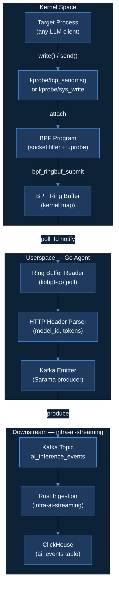
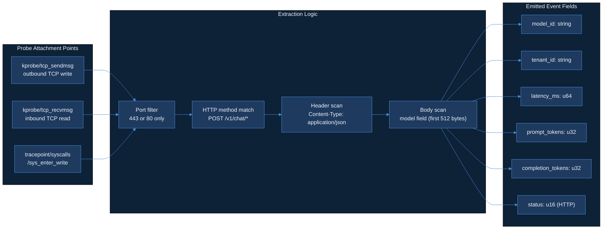

# Day 14 — Code Implementation Plan

| Field | Value |
|---|---|
| **Status** | Plan mode only — no implementation until user says `approve code`. |
| **Calendar day** | 2026-06-03 (Day 14 of 150) |
| **Repo to create** | `AkshantVats/ebpf-llm-tracer` |
| **Branch** | `feat/ebpf-llm-tracer-design` |
| **Product thread** | LensAI — zero-SDK LLM observability via eBPF kernel probes |
| **Daily thread** | Zero-SDK tracing is the design decision: Blog A's cardinality discipline meets Blog B's probe attachment strategy in one Kafka topic. |
| **Plan source** | `data/plan.json` → Day 14 → `code` field |

> **Plan.json quote (verbatim):**
> *"Create repo ebpf-llm-tracer + DESIGN.md: zero-SDK LLM HTTP tracing via eBPF. Sections: probe attachment points (socket/connect/send), HTTP parsing for model_id and token headers, userspace agent architecture, security/CAP constraints, integration contract with infra-ai-streaming Kafka topic. Read Cilium + BCC docs; spike feasibility on local Linux VM or Docker privileged container."*

---

## Ticket Summary

### What this is

`ebpf-llm-tracer` is a standalone OSS repo that intercepts outbound LLM API calls at the Linux kernel level — no changes to the application, no SDK injection, no sidecar proxy required. A BPF program attaches to TCP send/receive hooks, extracts the HTTP request and response headers to identify the LLM model being called and the token counts returned, then emits structured events to the same `ai_inference_events` Kafka topic consumed by `infra-ai-streaming`.

The Day 14 deliverable is not running code — it is the architectural blueprint: `DESIGN.md` in the new repo, plus a feasibility spike document that proves the approach works on a local privileged container. The DESIGN.md must be complete enough that any engineer (or the 8am agent) can implement the full tracer from it with no ambiguity.

### Why this day

Day 13 established cardinality discipline for metrics (from the Agoda TSDB incident: `model_id × pod × zone` exploding to millions of series). Day 14 takes that lesson directly into the tracer's label design: `ebpf-llm-tracer` deliberately caps emitted labels to `model_id` + `tenant_id` only — no per-call trace IDs, no pod names, no zone labels. The constraint is not accidental; it is a first-class architectural decision documented in DESIGN.md §5.

### Acceptance criteria

#### In scope

| # | Criterion | Verification |
|---|---|---|
| AC-1 | Repo `AkshantVats/ebpf-llm-tracer` created with MIT license, `.gitignore`, and `README.md` stub | `gh repo view AkshantVats/ebpf-llm-tracer` exits 0 |
| AC-2 | `DESIGN.md` committed to `feat/ebpf-llm-tracer-design` branch, all six sections present | `grep -c "^## " DESIGN.md` returns 6 |
| AC-3 | DESIGN.md §1 names at least three probe attachment points with kernel function names | Manual review |
| AC-4 | DESIGN.md §2 specifies HTTP header field names used to extract `model_id` and token counts | Manual review |
| AC-5 | DESIGN.md §3 describes userspace Go agent: ring buffer reader, event struct, Kafka producer | Manual review |
| AC-6 | DESIGN.md §4 lists required Linux capabilities with justification for each | Manual review |
| AC-7 | DESIGN.md §5 states emitted Kafka event schema (field names + types) matching `infra-ai-streaming` schema exactly | `diff <schema_in_DESIGN> <schema_in_infra_ai_streaming>` is empty |
| AC-8 | DESIGN.md §6 documents K8s DaemonSet deployment spec (resource limits, securityContext, hostPID/hostNetwork flags) | Manual review |
| AC-9 | `docs/spike-feasibility.md` documents what was tested, exact commands run, and pass/fail result | File present, non-empty |
| AC-10 | PR opened from `feat/ebpf-llm-tracer-design` to `main` with description linking to DESIGN.md and spike doc | PR URL recorded in DAILY_PROGRESS.md |

#### Out of scope (Day 14)

- Any BPF C source code (`.bpf.c`)
- Any Go source code for the userspace agent
- Actual Kafka producer integration
- Kubernetes manifests (beyond spec in DESIGN.md §6)
- TLS interception / SSL uprobes (deferred to Day 20+)
- Support for non-Linux platforms
- Handling of HTTP/2 or gRPC framing (HTTP/1.1 only in this design)

---

## LLD Diagram — eBPF Probe Architecture





---

## Implementation Checklist

### Phase A — Repository setup
- [ ] A1–A10: Source creds, create repo, clone, license, gitignore, README, scaffold commit, create branch, docs dir, push

### Phase B — DESIGN.md §1–§3
- [ ] B1–B6: Title block, §1 Probe Points, §2 HTTP Parsing, §3 Agent Architecture, self-review, commit

### Phase C — DESIGN.md §4–§6
- [ ] C1–C6: §4 Security, §5 Kafka Contract, §6 Deployment Spec, self-review, validate, commit

### Phase D — Feasibility spike
- [ ] D1–D10: Create spike doc, Docker command, bpftrace spike, BCC spike, kernel version, BTF check, libbpf vs BCC decision, failures, verdict, commit

### Phase E — Proof and PR
- [ ] E1–E8: Validate counts, check placeholders, verify spike doc, cleanup, push, open PR, record URL, set phase

---

## DESIGN.md Section Specs

### §1 — Probe Attachment Points
- §1.1 kprobe/tcp_sendmsg: `tcp_sendmsg(struct sock *sk, struct msghdr *msg, size_t size)`, 512-byte cap, port 80/443 filter, TLS limitation noted
- §1.2 tracepoint/syscalls/sys_enter_write: pid_fd_port BPF hash map, lower BTF dependency, higher overhead
- §1.3 Socket filter: SO_ATTACH_FILTER, pre-filter role only
- §1.4 Probe selection matrix table
- **Day 14 spike**: kprobe/tcp_sendmsg on port 80 only

### §2 — HTTP Parsing Strategy
- §2.1 First 512 bytes, POST/GET byte check, status code check
- §2.2 model_id: scan for `"model":"` (9 bytes), 64-byte read, unknown fallback, x-model-id header alt
- §2.3 Token counts: tcp_recvmsg correlation map keyed by (pid, sk_addr), latency_ms = (endNs-startNs)/1M, 30s lazy eviction
- §2.4 tenant_id: x-tenant-id header, cgroup fallback
- §2.5 Errors: partial event, never dropped path, parsing_errors map

### §3 — Userspace Agent Architecture
- §3.1 Binary layout (cmd/tracer, internal/{probe,parser,kafka,config}, bpf/)
- §3.2 Ring buffer reader: cilium/ebpf ringbuf.Reader, channel cap 4096, drop-oldest backpressure
- §3.3 RawEvent struct (byte-for-byte mirror of BPF C struct, LittleEndian unmarshal)
- §3.4 InferenceEvent struct with cost_usd computation from price table
- §3.5 Kafka: IBM/sarama async, WaitForLocal, tenant_id partition key, 100ms flush, MaxRetries=3

### §4 — Security and Capability Constraints
- CAP_BPF + CAP_PERFMON + CAP_NET_ADMIN on kernel 5.8+; drop CAP_SYS_ADMIN after load
- Kernel floor: 5.8 min, 5.15 LTS recommended
- BTF required at /sys/kernel/btf/vmlinux
- seccomp profile: Day 20+ task

### §5 — Kafka Integration Contract
- Topic: `ai_inference_events`, partition key: tenant_id
- Schema (8 fields): tenant_id, model_id, latency_ms, prompt_tokens, completion_tokens, cost_usd, status, timestamp_unix_ms
- **Cardinality discipline**: exactly two identity fields (tenant_id, model_id). No pod_name, zone, trace_id. Agoda lesson explicitly cited.
- Backward compat rules: additive = minor bump, rename/remove = new topic v2

### §6 — Deployment Spec
- DaemonSet YAML: hostPID: true, hostNetwork: false, tolerations: Exists, caps: BPF+NET_ADMIN+PERFMON, resources: 50m/64Mi req, 200m/256Mi limit
- Volume mounts: sys-kernel-btf (RO), sys-fs-bpf, cgroup-root (RO)
- libbpf-go (CO-RE) chosen over BCC
- Spike mode: docker --privileged --pid=host + BCC tools

### §D — Feasibility Spike Spec
- Sections: Environment, Spike 1 (bpftrace tcp_sendmsg), Spike 2 (BCC kprobe), Spike 3 (buffer read), Decision, Verdict
- Verdict: Feasible / Partially feasible / Blocked

---

## Proof Commands

```bash
grep -c "^## " DESIGN.md  # Expected: 6
grep -c "^### " DESIGN.md  # Expected: >= 18
wc -l DESIGN.md  # Expected: >= 250
grep -i "todo\|placeholder\|tbd\|fixme\|example\.com" DESIGN.md  # Expected: empty
for field in tenant_id model_id latency_ms prompt_tokens completion_tokens cost_usd status timestamp_unix_ms; do
    grep -q "\"${field}\"" DESIGN.md && echo "OK: ${field}" || echo "MISSING: ${field}"
done
wc -c docs/spike-feasibility.md  # Expected: >= 500
```

---

## Risk Table

| Risk | Likelihood | Impact | Mitigation |
|---|---|---|---|
| Agent host kernel < 5.8 | Medium | Medium | Fall back to BCC for spike only |
| Docker unavailable | Medium | Medium | Use bpftrace natively |
| BCC install fails | Medium | Low | Spike 1 proceeds independently |
| Schema diverges from infra-ai-streaming | Low | High | AC-7 field-by-field proof command |
| BPF verifier rejects buffer read | Medium | Low | Document error; informs Day 15 |

---

## Out of Scope

| Item | Deferred to |
|---|---|
| BPF C source (`tracer.bpf.c`) | Day 15 |
| Go source code | Day 15–16 |
| TLS interception (SSL uprobe) | Day 20+ |
| HTTP/2 or gRPC parsing | Day 22+ |
| K8s DaemonSet YAML | Day 17 |
| Unit tests | Day 15–16 |
| seccomp profile | Day 20+ |

---

*Plan generated: 2026-06-03 — Day 14 of 150 — Status: awaiting `approve code`.*
