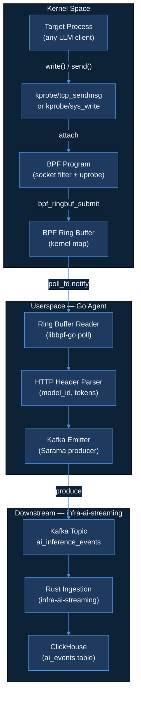
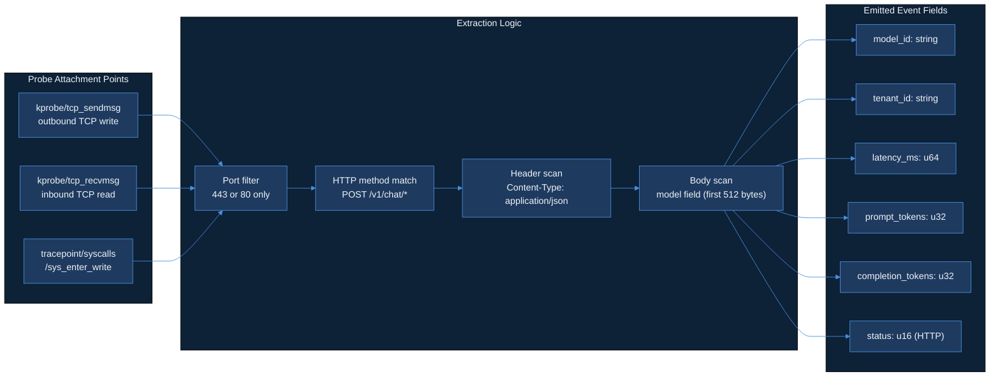

# Day 14 — Code Implementation Plan

| Field | Value |
|---|---|
| **Status** | Plan mode only — no implementation until user says `approve code`. |
| **Calendar day** | 2026-06-03 (Day 14 of 150) |
| **Repo to create** | `AkshantVats/ebpf-llm-tracer` |
| **Branch** | `feat/ebpf-llm-tracer-design` |
| **Product thread** | LensAI — zero-SDK LLM observability via eBPF kernel probes |
| **Daily thread** | Zero-SDK tracing is the design decision: Blog A's cardinality discipline meets Blog B's probe attachment strategy in one Kafka topic. |
| **Plan source** | `data/plan.json` → Day 14 → `code` field |

> **Plan.json quote (verbatim):**
> *"Create repo ebpf-llm-tracer + DESIGN.md: zero-SDK LLM HTTP tracing via eBPF. Sections: probe attachment points (socket/connect/send), HTTP parsing for model_id and token headers, userspace agent architecture, security/CAP constraints, integration contract with infra-ai-streaming Kafka topic. Read Cilium + BCC docs; spike feasibility on local Linux VM or Docker privileged container."*

---

## Ticket Summary

### What this is

`ebpf-llm-tracer` is a standalone OSS repo that intercepts outbound LLM API calls at the Linux kernel level — no changes to the application, no SDK injection, no sidecar proxy required. A BPF program attaches to TCP send/receive hooks, extracts the HTTP request and response headers to identify the LLM model being called and the token counts returned, then emits structured events to the same `ai_inference_events` Kafka topic consumed by `infra-ai-streaming`.

The Day 14 deliverable is not running code — it is the architectural blueprint: `DESIGN.md` in the new repo, plus a feasibility spike document that proves the approach works on a local privileged container. The DESIGN.md must be complete enough that any engineer (or the 8am agent) can implement the full tracer from it with no ambiguity.

### Why this day

Day 13 established cardinality discipline for metrics (from the Agoda TSDB incident: `model_id × pod × zone` exploding to millions of series). Day 14 takes that lesson directly into the tracer's label design: `ebpf-llm-tracer` deliberately caps emitted labels to `model_id` + `tenant_id` only — no per-call trace IDs, no pod names, no zone labels. The constraint is not accidental; it is a first-class architectural decision documented in DESIGN.md §5.

### Acceptance criteria

#### In scope

| # | Criterion | Verification |
|---|---|---|
| AC-1 | Repo `AkshantVats/ebpf-llm-tracer` created with MIT license, `.gitignore`, and `README.md` stub | `gh repo view AkshantVats/ebpf-llm-tracer` exits 0 |
| AC-2 | `DESIGN.md` committed to `feat/ebpf-llm-tracer-design` branch, all six sections present | `grep -c "^## " DESIGN.md` returns 6 |
| AC-3 | DESIGN.md §1 names at least three probe attachment points with kernel function names | Manual review |
| AC-4 | DESIGN.md §2 specifies HTTP header field names used to extract `model_id` and token counts | Manual review |
| AC-5 | DESIGN.md §3 describes userspace Go agent: ring buffer reader, event struct, Kafka producer | Manual review |
| AC-6 | DESIGN.md §4 lists required Linux capabilities with justification for each | Manual review |
| AC-7 | DESIGN.md §5 states emitted Kafka event schema (field names + types) matching `infra-ai-streaming` schema exactly | `diff <schema_in_DESIGN> <schema_in_infra_ai_streaming>` is empty |
| AC-8 | DESIGN.md §6 documents K8s DaemonSet deployment spec (resource limits, securityContext, hostPID/hostNetwork flags) | Manual review |
| AC-9 | `docs/spike-feasibility.md` documents what was tested, exact commands run, and pass/fail result | File present, non-empty |
| AC-10 | PR opened from `feat/ebpf-llm-tracer-design` to `main` with description linking to DESIGN.md and spike doc | PR URL recorded in DAILY_PROGRESS.md |

#### Out of scope (Day 14)

- Any BPF C source code (`.bpf.c`)
- Any Go source code for the userspace agent
- Actual Kafka producer integration
- Kubernetes manifests (beyond spec in DESIGN.md §6)
- TLS interception / SSL uprobes (deferred to Day 20+)
- Support for non-Linux platforms
- Handling of HTTP/2 or gRPC framing (HTTP/1.1 only in this design)

---

## LLD Diagram — eBPF Probe Architecture





---

## Implementation Checklist

Work proceeds in five phases. The 8am agent executes them in order.

### Phase A — Repository setup

- [ ] A1. Source `.agent/credentials.env`, configure `GITHUB_PAT` in git credential store
- [ ] A2. Create repo via `gh repo create AkshantVats/ebpf-llm-tracer --public --description "Zero-SDK LLM HTTP tracing via eBPF — part of LensAI"`
- [ ] A3. Clone locally
- [ ] A4. Add MIT `LICENSE` file
- [ ] A5. Add `.gitignore` for Go + BPF artifacts
- [ ] A6. Write `README.md` stub
- [ ] A7. Commit scaffold to `main`
- [ ] A8. Create branch `feat/ebpf-llm-tracer-design`
- [ ] A9. Create `docs/` directory
- [ ] A10. Push branch

### Phase B — DESIGN.md §1–§3

- [ ] B1. Write title block and intro
- [ ] B2. Write §1 — Probe Attachment Points
- [ ] B3. Write §2 — HTTP Parsing Strategy
- [ ] B4. Write §3 — Userspace Agent Architecture
- [ ] B5. Self-review §1–§3
- [ ] B6. Commit

### Phase C — DESIGN.md §4–§6

- [ ] C1. Write §4 — Security and Capability Constraints
- [ ] C2. Write §5 — Kafka Integration Contract
- [ ] C3. Write §6 — Deployment Spec
- [ ] C4. Self-review §4–§6
- [ ] C5. Validate section count
- [ ] C6. Commit

### Phase D — Feasibility spike

- [ ] D1. Create `docs/spike-feasibility.md`
- [ ] D2. Document Docker privileged container command
- [ ] D3. Run bpftrace spike on tcp_sendmsg
- [ ] D4. Run BCC kprobe spike
- [ ] D5. Record kernel version
- [ ] D6. Record BTF availability
- [ ] D7. Document libbpf-go vs BCC decision
- [ ] D8. Record failures
- [ ] D9. Write spike verdict
- [ ] D10. Commit

### Phase E — Proof and PR

- [ ] E1. Validate DESIGN.md section counts
- [ ] E2. Check for placeholder text
- [ ] E3. Verify spike doc non-empty
- [ ] E4. Final cleanup commit
- [ ] E5. Push branch
- [ ] E6. Open PR
- [ ] E7. Record PR URL in DAILY_PROGRESS.md
- [ ] E8. Update phase to `morning_complete`

---

## DESIGN.md Section Outlines

### §1 — Probe Attachment Points

#### §1.1 — kprobe/tcp_sendmsg
- Kernel function: `tcp_sendmsg(struct sock *sk, struct msghdr *msg, size_t size)`
- Read buffer: `bpf_probe_read_user(buf, len, msg->msg_iter.iov->iov_base)` — 512-byte cap
- Filter: check `sk->__sk_common.skc_dport` for port 80 or 443
- Limitation: TLS connections at port 443 are encrypted; TLS uprobes needed for plaintext

#### §1.2 — tracepoint/syscalls/sys_enter_write
- Args: `int fd, const char __user *buf, size_t count`
- Maintain BPF hash map `pid_fd_port` keyed by `(pid, fd)` → `dport`
- Advantage: available on older kernels without BTF
- Limitation: higher overhead, more complex fd correlation

#### §1.3 — Socket filter (BPF_PROG_TYPE_SOCKET_FILTER)
- Attach: `SO_ATTACH_FILTER` on raw socket
- Use: pre-filter to identify LLM API destination IPs
- Limitation: unreliable for HTTP body parsing

#### §1.4 — Probe selection matrix
Table: Probe type | HTTP/1.1 plaintext | HTTP/1.1 TLS | Kernel version floor | BTF required | Overhead

**Day 14 spike uses**: `kprobe/tcp_sendmsg` on port 80 only.

---

### §2 — HTTP Parsing Strategy

#### §2.1 — HTTP/1.1 framing in kernel buffers
- Read first 512 bytes. Sufficient for request line + most headers.
- Identify HTTP request: check bytes 0–3 for `POST` or `GET`
- Identify HTTP response: check bytes 9–11 for three-digit status code

#### §2.2 — model_id extraction
- Primary: scan for `"model":"` (9 bytes), read up to 64 bytes
- Use `bpf_probe_read_kernel_str` with explicit bound
- Fallback: emit `model_id = "unknown"` if not found
- Alternative: `x-model-id` HTTP request header

#### §2.3 — Token count extraction
- Source: HTTP response body (`"usage": {"prompt_tokens": N, "completion_tokens": M}`)
- Correlation map: key = `{ u32 pid; u64 sk_addr; }`, value = `{ u64 start_ns; char model_id[64]; char tenant_id[64]; }`
- On request: write entry with `bpf_ktime_get_ns()` timestamp
- On response: compute `latency_ms`, scan for token counts, emit event, delete entry
- Map eviction: entries older than 30 seconds deleted on next probe invocation

#### §2.4 — tenant_id extraction
- Source: `x-tenant-id` HTTP request header
- Fallback: cgroup name via `bpf_get_current_cgroup_id()` + userspace lookup table

#### §2.5 — Parsing error handling
- Parsing errors → partial event (model_id = "parse_error"), never dropped path
- Log to separate `parsing_errors` BPF perf event buffer

---

### §3 — Userspace Agent Architecture

#### §3.1 — Binary layout
```
ebpf-llm-tracer/
├── cmd/tracer/main.go
├── internal/probe/loader.go
├── internal/probe/ringbuf.go
├── internal/parser/http.go
├── internal/kafka/producer.go
├── internal/config/config.go
├── bpf/tracer.bpf.c
├── docs/DESIGN.md
├── docs/spike-feasibility.md
├── go.mod
└── README.md
```

#### §3.2 — Ring buffer reader goroutine
- Library: `github.com/cilium/ebpf/ringbuf`
- Backpressure: drop oldest event if channel full, increment `dropped_events_total`
- Error: `ringbuf.ErrClosed` = graceful shutdown

#### §3.3 — RawEvent struct
```go
type RawEvent struct {
    PID               uint32
    Pad               uint32
    SKAddr            uint64
    StartNs           uint64
    EndNs             uint64
    PromptTokens      uint32
    CompletionTokens  uint32
    HTTPStatus        uint16
    Pad2              [6]byte
    ModelID           [64]byte
    TenantID          [64]byte
}
```

#### §3.4 — HTTP correlation enrichment
```go
type InferenceEvent struct {
    TenantID         string  `json:"tenant_id"`
    ModelID          string  `json:"model_id"`
    LatencyMs        uint64  `json:"latency_ms"`
    PromptTokens     uint32  `json:"prompt_tokens"`
    CompletionTokens uint32  `json:"completion_tokens"`
    CostUSD          float64 `json:"cost_usd"`
    Status           int     `json:"status"`
    TimestampUnixMs  int64   `json:"timestamp_unix_ms"`
}
```

#### §3.5 — Kafka producer configuration
- Library: `github.com/IBM/sarama`
- `RequiredAcks = WaitForLocal`, topic: `ai_inference_events`, partition key: `tenant_id`
- Retry: `MaxRetries = 3`, `RetryBackoff = 250ms`
- Batching: `Flush.Frequency = 100ms`, `Flush.MaxMessages = 500`

---

### §4 — Security and Capability Constraints

| Capability | Required for | Can drop after load? |
|---|---|---|
| `CAP_BPF` | Loading BPF programs (kernel 5.8+) | No |
| `CAP_NET_ADMIN` | Attaching socket filters | No |
| `CAP_PERFMON` | Reading perf event buffers | No |
| `CAP_SYS_ADMIN` | Kernels < 5.8 only | Yes — drop after load on 5.8+ |

- Kernel floor: 5.8 (ring buffer + CAP_BPF split); recommended 5.15 LTS
- BTF required: `/sys/kernel/btf/vmlinux` must exist
- seccomp profile: Day 20+ hardening task

---

### §5 — Kafka Integration Contract

- Topic: `ai_inference_events`
- Partition key: `tenant_id`

```json
{
  "tenant_id": "string — required — max 128 chars",
  "model_id": "string — required — max 128 chars",
  "latency_ms": "uint64 — required",
  "prompt_tokens": "uint32 — required",
  "completion_tokens": "uint32 — required",
  "cost_usd": "float64 — required",
  "status": "int — required — HTTP status code",
  "timestamp_unix_ms": "int64 — required"
}
```

**Cardinality discipline (the Agoda lesson):** Schema has exactly two identity fields: `tenant_id` and `model_id`. No pod name. No zone. No trace ID. Cardinality = tenants × models. Bounded at any realistic scale.

---

### §6 — Deployment Spec

```yaml
apiVersion: apps/v1
kind: DaemonSet
metadata:
  name: ebpf-llm-tracer
  namespace: lensai
spec:
  template:
    spec:
      hostPID: true
      hostNetwork: false
      tolerations:
        - operator: Exists
      containers:
        - name: tracer
          image: ghcr.io/akshantvats/ebpf-llm-tracer:latest
          securityContext:
            privileged: false
            capabilities:
              add: [BPF, NET_ADMIN, PERFMON]
              drop: [ALL]
          resources:
            requests: {cpu: "50m", memory: "64Mi"}
            limits: {cpu: "200m", memory: "256Mi"}
          volumeMounts:
            - name: sys-kernel-btf
              mountPath: /sys/kernel/btf
              readOnly: true
            - name: sys-fs-bpf
              mountPath: /sys/fs/bpf
            - name: cgroup-root
              mountPath: /sys/fs/cgroup
              readOnly: true
```

**libbpf-go vs BCC decision:** Use libbpf-go (CO-RE). Single binary, no clang on node, BTF standard on 5.15+ LTS.

---

### §D — Feasibility Spike Spec (`docs/spike-feasibility.md`)

Required sections: Environment, Spike 1 (bpftrace tcp_sendmsg), Spike 2 (BCC kprobe), Spike 3 (read buffer bytes), Decision, Spike verdict.

Spike 1 command:
```bash
bpftrace -e 'kprobe:tcp_sendmsg { printf("pid=%d size=%d\n", pid, arg2); }' &
curl -s http://httpbin.org/post -d '{"model":"gpt-4o","prompt":"test"}' -H "Content-Type: application/json"
```

Spike verdict: one of Feasible / Partially feasible / Blocked.

---

## Proof Commands

```bash
# 1. Repo exists
gh repo view AkshantVats/ebpf-llm-tracer --json name,visibility

# 2. DESIGN.md has 6 sections
grep -c "^## " DESIGN.md  # Expected: 6

# 3. DESIGN.md has 18+ subsections
grep -c "^### " DESIGN.md  # Expected: >= 18

# 4. DESIGN.md is 250+ lines
wc -l DESIGN.md  # Expected: >= 250

# 5. No placeholder text
grep -i "todo\|placeholder\|tbd\|fixme\|example\.com" DESIGN.md  # Expected: empty

# 6. All 8 schema fields present
for field in tenant_id model_id latency_ms prompt_tokens completion_tokens cost_usd status timestamp_unix_ms; do
    grep -q "\"${field}\"" DESIGN.md && echo "OK: ${field}" || echo "MISSING: ${field}"
done

# 7. Spike doc non-empty
wc -c docs/spike-feasibility.md  # Expected: >= 500
```

---

## Definition of Done

- [ ] Repo `AkshantVats/ebpf-llm-tracer` is public
- [ ] LICENSE, .gitignore, README.md committed to main
- [ ] Branch `feat/ebpf-llm-tracer-design` with 3+ commits
- [ ] `DESIGN.md` at repo root with all six sections
- [ ] Event schema in §5 matches infra-ai-streaming exactly (8 fields)
- [ ] §5.3 explicitly references the Agoda TSDB lesson
- [ ] `docs/spike-feasibility.md` with spike commands and output
- [ ] Spike verdict stated
- [ ] PR open from `feat/ebpf-llm-tracer-design` to `main`
- [ ] PR URL in DAILY_PROGRESS.md
- [ ] Phase = `morning_complete`

---

## Risk Table

| Risk | Likelihood | Impact | Mitigation |
|---|---|---|---|
| Agent host kernel < 5.8 | Medium | Medium | Fall back to BCC for spike only |
| Docker unavailable | Medium | Medium | Use bpftrace natively |
| BCC install fails | Medium | Low | Spike 1 can proceed independently |
| DESIGN.md diverges from infra-ai-streaming schema | Low | High | AC-7 proof command catches it |
| BPF verifier rejects buffer read | Medium | Low | Document error, informs Day 15 |

---

## Out of Scope

| Item | Deferred to |
|---|---|
| BPF C source (`tracer.bpf.c`) | Day 15 |
| Go source code | Day 15–16 |
| TLS interception | Day 20+ |
| HTTP/2 or gRPC parsing | Day 22+ |
| Kubernetes DaemonSet YAML | Day 17 |
| Unit tests | Day 15–16 |

---

*Plan generated: 2026-06-03 — Day 14 of 150 — Status: awaiting `approve code`.*
