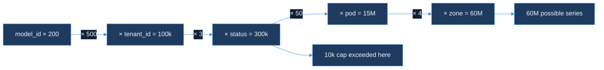
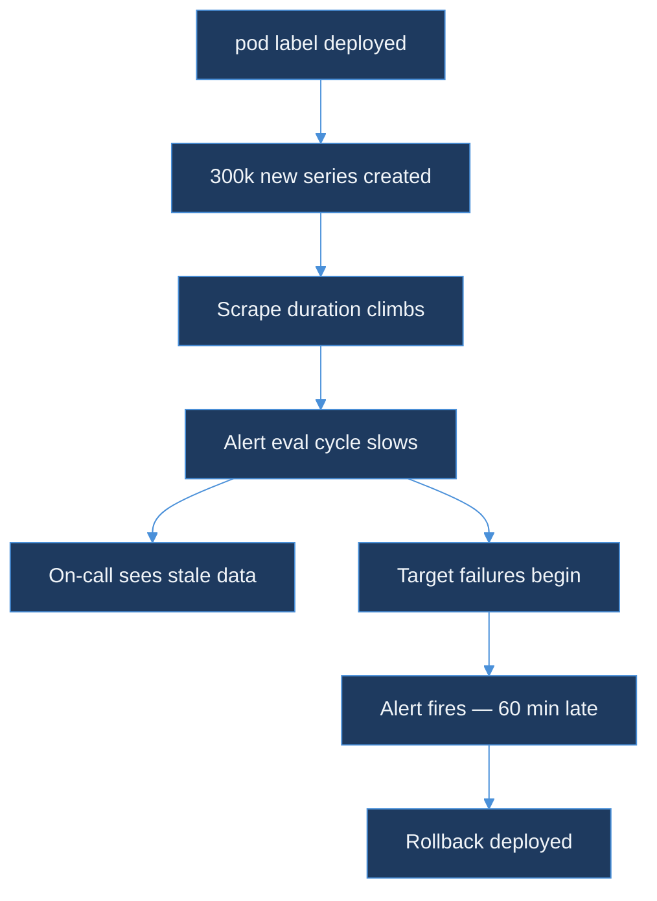

# Experience Blog Plan — Day 14

---

## Post Metadata

| Field | Value |
|---|---|
| **Title** | High-Cardinality Metrics — The Prometheus Wall We Hit |
| **Subtitle** | Agoda · schema design · label explosions |
| **Series** | experience |
| **Employer** | Agoda (WhiteFalcon TSDB team) |
| **Day** | 14 of 150 |
| **Format** | Incident (incident → investigation → root cause → fix → lesson) |
| **HTML filename** | `high-cardinality-metrics-prometheus-wall.html` |
| **Slug** | `high-cardinality-metrics-prometheus-wall` |
| **Cover image** | `blog/assets/covers/high-cardinality-metrics-prometheus-wall.png` |
| **OG image** | `blog/assets/og/high-cardinality-metrics-prometheus-wall.png` |
| **Estimated word count** | 2,400–2,800 words |
| **Date** | 2026-06-03 |
| **Bridge to OSS project** | `ebpf-llm-tracer` DESIGN.md cardinality cap — two-dimension hard limit justified by this incident |

---

## Relationship to Previous Posts

| Post | Angle |
|---|---|
| "Building a TSDB at Agoda" | System architecture overview |
| "When Percentiles Lie" | Cross-tier quantile correctness |
| "Cardinality Is the Silent Killer" | RoaringBitmap index limits |
| **Day 14 (this post)** | **The operational incident — Prometheus scrape failure, pod-label mistake, schema discipline** |

Do NOT repeat the RoaringBitmap deep-dive. One callback sentence: "The bitmap index had its own limits — that's a story I told in a previous post."

---

## Voice and Tone Reminders

- First person: "I was on call", "I didn't see it coming"
- Max 3 sentences per paragraph
- One concrete everyday analogy per major concept
- Every section ends with a "so what" close sentence
- Incident rhythm: calm → tension → root cause → relief → lesson
- Attribution: "the Agoda team had built", "I contributed", "my first proposal was wrong"
- Concrete numbers: 300k series, 60M combinations, 10k hard cap, 5 min scrape interval

---

## Section-by-Section Outline

### `<section id="hook">` — The Tuesday Morning

**P1:** Prometheus scrape duration doubled. Request rate flat. Asymmetry = cardinality signature. I didn't know that yet.

**P2:** First instinct: network. Checked saturation (flat), exporter times (normal). Problem on Prometheus write path, not the source.

**P3:** The alert didn't fire. Thresholded at target failure, not duration growth. Forty-minute gap before targets started failing.

**So-what:** The first thing cardinality steals from you is time: it grows in silence until the system cracks.

---

### `<section id="how-prometheus-identity-works">` — How Prometheus Turns Labels Into Identity

**P1 — filing cabinet analogy:** Metric name = drawer label. Each unique label combination = separate file folder. 1,000 pods = 1,000 folders.

**P2:** Low-cardinality labels fine. Unbounded labels (pod, user_id, request_id) multiply the entire existing folder count.

**P3:** Adding one label doesn't add series linearly — it multiplies. 6,000 series + label with 50 values = 300,000 series. Like photocopying every folder 50 times.

**So-what:** The multiplication is why cardinality doesn't walk into your system — it teleports.

---

### `<section id="the-incident-timeline">` — The Pod Label That Broke the Dashboard

**P1:** Change: `pod` label added to fleet-wide HTTP metric. Legitimate need — debugging latency discrepancy. Reviewed and merged. Looked harmless.

**P2:** Math nobody computed: 4 existing labels → 6,000 series. Fleet had 50 pods. `6,000 × 50 = 300,000` new series. Scrape duration climbed because work per interval multiplied by fifty.

**P3:** Alert was first casualty. Prometheus scrapes its own metrics for alerting. When scrape duration grows, alerting pipeline slows. We saw stale data — the window was already fogged.

**P4:** Fix: rollback config change + Prometheus restart. Ten minutes to baseline. `pod` label not reintroduced — separate scoped metric with TTL comment used instead.

**So-what:** Not a failure of engineering judgment — no gate existed to compute the cross-product before merge. That is the tooling failure.

---

### `<section id="the-combinatorics">` — Why It Explodes: The Seating Chart Math

**P1 — seating chart analogy:** 200 alumni × 500 tables = 100k. Add 3 meal options = 300k. Add 50 servers = 15M. From spreadsheet to warehouse.

**P2:** Real numbers: `model_id` (200) × `tenant_id` (500) × `status` (3) = 300,000. Add `pod` (50) × `zone` (4) = 60,000,000 combinations. Six million active at 10% fill — distributed database problem.

**P3:** Churn on top of cardinality: ephemeral pods create fresh series on restart that don't reuse old memory cleanly. Head block compaction cost.

**So-what:** Combinatorics doesn't care that most combinations never appear — it prices you for the ones that could.

---

### `<section id="what-whitefalcon-did-differently">` — Schema Discipline at WhiteFalcon

**P1 (attribute correctly):** The Agoda team built RoaringBitmap inverted index. Bitmap intersection = fast queries. Speed product of index structure. But 60M series ≠ 300k series for that operation.

**P2:** Hard cap: 10,000 unique series per metric. Not soft warning — configuration gate. Chosen by working backwards from P99 query latency. "Pricing the schema before you pay the bill."

**P3:** Mandatory cross-product analysis: list every existing label + cardinality + new label cardinality + upper-bound series count. If > 10k: second reviewer with sign-off.

**P4:** Flagged labels list: `pod`, `experiment_id`, `request_id`, `user_id`. Adding any flagged label requires justification + removal plan + scoped metric name.

**So-what:** The rules sound bureaucratic until you've watched a metrics stack go dark at 9am on a Tuesday.

---

### `<section id="my-contribution">` — My First Proposal Was Wrong

**P1:** Task: extend indexing for K8s tags (namespace, node, deployment). Legitimate need. My proposal: add as standard tag fields, identical to `service` and `region`.

**P2:** Review caught it. Senior engineer asked me to compute cross-product. Metric with 8,000 series + 4 K8s tags = 8,000 × 40 × 12 × 8 = 3M+ series. I missed the calculation entirely.

**P3:** Correct framing: index K8s tags as separate dimensions joinable at query time, not additional label dimensions on existing series. Write cost flat; cross-product paid at query time where it can be controlled.

**P4:** Revised design shipped. K8s tags queryable in production within the quarter. Since then: start every metrics schema design with the cross-product calculation first. "What is the highest-cardinality label, and what happens if I add the label I'm considering?"

**So-what:** The first proposal being wrong wasn't a failure — it was the moment the system taught me the right mental model.

---

### `<section id="diagram">` — The Label Explosion Multiplier

**Diagram 1 intro:** Trace a single metric from four-label state through adding `pod` and `zone`.



**Caption:** Each arrow is a multiplication. Series count crosses 10k cap before `pod` or `zone` are introduced.

**Diagram 2 intro:** Causal chain from config deploy to recovery. Forty-minute gap is the key structural failure.



**Caption:** Alert fired sixty minutes after problem started. Stale data window meant first dashboard snapshot was already misleading.

---

### `<section id="schema-rules">` — Schema Discipline You Can Apply Today

**Rule 1 — Compute before you commit:** (existing series) × (new label cardinality). If > cap: stop, redesign. Put calculation in PR description.

**Rule 2 — Flag structurally unbounded labels:** Maintain list: `pod`, `container`, `instance`, `experiment_id`, `request_id`, `user_id`, `trace_id`. Adding any requires justification + removal plan.

**Rule 3 — Alert on scrape duration, not just target failure:** Alert at 150% of baseline after two consecutive scrape intervals. Thirty-second lead time on five-minute scrape interval.

**Rule 4 — Use separate metrics for exploratory labels:** New metric name, TTL comment (`# INVESTIGATION: remove after YYYY-MM-DD`). Keeps fleet metric clean.

**Rule 5 — Validate cardinality in CI:** Query `/api/v1/series` count before and after. Block deployment when projected count exceeds cap.

**So-what:** These rules are not about limiting observability — they are about choosing when to pay the cross-product cost, and making that choice explicit.

---

### `<section id="bridge">` — Why ebpf-llm-tracer Has a Two-Dimension Cap

**P1:** Writing DESIGN.md for `ebpf-llm-tracer`, reached the metrics schema section. Temptation: flexibility. Wrote two-dimension hard cap instead. "No metric may carry more than two variable label dimensions."

**P2:** Two = largest number keeping metric under 10k series at realistic deployments: `model_id` (50 models) × `request_type` (10 types) = 500 series maximum. Adding `pod` (50 pods) = 25,000 — over cap immediately.

**P3:** Constraints that look restrictive are lessons from past incidents wearing engineering clothing. The two-dimension cap is a scar. The shape of what I learned on a Tuesday morning at Agoda when a one-line config change took a metrics stack dark for ninety minutes.

**So-what:** Every constraint in a system's design spec is a lesson someone paid for. Make sure yours are labeled.

---

### `<section id="closing">` — What I'd Tell the Engineer Who Added the Pod Label

**P1:** The engineer made a reasonable decision. Reviewed. Legitimate need. No prompt in the workflow to compute the cross-product. Blaming the individual is wrong analysis. Tooling failure, not judgment failure.

**P2:** High-cardinality incidents follow consistent shape: legitimate need → small-looking change → cross-product nobody computed → failure mode that looks like something else → fast recovery, slow diagnosis.

**P3:** If you take one thing: next time you add a label, write down the cross-product first. One line. Three multiplications. Share it in the PR description. The math takes two minutes. The incident takes ninety.

---

## Mermaid Node Label Audit

All node labels ≤ 6 words — verified:
- Diagram 1: model_id×200 (3), ×tenant_id=100k (4), ×status=300k (4), ×pod=15M (4), ×zone=60M (4), 60M possible series (3), 10k cap exceeded here (4) ✓
- Diagram 2: pod label deployed (3), 300k new series created (4), Scrape duration climbs (3), Alert eval cycle slows (4), On-call sees stale data (5), Target failures begin (3), Alert fires—60 min late (6), Rollback deployed (2) ✓

---

## Sidebar TOC

| Section | id | Sidebar text |
|---|---|---|
| Hook | `hook` | The Tuesday Morning |
| Labels as Identity | `how-prometheus-identity-works` | Labels as Identity |
| Incident Timeline | `the-incident-timeline` | The Pod Label Incident |
| Combinatorics | `the-combinatorics` | Why It Explodes |
| WhiteFalcon | `what-whitefalcon-did-differently` | Schema Discipline |
| My Contribution | `my-contribution` | My First Proposal Was Wrong |
| Diagram | `diagram` | The Multiplier Diagram |
| Rules | `schema-rules` | Rules for Today |
| Bridge | `bridge` | ebpf-llm-tracer Cap |
| Closing | `closing` | Closing |

---

## Cover Image

```bash
python3 .agent/generate_cover_dalle.py \
  --series experience \
  --title "High-Cardinality Metrics — The Prometheus Wall We Hit" \
  --subtitle "Agoda · schema design · label explosions" \
  --day 14 \
  --topic "Prometheus cardinality, label explosion, time series schema, TSDB design, cross-product analysis" \
  --out /tmp/cover-exp-day14.png
```

Fallback: `python3 .agent/generate_cover.py` with same args. Log: "DALL-E unavailable — used fallback Pillow cover"

Upload to:
- `blog/assets/covers/high-cardinality-metrics-prometheus-wall.png`
- `blog/assets/og/high-cardinality-metrics-prometheus-wall.png`

---

## series-index.json Entry

```json
{
  "slug": "high-cardinality-metrics-prometheus-wall",
  "title": "High-Cardinality Metrics — The Prometheus Wall We Hit",
  "subtitle": "Agoda · schema design · label explosions",
  "date": "2026-06-03",
  "series": "experience",
  "day": 14,
  "employer": "Agoda",
  "url": "blog/series/experience/high-cardinality-metrics-prometheus-wall.html",
  "coverImage": "blog/assets/covers/high-cardinality-metrics-prometheus-wall.png",
  "ogImage": "blog/assets/og/high-cardinality-metrics-prometheus-wall.png",
  "readingTime": "12 min",
  "tags": ["prometheus", "cardinality", "observability", "tsdb", "schema-design", "agoda"]
}
```

---

## Key Phrases to Use

- "The asymmetry — traffic normal, scrape time growing — is the specific signature of a cardinality explosion."
- "We were watching a system in distress, through a window that the distress had already fogged."
- "Pricing the schema before you pay the bill."
- "Constraints that look restrictive are often lessons from past incidents wearing engineering clothing."
- "The two-dimension cap is a scar."
- "The math takes two minutes. The incident takes ninety."

## Key Phrases to Avoid
- "Simply" — condescends
- "At the end of the day" — filler
- "This is a well-known problem" — it wasn't to the engineer who caused it
- Any phrasing implying the incident engineer made an error in judgment

---

## Git Branch and PR

- Branch: `blog/day-14-experience`
- PR title: `Day 14: High-Cardinality Metrics — The Prometheus Wall We Hit`
- Files: HTML, cover PNG, OG PNG, series-index.json update, Day 13 retrofix
- Merge: squash merge immediately after PR opens

---

*End of Day 14 Experience Blog Plan*
