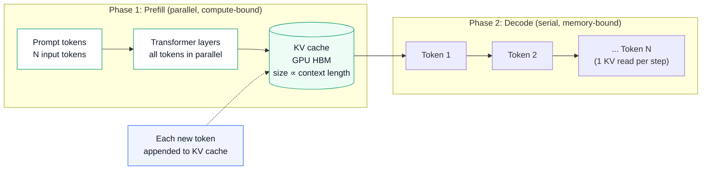
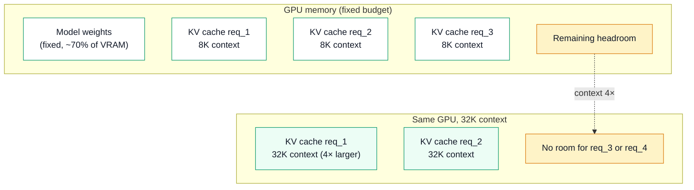
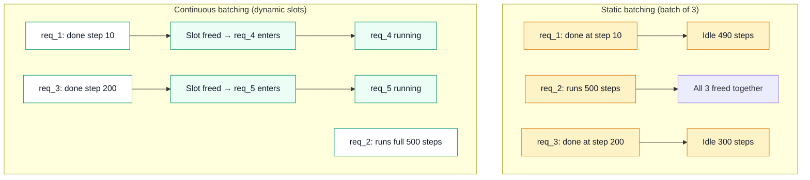

# Day 16 — AI Learning blog plan

**Workstream:** A3 · AI Learning (Profile)
**Status:** Plan mode — full draft for user review; no HTML until `approve ai`.
**Calendar day:** 16 of N · Thursday
**Code dependency:** HTTP parsing in userspace (`ebpf-llm-tracer`); `model_id` extraction feeds two-phase latency field design.

---

## Part A — Plan metadata

| Field | Value |
|-------|-------|
| **Title** | Day 16 — The Mental Model That Made LLM Infra Click |
| **Subtitle** | Prefill/decode + KV cache + continuous batching in DS analogies |
| **Public kicker** | **Day 16 of N** |
| **ai.day_index** | 16 |
| **Format ID** | `deep-dive` |
| **Series** | `ai-learning` → `Profile/blog/series/ai-learning/` |
| **Slug / filename** | `day-16-the-mental-model-llm-infra-click.html` |
| **Target HTML** | `Profile/blog/series/ai-learning/day-16-the-mental-model-llm-infra-click.html` |
| **Canonical URL** | `https://akshantvats.github.io/Profile/blog/series/ai-learning/day-16-the-mental-model-llm-infra-click.html` |
| **Hook (weave in opening, not subtitle)** | If you can explain Kafka, you can explain inference — after you name the two phases. |
| **Bridge (to today's code)** | The `model_id` extracted by today's eBPF HTTP parser is the join key between the two-phase latency columns Blog B defined on Day 1. |
| **Daily Thread (verbatim)** | Parsed `model_id` fields in eBPF events must align with the two-phase latency columns Blog B introduced on Day 1. |
| **Word target** | 1,500–2,200 |
| **Mermaid** | 3 diagrams — two-phase timeline (LR/TB), KV cache memory model (TB), continuous batching throughput (TB) |
| **Tags** | `AI Learning · 16 of N`, `LLM Inference`, `Prefill`, `Decode`, `KV Cache`, `Continuous Batching`, `LensAI` |
| **published_time** | `2026-06-02` (adjust on ship; newest in AI Learning series) |
| **Sibling Experience post** | Experience 15 of N — Cross-Tier Query Latency — Hot Redis, Cold Ceph |

---

## Part B — FULL BLOG DRAFT

> **Voice note:** Paste sections below into HTML `<article class="prose">`. H2 `id` attributes suggested in parentheses.

---

**AI Learning · 16 of N**

# Day 16 — The Mental Model That Made LLM Infra Click

*Prefill/decode + KV cache + continuous batching in DS analogies*

---

When I started working on LLM observability infrastructure, API latency was opaque. Time from request to last token was a single number. Some requests were fast. Some were slow for the first token and then fast. The tools I knew — Kafka lag, ClickHouse flush time, Redis hit rate — had no obvious analogue to LLM serving.

The mental model clicked when I stopped thinking about inference as a black box and named the two phases inside it. After that, every eBPF probe design decision, every Grafana column, and every SLO conversation had a structure.

**If you can explain Kafka, you can explain inference — after you name the two phases.**

<div class="stat-callout">
  <div class="stat-cell"><span class="stat-num">2</span><span class="stat-label">inference phases</span></div>
  <div class="stat-cell"><span class="stat-num">TTFT</span><span class="stat-label">time to first token = prefill cost</span></div>
  <div class="stat-cell"><span class="stat-num">KV cache</span><span class="stat-label">hot tier for attention states</span></div>
  <div class="stat-cell"><span class="stat-num">continuous batching</span><span class="stat-label">variable-partition consumer group</span></div>
</div>

## Phase 1: Prefill — the batch write

A prompt arrives at an LLM serving system. The first thing that happens is **prefill**: every input token is processed simultaneously, in parallel, by the transformer layers. The model reads the full context window and builds a **KV cache** — a set of key-value vectors for every attention layer, for every input token.

Prefill is compute-bound. It scales with the number of input tokens (context length). A 100-token prompt finishes in milliseconds. A 50,000-token RAG context takes noticeably longer. The output of prefill is not text — it is the KV cache.

**Kafka analogy:** Prefill is a producer writing a large batch to a topic. The write (prompt tokens → attention layers → KV cache) happens in one shot, in parallel across all "partitions" (transformer heads). The cost scales with batch size (context length). The produced artifact (the KV cache) sits in GPU memory for the consumer phase.

## Phase 2: Decode — the serial consumer

After prefill, the model generates tokens **one at a time**, autoregressively. To generate token N, it reads the KV cache for tokens 0 through N−1, runs the attention computation, and samples the next token. It then appends that token to the KV cache and generates token N+1.

Decode is memory-bandwidth-bound. Each step reads the full KV cache — which grows by one token per step. The GPU's HBM bandwidth is the bottleneck, not FLOPs. Generating 500 tokens requires 500 serial memory reads of the growing KV cache.

**Kafka analogy:** Decode is a slow consumer reading one message at a time from a partition where each read also appends to the end of the partition. The "message" is the KV cache state. The consumer cannot be parallelized across tokens within a single sequence — it is inherently serial.



## The KV cache — your hot tier for attention states

The KV cache lives in GPU HBM. It is structurally a hot tier:

| TSDB hot tier (Redis) | LLM KV cache (GPU HBM) |
|----------------------|------------------------|
| Recent metric buckets | Current sequence attention states |
| Eviction by time window | Eviction when context exceeds memory budget |
| Flush to cold tier on close | Offload to CPU RAM with prefix caching systems |
| Fast reads (DRAM-speed) | Fast reads (HBM-speed) |
| Memory-sized capacity | Strictly memory-sized capacity |

When GPU memory fills up — a common constraint at long contexts or high concurrency — the serving system evicts KV cache entries. With **prefix caching**, shared prompt prefixes are stored and reused, avoiding redundant prefill. This is identical to keeping frequently-accessed metric buckets in Redis while flushing old windows to cold storage.

<div class="pullquote"><p>The KV cache is not an optimization — it is the fundamental data structure that makes autoregressive generation possible at usable speed. Without it, every decode step would reprocess the entire prompt from scratch.</p></div>

The engineering constraint: **longer contexts → larger caches → fewer concurrent requests fit in GPU memory → throughput drops**. A model running 8K context per request can serve roughly 4× more concurrent users than the same model at 32K context given identical GPU memory. This is the memory wall in LLM serving — the same cardinality wall that causes label explosion in metrics systems.



## Continuous batching — the variable-partition consumer group

**Static batching:** the server collects a full batch of N requests, runs prefill for all simultaneously, then decodes all in lockstep until the last sequence finishes. If request 1 needs 10 tokens and request 2 needs 500 tokens, request 1 holds a batch slot for 490 idle steps.

**Continuous batching** (also called in-flight batching): as soon as a request emits its EOS token, the slot is freed and a new request enters the batch mid-stride. No slot idles waiting for the longest sequence.

**Kafka consumer group analogy:** Static batching is a consumer group that waits for all partitions to finish a batch before polling new messages — the slowest partition determines throughput. Continuous batching is a consumer group where each partition is polled independently as it completes; a fast partition returns its slot immediately.

| Static batching | Continuous batching |
|----------------|---------------------|
| Batch completes at slowest request | Slot freed at each request's EOS |
| GPU utilization drops as fast requests finish | GPU stays saturated throughout |
| Simple scheduler | Requires iteration-level slot management |
| Low throughput under mixed response lengths | 2–5× higher throughput in production |

The threshold where continuous batching matters: any workload with response length variance. LLM requests have enormous variance — a simple question generates 20 tokens, a code generation task 2,000. Static batching serializes everything behind the maximum. Continuous batching treats each decode stream independently.



## LensAI: the two-phase latency columns

From the plan thread: *"Parsed `model_id` fields in eBPF events must align with the two-phase latency columns Blog B introduced on Day 1."*

When an eBPF probe observes an LLM API call from the outside — capturing bytes at `SSL_write` (request) and `SSL_read` (response) — it sees:

- **Time to first response byte** ≈ **prefill time** (server runs prefill; no bytes until the first token is generated)
- **Time from first byte to last byte** ≈ **decode time** (tokens streaming, one per step)

This is the two-phase split visible from outside the serving system. For the `InferenceEvent` schema in `ebpf-llm-tracer`:

| Field | Phase | How eBPF captures it |
|-------|-------|----------------------|
| `prefill_latency_ms` | Phase 1 | `SSL_read` first byte ts − `SSL_write` ts |
| `decode_latency_ms` | Phase 2 | `SSL_read` last byte ts − first byte ts |
| `total_latency_ms` | Both | `SSL_read` last byte ts − `SSL_write` ts |
| `model_id` | Join key | Extracted from `"model"` JSON field in request |

`model_id` is the join key. Without it, a spike in `prefill_latency_ms` is invisible per model — you cannot distinguish a GPT-4o prefill regression from a cheaper model behaving as expected. `model_id` in every event is what makes the two-phase columns actionable in Grafana.

## Takeaway

Three concepts unlock LLM serving operations as a data-plane problem:

1. **Prefill = batch write** (compute-bound, scales with context length, produces KV cache)
2. **Decode = serial consumer** (memory-bandwidth-bound, scales with output tokens, reads KV cache per step)
3. **Continuous batching = variable-partition consumer group** (slots freed on sequence completion, not batch completion)

The KV cache is the hot tier. Context length is the cardinality knob. Throughput under continuous batching is throughput under optimal consumer group utilization — the same principle as maximizing partition fan-out while staying within Kafka consumer lag budgets.

Once you have these analogies, every serving system configuration decision — how many concurrent requests a GPU can handle, when TTFT spikes, why a 32K context request hurts other users — has a mechanical explanation from the data systems vocabulary you already hold.

Tomorrow the code continues with eBPF uprobe integration. The `model_id` field and two-phase latency split designed today are what make tomorrow's captured data meaningful rather than just bytes.

---

**Footnotes**

- Continuous batching paper: Orca (Yu et al., 2022) — "Orca: A Distributed Serving System for Transformer-Based Generative Models"
- TTFT / TPOT framing: vLLM documentation and project
- AI Day 14 (eBPF for AI infrastructure): `https://akshantvats.github.io/Profile/blog/series/ai-learning/day-14-ebpf-for-ai-infrastructure.html`
- AI Day 15 (multi-model routing): `https://akshantvats.github.io/Profile/blog/series/ai-learning/day-15-multi-model-routing-strategies.html`

---

## Part C — HTML implementation notes

- **Branch:** `feat/day-16-llm-mental-model`
- **File:** `blog/series/ai-learning/day-16-the-mental-model-llm-infra-click.html`
- **Shell:** copy Day 15 AI (newest with `blog-diagrams.css`)
- **`#series-nav-mount` data-series-slug:** `"ai-learning"`
- **Kicker:** `AI Learning · 16 of N`
- **3 Mermaid blocks:** two-phase LR, KV cache memory TB, continuous batching TB
- **`article:published_time`:** `2026-06-02`

### `blog/series-index.json` entry

```json
{
  "href": "blog/series/ai-learning/day-16-the-mental-model-llm-infra-click.html",
  "kicker": "Day 16 of N",
  "title": "The Mental Model That Made LLM Infra Click",
  "desc": "Prefill as batch write, decode as serial consumer, KV cache as hot tier, continuous batching as variable-partition consumer group — the three analogies that make LLM serving operations legible to data-plane engineers."
}
```

### `scripts/verify-blog-diagrams.mjs`

```javascript
{
  slug: 'day16',
  path: 'blog/series/ai-learning/day-16-the-mental-model-llm-infra-click.html',
  diagrams: 3,
  requiredClassDefs: ['pipeline', 'exact', 'semantic'],
}
```

Run: `node scripts/verify-blog-diagrams.mjs --slug day16` → exit **0**.

### Definition of done

- [ ] Prose approved (`approve ai`)
- [ ] HTML with 3 Mermaid diagrams + stat-callout + pullquote
- [ ] Cover PNG generated
- [ ] `series-index.json` updated
- [ ] User sign-off before Profile push

---

## Part D — Draft smell test

- [ ] Hook placed in opening paragraph, not subtitle
- [ ] All three concepts (prefill, decode, continuous batching) have concrete DS analogies
- [ ] KV cache = hot tier analogy includes memory constraint (not just speed)
- [ ] Two-phase latency table present with eBPF capture method for each field
- [ ] `model_id` as join key explained (not just mentioned)
- [ ] Thread woven once in prose (LensAI section), not as H2 title
- [ ] No employer AI product attribution
- [ ] 3 Mermaid blocks use `classDef pipeline / exact / semantic`
