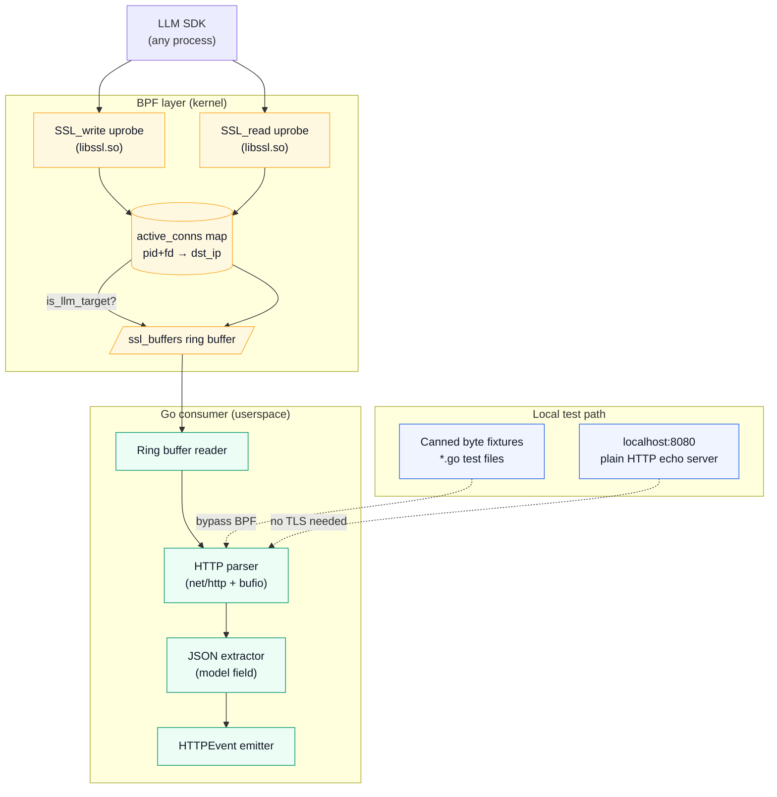

# Work Day 16 — Code / Infra (HTTP parsing in userspace)

**Status:** Plan mode only — no implementation until user says `approve code`.

**Calendar day:** 16 of N · **Thursday** · **LensAI** · repo: `ebpf-llm-tracer`

**Shared Daily Thread:** Parsed `model_id` fields in eBPF events must align with the two-phase latency columns Blog B introduced on Day 1.

**Plan source:** `data/plan.json` day 16 `code`:

> HTTP parsing in userspace: reassemble TLS plaintext via uprobes or capture pre-TLS on localhost test server first. Extract method, path, status, Content-Length, x-request-id, model from JSON body snippets. Unit tests with canned PCAP fixtures.

---

## 1. Ticket summary + acceptance criteria

### Ticket summary

**HTTP body parsing in userspace** — add `SSL_write` and `SSL_read` uprobes to the `ebpf-llm-tracer` to capture pre-encryption request bytes and post-decryption response bytes from LLM API calls. Parse HTTP headers and extract `model` from the JSON request body. Correlate captured bytes with the `active_conns` map from Day 15 to confirm this is an LLM connection before doing any work.

**Strategy:** Start with a localhost plain-HTTP test server (no TLS) to validate parsing logic, then layer on `SSL_write` uprobes for production traffic. This avoids TLS complexity while the HTTP parsing code is being developed and tested.

| In scope | Out of scope |
|----------|--------------|
| `SSL_write` uprobe on `libssl.so` → extract request bytes | IPv6 hostname-based allowlist (Bedrock) |
| `SSL_read` uprobe → extract response bytes | Streaming response reassembly (Day 17+) |
| Userspace HTTP/1.1 parser in Go | HTTP/2 / gRPC framing |
| JSON `model` field extraction from request body | Full response body parsing |
| `x-request-id` header extraction | Server-sent event reassembly |
| `Content-Length` and status code extraction | Kafka producer (Day 18) |
| Unit tests with canned byte slice fixtures | Integration test against live OpenAI API |
| `HTTPEvent` struct emitted by consumer goroutine | Prometheus metrics (Day 17) |

### Acceptance criteria

| # | Criterion | Proof |
|---|-----------|-------|
| 1 | `SSL_write` uprobe populates `ssl_buffers` ring buffer with `(pid, fd, buf_len, direction=write)` | BPF source + unit test fixture |
| 2 | `SSL_read` uprobe populates same ring buffer with `direction=read` | BPF source |
| 3 | `active_conns` lookup in uprobe skips non-LLM fds | BPF code review: map lookup returns null → skip |
| 4 | Go `http.ParseRequest(buf)` extracts method, path, Content-Length, x-request-id | Unit test with canned OpenAI request bytes |
| 5 | `extractModel(body)` parses `"model"` JSON field from first 4KB of request body | Unit test with 5 model name variants |
| 6 | `go test ./http/... -count=1` passes | CI |
| 7 | `go vet ./...` clean | CI |
| 8 | `HTTPEvent` struct committed to `probe/types.go` | Code review |

---

## 2. Architecture: uprobe capture path



---

## 3. BPF changes: SSL uprobe maps

### New maps (additions to Day 15 maps)

| Map | Type | Key | Value | Max entries |
|-----|------|-----|-------|-------------|
| `ssl_buffers` | RINGBUF | — | `ssl_event` (variable, max 4096 bytes payload) | 4 MB |

### `ssl_event` struct layout

```
offset  size  field
0       4     pid           __u32 / uint32
4       4     tid           __u32 / uint32
8       8     fd            __u64 / uint64
16      4     dst_ip        __u32 / uint32
20      2     buf_len       __u16 / uint16
22      1     direction     __u8  (0=write/request, 1=read/response)
23      1     _pad          __u8
24      8     ts_ns         __u64 / uint64
32      up to 4064  payload __u8[]
```

### `bpf/ssl.bpf.c` uprobe skeleton

```c
// Attach point: uprobe on SSL_write in libssl.so
SEC("uprobe/SSL_write")
int BPF_KPROBE(ssl_write_entry, void *ssl, const void *buf, int num) {
    // 1. get pid+tid from bpf_get_current_pid_tgid()
    // 2. read fd from ssl_to_fd scratch map (populated by SSL_get_fd uretprobe)
    // 3. lookup active_conns for this fd — if not LLM target, return 0
    // 4. reserve ssl_event in ring buffer
    // 5. copy min(num, 4064) bytes from buf into payload
    // 6. submit event
    return 0;
}
```

**Note on SSL* → fd:** OpenSSL's `SSL_get_fd()` is a userspace function; the BPF approach is to attach a uretprobe on `SSL_get_fd` to build a `ssl_to_fd` scratch map `(ssl_ptr → fd)`. This removes any struct-offset dependency. Unit tests bypass BPF entirely via the plain-HTTP test path.

---

## 4. HTTPEvent struct (`probe/types.go` addition)

```go
// HTTPEvent is emitted for each fully parsed LLM API request or response fragment.
type HTTPEvent struct {
    PID         uint32
    TID         uint32
    FD          uint64
    DstIP       uint32
    Direction   uint8   // 0=request, 1=response
    TsNs        uint64
    Method      string  // "POST"
    Path        string  // "/v1/chat/completions"
    StatusCode  int     // 200, 429, etc (response only)
    ContentLen  int64
    XRequestID  string
    ModelID     string  // extracted from "model" JSON field
    BodyPrefix  []byte  // first 256 bytes for debugging
}
```

---

## 5. HTTP parser (`http/parser.go`)

### Request parsing

```go
func ParseRequest(buf []byte) (*HTTPEvent, error) {
    req, err := http.ReadRequest(bufio.NewReader(bytes.NewReader(buf)))
    if err != nil { return nil, err }
    ev := &HTTPEvent{
        Method:     req.Method,
        Path:       req.URL.Path,
        ContentLen: req.ContentLength,
        XRequestID: req.Header.Get("x-request-id"),
    }
    body, _ := io.ReadAll(io.LimitReader(req.Body, 4096))
    ev.ModelID = extractModel(body)
    ev.BodyPrefix = body[:min(len(body), 256)]
    return ev, nil
}
```

### `extractModel` — JSON field extraction without full unmarshal

```go
// extractModel scans buf for `"model":"<value>"` without unmarshaling the full body.
// Handles partial captures (truncated JSON) by returning "" on no match.
var modelRe = regexp.MustCompile(`"model"\s*:\s*"([^"]+)"`)

func extractModel(buf []byte) string {
    m := modelRe.FindSubmatch(buf)
    if m == nil { return "" }
    return string(m[1])
}
```

**Why regex not `json.Unmarshal`:** The body may be a partial capture (truncated at 4KB). Unmarshaling would fail on incomplete JSON. The regex is resilient to truncated data and returns `""` safely.

**Gemini path-encoded model:** For Gemini, the model name is in the URL path (`/v1beta/models/gemini-1.5-pro:generateContent`), not the JSON body. `ParseRequest` must check `path` for a `models/<name>` segment when `extractModel` returns `""`.

---

## 6. Unit test fixtures (`http/parser_test.go`)

Five canned byte slice fixtures required:

| # | Fixture | Key assertion |
|---|---------|---------------|
| 1 | OpenAI `POST /v1/chat/completions`, `model: gpt-4o` | `ModelID == "gpt-4o"`, `XRequestID` extracted |
| 2 | Anthropic `POST /v1/messages`, `model: claude-sonnet-4-5` | `ModelID == "claude-sonnet-4-5"` |
| 3 | Gemini `POST /v1beta/models/gemini-1.5-pro:generateContent` | `ModelID` from path fallback |
| 4 | Response `HTTP/1.1 200 OK`, Content-Length, x-request-id | `StatusCode == 200`, `ContentLen > 0` |
| 5 | Truncated request body (JSON cut mid-`"model"` value) | `extractModel` returns `""`, no panic |

```go
var openAIRequestFixture = []byte("POST /v1/chat/completions HTTP/1.1\r\n" +
    "Host: api.openai.com\r\n" +
    "Content-Type: application/json\r\n" +
    "x-request-id: req_abc123\r\n" +
    "Content-Length: 78\r\n\r\n" +
    `{"model":"gpt-4o","messages":[{"role":"user","content":"hello"}]}`)

func TestParseRequest_OpenAI(t *testing.T) {
    ev, err := ParseRequest(openAIRequestFixture)
    require.NoError(t, err)
    assert.Equal(t, "POST", ev.Method)
    assert.Equal(t, "/v1/chat/completions", ev.Path)
    assert.Equal(t, "gpt-4o", ev.ModelID)
    assert.Equal(t, "req_abc123", ev.XRequestID)
}
```

---

## 7. Implementation checklist

**Branch (ebpf-llm-tracer):** `feat/http-parsing-userspace`

**Prerequisites**
1. [ ] Day 15 `feat/ebpf-connect-probe` merged to `main`
2. [ ] `active_conns` map accessible from new BPF program
3. [ ] Plan approved (`approve code`)

**Phase A — BPF SSL uprobes (45 min)**
4. [ ] Create `bpf/ssl.bpf.c` with `SSL_write` and `SSL_read` uprobes
5. [ ] Define `ssl_event` struct in `bpf/types.h`
6. [ ] Implement `ssl_to_fd` scratch map and `SSL_get_fd` uretprobe for fd correlation
7. [ ] Add `ssl_buffers` ring buffer map in `bpf/maps.h`
8. [ ] Update `Makefile` to compile `ssl.bpf.c` alongside `connect.bpf.c`

**Phase B — Go HTTP parser (1 h)**
9. [ ] Create `http/parser.go` with `ParseRequest`, `ParseResponse`, `extractModel`
10. [ ] Add `HTTPEvent` to `probe/types.go`
11. [ ] Wire ring buffer reader in `probe/probe.go` to call HTTP parser
12. [ ] Log `HTTPEvent` via zap in `cmd/tracer/main.go`

**Phase C — Unit tests (45 min)**
13. [ ] Create `http/parser_test.go` with 5 canned byte fixtures (§6)
14. [ ] Test `extractModel` with 5 model name variants including truncated body
15. [ ] Test `ParseResponse` with 200 and 429 status fixtures
16. [ ] `go test ./http/... -run . -v` passes locally

**Phase D — CI (20 min)**
17. [ ] Update `.github/workflows/ci.yml` to run `go test ./...`
18. [ ] Verify `go vet ./...` clean

**Phase E — Proof + commit (20 min)**
19. [ ] `go test ./... -count=1` green output captured
20. [ ] Commit: `feat(http-parser): userspace HTTP parsing for LLM API events`
21. [ ] **Do not push** until user sign-off

---

## 8. Thread: model_id field alignment

From `plan.json` thread: *"Parsed `model_id` fields in eBPF events must align with the two-phase latency columns Blog B introduced on Day 1."*

The `HTTPEvent.ModelID` field populated here feeds directly into the inference event schema. When the Kafka producer is added (Day 18), `model_id` becomes a partition routing key and a Grafana dimension. The field name `model_id` (snake_case) must match:
- `InferenceEvent.model_id` in `infra-ai-streaming`
- The two-phase latency Grafana columns: `prefill_latency_ms` (TTFT) and `decode_latency_ms` (total − TTFT)
- The `model_id × tenant_id` cardinality budget established on Day 1

Split latency fields on the `HTTPEvent`:

| Field | Capture point | Phase |
|-------|--------------|-------|
| `prefill_latency_ms` | `SSL_read` first byte ts − `SSL_write` ts | Prefill |
| `decode_latency_ms` | `SSL_read` last byte ts − first byte ts | Decode |
| `total_latency_ms` | `SSL_read` last byte ts − `SSL_write` ts | Both |

---

## 9. Definition of done

- [ ] This plan approved; user said `approve code`
- [ ] `go test ./http/... -count=1` passes with all 5 fixtures
- [ ] `HTTPEvent` struct in `probe/types.go` with `ModelID` and latency fields
- [ ] BPF SSL uprobe compiles via `make bpf`
- [ ] `go vet ./...` clean
- [ ] User sign-off before `git push`

---

## 10. Time estimate + risks

| Item | Estimate |
|------|----------|
| BPF SSL uprobes + ssl_to_fd map | 1 h |
| Go HTTP parser + extractModel | 1 h |
| Unit test fixtures (5) | 45 min |
| CI update | 20 min |
| **Total** | **~3 h** |

| Risk | Mitigation |
|------|------------|
| SSL* → fd requires platform-specific offset | Use `SSL_get_fd` uretprobe scratch map; unit tests bypass BPF entirely |
| Partial body captures truncate JSON | `extractModel` regex handles gracefully; fixture #5 validates no-panic |
| HTTP/2 framing is binary, not text | Day 16 scope is HTTP/1.1 only; note in code comment |
| Gemini model in URL path, not body | Special-case path extraction in `ParseRequest`; fixture #3 covers |
| Day 15 branch not merged | Start plain-HTTP parser development in parallel; BPF integration unblocked |
