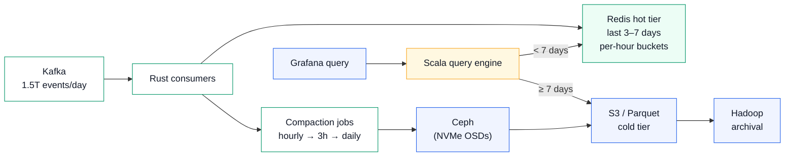
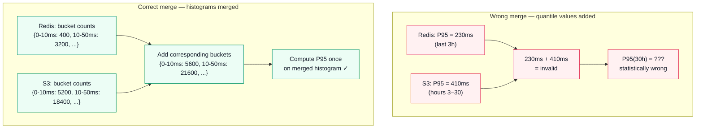
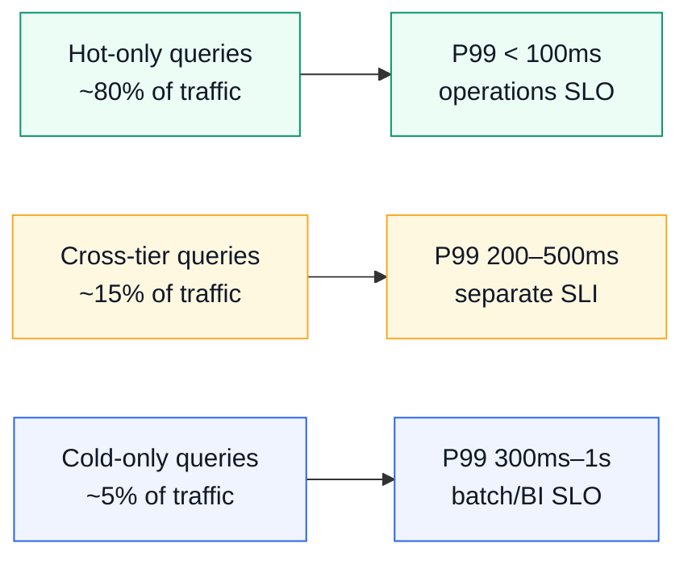

# Day 16 — Experience blog plan

**Workstream:** A2 · Experience (Profile)
**Status:** Plan mode — full draft for user review; no HTML until `approve experience`.
**Calendar day:** 16 of N · Thursday
**Code dependency:** HTTP parsing in userspace for `ebpf-llm-tracer` — extract model_id, path, x-request-id from TLS plaintext captures.

---

## Part A — Plan metadata

| Field | Value |
|-------|-------|
| **Title** | Cross-Tier Query Latency — Hot Redis, Cold Ceph |
| **Subtitle** | Agoda · tiering · why recent data dominates SLOs |
| **Public kicker** | **Experience Series · 15 of N** |
| **Format ID** | `patterns` — mechanism explanation with worked example |
| **Series** | `experience` → `Profile/blog/series/experience/` |
| **Slug / filename** | `cross-tier-query-latency-hot-redis-cold-ceph.html` |
| **Target HTML** | `Profile/blog/series/experience/cross-tier-query-latency-hot-redis-cold-ceph.html` |
| **Canonical URL** | `https://akshantvats.github.io/Profile/blog/series/experience/cross-tier-query-latency-hot-redis-cold-ceph.html` |
| **Bridge (to today's code)** | HTTP parsing in userspace mirrors separating hot path parsing from cold storage — do the minimum work before the bus. |
| **Daily Thread (verbatim)** | Parsed `model_id` fields in eBPF events must align with the two-phase latency columns Blog B introduced on Day 1. |
| **Word target** | 1,500–2,200 |
| **Mermaid** | 3 diagrams — tier topology (LR), wrong/correct merge (TB), query latency profile (LR) |
| **Tags** | `Experience Series · 15 of N`, `Agoda`, `TSDB`, `Storage Tiering`, `Redis`, `Ceph`, `Query Latency` |
| **published_time** | `2026-06-02` (adjust on ship; must be newest in Experience series) |
| **Sibling AI post** | Day 16 — The Mental Model That Made LLM Infra Click |

### Gold references (read before HTML)

| Priority | Post | Emulate |
|----------|------|---------|
| **Primary** | `building-tsdb-at-agoda.html` (Experience 1) | Attr-box attribution discipline, mechanism-first prose, no invented numbers |
| **Secondary** | `when-percentiles-lie-cross-tier-queries.html` | Histogram merge math, wrong/correct table |
| **Context doc** | `docs/context/agoda-whitefalcon-tsdb-architecture.md` | Canonical scale numbers, attribution boundary |

---

## Part B — FULL BLOG DRAFT

> **Copy source for HTML implementation.** Reader-facing H2 only. No ticket IDs, no plan labels.

---

**Experience Series · 15 of N**

# Cross-Tier Query Latency — Hot Redis, Cold Ceph

*Agoda · tiering · why recent data dominates SLOs*

---

The first time I queried a metric spanning more than seven days on WhiteFalcon, Agoda's in-house time-series database, the response time tripled. Not because the data was old — it was all indexed, all available — but because the query had crossed a tier boundary nobody had drawn a vertical line around on the SLO dashboard.

This is a post about what storage tiering looks like from the query path, why SLO percentiles are dominated by recent data even when cold-tier queries run fine, and what it means when a system stores histogram bucket counts instead of pre-computed percentiles.

<div class="stat-callout">
  <div class="stat-cell"><span class="stat-num">1.5T</span><span class="stat-label">events per day ingested</span></div>
  <div class="stat-cell"><span class="stat-num">3–7 days</span><span class="stat-label">hot-tier Redis retention</span></div>
  <div class="stat-cell"><span class="stat-num">2×–3×</span><span class="stat-label">latency increase at tier boundary</span></div>
  <div class="stat-cell"><span class="stat-num">1 merge</span><span class="stat-label">not two separate queries</span></div>
</div>

## Why recent data dominates SLOs

Most production metric queries have a recency bias that matches the storage tier topology by accident. Operations teams query "last 1 hour" or "last 24 hours." Incident retrospectives look at "last 3 days." These windows sit entirely within the hot tier and return fast. The SLO percentiles — P50, P95, P99 on query latency — are almost entirely shaped by these hot-tier reads.

The cold tier exists. It serves real queries. But they are rarer and they typically run as background jobs — weekly aggregate exports, capacity planning dashboards, billing reconciliation. The users who notice the latency difference are analysts. Operations teams rarely encounter it. This creates a performance contract that is true for the dominant workload and surprising for the tail.

At WhiteFalcon, the architecture made the tier boundary explicit:

- **Hot tier: Redis** — last 3–7 days at per-hour granularity. Bucketed in time windows. The window closes and a background job flushes it to Ceph/S3 as Parquet. Full per-hour resolution retained for the hot window.
- **Cold tier: Ceph → S3 (Parquet)** — compaction merges hourly → 3-hour → daily. Ceph sits as a local NVMe storage layer between pods and S3. Lower resolution over time. Cheaper per GB, higher query latency.
- **Long-term: Hadoop** — audit/archival only, not on the real-time query path.



<div class="attr-box team">
  <div class="attr-label">Agoda team's design</div>
  The Redis hot tier, Ceph/S3 cold tier, Rust consumers, compaction pipeline, and Kafka ingest were all designed and built by the Agoda engineering team. WhiteFalcon was running at scale when I joined. I contributed the cross-tier query engine extension — the piece that made a single request span both tiers correctly.
</div>

## The query that revealed the boundary

A time range query on WhiteFalcon routes based on whether the window falls entirely in Redis, entirely in cold storage, or crosses the boundary. Before the cross-tier extension existed, crossing the boundary required two manual queries — one to Redis, one to S3 — and the caller either picked the wrong tier or wrote application-layer merge code.

The problem with manual merging was not code complexity. It was the math.

**For additive aggregations, manual merge works:**
```
COUNT(Redis, last 3h) + COUNT(S3, hours 3–30) = COUNT(all 30h) ✓
```

**For percentiles, it silently produces wrong results:**
```
P95(Redis, last 3h) + P95(S3, hours 3–30) ≠ P95(all 30h)
```

Percentiles are not additive. Two P95 values from different datasets carry no information about the combined distribution. This is not an implementation detail — it is a property of quantile statistics.

WhiteFalcon avoids this at the storage layer. Aggregations are stored as **histogram bucket counts**, not as pre-computed percentiles. Each time window in Redis holds the raw distribution: how many samples fell in the 0–10ms bucket, 10–50ms bucket, 50–100ms bucket, and so on. The Scala query engine computes percentiles at read time from these bucket counts.



This is the design decision that makes cross-tier quantile queries correct: storing raw distributions, not summaries. The summary is computed at read time from whichever combination of tiers the time range spans.

## The cross-tier extension

The Scala query engine before this extension assumed queries hit one tier. A time range starting at T-2h and ending at T-30h required the caller to split it at the tier boundary.

The extension handles this internally:

1. Inspect the query time range
2. Determine which portions fall in Redis (hot) and which in S3 (cold)
3. Fetch histogram bucket counts from both tiers in parallel
4. Merge the bucket count arrays (element-wise addition)
5. Compute the requested quantile(s) on the merged result
6. Return a single response

The caller sees one query, one result. The tier boundary is invisible to the application.

I also added new Grafana query types via this path: wildcard tag matching across both tiers, and combined range queries that use the merged histogram path by default. These gave operations teams their first single query that could answer "what was P95 latency for model X across the last 10 days" without manual orchestration.

<div class="attr-box mine">
  <div class="attr-label">My scope at Agoda</div>
  I extended the Scala query engine to support cross-tier time range queries with correct quantile merge logic, and added the new Grafana query types that expose this path. I did not design the RoaringBitmap indexing layer, the Rust consumers, or the compaction pipeline — those were built by the Agoda team before I joined. Tenure: ~5 months, Senior Engineer.
</div>

## Why the latency cliff exists and how to observe it

Even with correct cross-tier merge, the query latency profile is not flat:

| Query window | Data source | Typical latency range |
|--------------|-------------|----------------------|
| Last 1h | Redis only | ~15–30ms |
| Last 24h | Redis only | ~30–60ms |
| Last 3 days | Redis (+ near boundary) | ~50–100ms |
| Last 7 days | Redis/cold boundary | ~100–200ms |
| Last 30 days | Cold tier S3/Parquet | ~300–800ms |

The latency cliff at the tier boundary is expected, not a bug. Cold-tier queries require S3 reads of Parquet files via Ceph-backed NVMe. They are cheaper storage but carry a latency cost by design.

What goes wrong operationally is when the SLO only measures hot-tier reads. If P99 alert fires at 500ms and all P99 samples are hot-tier, the cold tier can degrade to 5 seconds before any alert triggers. The fix: **separate SLIs for hot-only, cross-tier, and cold-only query classes**, surfaced distinctly in Grafana.



## Bridge to today's code

HTTP parsing in userspace has the same tiering intuition. When an eBPF SSL uprobe captures an LLM API call, it extracts only what it needs from the plaintext bytes before returning: `model_id`, `x-request-id`, `Content-Length`, status code. It does not reassemble the full response body. It does not wait for the stream to complete.

This is the principle behind the WhiteFalcon hot-tier design: Redis buckets store the minimum pre-aggregated form (histogram counts), not raw events. The ring buffer between kernel and userspace — like the Kafka pipe between Rust consumers and Ceph — is the minimum-work handoff point. Heavy processing (full body parse, JSON unmarshal, cold-tier scan) belongs downstream.

The `model_id` field extracted today becomes the dimension that separates two-phase inference latency (prefill vs decode) in the Grafana columns Blog B defined. The tier boundary in a storage system and the phase boundary in inference serving create the same observability problem: a single aggregate metric hides two distinct regimes, and the dominant (fast) regime sets the SLO while the tail (slow) regime causes the real incidents.

---

**Footnotes**

- Agoda engineering blog: search "Agoda WhiteFalcon engineering blog" for the team's published write-ups
- Experience 1 (Agoda TSDB full system tour): `https://akshantvats.github.io/Profile/blog/series/experience/building-tsdb-at-agoda.html`
- When Percentiles Lie (cross-tier quantile merge detail): `https://akshantvats.github.io/Profile/blog/series/experience/when-percentiles-lie-cross-tier-queries.html`
- Cardinality Is the Silent Killer (RoaringBitmap indexing): `https://akshantvats.github.io/Profile/blog/series/experience/cardinality-is-the-silent-killer-roaringbitmap-lessons.html`

---

## Part C — HTML implementation notes

- **Branch:** `feat/day-16-cross-tier-query-latency`
- **File:** `blog/series/experience/cross-tier-query-latency-hot-redis-cold-ceph.html`
- **Shell:** copy Experience 15 HTML (newest)
- **`#series-nav-mount` data-series-slug:** `"experience"`
- **Kicker:** `Experience Series · 15 of N`
- **3 Mermaid blocks:** tier topology LR, wrong/correct merge TB, query latency profile LR
- **`article:published_time`:** `2026-06-02`

### `blog/series-index.json` entry

```json
{
  "href": "blog/series/experience/cross-tier-query-latency-hot-redis-cold-ceph.html",
  "kicker": "Experience 15 of N",
  "title": "Cross-Tier Query Latency — Hot Redis, Cold Ceph",
  "desc": "How WhiteFalcon's histogram-based storage design makes cross-tier quantile queries mathematically correct — and why SLOs dominated by hot-tier reads hide cold-tier degradation until it's too late."
}
```

### Definition of done (HTML phase)

- [ ] Prose approved (`approve experience`)
- [ ] HTML with 3 Mermaid diagrams + attr-boxes (team + mine)
- [ ] Cover PNG generated
- [ ] `series-index.json` updated
- [ ] User sign-off before Profile push

---

## Draft smell test

- [ ] Attribution boundary respected: Agoda team built storage layers; Akshant extended query engine only
- [ ] No scale numbers outside 1.5T–1.8T/day range
- [ ] Histogram math explained correctly — bucket counts not quantile addition
- [ ] Bridge to eBPF/code natural (minimum-work-before-bus principle)
- [ ] No opening identical to prior Agoda posts (building-tsdb, percentiles-lie, cardinality)
- [ ] Separate SLI recommendation present (hot/cross/cold tiers)
