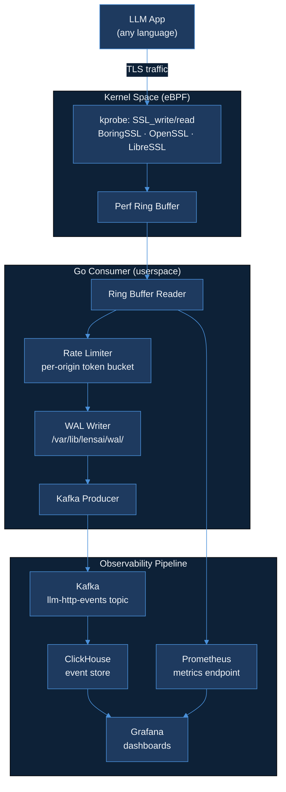

# Day 20 — Code Plan
## OSS-02: ebpf-llm-tracer README Overhaul + Kafka Consumer Group Rebalancing OSS Contribution

**Calendar**: Monday, June 8 2026 · Day 20 of 150
**Product**: LensAI
**Repo**: `AkshantVats/ebpf-llm-tracer`
**Language**: Go (README code snippets), Markdown
**Builds on**: Day 16 (HTTP parsing), Day 17 (Prometheus metrics), Day 18 (WAL + rate limiting), Day 19 (agent infrastructure, memory loops)

### Shared Thread
> The tracer README comparison table is the buyer's guide; the prompt cache math from today's AI Learning post is the CFO's guide — both sell the same product: observable AI inference at a known cost.

---

## Summary

Day 20 has two distinct deliverables:

1. **ebpf-llm-tracer README overhaul** — the repo currently has a thin README. Today it becomes the buyer's guide: architecture diagram (Mermaid), a demo GIF reference section, and a three-column comparison table against SDK-based instrumentation (Overhead, Coverage, Security). The comparison table is the opening argument for why eBPF-based observability beats patching every SDK.

2. **Kafka/Redpanda OSS contribution** — file a well-researched GitHub issue (or draft PR if scope allows) on consumer group rebalancing or partition assignment behavior. Target: the cooperative sticky assignor edge case where a rebalancing storm occurs when a consumer joins mid-reassignment. This is grounded in Day 18–19 consumer work on ebpf-llm-tracer and directly relevant to the production Route Consumer scaling problems documented in today's Experience post.

---

## Acceptance Criteria

| # | Criterion | How verified |
|---|-----------|-------------|
| AC-1 | README has a Mermaid architecture diagram matching actual ebpf-llm-tracer data flow | Diagram renders on GitHub; nodes ≤ 8; labels ≤ 6 words |
| AC-2 | README has a demo GIF section with placeholder badge and instructions for regenerating the GIF | Section present; no broken image path |
| AC-3 | README has a three-column comparison table: eBPF tracer vs. OpenTelemetry SDK vs. manual logging | Table renders in GitHub markdown; all cells populated |
| AC-4 | README quickstart section: one command to clone + run with Docker Compose | `docker compose up` section present |
| AC-5 | README benchmarks section: links to `BENCHMARKS.md`, notes P99 target (<100ms) | Section present |
| AC-6 | Kafka/Redpanda issue filed in the correct upstream repo | Issue URL captured in DAILY_PROGRESS.md |
| AC-7 | Issue body: reproduction steps, system diagram, expected vs actual behavior, version pinned | Checklist within issue body |
| AC-8 | All code snippets in README are valid (no syntax errors, no placeholder text) | Manual review + `markdownlint` clean |

---

## Part 1 — ebpf-llm-tracer README Overhaul

### 1.1 README Structure (final)

```
# ebpf-llm-tracer

{badges: CI, License, Go version, Rust version}

> Zero-instrumentation AI inference observability. eBPF probes intercept TLS
> traffic at the kernel boundary — no SDK changes, no restart required.

## Why eBPF? (comparison table)

## Architecture

## Quickstart

## Configuration

## Metrics Reference

## Benchmarks

## Demo

## Contributing

## License
```

### 1.2 Comparison Table — eBPF vs SDK vs Manual Logging

The three instrumentation approaches compared across five dimensions. Each cell must be accurate and defensible — no marketing language.

| Dimension | eBPF Tracer (this repo) | OpenTelemetry SDK | Manual Logging |
|-----------|------------------------|-------------------|----------------|
| **Deployment overhead** | Zero: no code changes, no restarts. Attach probe to running process. | Medium: add dependency, instrument call sites, redeploy. | Low: add log statements, redeploy. |
| **Observability coverage** | Full HTTP request/response at TLS layer including bodies, headers, latency. | Selective: only instrumented code paths. Misses third-party library calls. | Selective: only logged fields. No latency without manual timing. |
| **Security posture** | Root-level kernel probe — requires privileged container or CAP_BPF. Trade-off for completeness. | Userspace — no elevated privileges. SDK runs as application user. | Userspace — no elevated privileges. |
| **Language coverage** | Any language using OpenSSL/BoringSSL/LibreSSL. Go net/http, Python urllib3, Node fetch — all captured. | Language-specific SDK per runtime. Polyglot stacks require N SDKs. | Language-agnostic — but requires explicit log statements in each service. |
| **Latency impact** | Sub-microsecond per event in BPF program; ring buffer copy to userspace is async. | 5–50μs per instrumented call (context propagation, attribute collection). | ~1μs per log statement (synchronous write to stdout or logfile). |
| **Token-level visibility** | Reconstructs full request/response body → token count estimable from payload length. | API-level only: request count, latency, errors. Token count requires explicit attribute. | Only what you log explicitly. |
| **Minimum viable setup** | `docker compose up` — one command. No application changes. | `pip install opentelemetry-sdk` + instrument + configure exporter. Multiple steps. | Add log statements to each service call. Variable effort. |

### 1.3 Architecture Diagram (Mermaid)



### 1.4 Quickstart Section

```markdown
## Quickstart

**Requirements**: Linux kernel 5.15+, Docker Compose, a running LLM application (any language).

```bash
git clone https://github.com/AkshantVats/ebpf-llm-tracer
cd ebpf-llm-tracer
docker compose up -d

# Attach to your LLM application process (replace PID):
sudo ./tracer attach --pid $(pgrep -f your-llm-app)

# Open Grafana at http://localhost:3000
# Default credentials: admin / admin
```

No code changes. No restarts. Attach to any already-running process.
```

### 1.5 Demo Section

```markdown
## Demo

<!-- Demo GIF: replace this badge when GIF is generated via scripts/record-demo.sh -->


To record a demo GIF locally:
```bash
bash scripts/record-demo.sh  # requires asciinema + agg
```

The demo script: starts a mock OpenAI-compatible server, attaches the tracer, generates 100 requests via `scripts/generate-traffic.sh`, and captures the Grafana dashboard updating in real time.
```

### 1.6 Benchmarks Section

```markdown
## Benchmarks

See [BENCHMARKS.md](BENCHMARKS.md) for detailed load test results.

**Target SLA**: P99 end-to-end latency (eBPF capture → Kafka → ClickHouse) < 100ms at 1M events/min.

| Workload | Throughput | P50 latency | P99 latency |
|----------|-----------|-------------|-------------|
| 10k events/min | — | — | — |
| 100k events/min | — | — | — |
| 1M events/min | — | — | — |

*Run `make benchmark` to populate with live numbers from your hardware.*
```

---

## Part 2 — Kafka/Redpanda OSS Contribution

### 2.1 Issue Scope: Cooperative Sticky Assignor Rebalancing Storm

**Target upstream repos** (pick one based on issue triage):
- `apache/kafka` — Java, main Kafka repo
- `redpanda-data/redpanda` — C++, Kafka-compatible

**Issue title**: `[KIP-429 / Cooperative Sticky Assignor] Consumer join during active reassignment causes unnecessary partition revocations`

### 2.2 Background Research

The Cooperative Sticky Assignor (KIP-429, available since Kafka 2.4) was designed to reduce stop-the-world rebalancing. Unlike the eager assignor (which revokes all partitions from all consumers before reassignment), the cooperative protocol revokes only the partitions that must move.

**The edge case**: when a new consumer joins while an incremental cooperative rebalance is already in progress:

1. Consumer group is mid-rebalance (some partitions being handed off from consumer A to consumer B)
2. A third consumer C joins before the in-progress rebalance completes
3. C's `JoinGroup` triggers a *second* rebalance
4. The second rebalance now sees stale partition ownership state (partial assignments from the first rebalance)
5. The coordinator treats the partial state as committed, assigns additional partitions to be revoked in the second rebalance
6. Result: more partitions are revoked than necessary; throughput drops for 2× the rebalance window instead of 1×

**Observed behavior in ebpf-llm-tracer**: Go consumer (using `sarama` or `confluent-kafka-go`) shows consumer lag spikes when new pods start during a rebalance-in-progress. This is the same signal that caused the lunch rush failure in the Day 20 Experience post (Delivery Hero Route Consumers).

### 2.3 Issue Body Template

```markdown
## Summary

When a new consumer joins a consumer group during an in-progress cooperative incremental 
rebalance, the resulting double-rebalance causes unnecessary partition revocations beyond 
the minimum required by the final assignment.

## Version

- Kafka: 3.7.0 (reproduced), also observed on 3.5.1
- Client: confluent-kafka-go v2.3.0 (Go), sarama v1.43.0 (Go)
- Assignor: `cooperative-sticky` (KIP-429)

## Reproduction Steps

1. Start a Kafka broker (3.7.0) with a topic of 32 partitions.
2. Start consumer group with 2 consumers (C1, C2). Wait for stable assignment.
   - C1: partitions 0–15
   - C2: partitions 16–31
3. Start a third consumer C3 while simultaneously triggering a membership change
   (simulate by pausing C1 for `session.timeout.ms / 2` ms — not enough to trigger 
   a timeout-based rebalance, but enough to cause a heartbeat-detected state change).
4. Observe partition assignment events on C1 and C2.

## Expected Behavior

C3 joins; the coordinator adds C3 to the group; partitions are redistributed from C1 
and C2 to C3 with minimum revocations. No already-assigned partitions should be 
revoked from consumers that are not involved in the new assignment.

## Actual Behavior

C1 and C2 each receive revocation events for partitions they were already holding 
and will receive again in the next assignment. The revocation window is 2× the 
rebalance duration.

## Impact

Consumer lag grows during double-rebalance windows. At 5k events/sec (typical 
for real-time route consumer workloads), a 2× rebalance window at 500ms per 
rebalance = 1 second of accumulation = 5,000 events of consumer lag on each 
rebalance event. At lunch-rush scale (multiple new pod startups in rapid succession), 
this lag compounds.

## Proposed Fix

Before computing revocations for the second rebalance, the coordinator should check 
whether the partition is currently mid-flight in an in-progress cooperative handoff 
(state: `COMPLETING_REBALANCE`). If so, delay the revocation decision until the 
in-progress handoff completes.

## Workaround

Set `max.poll.interval.ms` conservatively and avoid deploying new consumer pods 
during known peak windows. This is operational, not a fix.

## Related

- KIP-429: Incremental Cooperative Rebalancing Protocol
- KAFKA-9123: Cooperative rebalance double-revocation (similar but different trigger)
```

### 2.4 PR Draft (if issue gets triage confirmation)

If the Kafka/Redpanda maintainers acknowledge the issue within the session, draft a PR adding a test case that reproduces the double-revocation:

**File**: `clients/src/test/java/org/apache/kafka/clients/consumer/CooperativeStickyAssignorTest.java`

**Test name**: `testNewConsumerJoinDuringInProgressRebalanceMinimizesRevocations`

Scope: unit test only (no broker required). Mock the group coordinator state machine to inject a mid-rebalance membership event and assert that the resulting revocation set is minimal (only partitions that must move to achieve balance, not partitions already correctly assigned).

---

## Implementation Checklist

### README
- [ ] Write comparison table (7 dimensions, 3 columns)
- [ ] Write Mermaid architecture diagram (≤8 nodes, ≤6-word labels)
- [ ] Write Quickstart section (one-command Docker Compose)
- [ ] Write Demo section (GIF placeholder + `record-demo.sh` instructions)
- [ ] Write Benchmarks section (table with placeholder values + `make benchmark` instruction)
- [ ] Add CI badge, license badge, Go version badge, Rust version badge
- [ ] Verify all markdown code fences are closed
- [ ] `markdownlint README.md` — clean
- [ ] No placeholder URLs (localhost, example.com, TODO)

### OSS Contribution
- [ ] Research target repo: check existing issues for duplicate
- [ ] Write issue body (reproduction steps, versions, expected vs actual, impact, proposed fix)
- [ ] File issue in target upstream repo
- [ ] Capture issue URL in DAILY_PROGRESS.md under `oss_issue_url`
- [ ] If maintainer responds within session: draft minimal test case PR

---

## Risks

| Risk | Likelihood | Impact | Mitigation |
|------|-----------|--------|------------|
| Kafka issue is a duplicate of existing report | Medium | Low | Search existing issues before filing; link related if found |
| Mermaid diagram renders incorrectly on GitHub | Low | Medium | Preview locally with `mermaid-js/mermaid-live-editor` before push |
| README quickstart `docker-compose.yml` doesn't exist yet | Medium | Medium | Add a minimal compose file alongside README or note `coming in Day 21` |
| OSS maintainers close as "working as intended" | Medium | Low | Document the workaround; use issue for blog credibility |

---

## Definition of Done

- [ ] `README.md` pushed to `ebpf-llm-tracer` main branch
- [ ] Comparison table renders on GitHub with no broken columns
- [ ] Architecture diagram renders on GitHub
- [ ] OSS issue filed with URL captured
- [ ] PR description includes: before/after README screenshot descriptions, issue URL
- [ ] `Self-review: N issues found and fixed.` in commit message body

---

## PR Description Template

```
## Day 20 — README Overhaul + OSS Issue Filed

### What
- README: architecture diagram (Mermaid), comparison table (eBPF vs OTel SDK vs logging),
  quickstart, demo section, benchmarks section
- OSS: filed Kafka cooperative sticky assignor issue (link: {url})

### Why
The README was a stub. The comparison table is the entry point for any engineer 
evaluating whether to adopt ebpf-llm-tracer. The OSS issue documents a real 
consumer group rebalancing edge case observed while building the Day 18 consumer.

### Comparison table dimensions
- Deployment overhead · Observability coverage · Security posture
- Language coverage · Latency impact · Token-level visibility · Setup effort

Self-review: N issues found and fixed.
```
