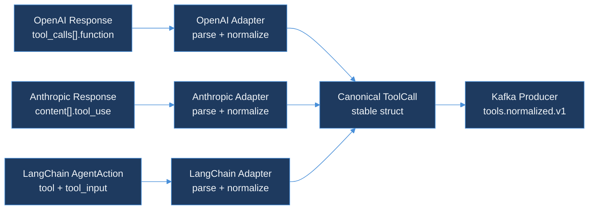

# Day 38 — AI Learning Blog Outline
## Day 38 — Adapter Pattern for Vendor Drift

**Calendar**: Friday, 17 July 2026 · Day 38 of 150
**Series**: AI Learning
**Slug**: `day-38-adapter-pattern-vendor-drift`
**Live URL**: `https://akshantvats.github.io/Profile/blog/series/ai-learning/day-38-adapter-pattern-vendor-drift.html`

---

## Post Metadata

| Field | Value |
|---|---|
| Title | `Day 38 — Adapter Pattern for Vendor Drift` |
| Subtitle | Versioned normalizers behind stable structs |
| Series chip | `AI Learning · Day 38 of 150` |
| Cover image | `blog/assets/covers/day-38-adapter-pattern-vendor-drift.png` |
| OG image | `blog/assets/og/day-38-adapter-pattern-vendor-drift.png` |
| Estimated read time | 9 min |
| Format | deep-dive |

---

## Hook

> "Golden files are your contract tests when OpenAI changes JSON."

OpenAI has changed the shape of `tool_calls` responses three times in eighteen months. Anthropic ships `tool_use` in a completely different location in the response body. LangChain doesn't give you a canonical ID at all. If you write code that touches the raw vendor response, you're writing code that will break.

The Adapter Pattern is how you insulate the rest of your system from vendor churn. Today I built three adapters in `tool-call-analyzer` — one per vendor — and the rest of the pipeline doesn't know any vendor exists.

---

## Core Analogy

Think of a universal travel plug adapter. Your laptop has one charging interface (the connector on the power brick). But every country has a different wall socket shape. You don't redesign the laptop for each country — you put a small adapter between the wall and the brick that converts the local shape into the one your laptop expects.

That's exactly what these adapters do. The "laptop" is the rest of TraceForge — Kafka producer, ClickHouse writer, Grafana dashboards. It speaks one shape: `ToolCall`. The "wall sockets" are OpenAI's `tool_calls[].function.arguments`, Anthropic's `content[].input`, and LangChain's `tool_input`. Each adapter is a small converter between one wall socket and the canonical plug.

---

## Outline

### Section 1: Why Vendor Formats Are a Moving Target (700 words)

- OpenAI `tool_calls` went through three breaking changes: `functions` (deprecated) → `tool_calls` → `parallel_tool_calls` added
- Anthropic shifted from `tool_results` in system prompt to `content` array in v3
- LangChain's `AgentAction` provides no canonical ID, no token usage, no model name
- Without an abstraction layer: every downstream consumer (ClickHouse writer, cost aggregator, alerting rule) breaks on every API version bump
- With an abstraction layer: vendor changes are a one-file fix — update the adapter, keep everything downstream intact
- Real cost: a missed adapter update in a pipeline that emits cost data means cost attribution goes to zero silently — the worst kind of failure

**Paragraph ends with "so what"**: The adapter layer is a firewall between vendor churn and your data model. Every hour you spend building it is an hour you don't spend debugging a cost dashboard that suddenly shows $0 for half your agents.

### Section 2: The Three Wire Formats (650 words)

Walk through each vendor format with the actual JSON shape:

**OpenAI (`tool_calls[].function.*`)**
```json
{
  "choices": [{
    "message": {
      "tool_calls": [{
        "id": "call_abc123",
        "type": "function",
        "function": { "name": "search_web", "arguments": "{\"query\": \"...\"}"}
      }]
    }
  }],
  "usage": { "prompt_tokens": 512, "completion_tokens": 64 }
}
```
Key detail: `arguments` is a JSON string, not a JSON object. You unmarshal the outer response, then unmarshal `arguments` separately. This trips up every first-time implementer.

**Anthropic (`content[].tool_use`)**
```json
{
  "content": [{
    "type": "tool_use",
    "id": "toolu_01A09q90qw90lq917835lq9",
    "name": "search_web",
    "input": { "query": "..." }
  }],
  "usage": { "input_tokens": 348, "output_tokens": 72 }
}
```
Key detail: `input` is already a JSON object (not a string). Token field names differ from OpenAI: `input_tokens` not `prompt_tokens`. There's no `choices` array.

**LangChain (`AgentAction`)**
```json
{
  "tool": "search_web",
  "tool_input": { "query": "..." },
  "log": "I should search for this.\nAction: search_web\n..."
}
```
Key detail: no ID, no token usage, no model name. The log field is unstructured text with embedded reasoning. You synthesize an ID from a hash of `tool + log` to get stability across runs.

**Paragraph ends with "so what"**: Three formats, three different field names for the same concept. The adapter's job is to paper over this inconsistency exactly once so nothing else in the pipeline ever has to care.

### Section 3: Golden Files as Contract Tests (700 words)

This is where the blog becomes a how-to:

- Golden files are recorded real API responses saved to `testdata/golden/{vendor}/`
- They serve two purposes: (1) adapter tests, (2) regression detection when vendor APIs change
- When OpenAI adds a new field (like `logprobs` in a recent version), your adapter test loads the golden file and must not fail — because you've written the adapter to use `json.Unmarshal` with unknown-field ignoring (Go's default behavior)
- When OpenAI *removes* or *renames* a field you depend on, the golden file test catches it — but only if you update the fixture to the new format when you upgrade the SDK

The drift simulation fixture (`tool_call_unknown_fields.json`) adds `"new_field_openai_added": "some_value"` — a field that didn't exist when you wrote the adapter. The test confirms the adapter parses without error. This is the test that would have caught the three OpenAI breaking changes before they hit production.

Mermaid diagram:



**Paragraph ends with "so what"**: A golden file that's 6 months old is a golden file that lies. The discipline is: every time you upgrade an AI SDK, update the golden fixtures to the new response format. The test failing is the warning; you catching it before deploy is the payoff.

### Section 4: The `CanHandle` Auto-detection Pattern (450 words)

- The `Registry` calls `CanHandle(raw)` on each adapter in priority order
- `CanHandle` does a minimal JSON unmarshal to sniff the payload shape — not a full parse
- This lets the system process tool calls from a mixed log stream without knowing which vendor sent each one
- Priority order matters: check OpenAI first (most common), then Anthropic, then LangChain
- The LangChain format is ambiguous (any JSON object with a `tool` string field would match) — so it goes last

Real-world use: a log aggregator pulling from multiple agent frameworks doesn't know which vendor produced each entry. The Registry handles detection automatically.

**Paragraph ends with "so what"**: Auto-detection is what makes the normalizer pipeline practical in a multi-vendor environment. Without it, you'd need to tag every log entry with its source — which assumes the source is always correct, and it never is.

### Section 5: Cost Model Across Vendors (400 words)

- OpenAI provides `usage.prompt_tokens` and `usage.completion_tokens`
- Anthropic provides `usage.input_tokens` and `usage.output_tokens`
- LangChain provides nothing — cost is zero, flagged in `model_name: "unknown"`
- The `EstimateCost` function uses a hardcoded price table (updated July 2026 pricing)
- LangChain's zero cost is visible in dashboards — an honest signal that the framework stripped the data

**Paragraph ends with "so what"**: When your cost dashboard shows a cluster of $0 entries for `vendor=langchain`, that's not a bug — it's the adapter honestly reporting that LangChain didn't give us the data. The response is to instrument at the LangChain SDK level, not to paper over the gap with a guess.

### Section 6: What's Next (250 words)

- Day 39: Add LlamaIndex adapter + cost rollup MV in ClickHouse (sum `cost_usd` by `vendor`, `model_name`, `category` per 1-min window)
- Day 40: Avro schema for `tools.normalized.v1` topic + Confluent Schema Registry setup
- The missing piece today: real Kafka broker integration test. The producer is tested with a mock writer — an actual end-to-end test (parse a fixture → emit → consume → verify) is a Day 39 add-on

---

## Series Nav (sidebar)

Previous: Day 37 — tool-call-analyzer: Canonical ToolCall Struct, Adapter Interface, Cost Model
Next: Day 39 — LlamaIndex Adapter + ClickHouse Cost Rollup (coming)

---

## Tags for social sharing

`#DistributedSystems #AIInfrastructure #GPUComputing #Observability #BackendEngineering #AdapterPattern`
