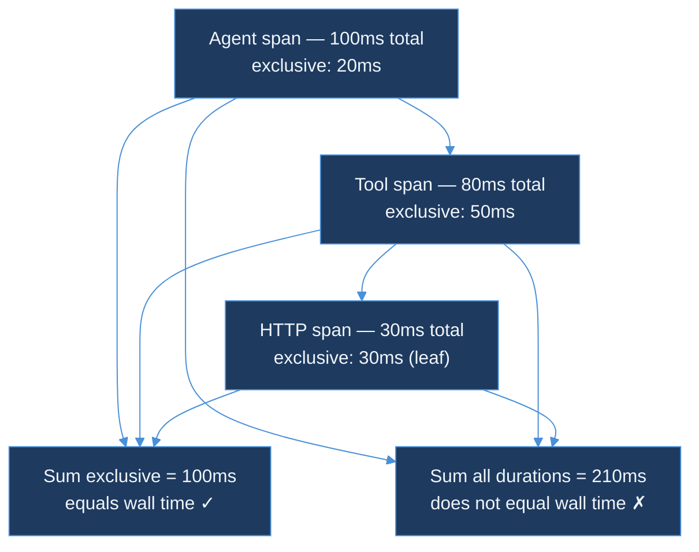
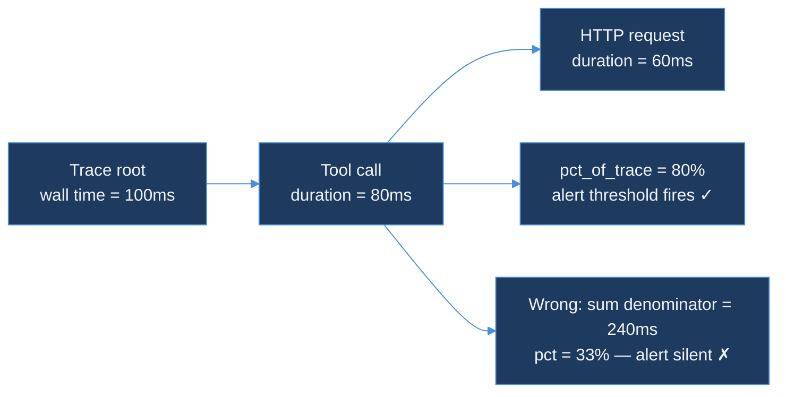

# Day 39 — AI Learning Blog Outline
## Day 39 — Exclusive Time vs Wall Time

**Calendar**: Saturday, 18 July 2026 · Day 39 of 150
**Series**: AI Learning
**Slug**: `day-39-exclusive-time-wall-time`
**Live URL**: `https://akshantvats.github.io/Profile/blog/series/ai-learning/day-39-exclusive-time-wall-time.html`

---

## Post Metadata

| Field | Value |
|---|---|
| Title | `Day 39 — Exclusive Time vs Wall Time` |
| Subtitle | Why summing span durations double-counts |
| Series chip | `AI Learning · Day 39 of 150` |
| Cover image | `blog/assets/covers/day-39-exclusive-time-wall-time.png` |
| OG image | `blog/assets/og/day-39-exclusive-time-wall-time.png` |
| Estimated read time | 8 min |
| Format | deep-dive |

---

## Hook

> "Exclusive time is how you find the tool that actually blocked completion."

If you sum up all the span durations in a trace, you get a number larger than the wall clock time. Sometimes much larger. This trips up every engineer who looks at trace data for the first time — "the trace took 400ms but my spans add up to 720ms, where did those extra 320ms go?"

They didn't go anywhere. They were counted twice. Child spans are included in their parent span's duration. You can't add them.

Today's code in `tool-call-analyzer` computes `pct_of_trace` as `duration_ms / trace_duration_ms` — and that denominator is wall time, not sum-of-spans. Getting this right is why the 40% alert fires on the right tool.

---

## Core Analogy

Think of a kitchen with one chef. You're cooking a three-course meal. The whole meal takes 90 minutes (wall time). You run separate timers for each dish: the starter goes 20 minutes, the main course goes 60 minutes, the dessert goes 15 minutes. Those timers add up to 95 minutes — but the kitchen was only occupied for 90 minutes.

The extra 5 minutes came from overlap: you started the dessert prep during the last 5 minutes of the starter. The timers overlapped. Summing them counted those 5 minutes twice.

In distributed tracing, spans are those timers. The trace root span is the 90-minute meal timer. Child spans are the individual dish timers. Adding all durations gives you "total CPU and wait time" — a useful number — but it is not "how long the user waited." Wall time is always the trace root span's duration, and it is never the sum of its children.

---

## Outline

### Section 1: What Wall Time Actually Measures (500 words)

- Wall time = `max(end_time of all spans) - min(start_time of all spans)` = trace root span duration
- It answers: "how long did the user wait?"
- It does NOT answer: "how much total CPU or IO was consumed?"
- For sequential tools (tool A finishes before tool B starts): `sum(durations) = wall_time`
- For parallel tools (A and B run concurrently): `sum(durations) > wall_time`
- For nested spans (parent contains child): `sum(durations) > wall_time` because child duration is already counted inside parent

The key insight: **nesting is the root cause, not concurrency**. Even in a fully sequential trace, if spans are nested (agent → tool → sub-operation), summing them counts the sub-operation three times — once in the sub-operation span, once inside the tool span's duration, and once inside the agent span's duration.

**So what**: The alert threshold in today's code uses `duration_ms / trace_duration_ms` — dividing by wall time. If you accidentally used the sum of all span durations as the denominator, the 40% threshold would fire too late or not at all, because the denominator is inflated by the double-counting.

### Section 2: Exclusive Time — The Correct Attribution Unit (600 words)

Exclusive time answers: "how long did this span spend doing work that no child span claimed?"

```
Formula:
exclusive_time(span) = span.duration - sum(direct_child.duration)
```

Example:
```
Agent span:    [0ms ─────────────────── 100ms]  duration = 100ms
  Tool span:   [10ms ─────────────── 90ms]      duration = 80ms
    HTTP span: [30ms ──────── 60ms]             duration = 30ms

exclusive_time(Agent) = 100 - 80 = 20ms   (10ms before tool call + 10ms after)
exclusive_time(Tool)  = 80 - 30  = 50ms   (setup + post-processing around HTTP)
exclusive_time(HTTP)  = 30ms              (leaf node — no children to subtract)

sum(exclusive_time) = 20 + 50 + 30 = 100ms = wall_time ✓
sum(durations)      = 100 + 80 + 30 = 210ms ≠ wall_time ✗
```

Exclusive time slices partition the trace without double-counting. Summed, they always equal wall time.

Mermaid diagram:



**So what**: Exclusive time is the only duration metric where values partition correctly. If your cost model assigns cost per span proportional to duration, using exclusive time instead of total duration means each unit of cost is counted exactly once.

### Section 3: The Double-Count Problem in Practice (500 words)

A concrete failure scenario:

- An agent trace has: root span (500ms), tool span (450ms), HTTP span (400ms)
- Sum of durations: 1350ms
- A naive "cost per millisecond" model divides total cost by 1350ms to get cost-per-ms
- But wall time is only 500ms — the model under-attributes cost by 2.7×
- The HTTP span's 400ms is counted three times: once in HTTP, once inside Tool, once inside Agent

This is why today's alert threshold uses wall time as denominator:

```go
pct := (float64(durationMs) / float64(traceDurationMs)) * 100.0
return pct > 40.0
```

If `durationMs` is the tool's own span duration (450ms) and `traceDurationMs` is the trace root duration (500ms), the result is 90% — the tool used 90% of wall time. If you used sum-of-all-spans (1350ms) as the denominator, you'd get 33%, and the 40% alert would not fire even though the tool is clearly the bottleneck.

**So what**: The formula choice is the alert design. Using the right denominator is the difference between an alert that identifies the bottleneck tool and an alert that never fires when it should.

### Section 4: When Parallel Spans Make This Interesting (450 words)

For parallel tool execution (two tools running simultaneously):

```
Trace wall time: 100ms
Tool A: [0ms → 80ms] = 80ms (critical path — last to finish)
Tool B: [0ms → 70ms] = 70ms (concurrent with A)

pct_of_trace(A) = 80/100 = 80%  — alert fires
pct_of_trace(B) = 70/100 = 70%  — alert also fires
pct_of_trace(A) + pct_of_trace(B) = 150%  — and that is correct
```

Percentages can sum to more than 100% when work runs in parallel — that is expected and fine. Each percentage answers "what fraction of the user's wait time did this tool account for?" When two tools overlap, both can account for a large fraction of the same wait.

The critical path is determined by whichever branch takes longest. Tool A is on the critical path here — speeding up Tool A shortens the trace. Speeding up Tool B alone does nothing unless it becomes the bottleneck. But you cannot determine that from `pct_of_trace` alone; you need span start and end timestamps to compute the actual critical path.

**So what**: `pct_of_trace > 40%` is a heuristic, not a precise critical-path calculation. A tool at 45% with a wall-time denominator is always worth investigating. A tool at 45% computed against a sum-of-spans denominator may be perfectly fine — you just can't tell.

### Section 5: What Tomorrow Adds — Critical Path Analysis (300 words)

- Day 40 will add span start and end timestamps to the ClickHouse schema
- With timestamps, you can compute the actual critical path: the sequence of spans where delaying any one span delays the trace root
- Critical path analysis answers: "if I make this tool 50% faster, does the user see a 50% faster trace?"
- A tool on the critical path: yes. A tool not on the critical path: no, unless it becomes the new longest chain.
- For now, `pct_of_trace` is a reliable proxy: a tool consuming 80% of wall time is almost certainly on the critical path in any agent design with fewer than five parallel branches.

---

## Mermaid Diagram 2 — Wall Time vs Sum-of-Spans



---

## Series Nav (sidebar)

Previous: Day 38 — Adapter Pattern for Vendor Drift
Next: Day 40 — Critical Path Analysis in Agent Traces (coming)

---

## Tags for social sharing

`#DistributedSystems #AIInfrastructure #GPUComputing #Observability #BackendEngineering #OpenTelemetry`
