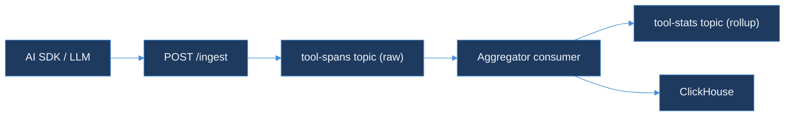

# Day 43 — AI Learning Blog Outline
## "Day 43 — Backpressure on Analytics Pipelines"
### Kafka consumer lag on tool stats

**Series**: AI Learning · Day 43 of 150
**Slug**: `day-43-backpressure-analytics-pipelines`
**File**: `blog/series/ai-learning/day-43-backpressure-analytics-pipelines.html`
**Live URL**: `https://akshantvats.github.io/Profile/blog/series/ai-learning/day-43-backpressure-analytics-pipelines.html`
**Hook**: "Slow aggregator must not block span ingest — split topics."

---

## Title Block

```
<title>Day 43 — Backpressure on Analytics Pipelines | AI Learning Series</title>
Accent chip: AI Learning · Day 43 of 150
<h1 class="post-title">Day 43 — Backpressure on Analytics Pipelines</h1>
Meta line: AI Learning · Day 43 of 150
Series footer: AI Learning · Day 43 of 150
```

---

## Core Concept Summary

When an AI inference pipeline emits tool call spans into an analytics system, the analytics pipeline is almost always slower than the ingest path. Aggregating cost, computing exclusive time, detecting N+1 patterns — these are CPU- and IO-bound operations. Span ingest is a lightweight HTTP write. If a slow aggregator can stall span ingest, every span the LLM emits during the aggregator's slow period is either lost or delayed at the worst possible time: when the system is under load.

Backpressure is the design property that prevents a slow downstream from stalling a fast upstream. In Kafka-backed pipelines, backpressure is structural: the topic absorbs the pace mismatch, consumer lag is the observable, and the ingest path is immune to downstream latency. Today's chaos test in tool-call-analyzer proves this property holds for the TraceForge tool span pipeline.

---

## DS Analogy — The Loading Dock

Before any code: a loading dock analogy.

A warehouse has two areas: the receiving dock (ingest) and the sorting floor (aggregator). Trucks arrive at the dock every few seconds. The sorting floor categorizes packages, computes weights, and routes them to the right aisle. On a normal day, the sorting floor keeps up. On a busy day, the floor gets backed up — too many packages, too few workers.

Without a buffer: trucks arrive at the dock, see the floor is full, and leave without unloading. Packages are lost. The dock is the point of failure, not the floor.

With a Kafka-sized loading bay: trucks unload onto the bay regardless of floor speed. Packages stack up in the bay (consumer lag). The floor processes them at its own pace. No packages are lost. The bay is the shock absorber between two processes running at different speeds.

Consumer lag is the height of the stack in the bay. It grows when trucks arrive faster than the floor processes. It drains when the floor catches up. The trucks (producers) never know the floor (consumers) is slow.

---

## Mermaid Diagram — Split Topic Architecture



---

## Section 1 — Why Analytics Pipelines Have a Backpressure Problem

### The speed mismatch
Span ingest is a lightweight HTTP write: receive JSON, validate schema, write to Kafka, return 202. On modern hardware this takes microseconds. Analytics aggregation is expensive: parse the span, look up the parent span to compute exclusive time, check for N+1 patterns across the last 100 spans in the same trace, update the ClickHouse materialized view. This takes milliseconds — sometimes tens of milliseconds per span if the lookup requires a database read.

### The consequence without a buffer
If the aggregator sits directly in the ingest path — HTTP handler calls aggregator synchronously — then the P99 latency of span ingest is the P99 latency of the aggregator. When the aggregator is slow (high trace cardinality, ClickHouse under load, N+1 detection triggering a full trace scan), the ingest handler is slow. When the ingest handler is slow, the AI SDK waiting for the 202 Accepted spends time blocked that it should spend on the next tool call. The observability system degrades the system it is observing.

### What Kafka breaks
Kafka breaks the synchronous coupling between ingest and aggregation. The ingest handler writes to the `tool-spans` Kafka topic and returns 202 immediately — typically in under a millisecond. The aggregator reads from the same topic at its own pace. The two processes share nothing except the topic offset. The aggregator can be restarted, scaled horizontally, or replaced entirely without the ingest handler knowing.

### So what
The ingest path's latency budget is determined by Kafka write latency, not by aggregation latency. This is the design principle: never let the slowest downstream operation appear in the critical path of the fastest upstream operation. In an AI inference pipeline where every millisecond of SDK latency is visible to the user, this is not optional.

---

## Section 2 — Consumer Lag as the Observable

### What consumer lag is
Consumer lag is the difference between the latest offset written to a Kafka topic and the latest offset committed by a consumer group. If the producer writes to offset 10,000 and the consumer has committed to offset 9,500, consumer lag is 500 messages. Those 500 messages are safe on disk, waiting to be processed.

### What rising consumer lag means (and doesn't mean)
Rising consumer lag means the aggregator is slower than the ingest rate. It does not mean messages are lost. It does not mean the ingest path is degraded. It means work is accumulating in the buffer. The correct response is to observe the rate of lag growth and the rate of drain. If lag grows by 1,000 messages per minute and drains at 1,200 per minute after load peaks, no action is needed. If lag grows indefinitely without draining, the aggregator is stuck — investigate its error rate and ClickHouse connectivity.

### The monitoring setup
Three metrics to watch on the `tool-spans` consumer group:
- `consumer_lag_messages`: absolute lag in messages (alert threshold: topic retention × 0.5)
- `consumer_lag_seconds`: how far behind the consumer is in wall time (alert threshold: 5 minutes)
- `consumer_commit_rate`: messages committed per second (alert threshold: drops to zero for 60s)

Consumer lag seconds is more actionable than message count for variable-size messages. Consumer commit rate dropping to zero is the "stuck vs slow" detector.

### So what
Consumer lag is the health signal for the aggregation path. Treating it as an emergency leads to unnecessary consumer restarts that interrupt processing and potentially duplicate work. Treating it as information — a rate signal that tells you whether the aggregator is keeping up — leads to appropriate responses: scale horizontally if structurally behind, investigate if commit rate stalls.

---

## Section 3 — Split Topics: Ingest vs Aggregation

### Why one topic is not enough
A single `tool-spans` topic serves two audiences with different requirements:
1. The aggregator: needs every raw span, in order, to compute exclusive time and detect N+1 patterns
2. Downstream consumers (billing, alerting, dashboards): need aggregated stats — total cost by tenant, P99 tool latency, N+1 alert events — not raw spans

If downstream consumers read from the raw `tool-spans` topic, they process thousands of messages to derive one stat. That's waste. They also create additional consumer groups that compete for broker read throughput during replay scenarios.

### The split topic design
Introduce a second topic: `tool-stats`. The aggregator reads from `tool-spans`, computes stats per trace/tenant/tool, and publishes summary records to `tool-stats`. Downstream consumers (billing engine, alerting, Grafana) read from `tool-stats` only.

```
tool-spans (raw, high volume, 7-day retention)
    → aggregator consumer
        → tool-stats (rollup, low volume, 30-day retention)
            → billing consumer
            → alerting consumer
            → Grafana data connector
```

### The retention asymmetry
Raw spans are high-volume and short-lived: 7-day retention is enough to replay if the aggregator has a bug. Aggregated stats are low-volume and long-lived: 30-day retention supports monthly billing reconciliation without a separate ClickHouse query. The two topics have different message sizes, different consumer counts, and different retention needs — separating them lets you configure each independently.

### So what
The split-topic design is the Kafka equivalent of separating your hot and cold storage tiers. The raw topic is hot: written constantly, read by one consumer, short retention. The stats topic is warm: written infrequently (once per aggregation window), read by many consumers, longer retention. The boundary between them is the aggregator — the same role WhiteFalcon's Rust consumers played between the Kafka ingest topic and the Redis hot tier.

---

## Section 4 — Chaos Testing the Backpressure Property

### What chaos testing proves
A chaos test proves a system property rather than a unit behaviour. The system property here is: "when the ClickHouse aggregator is slow, span ingest continues without data loss." This property cannot be proven by a unit test of the Kafka producer in isolation — it requires the full ingest path (HTTP handler → ClickHouse write → Kafka fallback → Kafka topic) to behave correctly under load.

### How the chaos test works
The test injects a slow ClickHouse stub (200ms artificial latency) into the ingest path and fires 100 concurrent spans. The ingest handler's 100ms ClickHouse deadline expires before the stub responds. The Kafka fallback path activates. All 100 spans arrive on the `tool-spans` Kafka topic. The test reads the topic and asserts: 100 messages, all deserializable as valid `BillingEvent` envelopes, no duplicates.

### The 100ms deadline choice
100ms is not arbitrary. The AI SDK sending tool spans expects the ingest endpoint to respond in under 200ms — similar to a DNS lookup latency budget. If the ClickHouse write takes 200ms, the ingest handler's 100ms deadline fires first, the fallback activates, and the handler returns 202 in under 10ms (Kafka write latency). The SDK sees a fast response. The aggregation delay is invisible.

### What the chaos test does not prove
It does not prove that the ClickHouse recovery consumer (draining buffered spans after ClickHouse recovers) works correctly — that consumer is not built until a future day. It does not prove behaviour under sustained Kafka broker unavailability — the chaos test assumes Kafka is healthy. It proves exactly one property: slow ClickHouse does not cause span loss.

### So what
Chaos tests belong in the build pipeline of any system that makes availability claims. Claiming "this system does not drop spans when the downstream is slow" without a test that proves it under load is not a claim — it is a hope. The chaos test converts the hope into a regression-protected assertion that runs on every commit.

---

## Section 5 — What the OpenAPI Spec and README Add

### The interface contract
The OpenAPI spec for `POST /ingest` is the machine-readable version of the claim "this is how you send a tool span to tool-call-analyzer." Any future SDK wrapper, CLI integration, or load test can generate a valid request from the spec without reading Go source. The spec is the public surface area of the ingest path — not the internal implementation, not the Kafka fallback, not the ClickHouse schema.

### Why it belongs in Day 43
The chaos test and the OpenAPI spec are two sides of the same coin. The spec says what the interface promises. The test says the implementation keeps the promise. Committing them together means they are reviewed together and drift from each other visibly.

### The README's architecture diagram
The Mermaid diagram in the README is the single-source-of-truth for where each component sits. It is cheaper to update a Mermaid node label than to let the README fall out of sync with reality and have new contributors trace the architecture manually. The diagram also makes the split-topic design (and the Kafka fallback) legible without reading the Go code.

### So what
OpenAPI specs and README architecture diagrams are not documentation for their own sake. They are the interface contracts and architectural commitments that make a system maintainable by anyone who wasn't there when it was built. A system with a chaos test but no spec is one that proves it works but won't tell you how to use it. A system with a spec but no chaos test is one that describes what it promises but can't prove it keeps the promise. Day 43 ships both.

---

## Series Navigation Footer

Previous: Day 42 — Tool Calling Protocols for DS Engineers
Next: Day 44 — (coming)

---

## HTML Checklist Before Push

- [ ] `Day 43` in `<title>`, `<h1>`, accent chip, meta line, series footer (all four mandatory locations)
- [ ] `class="series-nav"` / `class="series-posts"` / `class="series-post"` CSS present in `<style>` block
- [ ] All `<div>` opens match `</div>` closes
- [ ] No `</motion.div>` tags
- [ ] No `<a>` nested inside `<a>`
- [ ] Max 3 sentences per paragraph (split any that exceed this)
- [ ] No placeholder URLs
- [ ] Mermaid diagram has correct init block (copy from spec)
- [ ] Mermaid diagram has ≤8 nodes
- [ ] No node label exceeds 6 words
- [ ] DS analogy present (loading dock analogy in Section 0)
- [ ] Every major section ends with a "so what" sentence
