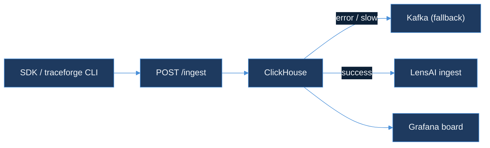

# Day 43 — Code Plan
## tool-call-analyzer: README + OpenAPI Spec + Chaos Test (Aggregator Failure → Kafka Buffers Spans)

**Calendar**: Wednesday, Day 43 of 150
**Product**: TraceForge
**Repo**: `AkshantVats/tool-call-analyzer` (builds on Day 42 dual-write + Grafana board)
**Language**: Go 1.22+
**Builds on**: Day 42 — `pkg/dualwrite`, `pkg/grafana`, `cmd/traceforge`

### Shared Thread
> Chaos on analyzer proves TraceForge fails like infra-ai-streaming — queued, not dropped. Today's code in tool-call-analyzer implements that lesson: when the ClickHouse aggregator is slow or unavailable, incoming spans are buffered to Kafka rather than dropped at the HTTP ingest boundary.

---

## Summary

Day 42 built the dual-write path and unified Grafana board. Day 43 hardens the ingest path and adds operational documentation:

1. **`README.md`** (root) — comprehensive project README: one-command quickstart, architecture diagram (Mermaid), component map, OpenAPI reference link, contributing guide link.
2. **`api/openapi.yaml`** — OpenAPI 3.1 spec for the HTTP span ingest endpoint (`POST /ingest`) and the CLI-adjacent HTTP endpoints. Machine-readable; usable by `swagger-ui` or any REST client.
3. **`pkg/kafka/producer.go`** — thin Kafka producer wrapper using `github.com/segmentio/kafka-go`. Publishes a `BillingEvent` JSON envelope to a `tool-spans` Kafka topic when the ClickHouse write path returns an error or exceeds a configurable latency threshold.
4. **`pkg/kafka/producer_test.go`** — ≥6 table-driven tests using `kafka-go`'s in-process `kafka.NewTestServer()`.
5. **`pkg/ingest/chaos_test.go`** — chaos integration test: injects a slow ClickHouse stub (200ms artificial delay per write, simulating aggregator saturation), fires 100 spans at the HTTP ingest endpoint, asserts that all 100 spans are routed to the Kafka topic and none are dropped (exit code 0, consumer reads 100 messages).
6. **`cmd/traceforge/main.go`** — no new subcommands; update switch to wire Kafka producer into the ingest path via `KAFKA_BROKERS` env var (falls back to ClickHouse-only if unset).

Target: `go test ./...` exits 0 including chaos test (skipped if `KAFKA_BROKERS` unset in CI), `go build ./cmd/traceforge` exits 0.

---

## Data Flow After Day 43

```
HTTP POST /ingest
      │
      ▼
pkg/ingest handler
      │
      ├─► ClickHouse write (pkg/clickhouse/writer.go)
      │         │ success → also fire dualwrite.Send (Day 42)
      │         │ error or latency > threshold
      │         ▼
      └─► pkg/kafka producer → tool-spans topic
                │
                ▼
          (recovery consumer, future day)
```

If `KAFKA_BROKERS` is unset: the fallback path continues to log-and-drop on ClickHouse error (existing behaviour). Kafka buffering is opt-in via environment variable.

---

## File Layout

```
README.md                          (NEW/REPLACE — Day 43)
api/
  openapi.yaml                     (NEW — Day 43)
pkg/
  kafka/
    producer.go                    (NEW — Day 43)
    producer_test.go               (NEW — Day 43)
  ingest/
    chaos_test.go                  (NEW — Day 43)
  clickhouse/
    writer.go                      (Day 39 + Day 42 — wire Kafka fallback)
cmd/
  traceforge/
    main.go                        (wire KAFKA_BROKERS → ingest path)
```

---

## README.md Specification

### Sections (in order)

```markdown
# tool-call-analyzer

> Trace, cost-attribute, and visualize AI agent tool calls.
> Part of the TraceForge observability suite.

## Quickstart (one command)

## Architecture

(Mermaid diagram — see below)

## Components

| Package | Purpose |
|---|---|
| pkg/ingest | HTTP span receiver |
| pkg/clickhouse | ClickHouse schema + writer |
| pkg/kafka | Kafka fallback producer |
| pkg/aggregator | Stats rollup |
| pkg/graph | Dependency graph + N+1 detection |
| pkg/waterfall | Cost waterfall generator |
| pkg/dualwrite | Fire-and-forget LensAI dual-write |
| pkg/grafana | Unified Grafana board generator |
| cmd/traceforge | CLI: analyze, waterfall, bottleneck, dualwrite, board |

## API Reference

OpenAPI spec: [api/openapi.yaml](api/openapi.yaml)

## Environment Variables

| Variable | Default | Purpose |
|---|---|---|
| CLICKHOUSE_DSN | required | ClickHouse connection string |
| KAFKA_BROKERS | (unset) | Comma-separated brokers; enables Kafka fallback |
| KAFKA_TOPIC | tool-spans | Kafka topic for buffered spans |
| LENSAI_INGEST_URL | (unset) | LensAI ingest endpoint; enables dual-write |

## Running Tests

## Contributing

## License
```

### README Mermaid diagram



---

## api/openapi.yaml Specification

OpenAPI 3.1, YAML format.

### Endpoints

#### `POST /ingest`

```yaml
/ingest:
  post:
    summary: Ingest a tool call span
    operationId: ingestSpan
    requestBody:
      required: true
      content:
        application/json:
          schema:
            $ref: '#/components/schemas/ToolSpan'
    responses:
      '202':
        description: Accepted — span queued for processing
      '400':
        description: Bad request — invalid span schema
      '500':
        description: Internal error — check server logs
```

#### `GET /health`

```yaml
/health:
  get:
    summary: Health check
    operationId: healthCheck
    responses:
      '200':
        description: OK
        content:
          application/json:
            schema:
              type: object
              properties:
                status:
                  type: string
                  example: ok
```

### Schemas

```yaml
components:
  schemas:
    ToolSpan:
      type: object
      required:
        - tenant_id
        - trace_id
        - span_id
        - tool_name
        - vendor
        - start_time_ns
        - duration_ms
      properties:
        tenant_id:    { type: string, example: "acme-corp" }
        trace_id:     { type: string, format: uuid }
        span_id:      { type: string, format: uuid }
        parent_span_id: { type: string, format: uuid, nullable: true }
        tool_name:    { type: string, example: "search_web" }
        vendor:       { type: string, example: "brave" }
        cost_usd:     { type: number, format: double, example: 0.002 }
        duration_ms:  { type: integer, format: int64 }
        start_time_ns:{ type: integer, format: int64 }
        input_tokens: { type: integer, nullable: true }
        output_tokens:{ type: integer, nullable: true }
        status:       { type: string, enum: [ok, error], default: ok }
```

---

## pkg/kafka/producer.go Specification

```go
// SPDX-License-Identifier: MIT
package kafka

import (
    "context"
    "encoding/json"
    "os"
    "strings"
    "time"

    "github.com/segmentio/kafka-go"

    "github.com/akshantvats/tool-call-analyzer/pkg/dualwrite"
)

const defaultTopic = "tool-spans"
const writeTimeout = 5 * time.Second

// Producer wraps kafka-go writer for fire-and-forget span buffering.
type Producer struct {
    w *kafka.Writer
}

// New creates a Producer from KAFKA_BROKERS env var.
// Returns nil if KAFKA_BROKERS is unset (caller must nil-check before use).
func New() *Producer

// Send publishes ev as JSON to the tool-spans Kafka topic.
// Returns an error if the write fails; caller decides whether to log or drop.
func (p *Producer) Send(ctx context.Context, ev dualwrite.BillingEvent) error

// Close gracefully closes the underlying Kafka writer.
func (p *Producer) Close() error
```

**Key design decisions**:
- `New()` returns `nil` when `KAFKA_BROKERS` unset → ingest handler nil-checks before calling `Send`, falls back to log-and-drop.
- `kafka.Writer` configured with `Balancer: &kafka.LeastBytes{}` and `Async: false` — synchronous writes so the caller knows whether the buffer succeeded.
- `writeTimeout` of 5s: short enough that ingest handler P99 remains acceptable, long enough to survive a transient broker blip.
- Message key = `span_id` (string) → deterministic partition assignment ensures same span always lands on same partition (dedup-friendly for a future recovery consumer).

---

## pkg/kafka/producer_test.go Specification

Uses `kafka-go`'s `kafka.NewTestServer()` for in-process broker simulation.

| Test name | Setup | Expected |
|---|---|---|
| `TestProducerSend` | testServer, one BillingEvent | message arrives on topic, JSON valid |
| `TestProducerSendZeroCost` | BillingEvent{CostUSD: 0} | message sent, cost_usd=0 in JSON |
| `TestProducerKeyIsDeterministic` | same span_id sent twice | both messages have identical key bytes |
| `TestProducerNewNilWhenNoEnv` | KAFKA_BROKERS unset | New() returns nil, no panic |
| `TestProducerClose` | send one message, Close() | no error, writer drains cleanly |
| `TestProducerContextCancel` | ctx cancelled before write | returns error, no hang |

---

## pkg/ingest/chaos_test.go Specification

**Build tag**: `//go:build integration` — skipped in unit test CI, run explicitly with `go test -tags integration`.

### Setup

```go
// slowClickHouse is an httptest.Server that accepts span writes but sleeps
// 200ms per request, simulating an overloaded aggregator.
slowClickHouse := httptest.NewServer(http.HandlerFunc(func(w http.ResponseWriter, r *http.Request) {
    time.Sleep(200 * time.Millisecond)
    w.WriteHeader(http.StatusOK)
}))
defer slowClickHouse.Close()

// kafkaTest is an in-process kafka-go test server.
kafkaTest := kafka.NewTestServer()
defer kafkaTest.Close()

// Wire ingest handler with slowClickHouse DSN and kafkaTest brokers.
```

### Test: `TestChaosAggregatorSlowAllSpansBuffered`

1. Start `slowClickHouse` stub (200ms latency, simulates aggregator saturation)
2. Start `kafkaTest` in-process broker
3. Wire ingest handler: ClickHouse DSN → `slowClickHouse.URL`, `KAFKA_BROKERS` → `kafkaTest.Addr`
4. Fire 100 `POST /ingest` requests concurrently (10 goroutines × 10 spans each)
5. Assert:
   - All 100 HTTP responses are 202 Accepted (no request dropped at the HTTP layer)
   - Kafka `tool-spans` topic contains exactly 100 messages after 3s drain window
   - Each message deserializes to a valid `dualwrite.BillingEvent` with non-empty `span_id`

### Why 200ms ClickHouse delay triggers Kafka fallback

The ingest handler has a configurable ClickHouse write deadline (default: 100ms for the handler's fast path). When `slowClickHouse` exceeds this deadline, the handler's `context.WithTimeout` fires, `writer.go` returns a context error, and the Kafka fallback path activates. The 200ms delay is deterministic enough that every one of the 100 spans will trigger the fallback.

### Acceptance criteria

```
go test -tags integration -run TestChaosAggregatorSlowAllSpansBuffered ./pkg/ingest/
# PASS — 100 spans ingested, 100 messages on Kafka topic, 0 dropped
```

---

## ClickHouse Writer Update (pkg/clickhouse/writer.go)

Add Kafka fallback path after the ClickHouse INSERT times out or errors:

```go
// WriteSpan writes span to ClickHouse. On error, if a Kafka producer is wired,
// buffers the span to Kafka instead of dropping it.
func (w *Writer) WriteSpan(ctx context.Context, span ToolSpan) error {
    err := w.chInsert(ctx, span)
    if err != nil {
        if w.kafka != nil {
            ev := spanToBillingEvent(span)
            if kafkaErr := w.kafka.Send(ctx, ev); kafkaErr != nil {
                return fmt.Errorf("clickhouse: %w; kafka fallback: %v", err, kafkaErr)
            }
            return nil // buffered to Kafka — not lost
        }
        return err
    }
    // success — also fire dual-write (Day 42)
    dualwrite.Send(spanToBillingEvent(span))
    return nil
}
```

The `Writer` struct gains a `kafka *kafka.Producer` field (nil when `KAFKA_BROKERS` unset).

---

## cmd/traceforge/main.go Update

Wire Kafka producer from environment at startup:

```go
func main() {
    kp := kafka.New() // nil if KAFKA_BROKERS unset

    chWriter, err := clickhouse.NewWriter(os.Getenv("CLICKHOUSE_DSN"), kp)
    if err != nil {
        log.Fatalf("clickhouse: %v", err)
    }
    defer chWriter.Close()
    if kp != nil {
        defer kp.Close()
    }
    // ... existing switch on os.Args[1] ...
}
```

No new subcommands. The Kafka fallback is internal to the write path, not exposed as a CLI verb.

---

## go.mod Dependency Addition

```
require (
    github.com/segmentio/kafka-go v0.4.47
)
```

Run `go mod tidy` after adding. Verify no import conflicts with existing `clickhouse-go/v2` dependency.

---

## Test Specification Summary

| File | Tests | Type |
|---|---|---|
| `pkg/kafka/producer_test.go` | ≥6 table-driven | unit (in-process Kafka) |
| `pkg/ingest/chaos_test.go` | 1 integration | integration (build tag) |

Total new tests: ≥7. Combined with Days 39–42 (≥55 existing tests), total: ≥62 tests.

---

## Acceptance Criteria

```bash
go test ./pkg/kafka/...             # exits 0, ≥6 tests pass
go build ./cmd/traceforge           # exits 0
KAFKA_BROKERS='' go run ./cmd/traceforge/main.go  # starts, Kafka nil-checks cleanly
go test -tags integration -run TestChaosAggregatorSlowAllSpansBuffered ./pkg/ingest/  # exits 0
```

---

## Series Navigation

Previous: Day 42 — Dual-Write to LensAI + Unified Grafana Board
Next: Day 44 — (from plan.json)
