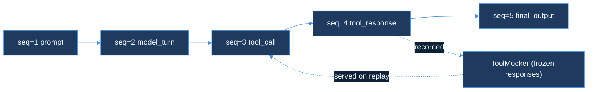

# Day 44 — AI Learning Blog Outline
## "Day 44 — Event Sourcing for Agent Runs"
### Append-only steps, deterministic replay

**Series**: AI Learning · Day 44 of 150
**Slug**: `day-44-event-sourcing-agent-runs`
**File**: `blog/series/ai-learning/day-44-event-sourcing-agent-runs.html`
**Live URL**: `https://akshantvats.github.io/Profile/blog/series/ai-learning/day-44-event-sourcing-agent-runs.html`
**Hook**: "Replay is Kafka log compaction for agent state."

---

## Title Block

```
<title>Day 44 — Event Sourcing for Agent Runs | AI Learning Series</title>
Accent chip: AI Learning · Day 44 of 150
<h1 class="post-title">Day 44 — Event Sourcing for Agent Runs</h1>
Meta line: AI Learning · Day 44 of 150
Series footer: AI Learning · Day 44 of 150
```

---

## Core Concept Summary

An agent run is a sequence of decisions: model reads prompt, issues tool call, receives response, issues another tool call, produces output. Each step is discrete and observable. Event sourcing is the pattern of recording each step as an immutable log entry so the entire run can be replayed later with the same inputs. For agent systems, event sourcing solves a problem that is invisible until you need debugging: the run happened once, the tool responses are gone, and you cannot reproduce the failure.

Today's `agent-replay-engine` introduces `pkg/eventlog` (the append-only log types) and `pkg/mocker` (the frozen tool response server). Together they provide the substrate for deterministic agent replay: record every tool call and response during a live run, then re-feed the model the frozen responses during replay, intercepting every tool call before it reaches a live API.

---

## DS Analogy — Kafka Log Compaction as Agent Memory

Before any code: a Kafka analogy.

Kafka keeps messages in an append-only log. Consumers can read from any offset — including offset 0, which replays the entire history. Log compaction is Kafka's way of keeping the log bounded: for keys that appear multiple times, it retains only the latest value, discarding the intermediate ones. But the offset sequence is never rewritten. Any consumer that read the original sequence can verify it against the compacted log by comparing keys.

Agent replay is the same idea without compaction. The event log keeps every step in order: prompt at offset 1, model turn at offset 2, tool call at offset 3, tool response at offset 4, final output at offset 5. Replay reads from offset 1 — identical to a Kafka consumer replaying from the beginning of a partition. The frozen tool responses (the ToolMocker) are the compacted values: the original API payloads, stored exactly as received, served back verbatim when the model re-issues the same call.

The one difference: Kafka log compaction discards intermediate values for a key. Agent replay keeps every value. There is no compaction for debugging purposes — you want the full history, including intermediate model turns and every tool call, not just the final state.

---

## Mermaid Diagram — Agent Event Log Structure



---

## Section 1 — Why Agent Runs Are Hard to Reproduce

### The non-determinism problem
A model run is, in isolation, deterministic: same weights, same prompt, same temperature, same tool responses → same output. But "same tool responses" is the hard part. Tool calls hit live APIs: search engines that return different results by the hour, databases that return different rows as data changes, internal services that return different states across deploys. Two runs of the same agent with the same prompt, five minutes apart, can produce radically different outputs because the tool responses differ.

### What debugging looks like without event sourcing
An agent run fails in production at 3am. The failure is in the fifth tool call — the model received an unexpected response from an internal API and went down a wrong reasoning branch. By the time the on-call engineer looks at it, the API has returned to normal. There is no way to reproduce the failure: the wrong response is gone, the model is behaving correctly now, and the logs contain the tool call inputs but not the full API response payloads. The bug is unreproducible.

### What debugging looks like with event sourcing
The same failure. But every tool call and response was recorded to an event log. The on-call engineer loads the log into the `ToolMocker`, replays the run, and sees the same fifth tool call receive the same wrong response — deterministically. The model takes the same wrong branch. The failure is reproducible as often as needed to understand the root cause.

### So what
Event sourcing for agent runs is not an optimisation. It is a precondition for debugging. Without it, failures that happen in production are forensic puzzles where key evidence (the live API state at the moment of the call) is always gone. With it, any failure can be reproduced by replaying the event log against the same model — as many times as needed, with modifications to the prompt or mock responses to test hypotheses.

---

## Section 2 — The Append-Only Event Log

### What belongs in the log
Every discrete step in the agent's execution is one log entry: the initial prompt, each model turn (including all tool calls the model decided to issue), each tool call payload, each tool response payload, and the final output. Nothing is omitted. The log is the complete execution trace.

Each entry has a monotonic sequence number (`seq_num`) that provides a total ordering. This is the same role Kafka offsets play: a consumer replaying from `seq_num = 1` sees exactly the same sequence the original run saw.

### The InputHash design
Tool call inputs can contain sensitive data — API keys in request headers, PII in query parameters, internal IDs in arguments. Recording the raw input would require the event log to be treated as a secret. The `InputHash` field stores `SHA-256(tool_call_input_json)` instead. The hash identifies the call for mocker lookup without storing the sensitive bytes. The hash is collision-resistant: the probability of two different inputs producing the same SHA-256 is negligible for the event volumes agent systems operate at.

### JSON Lines as storage format
One event per line. Append-only writes add a newline at the end. Sequential reads scan from line 1. Any editor, `jq` pipeline, or `grep` can inspect the log without a schema file or binary parser. The format choice optimises for debuggability over throughput — the log is written once (during the live run) and read many times (during debugging). Throughput at write time is not the bottleneck; readability at debug time is the priority.

### So what
The append-only log is the simplest possible implementation of event sourcing for an agent. It makes no assumptions about the model, the tool ecosystem, or the downstream replay infrastructure. Any system that writes valid `AgentEvent` JSON Lines can produce a log that `agent-replay-engine` can replay. The interface is the schema, not the implementation.

---

## Section 3 — The Mock Tool Architecture

### How the ToolMocker works
The `ToolMocker` is a lookup table: composite key → frozen response payload. The key is `SHA-256(tool_name + ":" + input_hash)`. The value is the exact `json.RawMessage` payload recorded in the corresponding `KindToolResponse` event.

Loading is a two-pass operation. First pass: collect all `KindToolCall` events. Second pass: for each tool call, find the next `KindToolResponse` event with the same `ToolName` and `InputHash` and store it under the composite key. Any tool call with no matching response is a log integrity error — the log was truncated or corrupted.

### Why composite key, not input hash alone
Two different tools can receive the same input. A `search_web` call with `{"query": "kafka"}` and a `search_news` call with `{"query": "kafka"}` have the same input hash but must return different frozen responses. Including the tool name in the key prevents the mocker from serving `search_web`'s frozen response to a `search_news` call.

### The ErrUnknownCall sentinel
When the model issues a tool call during replay that has no frozen response, the mocker returns `ErrUnknownCall`. This happens when the model's behaviour diverges from the original run — it issues a tool call that was not present in the recorded session. The replay runner receives `ErrUnknownCall` and has two options: halt the replay (strict mode) or forward the call to the live API (lenient mode). Day 44 implements strict mode. Lenient mode is Day 45.

### CallHistory as the divergence detector
The `CallHistory()` method returns the composite keys of every `Respond` call in order. After replay, comparing `CallHistory()` to the sequence of `KindToolCall` events in the original log reveals whether the model issued the same calls in the same order. If the sequences match, the replay was faithful. If they diverge — a tool call appears in a different position, or the model issues a call the original session never did — the divergence point is the first index where the sequences differ. That index is where debugging should start.

### So what
The ToolMocker is the simplest possible implementation of a tool call interceptor. It does not need to understand the model's reasoning, the tool's semantics, or the application's domain. It maps a call signature to a frozen payload. The call signature is deterministic (same tool name, same input → same hash). The payload is exact (no serialization round-trip, raw bytes as recorded). The mocker is the minimum necessary piece to make replay deterministic.

---

## Section 4 — Determinism Rules

### What "deterministic replay" means precisely
Replay is deterministic if, given the same event log and the same model weights, every replay produces the same final output. This requires: all tool responses are frozen (mocker serves recorded payloads, no live API calls), all tool calls are issued in the same order (enforced by comparing CallHistory to the log), and no external state is injected into the model context (timestamps are metadata only, never model inputs).

### What can still cause non-determinism
Model weights change between the record run and the replay. If the model was updated between runs, the same tool responses may produce different model turns. This is not a bug in the replay engine — it is information. A replay that fails with updated model weights tells you that the model's behaviour changed. This is exactly what regression tests for LLM prompts need to detect.

Temperature and sampling parameters. If the original run used `temperature > 0`, the model's sampling was stochastic. The replay uses the same temperature, but the stochastic samples differ. Solution: freeze temperature at 0 for all runs that need deterministic replay. Zero temperature makes the model's sampling deterministic (argmax over logits) given the same weights.

### What the event log's Validate() guards
`Validate()` checks two invariants. First: `seq_num` is strictly monotonic — no gaps, no duplicates, no reordering. A gap means a step was not recorded. A duplicate means a step was recorded twice (write retry without deduplication). Second: no `SpanID` appears twice. A duplicate `SpanID` means the same tool call was recorded twice, and the mocker cannot determine which response to serve. Both errors are log integrity failures that must be resolved before replay.

### So what
Determinism rules are not theoretical guarantees — they are practical checks that catch the cases where replay would silently produce wrong results. A replay that succeeds but produces the wrong output because of a stale model weight or a duplicate span in the log is worse than a replay that fails loudly. The `Validate()` call and the `CallHistory` comparison are the two checks that prevent silent replay corruption.

---

## Section 5 — What agent-replay-engine Enables

### Regression tests for LLM prompts
Once event logs are recorded for a set of representative agent runs, they become regression tests. Run the replay after every model update: if the output matches the recorded final output, the model change did not break this run's behaviour. If it diverges, the divergence point (the `CallHistory` comparison) shows exactly which tool call triggered the change. This is the AI equivalent of snapshot testing in frontend engineering — the recorded output is the expected value, and any change is visible immediately.

### Debugging at the exact failure point
With the event log, a debugger can inject a modified mock response at a specific `seq_num` and replay from that point forward. This is the agent-run equivalent of `git bisect`: narrow down the failure to a single tool response, modify it, and see whether the modified response fixes the downstream behaviour. Without the log, this kind of targeted debugging is impossible — you can only reproduce the failure if the live API happens to return the same wrong data.

### Cost attribution without live API calls
The event log contains every tool call with its timestamp and input hash. Cost attribution (which tool call drove the most cost, which trace had the highest N+1 count) can be computed from the log without re-running the agent or hitting a live API. The `pkg/eventlog` types are designed to be compatible with `tool-call-analyzer`'s `BillingEvent` envelope — the `SpanID` and `TraceID` fields are the same. A single event log can feed both the replay engine and the cost attribution pipeline.

### So what
`agent-replay-engine` is not a debugging tool that sits outside the production system. It is infrastructure that makes agent systems observable in the same way that distributed tracing makes service meshes observable. The event log is the agent's distributed trace. The replay is the equivalent of re-running a service request against a staging environment with recorded traffic. Building it into the system from Day 44 means every agent run is reproducible from the first day it goes to production.

---

## Series Navigation Footer

Previous: Day 43 — Backpressure on Analytics Pipelines
Next: Day 45 — (coming)

---

## HTML Checklist Before Push

- [ ] `Day 44` in `<title>`, `<h1>`, accent chip, meta line, series footer (all four mandatory locations)
- [ ] `class="series-nav"` / `class="series-posts"` / `class="series-post"` CSS present in `<style>` block
- [ ] All `<div>` opens match `</div>` closes
- [ ] No `</motion.div>` tags
- [ ] No `<a>` nested inside `<a>`
- [ ] Max 3 sentences per paragraph (split any that exceed this)
- [ ] No placeholder URLs
- [ ] Mermaid diagram has correct init block (copy from spec)
- [ ] Mermaid diagram has ≤8 nodes
- [ ] No node label exceeds 6 words
- [ ] DS analogy present (Kafka log compaction analogy)
- [ ] Every major section ends with a "so what" sentence
