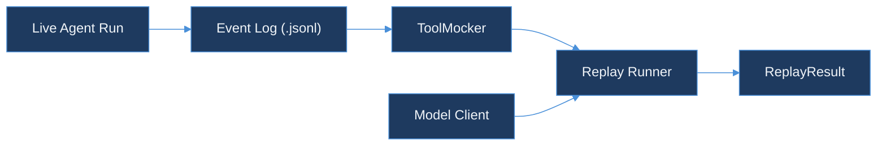

# Day 44 — Code Plan
## agent-replay-engine: DESIGN.md — Event Sourcing, Mock Tools, Determinism Rules

**Calendar**: Thursday, Day 44 of 150
**Product**: TraceForge
**Repo**: `AkshantVats/agent-replay-engine` (new repo — first commit)
**Language**: Go 1.22+
**Builds on**: tool-call-analyzer (event schema and BillingEvent envelope from pkg/dualwrite)

### Shared Thread
> Replay mocks are idempotent consumers — Wayfair price replay with frozen inputs. Today's code in agent-replay-engine implements that lesson: replaying an agent run requires freezing the tool responses so the model receives the same inputs it did originally, producing deterministic output regardless of what live APIs return now.

---

## Summary

Day 44 creates the `agent-replay-engine` repository with its foundational design document and initial Go scaffolding. The deliverable is:

1. **`DESIGN.md`** — full architecture document: event model, storage format, mock tool contract, determinism rules, replay algorithm.
2. **`pkg/eventlog/event.go`** — Go types for the agent event log: `AgentEvent`, `EventKind`, `EventLog`.
3. **`pkg/eventlog/event_test.go`** — ≥6 tests: marshal/unmarshal round-trips, ordering guarantees, deduplication on span_id.
4. **`pkg/mocker/mock.go`** — `ToolMocker` struct: loads a recorded event log and serves frozen tool responses keyed by SHA-256 hash of the tool call input.
5. **`pkg/mocker/mock_test.go`** — ≥5 tests: deterministic lookup, unknown-call fallback, collision resistance, multi-call ordering.
6. **`README.md`** — one-command quickstart, architecture diagram, link to DESIGN.md.

Target: `go test ./...` exits 0 (≥11 new tests), `go build ./...` exits 0.

---

## DESIGN.md Specification

### Title and Purpose

```markdown
# agent-replay-engine

> Deterministic replay of AI agent runs using append-only event logs and frozen mock tool responses.
> Part of the TraceForge observability suite.
```

### Problem Statement

An agent run is non-deterministic by default. The model issues tool calls; the tool calls hit live APIs; the APIs return data that changes over time. Running the same agent twice on the same prompt returns different outputs if any tool returns different data. This makes debugging impossible: a bug that appeared during a live run cannot be reproduced after the fact because the tool responses are gone.

Event sourcing solves this by recording every step of an agent run as an immutable, append-only log entry. To replay the run, you feed the model the same prompt and intercept every tool call — instead of forwarding it to the live API, you return the frozen response from the event log. The model receives the same inputs it did originally. The output is deterministic.

### Event Model

Each entry in the event log is an `AgentEvent`. An `AgentEvent` captures one discrete step in the agent's execution:

```go
type EventKind string

const (
    KindPrompt        EventKind = "prompt"         // initial user message
    KindModelTurn     EventKind = "model_turn"     // model response (text + tool calls issued)
    KindToolCall      EventKind = "tool_call"      // tool call issued by model
    KindToolResponse  EventKind = "tool_response"  // tool call result received
    KindFinalOutput   EventKind = "final_output"   // agent's terminal output
)

type AgentEvent struct {
    SeqNum    int64             `json:"seq_num"`    // monotonic, 1-based
    SpanID    string            `json:"span_id"`    // matches tool-call-analyzer span_id
    TraceID   string            `json:"trace_id"`   // groups events in one run
    Kind      EventKind         `json:"kind"`
    Timestamp int64             `json:"timestamp_ns"` // Unix nanoseconds (frozen on record)
    ToolName  string            `json:"tool_name,omitempty"`
    InputHash string            `json:"input_hash,omitempty"` // SHA-256 of tool call input JSON
    Payload   json.RawMessage   `json:"payload"`    // kind-specific data (opaque bytes)
}
```

**Why `InputHash` not raw input**: the raw tool call input may contain secrets (API keys in headers, PII in arguments). The hash identifies the call for lookup purposes without storing the sensitive content. A separate vault (out of scope for Day 44) can store the full input if needed for debugging.

**Why `json.RawMessage` for Payload**: different event kinds have radically different payload shapes. `KindPrompt` payload is `{"text": "..."}`. `KindToolResponse` payload is the raw API response body. Using `json.RawMessage` avoids a discriminated union type and preserves exact bytes without re-serializing.

### Storage Format

The event log is a JSON Lines (`.jsonl`) file — one `AgentEvent` per line, in `seq_num` order.

```
{"seq_num":1,"span_id":"...","trace_id":"...","kind":"prompt","timestamp_ns":...,"payload":{"text":"..."}}
{"seq_num":2,"span_id":"...","trace_id":"...","kind":"model_turn","timestamp_ns":...,"payload":{"tool_calls":[...]}}
{"seq_num":3,"span_id":"...","trace_id":"...","kind":"tool_call","tool_name":"search_web","input_hash":"sha256:...","timestamp_ns":...,"payload":{...}}
{"seq_num":4,"span_id":"...","trace_id":"...","kind":"tool_response","tool_name":"search_web","input_hash":"sha256:...","timestamp_ns":...,"payload":{...}}
```

**Why JSON Lines**: one event per line means the log can be streamed, appended to without re-writing the file, and read by any tool that handles newline-delimited JSON (jq, grep, awk). Binary formats (protobuf, MessagePack) are faster but require schema files and tooling to inspect. For a debug-oriented system, human-readability beats throughput.

**Why not SQLite**: SQLite supports arbitrary queries, but the event log has one primary access pattern: sequential read from `seq_num = 1`. JSON Lines is optimal for this pattern and has zero dependency footprint.

### Mock Tool Architecture

The `ToolMocker` intercepts tool calls during replay and returns frozen responses:

```go
type ToolMocker struct {
    responses map[string]json.RawMessage // key: SHA-256(tool_name + ":" + input_hash)
    calls     []string                   // ordered call history for assertions
}

// LoadFromLog builds a ToolMocker from a recorded event log.
// It reads KindToolCall + KindToolResponse pairs in seq_num order.
// For each pair, it stores responses[hash(tool_name+input_hash)] = response_payload.
func LoadFromLog(log EventLog) (*ToolMocker, error)

// Respond looks up the frozen response for a tool call.
// Returns ErrUnknownCall if no matching record exists in the log.
// Returns the raw payload bytes if found — caller deserializes to expected type.
func (m *ToolMocker) Respond(toolName string, inputHash string) (json.RawMessage, error)

// CallHistory returns the list of hashes in the order Respond was called.
// Used in replay assertions to verify the model issued the same tool calls in the same order.
func (m *ToolMocker) CallHistory() []string
```

**Key design decision — composite key**: the lookup key is `SHA-256(tool_name + ":" + input_hash)` rather than just `input_hash`. Two different tools can receive the same input (e.g., both `search_web` and `search_news` receive `{"query": "kafka"}`) — the tool name in the key prevents a collision returning the wrong tool's response.

**Key design decision — `ErrUnknownCall`**: when the model issues a tool call that has no frozen response, the mocker returns a typed error rather than an empty response or a panic. The replay runner decides how to handle this: halt the replay (strict mode) or forward to the live API (lenient mode). Day 44 implements strict mode only.

### Determinism Rules

For a replay to be deterministic, three categories of state must be frozen:

**1. Tool responses** (always frozen in replay)
Every `KindToolResponse` payload is frozen at record time. The replay mocker serves these payloads verbatim. No tool call reaches a live API during replay.

**2. Timestamps** (frozen in the event log, not re-used by the model)
`timestamp_ns` in each event is the wall-clock time at record time. The replay runner does not inject these into the model's context — they are metadata for the observer (latency analysis, cost attribution) not inputs to the model. The model's behaviour must not depend on wall-clock time.

**3. Sequence** (enforced by seq_num ordering)
Tool calls must be replayed in the same order as recorded. If the model issues tool calls in a different order during replay, the mocker's call history diverges from the recorded history — detected by comparing `CallHistory()` to the recorded `KindToolCall` sequence. Order divergence is a replay failure, not a warning.

**What is NOT frozen**: the model weights. A replay does not guarantee the same model weights are in use. If the model has been updated between the record run and the replay, the model may issue different tool calls given the same responses. This is intentional — replay detects model-induced behaviour changes, which is a valid use case (regression testing prompts across model versions).

### Replay Algorithm

```
function replay(log: EventLog, mocker: ToolMocker, model: ModelClient) -> ReplayResult:
    prompt = log.first(KindPrompt).payload.text
    session = model.start_session(prompt)

    for step in session:
        if step is FinalOutput:
            recorded = log.first(KindFinalOutput).payload.text
            return ReplayResult{
                Output: step.text,
                Matches: step.text == recorded,
                CallHistory: mocker.CallHistory(),
            }

        if step is ToolCall:
            response, err = mocker.Respond(step.toolName, step.inputHash)
            if err == ErrUnknownCall:
                return ReplayResult{Error: fmt.Errorf("unknown tool call: %s %s", step.toolName, step.inputHash)}
            session.injectToolResponse(step.toolName, response)

    return ReplayResult{Error: errors.New("session ended without FinalOutput")}
```

The replay runner does not need to understand the model's internal reasoning — it only needs to intercept tool calls and inject frozen responses. This makes it model-agnostic: the same replay engine works for OpenAI function calling, Anthropic tool use, and any future tool call protocol.

### Scope for Day 44

Day 44 delivers the event log types (`pkg/eventlog`) and mock tool architecture (`pkg/mocker`). The replay runner and model client integration are Day 45+. The goal for Day 44 is a compilable, tested foundation that the replay runner can build on.

---

## File Layout

```
DESIGN.md                          (NEW — Day 44)
README.md                          (NEW — Day 44)
pkg/
  eventlog/
    event.go                       (NEW — Day 44: AgentEvent, EventKind, EventLog)
    event_test.go                  (NEW — Day 44: ≥6 tests)
  mocker/
    mock.go                        (NEW — Day 44: ToolMocker)
    mock_test.go                   (NEW — Day 44: ≥5 tests)
go.mod                             (NEW — module: github.com/akshantvats/agent-replay-engine)
go.sum                             (generated)
```

---

## pkg/eventlog/event.go Specification

```go
// SPDX-License-Identifier: MIT
package eventlog

import (
    "bufio"
    "encoding/json"
    "fmt"
    "io"
    "sort"
)

type EventKind string

const (
    KindPrompt       EventKind = "prompt"
    KindModelTurn    EventKind = "model_turn"
    KindToolCall     EventKind = "tool_call"
    KindToolResponse EventKind = "tool_response"
    KindFinalOutput  EventKind = "final_output"
)

type AgentEvent struct {
    SeqNum    int64           `json:"seq_num"`
    SpanID    string          `json:"span_id"`
    TraceID   string          `json:"trace_id"`
    Kind      EventKind       `json:"kind"`
    Timestamp int64           `json:"timestamp_ns"`
    ToolName  string          `json:"tool_name,omitempty"`
    InputHash string          `json:"input_hash,omitempty"`
    Payload   json.RawMessage `json:"payload"`
}

// EventLog is an ordered slice of AgentEvents sorted by SeqNum.
type EventLog []AgentEvent

// ReadJSONL reads an event log from a JSON Lines reader.
// Events are sorted by SeqNum before returning.
func ReadJSONL(r io.Reader) (EventLog, error)

// WriteJSONL writes the event log to w in JSON Lines format.
func (log EventLog) WriteJSONL(w io.Writer) error

// First returns the first event of the given kind, or ErrNotFound.
func (log EventLog) First(kind EventKind) (AgentEvent, error)

// AllOfKind returns all events of the given kind in SeqNum order.
func (log EventLog) AllOfKind(kind EventKind) []AgentEvent

// Validate checks ordering and uniqueness invariants.
// Returns an error if SeqNums are not strictly monotonic or any SpanID is duplicated.
func (log EventLog) Validate() error
```

---

## pkg/eventlog/event_test.go Specification

| Test name | Setup | Expected |
|---|---|---|
| `TestReadWriteRoundTrip` | Write 5 events via WriteJSONL, read back via ReadJSONL | events equal original, SeqNum order preserved |
| `TestReadJSONLSortsBySeqNum` | Write events in reverse SeqNum order | ReadJSONL returns them sorted ascending |
| `TestFirstReturnsEarliestOfKind` | Log with 2 KindToolCall events | First(KindToolCall) returns the one with lower SeqNum |
| `TestAllOfKindFilters` | Mixed event kinds | AllOfKind(KindToolResponse) returns only tool responses, in order |
| `TestValidateRejectsDuplicateSpanID` | Two events with identical SpanID and different SeqNum | Validate() returns error |
| `TestValidateRejectsNonMonotonic` | SeqNum sequence: 1, 2, 2, 3 | Validate() returns error |
| `TestEmptyLogIsValid` | Empty EventLog | Validate() returns nil, First returns ErrNotFound |

---

## pkg/mocker/mock.go Specification

```go
// SPDX-License-Identifier: MIT
package mocker

import (
    "crypto/sha256"
    "encoding/json"
    "errors"
    "fmt"
    "sync"

    "github.com/akshantvats/agent-replay-engine/pkg/eventlog"
)

var ErrUnknownCall = errors.New("mocker: no recorded response for this tool call")

// ToolMocker serves frozen tool responses from a recorded event log.
type ToolMocker struct {
    mu        sync.Mutex
    responses map[string]json.RawMessage
    history   []string // composite keys in Respond call order
}

// LoadFromLog builds a ToolMocker from a recorded EventLog.
// Pairs KindToolCall events with the immediately following KindToolResponse
// for the same ToolName and InputHash.
func LoadFromLog(log eventlog.EventLog) (*ToolMocker, error)

// Respond returns the frozen response payload for a tool call.
// toolName and inputHash must match a recorded KindToolCall entry.
// Returns ErrUnknownCall if not found.
// Records the composite key in CallHistory.
func (m *ToolMocker) Respond(toolName, inputHash string) (json.RawMessage, error)

// CallHistory returns the composite keys of all Respond calls made so far,
// in call order. Used to assert the model issued the same tool calls in the
// same sequence as the original run.
func (m *ToolMocker) CallHistory() []string

// compositeKey returns SHA-256(toolName + ":" + inputHash) as a hex string.
func compositeKey(toolName, inputHash string) string
```

---

## pkg/mocker/mock_test.go Specification

| Test name | Setup | Expected |
|---|---|---|
| `TestMockerDeterministicLookup` | Log with one tool call/response pair | Respond returns exact frozen payload, no error |
| `TestMockerUnknownCallReturnsError` | Empty mocker, any tool call | Returns ErrUnknownCall |
| `TestMockerCompositeKeyIsolation` | Two tools with identical input_hash, different tool_name | Each returns its own frozen response, no cross-lookup |
| `TestMockerCallHistoryOrdered` | Respond called 3 times in order A, B, C | CallHistory() returns [A, B, C] |
| `TestMockerConcurrentRespond` | 10 goroutines each calling Respond on distinct keys | No data race (run with -race), all return correct responses |

---

## README.md Specification

### Sections

```markdown
# agent-replay-engine

> Deterministic replay of AI agent runs.
> Part of the TraceForge observability suite.

## Why

## Quickstart

go test ./...

## Architecture

(Mermaid diagram — see below)

## Design

See [DESIGN.md](DESIGN.md) for the full event model, mock tool contract, and determinism rules.

## Packages

| Package | Purpose |
|---|---|
| pkg/eventlog | AgentEvent types, JSON Lines read/write, validation |
| pkg/mocker | ToolMocker — frozen tool response server |

## License
```

### README Mermaid Diagram



---

## go.mod

```
module github.com/akshantvats/agent-replay-engine

go 1.22
```

No external dependencies for Day 44 — `pkg/eventlog` and `pkg/mocker` use only the standard library (`encoding/json`, `crypto/sha256`, `sync`, `bufio`, `io`).

---

## Test Specification Summary

| File | Tests | Type |
|---|---|---|
| `pkg/eventlog/event_test.go` | ≥7 | unit |
| `pkg/mocker/mock_test.go` | ≥5 (one with -race) | unit |

Total new tests: ≥12.

---

## Acceptance Criteria

```bash
go test ./...               # exits 0, ≥12 tests pass
go test -race ./...         # exits 0, no data race detected
go build ./...              # exits 0
```

---

## Series Navigation

Previous: Day 43 — tool-call-analyzer README + OpenAPI + Kafka Chaos Test
Next: Day 45 — agent-replay-engine: Replay Runner + Model Client Interface
