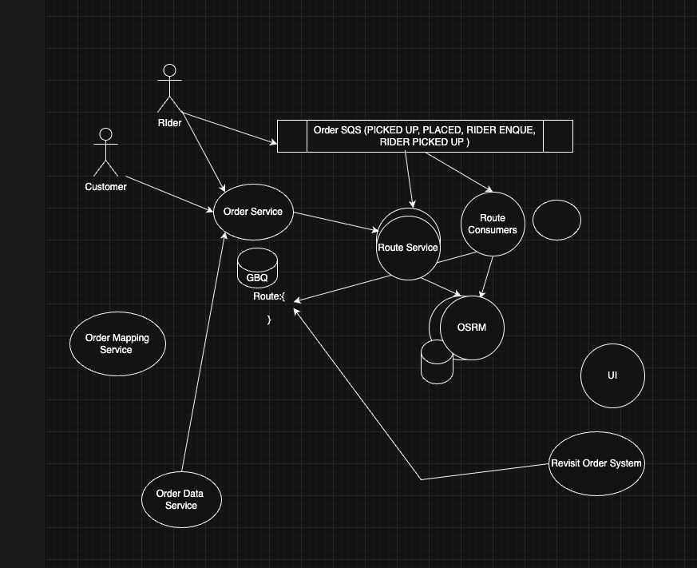
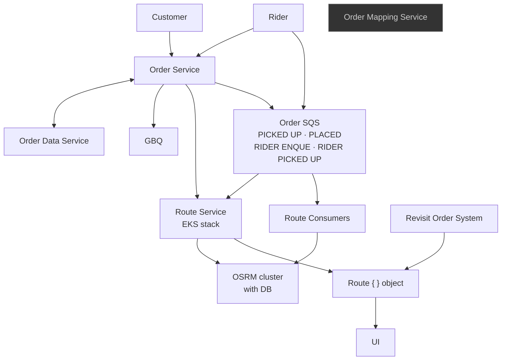

# Delivery Hero — Rider Tracking System (canonical)

**Source of truth** for Experience-series posts about Delivery Hero rider tracking. Do not invent alternate pipelines (e.g. Kinesis-only routing) unless the user explicitly extends this diagram.

**Context pack:** [`docs/context/README.md`](context/README.md) · diagram PNG updated 2026-05-22 in [`docs/assets/delivery-hero-rider-tracking-architecture.png`](assets/delivery-hero-rider-tracking-architecture.png).

## Actors

| Actor | Interactions |
|-------|----------------|
| **Customer** | Order Service |
| **Rider** | Order Service, Order SQS (lifecycle + enqueue events) |

## Services & data stores

| Component | Role |
|-----------|------|
| **Order Service** | Hub: customer/rider ingress, persistence, analytics export, routing triggers |
| **Order Data Service** | Order persistence backing Order Service |
| **Order Mapping Service** | Separate mapping service (not wired in this view) |
| **GBQ** | Analytics warehouse from Order Service |
| **Order SQS** | Lifecycle events: `PICKED UP`, `PLACED`, `RIDER ENQUE`, `RIDER PICKED UP` — Rider also publishes here |
| **Route Service** | EKS deployment stack; inputs from Order Service and Order SQS |
| **Route Consumers** | Read Order SQS → OSRM |
| **OSRM cluster** | Map-matching / routing engine (with DB) |
| **Route `{ }` object** | Output polyline/distance/revision — produced by Route Service + Revisit Order System |
| **Revisit Order System** | Audit replay / immutable snapshots into Route object |
| **UI** | Customer and support surfaces |

## Data flow (summary)

1. **Ingress:** Customer and Rider → Order Service.
2. **Persistence / analytics:** Order Service ↔ Order Data Service; Order Service → GBQ.
3. **Lifecycle contract:** Order Service and Rider → Order SQS (`PLACED`, `PICKED UP`, `RIDER ENQUE`, `RIDER PICKED UP`).
4. **Routing plane (EKS):** Order Service + Order SQS → Route Service; Order SQS → Route Consumers.
5. **Map work:** Route Service → OSRM; Route Consumers → OSRM.
6. **Output:** Route Service + Revisit Order System → Route `{ }` object → UI.

**EKS / capacity posts** layer HPA, PDB, and lag observability on **Route Service** and **Route Consumers**, not on invented stream-only pipelines.

## Mermaid (canonical topology)

> **Note:** Order Mapping Service and UI appear as standalone nodes in the whiteboard diagram; wire them in prose only when the user confirms connections.

## Related posts (Profile blog)

| Post | Layer |
|------|--------|
| [Five Thousand Geo-Events Per Second](https://akshantvats.github.io/Profile/blog/series/experience/five-thousand-geo-events-per-second.html) | Stream shape, partition skew, OSRM match quality |
| [Ten Thousand Concurrent Requests — EKS Patterns](https://akshantvats.github.io/Profile/blog/series/experience/ten-thousand-concurrent-requests-eks-patterns-delivery-hero.html) | Route Service + Route Consumers autoscaling at peak |
