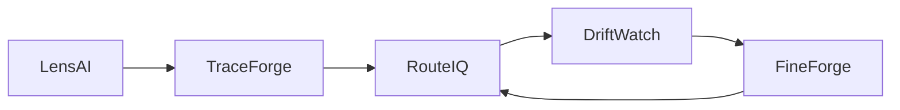
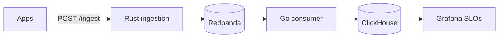
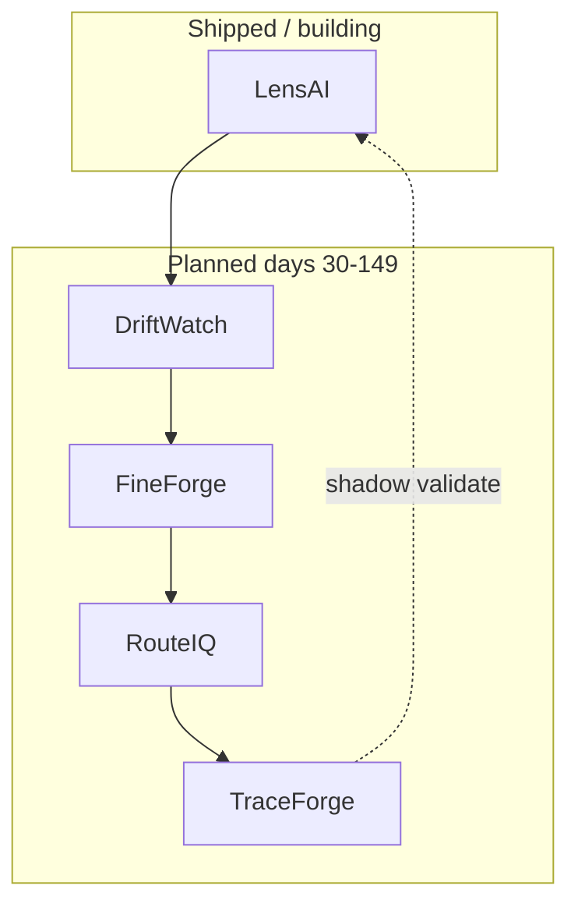

# YC Pitch Deck — Slide-by-Slide (10–12 slides)

> **Format:** Title · on-slide headline · speaker notes (30–60s) · visual suggestion  
> **Presenter:** [Founder name] — solo or team intro on slide 10  
> **Design:** Dark background, monospace accents, one diagram per slide max (match 150-day plan site)

---

## Slide 1 — Title

**Headline:** LensAI — inference observability at TSDB scale

**Speaker notes (45s):**  
"I'm [Name]. We open-source the data plane for production LLM inference—then wire agent tracing, routing, drift, and retrain on the same bus. Week one is shipped in Rust and Go; the rest is a sequenced 150-day roadmap, not vapor."

**Visual:** Logo wordmark + subtitle `observe → trace → route → drift → retrain`  
**Mermaid (footer or next slide teaser):**

---

## Slide 2 — Problem

**Headline:** Prometheus breaks when `model_id × tenant_id` explodes

**Speaker notes (50s):**  
"Teams shipping vLLM or Triton hit cardinality walls in metrics backends. Finance asks per-customer GPU dollars; SRE needs prefill vs decode latency. Trace tools show prompts—they don't give you a replayable, multi-tenant cost bus at a million events a minute. I lived this at Agoda: 1.5 trillion events a day. You can't buy your way out—you build a data plane."

**Visual:** Split panel — left: Prometheus "cardinality limit exceeded"; right: finance spreadsheet with ??? per tenant  
**Reference:** Experience blog hook from Day 0 plan

---

## Slide 3 — Solution (wedge)

**Headline:** LensAI — sub-100ms ingest, ClickHouse-native analytics

**Speaker notes (55s):**  
"LensAI is AP-oriented ingestion: WAL, Kafka, batch ClickHouse writer with circuit breaker and DLQ. Per-tenant rate limits with 429 and Retry-After—not silent drops. Four Grafana panels: throughput, P99 by model, cost per hour, consumer lag. This repo is public today; you can curl ingest on your laptop in ten minutes."

**Visual:** Architecture diagram from `infra-ai-streaming` README:

---

## Slide 4 — Traction (honest)

**Headline:** Week 1 shipped · $0 ARR · OSS proof

**Speaker notes (40s):**  
"We're pre-revenue. Traction is execution: G-01 through G-06 on main—ingestion, compose stack, ClickHouse writer, dual dashboards, chaos runbook. Helm and HPA on Kafka lag in PR five. Zero production tenants yet. We're applying with velocity and design docs, not fake logos."

**Visual:** Timeline bar Days 0–6 ✅ · Day 7–8 in progress · Days 30+ grey "planned"  
**Bullets on slide:**

- ✅ Rust + Go pipeline, CI green  
- ✅ Local/k3d E2E documented  
- ⏳ Hosted SaaS — not launched  
- ❌ TraceForge / RouteIQ — not started  

---

## Slide 5 — Platform vision

**Headline:** Five products · one closed loop

**Speaker notes (60s):**  
"LensAI is the wedge—observe inference. TraceForge adds agent spans. RouteIQ sends traffic to the right model for cost and SLO. DriftWatch scores production drift. FineForge retrains and registers weights back into RouteIQ. Day 149 demo wires shadow validation through TraceForge. Only LensAI exists today; we're explicit about that."

**Visual:** Platform loop from `platform.html`:

---

## Slide 6 — Market

**Headline:** Every self-hosted inference team is a prospect

**Speaker notes (45s):**  
"ICP is platform teams at Series B–D with real multi-tenancy and self-hosted GPUs—or API spend big enough that FinOps cares. TAM is observability plus ML ops—billions. We start narrow: teams who already run Kafka and want open source before Datadog tax."

**Visual:** Concentric circles TAM → SAM (self-hosted LLM) → SOM (200 × $50k ACV)

---

## Slide 7 — Business model

**Headline:** Open-core bus · monetize hosted ops

**Speaker notes (40s):**  
"MIT on the data plane builds trust and contributors. Money is managed cloud—per million events and retention—and later enterprise VPC, SSO, and support. Platform modules upsell on the same tenant graph. India-based engineering improves margin versus pure-SF burn."

**Visual:** Three-step ladder: OSS → Cloud → Enterprise

---

## Slide 8 — Competition

**Headline:** They sell UI · we ship the bus

**Speaker notes (50s):**  
"Langfuse and Helicone win on trace UX. Datadog bundles LLM into APM—you pay cardinality tax. Arize owns drift but not your ingest path. Our insight: at scale it's a data-plane game—WAL, partitions, overflow, DLQ—the stuff I operated for years. Dashboards without the bus are a feature, not a company."

**Visual:** 2×2 matrix — axis: owns data plane (Y) vs trace-only (X); we're top-right open source

---

## Slide 9 — Moat & tech

**Headline:** DESIGN.md is the moat until traffic arrives

**Speaker notes (45s):**  
"Partition strategy, backpressure, chaos scenarios—documented before hype. Schema carries cost and tokens for FinOps. Switching cost grows once history lives in our ClickHouse model. Community contributes to ingestion and consumer before we close the UI."

**Visual:** Screenshot blur of `DESIGN.md` TOC + `CHAOS.md` five scenarios

---

## Slide 10 — Team

**Headline:** [Founder name] — 1.5T/day → LensAI in public

**Speaker notes (50s):**  
"[Name], staff engineer, 7.5 years: Agoda TSDB, Wayfair pricing engine, Walmart IoT, Delivery Hero geo streams. Building LensAI in public with daily commits and blogs—same discipline as production infra reviews. [Co-founder: TBD — role and proof point]."

**Visual:** Founder photo + four logos (Agoda, Wayfair, Walmart, Delivery Hero) + GitHub activity sparkline **[real chart at submit]**

---

## Slide 11 — Roadmap (150 days)

**Headline:** 150 days · sequenced · verifiable

**Speaker notes (40s):**  
"Days 0–29 LensAI GA-ready open source. 30–59 TraceForge. 60–89 RouteIQ. 90–119 DriftWatch. 120–149 FineForge and platform launch. Each phase has a repo and DESIGN.md before heavy code—staff practice, not hackathon scope creep."

**Visual:** Gantt-style five color bars (match product colors on plan site)

---

## Slide 12 — Ask

**Headline:** YC → hosted SaaS + 10 design partners

**Speaker notes (35s):**  
"We want YC for network, batch focus, and US GTM intros. Use of funds: managed cloud MVP, first solutions hire or GTM co-founder search, and design-partner program. We're not asking you to believe five products today—believe the wedge and the builder."

**Visual:** Single line: `$500k standard deal · [X months runway → Y milestones]` **[fill milestones]**

---

## Appendix slides (optional, not for 60s demo day)

### A1 — Demo flow

Three commands: compose up → run ingestion + consumer → curl ingest → Grafana URL

### A2 — Event schema

JSON example with `tenant_id`, `model_id`, `cost_usd`, `latency_ms`, token fields

### A3 — Risk disclosure

Solo founder · no revenue · competitor velocity · **[mitigations]**

---

## Deck delivery tips (YC interview / Demo Day style)

1. **Lead with demo** if partner asks—Grafana beats architecture on slide 3.  
2. **Say "not built yet"** when showing TraceForge+; partners respect honesty.  
3. **Keep 10 slides under 6 minutes**; appendix for diligence.  
4. Export PDF with embedded fonts; test on phone (partners read on mobile).

---

*Diagrams align with `platform.html` and `infra-ai-streaming/README.md` mermaid blocks.*
