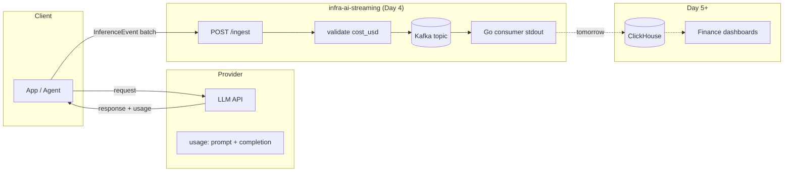
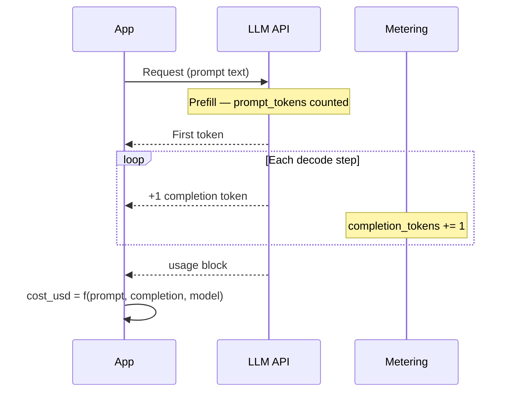

# Day 4 — AI Learning Blog Execution Plan

**Agent:** A3 (AI Learning) · **Phase:** Plan mode only — no HTML  
**Calendar day:** 4 of N · **Series index:** 3 of N — Learning LLM Inference (`ai.day_index: 3`)  
**Repo context:** `infra-ai-streaming` · Ticket G-02 (docker-compose + Go consumer skeleton)  
**Target file (after approval):** `Profile/blog/series/ai-learning/day-3-token-budgets-cost-structure.html`  
**Sources:** `data/plan.json` day 4 · `CHECKLIST.md` · Days 0–2 HTML · `ingest.rs` / README schema · code plan thread

---

## Shared Daily Thread (verbatim — all agents)

> Go consumer skeleton exists so tomorrow's ClickHouse writer can aggregate cost_usd the way finance asks.

**Placement in post:** First paragraph after the cold open (italic or compact `attr-box.mine`), same pattern as sibling plans. Do not paraphrase.

---

## 1. Title + subtitle (locked format)

| Field | Locked copy |
|-------|-------------|
| **H1 (`post-title`)** | Day 3 of Learning LLM Inference — Token Budgets and Real Cost Structure |
| **Subtitle (`post-subtitle`)** | 3 of N — AI Learning Series. Prompt vs completion pricing as capacity planning — and why `cost_usd` in the ingest schema has to reconcile with provider bills, not vibes. |
| **Meta title** | Day 3 — Token Budgets & Cost Structure (Learning LLM Inference) — Akshant Sharma |
| **OG title** | Day 3 of Learning LLM Inference — Token Budgets and Real Cost Structure |
| **Tags** | `AI Learning · 3 of N`, `LLM inference`, `Token pricing`, `Distributed systems`, `Observability` |
| **Read time target** | ~10–12 min (800–1,200 words prose; diagrams add scroll) |

**Subtitle tone lock:** Match Day 2 pattern — lead with `N of N — AI Learning Series.` (series index N), then topic + observability hook (not ML lecture).

**plan.json hook (weave into intro, not subtitle):** Validate `cost_usd` + `prompt_tokens` / `completion_tokens` in event JSON against provider pricing pages.

---

## 2. Outline (800–1,200 words target)

Word budget is **intentionally shorter** than Days 1–2 (~2,500+ words). One idea per section; no PagedAttention deep-dive (already in Day 2).

| § | H2 id | Section | ~words | Purpose |
|---|--------|---------|--------|---------|
| 0 | — | Cold open + Daily Thread | 80 | Hook: finance asks “cost per tenant per hour”; you only have `latency_ms` → you lose. |
| 1 | `two-buckets` | Two token buckets on every bill | 120 | Define prompt (input) vs completion (output) tokens; map to prefill vs decode from Day 1. |
| 2 | `pricing-table` | How providers price (asymmetric) | 150 | $/1M input vs $/1M output; worked example (GPT-4o-class numbers, **dated May 2026**). |
| 3 | `why-completion` | Why completion costs more | 180 | Systems + economics: serial decode, KV growth, scarcity — not “outputs are magic.” |
| 4 | `ds-analogy` | The analogy that made this concrete | 200 | **Required DS section** — see §3 below. |
| 5 | `budgets` | Token budgets as capacity planning | 120 | max_tokens, context window, tenant caps; completion is the spend lever. |
| 6 | `validate` | Reconciling `cost_usd` at ingest | 150 | Formula + tolerance; what to log when mismatch. |
| 7 | `infra-today` | What this changes in infra-ai-streaming today | 150 | Schema/API — see §6 below. |
| 8 | `experience-link` | Sibling post (one paragraph) | 60 | Link Experience Day 4; shared thread; no Walmart story. |
| 9 | `takeaway` | What I am taking away | 80 | Finance-grade facts in the stream before ClickHouse. |
| — | `series-footer` | Footer + next tease | 50 | Day 4 series index tease (PagedAttention depth **or** pipeline day — see §11). |

**Pullquote candidate:** “Completion tokens are the variable cost line item. Prompt tokens are the fixed setup charge.”

**Stat callout (optional, 3 cells):**

- Example request: 2,000 prompt + 400 completion  
- Cost split: ~X% prompt / ~Y% completion (with real rates)  
- Same request if completion doubles: cost +Z%

---

## 3. DS analogy section (detailed — draft spine)

**Section id:** `ds-analogy`  
**H2 title:** The analogy that made this concrete  
**attr-box:** `.mine` — “Distributed systems parallel”

### Primary analogy: Spark batch job vs streaming sink (use this)

| ML / LLM | DS parallel |
|----------|-------------|
| Prompt tokens (prefill, parallel) | **Wide transformation** — read full partition once, high parallelism, cost ∝ input size |
| Completion tokens (decode, serial) | **Per-row UDF in a foreach** — each output row triggers another pass over growing state |
| KV cache growth | **Shuffle spill / state store** — every extra step reads more accumulated state |
| Higher $/completion token | **Egress / cross-AZ egress pricing** — marginal bytes out cost more than bytes in |
| `max_tokens` / budget | **Job `spark.sql.shuffle.partitions` + executor memory cap** — wrong cap → OOM or runaway bill |

**Narrative beats (write in first person, Agoda/DH tone like Day 1):**

1. At Agoda-scale pipelines, the expensive surprise was never the initial scan — it was the **iterative fan-out** (downstream joins, repeated reads of hot keys). Prompt tokens are the scan; completion tokens are the iterations you cannot fully parallelize per request.

2. Finance never accepted “we processed N rows” without **splitting read vs write bytes** on the invoice. LLM bills split input vs output tokens for the same reason: **different resource shapes**.

3. **Do not** use training/loss analogies here (Day 0 lens: serving, not gradients).

### Secondary one-liner (optional, single sentence)

Hotel analogy: prompt = conference room block (reserved upfront); completion = minibar (metered per item, adds up fast on long stays).

### What to avoid in this section

- Walmart IoT / edge filtering (Experience owns that).  
- Kafka batching / continuous batching (Day 2 + code thread Day 3).  
- KV cache bandwidth math (Day 1 — link only).

---

## 4. Concept explanation (prompt vs completion, pricing, why completion costs more)

### 4.1 Definitions (tie to Day 1)

- **Prompt (input) tokens:** Everything sent in the context window before/during the first generated token — system prompt, RAG chunks, tool results, user message. Billed once per request (prefill pass).  
- **Completion (output) tokens:** Everything the model generates autoregressively after prefill. Billed **per generated token** (each decode step from Day 1).

**Provider usage object (cite in footnotes):** OpenAI/Anthropic responses include `usage.prompt_tokens`, `usage.completion_tokens`, sometimes `total_tokens`.

### 4.2 Pricing model (conceptual)

- Prices quoted **per million tokens** (or per 1K in older docs).  
- **Two rates:** `price_input` and `price_output` (names vary).  
- **Total cost:**

```text
cost_usd ≈ (prompt_tokens / 1e6) * rate_input(model)
         + (completion_tokens / 1e6) * rate_output(model)
```

- **Asymmetry:** Typical hosted APIs: `rate_output` is **2×–5×** `rate_input` (model-dependent). Always snapshot rates in post with **“as of May 2026 — verify on pricing page.”**

### 4.3 Worked example (for draft)

Use rounded public list prices (verify before publish):

| Model (example) | Input $/1M | Output $/1M |
|-----------------|------------|-------------|
| gpt-4o (illustrative) | $2.50 | $10.00 |
| claude-sonnet (illustrative) | $3.00 | $15.00 |

Request: `prompt_tokens=2000`, `completion_tokens=500`

```text
cost = 2000/1e6 * 2.50 + 500/1e6 * 10.00
     = 0.005 + 0.005 = $0.01
```

**50/50 split on dollars** despite **80/20 split on token count** — core punchline for finance.

### 4.4 Why completion costs more (four layers — pick 3 in prose)

1. **Compute shape:** Prefill is parallel across prompt length; decode is **serial** (Day 1). Provider GPU time per request extends with every completion token.  
2. **Memory bandwidth:** Each completion step reads growing KV cache (Day 1) — longer outputs = more VRAM traffic per token.  
3. **Utilization / scheduling:** Long completions hold scheduler slots (Day 2) — opportunity cost on shared GPUs.  
4. **Business model:** Cheap input encourages adoption (RAG, long contexts); expensive output aligns price with **unbounded** generation.

**Explicit non-claim:** Output tokens are not “more intelligent”; they are **more expensive to produce at scale**.

### 4.5 Token budgets (capacity planning)

- **`max_tokens` / `max_completion_tokens`:** Hard cap on variable spend.  
- **Context window:** Upper bound on prompt + completion **combined** — breaching truncates or errors.  
- **Tenant budget (future Day 18 arc):** Rolling window on **sum(completion_tokens)** or **sum(cost_usd)** — finance cares about the latter.  
- **Product implication:** Shrinking prompt (cheaper, one-time) vs limiting completion (cheaper **per request** at scale) are different levers.

---

## 5. Mermaid diagrams

Use same embed pattern as Day 2: `<pre class="mermaid">` + CDN init at bottom.

### Diagram A — Cost flow (flowchart LR)

**Section:** after `validate` or inside `infra-today`  
**Title (figcaption):** From provider meter to finance rollup



**Alt text:** Cost facts flow from API usage through ingest and Kafka to analytics.

### Diagram B — Request lifecycle (sequence)

**Section:** `two-buckets` or `why-completion`



**Optional Diagram C — Cost stack bar (if Mermaid supports):** skip if brittle; use `stat-callout` instead.

---

## 6. How this changes infra-ai-streaming design today

**Section id:** `infra-today`  
**Tone:** Same as Day 2 observability section — concrete fields, not roadmap fluff.

### Code shipped / shipping Day 4 (G-02)

- `docker compose up`: Redpanda, ClickHouse, Redis, Grafana, Prometheus.  
- Go consumer: read Kafka → **stdout log** (proves path; CH writer Day 5).  
- E2E: Rust `POST /ingest` → Kafka → Go consumer.

### Schema: `InferenceEvent` (canonical — match commit)

From `ingestion/src/handlers/ingest.rs` / README:

| Field | Role for cost |
|-------|----------------|
| `prompt_tokens` | Input bucket; prefill-sized |
| `completion_tokens` | Output bucket; decode-sized |
| `cost_usd` | **Finance source of truth** — must be ≥ 0, validated at ingest |
| `model_id` | Price table key |
| `tenant_id` | Isolation + rollup dimension |
| `timestamp_unix_ms` | Hourly cost partitions (Day 6 Grafana panel 3) |
| `latency_ms` | SLO — **do not** use as cost proxy |
| `prefill_latency_ms` / `decode_latency_ms` | Optional; explain cost **drivers**, not dollars |
| `request_id` | Tie multi-event agent traces later |
| `status` / `error_code` | Failed calls may still incur prompt cost |

### API: `POST /ingest`

- Batch: `{ "events": [ InferenceEvent, ... ] }`  
- Header: `X-Tenant-ID` must match event `tenant_id` (rate limit / isolation).  
- Validation today: `cost_usd >= 0`, `latency_ms != 0`, batch size caps.

### Design decisions to state in post

1. **Store tokens + dollars, not dollars alone** — finance reconciles; eng debugs token leaks.  
2. **Compute `cost_usd` at the producer** (app/SDK/gateway) using provider usage + rate card — ingest **validates** (hook), does not silently re-price (version skew).  
3. **Log reconciliation drift** (future-friendly): optional `pricing_version` or ingest metric `cost_validation_delta_usd` — mention as Day 5+ enhancement, don’t implement in blog.  
4. **Go consumer stdout** — intentionally boring; proves Kafka payload shape finance will aggregate tomorrow.

### Example JSON block (copy from README after code freeze)

Use live curl from README; update SHA in footnote when publishing.

### k6 / load script alignment

`infra-ai-streaming-7day-plan.md` load test already uses:

`cost_usd = prompt*5e-6 + completion*15e-6` — cite as **test harness rate card**, not production truth.

### Explicit bridge to Day 5

ClickHouse writer will `sum(cost_usd) GROUP BY tenant_id, toStartOfHour(timestamp)` — today’s post is why those columns must exist **before** the writer lands.

---

## 7. Cross-link to Experience blog (4 of N)

| Item | Value |
|------|--------|
| **Experience title** | Seven Million IoT Sensors — Failure Modes Textbooks Skip |
| **Subtitle** | Walmart · refrigeration, HVAC · edge filtering at scale |
| **Expected path** | `Profile/blog/series/agoda/` or new `experience/` slug — **confirm path at HTML time** |
| **Link copy (draft)** | “Today's Experience post ([4 of N](TBD)) is about refrigeration telemetry and shard isolation at Walmart scale — the same ‘drop bad data before it hits the hot path’ instinct as validating `cost_usd` before events enter Kafka.” |
| **Thread sentence** | Repeat Shared Daily Thread verbatim in both posts. |

**Sibling link placement:** Short paragraph in `experience-link` section + footnote row entry.

---

## 8. Daily Thread one-liner

**Verbatim:**

```text
Go consumer skeleton exists so tomorrow's ClickHouse writer can aggregate cost_usd the way finance asks.
```

**Also include in:** chat draft header, commit `Refs:` line, Experience plan cross-ref.

---

## 9. What NOT to duplicate from Experience blog

| Experience owns | AI Learning mentions at most |
|-----------------|------------------------------|
| 7M IoT sensors narrative, device identity | — |
| Edge filtering, bad device drops | One sentence: “validate before central aggregation” |
| docker-compose as **shard / blast-radius** isolation | “multi-service compose” in one clause only |
| Walmart war stories, failure modes | — |
| Multi-tenant **physical** sharding | Use **logical** `tenant_id` cost isolation |
| Agoda TSDB quantile merge | — (Day 3 Experience) |

**AI Learning owns exclusively today:** token taxonomy, pricing asymmetry, `cost_usd` math, ingest validation, Kafka → consumer path for cost facts.

---

## 10. References to read (before draft / footnotes)

Verify URLs and numbers at draft time.

| Source | URL | Use |
|--------|-----|-----|
| OpenAI API pricing | https://openai.com/api/pricing/ | Rate card for worked example |
| OpenAI usage object | https://platform.openai.com/docs/api-reference/chat/create (response `usage`) | Field names |
| Anthropic pricing | https://www.anthropic.com/pricing | Second vendor comparison |
| Anthropic message usage | https://docs.anthropic.com/en/api/messages | `input_tokens` / `output_tokens` |
| Google Gemini pricing | https://ai.google.dev/pricing | Optional footnote |
| infra-ai-streaming README | repo README ingest example | Schema snippet |
| DESIGN.md | cost_usd rationale | Cardinality / finance paragraph |
| Day 1 post | KV / prefill-decode | Back-link |
| Day 2 post | Slot / completion length | Back-link |

**Footnote style:** Match Day 2 — `footnote-row` with arrow links; no bare URLs in prose.

---

## 11. Consistency check vs Days 0–2

| Check | Status | Action |
|-------|--------|--------|
| Title format `Day N of Learning LLM Inference — Topic` | ✅ plan.json | Use exact plan title |
| Subtitle `N of N — AI Learning Series.` prefix | ✅ Day 2 retrofix | Match |
| Infra engineer voice, no training math | ✅ | Keep |
| DS analogy section required | ✅ CHECKLIST | §3 above |
| Mermaid for architecture/flow | ✅ | Two diagrams |
| Observability → schema fields section | ✅ Day 2 pattern | §6 |
| Word count | ⚠️ Days 1–2 much longer | **This post 800–1,200** per today’s plan |
| Day 2 footer teases “Day 3: PagedAttention” | ❌ drift | **Retrofix Day 2** `series-footer` to “Day 3 — Token budgets & cost structure” OR add forward link from Day 3 back: “PagedAttention intro was Day 2; today is unit economics.” |
| PagedAttention content | Day 2 § already | Day 3 does not repeat paging |
| `prefill_latency_ms` / `decode_latency_ms` | Day 1 argued split | Reference as cost **drivers**, optional in events |
| Series nav / `day-3-*.html` filename | — | `day-3-token-budgets-cost-structure.html` (index `ai.day_index` 3) |
| Calendar 4 of N vs series 3 of N | — | Tags use **3 of N** (AI series index); do not say “4 of N” in AI series title |
| Daily Thread in published HTML | Not in Days 1–2 body | **Add** per CHECKLIST (Phase 3) |
| Experience cross-link | No prior AI post has it | Add `experience-link` section |
| plan.json `ai.day_index` | 3 | Matches “Day 3 of Learning…” |

**Forward tease (series-footer):** Day 5 — ClickHouse batch writer + aggregating `cost_usd` (align plan.json day 5 code G-03).

---

## 12. Chat draft structure (for user approval)

Deliver in chat in this order **before any HTML**:

```markdown
# [Daily Thread one-liner verbatim]

## Day 3 of Learning LLM Inference — Token Budgets and Real Cost Structure
**Subtitle:** 3 of N — AI Learning Series. ...

### Outline confirmation
- [ ] 800–1,200 words OK
- [ ] Sections list (H2 ids)

### Full draft prose
#### Cold open
#### Two token buckets
#### Provider pricing + worked example (with dated rates)
#### Why completion costs more
#### DS analogy (Spark / egress — full section)
#### Token budgets as capacity planning
#### Validating cost_usd at ingest
#### infra-ai-streaming today (schema + docker-compose path)
#### Experience sibling link (1 paragraph)
#### Takeaway + series footer

### Mermaid
- [ ] Diagram A (cost flow) — paste source
- [ ] Diagram B (request lifecycle) — paste source

### Code/schema block
- [ ] InferenceEvent JSON example (from today's commit SHA: ______)

### Footnotes / references list

### Consistency / retrofix notes
- Day 2 footer conflict
```

**User approval gate:** CHECKLIST Phase 2 — explicit “approved” before `day-3-token-budgets-cost-structure.html`.

---

## Dependency matrix (today)

| Upstream | Downstream impact |
|----------|-------------------|
| Code: G-02 docker-compose + Go consumer | Mention services by name; E2E path in §6 |
| Code: `InferenceEvent` frozen | JSON block must match commit SHA |
| Experience Day 4 HTML path | Fix cross-link URL at publish |
| plan.json `thread` | Verbatim in opening |
| Day 5 ClickHouse writer | Forward tease only |

**Sync before HTML:** Code agent posts commit SHA; re-copy ingest example if validation rules change.

---

## Implementation checklist (Phase 3 — out of scope now)

- [ ] User approves chat draft  
- [ ] Retrofix Day 2 footer (optional same PR)  
- [ ] Write HTML + mermaid CDN  
- [ ] Update series nav JSON / `series-nav-dynamic.js` data  
- [ ] Profile site build + URL verify  
- [ ] Do not push without user say-so  

---

*Plan artifact — local `akshant-150-day-plan` — not for public GitHub push.*
