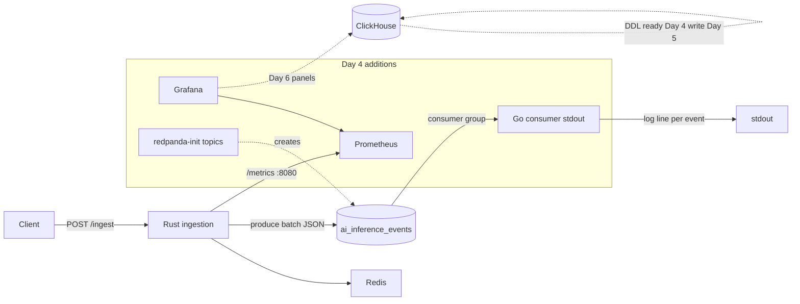

# Day 4 — Code Execution Plan (infra-ai-streaming)

**Plan mode only — no implementation until user approval.**

| Field | Value |
|-------|--------|
| **Calendar day** | 4 of N |
| **Date** | 2026-05-16 (Saturday) |
| **Repo** | `akshantvats/infra-ai-streaming` |
| **Branches** | See § **Branch strategy** below (no `day-004-*` names) |
| **Ticket** | G-02 — Local dev stack + Go consumer skeleton |
| **Observable outcome** | `docker compose up` brings up Redis, Redpanda, ClickHouse, Prometheus, Grafana; `cargo run -p ingestion` + `go run ./consumer/cmd/consumer` + one `curl /ingest` → event appears in Go consumer stdout |
| **Shared Daily Thread** | Go consumer skeleton exists so tomorrow's ClickHouse writer can aggregate cost_usd the way finance asks. |

---

## 1. Current state assessment (Days 0–3)

### What exists today

| Area | Status | Evidence |
|------|--------|----------|
| **Day 0** — README, LICENSE, Mermaid architecture | Done | `README.md`, MIT license |
| **Day 1** — DESIGN.md (CAP, partitions, backpressure, failures) | Done | `DESIGN.md` (7 core sections + Day 3 appendix) |
| **Day 2** — Rust foundation | Done | `ingestion/`: `config.rs`, `metrics.rs`, `wal/`, `rate_limit/` |
| **Day 3** — Runnable ingestion binary | Done | `ingestion/src/main.rs`, `server.rs`, `handlers/ingest.rs`, `kafka/producer.rs` |
| **CI** | Rust unit tests only | `.github/workflows/ci.yml` → `cargo test -p ingestion` |
| **Docker Compose (partial)** | **3 of 5** planned services | `deploy/docker-compose.yml`: Redis, Redpanda, ClickHouse + `clickhouse-init` |
| **ClickHouse DDL** | **Placeholder** | `deploy/clickhouse/init.sql` — 3 columns only (`tenant_id`, `model_id`, `timestamp`) |
| **Prometheus / Grafana** | **Not in compose** | `deploy/README.md` notes `grafana/` and `prometheus/` as placeholders |
| **Kafka topics** | **Not pre-created** | No `redpanda-init`; relies on broker auto-create (if enabled) |
| **Go consumer** | **Absent** | No `consumer/` tree, no `.go` files |
| **E2E pipeline** | **Producer half only** | HTTP → WAL → Kafka works; nothing consumes in-repo |

### Day 3 ingestion behavior (contract for Day 4 consumer)

- **HTTP:** `POST /ingest` → **202 Accepted** after WAL append + channel enqueue; **503** + `Retry-After` on backpressure; **429** on rate limit.
- **Kafka payload:** JSON string `{"events":[<InferenceEvent>, ...]}` (batch wrapper), not one record per event.
- **Partition key:** `tenant_id` from first event in batch (`ingestion/src/kafka/producer.rs`); DESIGN §3 target `hash(tenant_id:model_id)` is **not** implemented yet.
- **Topics (env):** `ai_inference_events`, `ai_inference_dlq`.
- **Schema (`InferenceEvent`):** `event_id?`, `tenant_id`, `model_id`, `timestamp_unix_ms`, `latency_ms`, `prefill_latency_ms?`, `decode_latency_ms?`, `prompt_tokens`, `completion_tokens`, `cost_usd`, `status?`, `error_code?`, `request_id?` — server assigns `event_id` (UUID) and default `status = "success"`.
- **Metrics:** exposed on **same port as HTTP** (`HTTP_PORT`, default 8080) at `/metrics` — not a separate `:9090` listener.

### Gap vs Day 4 `plan.json` scope

`plan.json` explicitly scopes Day 4 consumer to **stdout logging**; **ClickHouse batch writer, circuit breaker, Redis overflow, DLQ consumer logic** ship **Day 5 (G-03)**. The internal `infra-ai-streaming-7day-plan.md` Session 4B describes a fuller consumer — **defer** that to Day 5 per master plan source of truth.

---

## 1b. Branch strategy (FAANG/OSS)

Per [CHECKLIST.md](../CHECKLIST.md) **Branching & Git Standards** — short-lived branches off `main`, Conventional Commits, PR-ready slices.

| Option | When | Branch name(s) |
|--------|------|----------------|
| **A — Single branch** (default if shipping one PR) | All G-02 work lands together | `feat/local-dev-go-consumer-stdout` |
| **B — Logical split** (preferred for review) | Compose/observability vs consumer vs docs | See commits in §10 |

**Recommended split (Option B):**

| Branch | Scope |
|--------|--------|
| `chore/deploy-prometheus-grafana-redpanda-init` | Compose, `redpanda-init`, Prometheus, Grafana provisioning |
| `feat/deploy-clickhouse-inference-events-schema` | Expanded `init.sql` |
| `feat/consumer-kafka-stdout-skeleton` | `consumer/` tree, franz-go reader, stdout logging |
| `docs/readme-e2e-smoke-quickstart` | README, DESIGN appendix, `PROJECT-STATUS`, `scripts/smoke-e2e.sh` |

Merge order: deploy branches first → consumer → docs (or squash per user preference). **Daily Thread** in commit bodies only — not in branch names.

---

## 2. What changes will be made (file-by-file)

### 2.1 Extend local stack (`deploy/`)

| File | Action |
|------|--------|
| `deploy/docker-compose.yml` | **Modify** — add `redpanda-init`, `prometheus`, `grafana`; optional explicit `networks:`; `depends_on` health chains |
| `deploy/redpanda/init-topics.sh` | **Create** — idempotent `rpk topic create` for `ai_inference_events`, `ai_inference_dlq` (and optionally `ai_anomalies` stub for later) |
| `deploy/prometheus/prometheus.yml` | **Create** — scrape ingestion `/metrics` on host; placeholder job for Go consumer `:9091` |
| `deploy/grafana/provisioning/datasources/datasources.yml` | **Create** — Prometheus (default) + ClickHouse HTTP |
| `deploy/.env.example` | **Modify** — add `CONSUMER_*`, `PROMETHEUS_*`, `GRAFANA_*`, compose-internal broker URL comments |
| `deploy/clickhouse/init.sql` | **Modify** — expand table to full inference schema (see §5); keep DB `infra_ai` |
| `deploy/README.md` | **Modify** — document all services, ports, health checks, E2E order |

### 2.2 Go consumer skeleton (`consumer/`)

| File | Action |
|------|--------|
| `consumer/go.mod` | **Create** — module path `github.com/akshantvats/infra-ai-streaming/consumer`, Go 1.22+ |
| `consumer/go.sum` | **Create** — via `go mod tidy` |
| `consumer/cmd/consumer/main.go` | **Create** — env config, zap logger, signal handling, start reader |
| `consumer/internal/config/config.go` | **Create** — mirror Rust env names: `KAFKA_BROKERS`, `KAFKA_TOPIC`, `KAFKA_GROUP_ID`, `LOG_LEVEL` |
| `consumer/internal/model/event.go` | **Create** — `InferenceEvent` + `IngestBatch` structs with `json` tags matching Rust |
| `consumer/internal/kafka/reader.go` | **Create** — franz-go consumer, poll loop, deserialize batch, log each event to stdout |
| `consumer/internal/kafka/reader_test.go` | **Create** — unit test for JSON deserialize (fixture from README curl) |
| `consumer/README.md` | **Create** — short: purpose, env vars, run command |

**Explicitly not created on Day 4:** `internal/clickhouse/`, `internal/redis/overflow.go`, `internal/anomaly/`, metrics HTTP server (optional stub only if trivial).

### 2.3 Docs, scripts, CI

| File | Action |
|------|--------|
| `README.md` | **Modify** — honest status: Go consumer skeleton; compose includes Grafana/Prometheus; E2E steps |
| `DESIGN.md` | **Modify** — appendix: Day 4 milestone; Kafka message envelope; consumer group name; metrics port correction |
| `docs/PROJECT-STATUS.md` | **Modify** — Go consumer skeleton; compose completeness; E2E status |
| `scripts/smoke-e2e.sh` | **Create** (recommended) — compose up check, curl ingest, hint to watch consumer logs |
| `.github/workflows/ci.yml` | **Optional** — add `go test ./consumer/...` job (non-blocking recommendation: add if fast; else Day 5) |
| `CONTRIBUTING.md` | **Modify** — Go prerequisite + consumer run line |

### 2.4 Out of scope (do not touch Day 4)

- Rust ingestion logic (unless bug found during E2E)
- ClickHouse writes from Go
- Grafana dashboard JSON (`dashboards/` — Day 6)
- `OBSERVABILITY.md`, `BENCHMARKS.md`, `CHAOS.md`
- Helm/K8s
- Profile blog HTML (separate agents)

---

## 3. Why each change

| Change | Why |
|--------|-----|
| **Prometheus + Grafana in compose** | G-02 and README promise a local observability stack; Experience blog bridges “multi-service compose” to shard isolation; sets up Day 6 dashboards without re-plumbing compose |
| **redpanda-init** | Deterministic topic names + partition count; avoids “works on my laptop because auto-create” drift vs DESIGN §3 |
| **Expanded `init.sql`** | Blogs and AI post validate `cost_usd` + token fields; Day 5 writer needs DDL ready — applying schema now avoids double-migration on first insert |
| **Go consumer (stdout)** | Closes the loop Rust → Kafka → downstream; proves consumer group, deserialization, and ops workflow before adding ClickHouse failure modes |
| **`internal/model/event.go`** | Single schema contract shared by stdout logger today and CH writer tomorrow — blogs cite same field names |
| **smoke script** | Repeatable E2E for you and for blog commit SHA verification |
| **Docs updates** | README currently says “Go consumer not in repo yet” — must stay truthful post-Day 4 |

---

## 4. Architecture impact



- **Data plane:** Still **at-least-once** ingest → Kafka; consumer **reads and logs** only — no new durability boundary.
- **Control plane:** Topics and schemas become **explicit** in repo (init job + SQL).
- **Observability plane:** Prometheus/Grafana **scrape-ready**; ingestion metrics live; consumer metrics deferred to Day 5.
- **No change** to CAP stance, WAL ordering, or rate-limit fail-open semantics.

---

## 5. Design choices and alternatives rejected

### 5.1 Consumer scope: stdout vs full ClickHouse writer

| Option | Verdict |
|--------|---------|
| **A. Stdout skeleton only** (plan.json) | **Chosen** — isolates Kafka wiring; Day 5 adds reliability complexity |
| B. Full writer + circuit breaker Day 4 | Rejected — blurs G-02/G-03; harder to debug E2E failures |
| C. Consumer in Rust (second binary) | Rejected — DESIGN commits Go to stream processing |

### 5.2 Kafka client library (Go)

| Option | Verdict |
|--------|---------|
| **A. franz-go** (`github.com/twmb/franz-go`) | **Chosen** — aligns with 7-day plan; modern API, good consumer group support |
| B. confluent-kafka-go | Rejected — cgo friction in CI/contributor onboarding |
| C. segmentio/kafka-go | Rejected — viable but diverges from documented plan |

### 5.3 Topic partition count (local)

| Option | Verdict |
|--------|---------|
| **A. 8 partitions local, 32 prod** (documented in DESIGN) | **Chosen** — laptop-friendly; comment in init script |
| B. 32 partitions locally | Rejected — unnecessary broker overhead for dev |
| C. 1 partition | Rejected — hides consumer group rebalance bugs |

### 5.4 ClickHouse schema timing

| Option | Verdict |
|--------|---------|
| **A. Expand `init.sql` Day 4, write Day 5** | **Chosen** — AI blog can reference DDL; writer lands tomorrow |
| B. Minimal placeholder until Day 5 | Rejected — blog/schema drift risk |
| C. Full MV + TTL Day 4 | Rejected — scope creep; MVs in Day 5–6 |

### 5.5 Prometheus scrape target for Rust

| Option | Verdict |
|--------|---------|
| **A. Scrape `host.docker.internal:8080/metrics`** | **Chosen** — matches actual server |
| B. Separate metrics port 9090 | Rejected — not implemented; 7-day plan typo |

### 5.6 Message granularity

| Option | Verdict |
|--------|---------|
| **A. Deserialize `{"events":[...]}` batch per Kafka record** | **Chosen** — matches producer |
| B. One Kafka message per event | Rejected — requires Rust producer change |

### 5.7 Partition key strategy

| Option | Verdict |
|--------|---------|
| **A. Keep `tenant_id` only Day 4** | **Chosen** — no Rust change; document DESIGN gap |
| B. Implement `hash(tenant_id:model_id)` Day 4 | Defer — cross-cutting producer + replay concern |

---

## 6. Tradeoffs

| Tradeoff | Choice | Cost | Benefit |
|----------|--------|------|---------|
| **Consumer commits offsets** | Commit after successful stdout log | On crash, may lose last batch from logs (still in Kafka) | Simple skeleton; replayable |
| **No ClickHouse write** | Logs only | Grafana CH panels empty until Day 5+ | Faster Day 4 ship; clear milestone |
| **Grafana in compose** | Heavier RAM (~512MB+) | Laptop strain | Matches “full stack” narrative; Day 6 imports dashboards |
| **8 vs 32 partitions** | 8 local | Differs from prod DESIGN default | Faster `rpk`/rebalance on Mac |
| **Expand DDL early** | Full columns now | Slightly larger init job | Day 5 writer is insert-only code change |
| **No Go CI initially** | Rust-only CI unchanged | Consumer regressions caught manually | Keeps Day 4 PR smaller; add Go job when tests exist |

---

## 7. Dependencies on Experience + AI blogs

### Shared Daily Thread (verbatim in commits/plans)

> Go consumer skeleton exists so tomorrow's ClickHouse writer can aggregate cost_usd the way finance asks.

### Experience Series — 4 of N

**Title:** Seven Million IoT Sensors — Failure Modes Textbooks Skip  
**Bridge:** Multi-service compose today mirrors shard isolation before million-device fan-out.

| Code artifact | Blog use |
|---------------|----------|
| 5-service compose diagram | Mermaid: Redis / Redpanda / ClickHouse / Prometheus / Grafana as isolated failure domains |
| Service healthchecks | “Blast radius” — one unhealthy dependency doesn’t silently take others |
| Consumer stdout | “Edge filter before warehouse” analogy — consumer as first aggregation hop |

**Notify Experience agent:** compose service list + ports after implementation; no API change.

### AI Learning — 3 of N (Learning LLM Inference series)

**Title:** Token Budgets and Real Cost Structure  
**Hook:** Validate `cost_usd` + prompt vs completion token fields in event JSON against provider pricing.

| Schema field | Blog validation |
|--------------|-----------------|
| `prompt_tokens` | Cheaper input-side pricing |
| `completion_tokens` | Decode-step pricing |
| `cost_usd` | Must appear in stdout log line and in `init.sql` |
| `prefill_latency_ms` / `decode_latency_ms` | Optional; document if present in test event |

**Code → blog contract (freeze before HTML):**

```json
{
  "events": [{
    "tenant_id": "demo",
    "model_id": "gpt-4o",
    "timestamp_unix_ms": 1715000000000,
    "latency_ms": 342,
    "prompt_tokens": 512,
    "completion_tokens": 128,
    "cost_usd": 0.00423,
    "status": "success"
  }]
}
```

**Consumer stdout format (suggested for blog quotes):**

```
level=info msg=event_consumed tenant_id=demo model_id=gpt-4o prompt_tokens=512 completion_tokens=128 cost_usd=0.00423 latency_ms=342
```

**Cross-link:** AI post links to Experience post via Daily Thread; Experience links back to AI cost field explanation.

### README quickstart (both blogs)

After Day 4, quickstart must list:

1. `docker compose ... up -d`
2. `cargo run -p ingestion`
3. `go run ./consumer/cmd/consumer`
4. `curl` example

Blog agents must **not** publish HTML until code agent provides **commit SHA** and verified stdout snippet.

---

## 8. Local validation steps

### Prerequisites

- Docker Desktop (or compatible) with **≥ 8 GB RAM** allocated if running full stack including ClickHouse + Grafana
- Rust **1.86+** (`rust-toolchain.toml`)
- Go **1.22+**
- `cmake` (Rust rdkafka)
- `cp deploy/.env.example deploy/.env`

### Commands (in order)

```bash
# 1. Branch (single-branch option; or use split names from §1b)
cd /Users/akshant/Desktop/github/infra-ai-streaming
git checkout main && git pull
git checkout -b feat/local-dev-go-consumer-stdout

# 2. Stack
cp deploy/.env.example deploy/.env
docker compose --env-file deploy/.env -f deploy/docker-compose.yml up -d

# 3. Wait for health (all services healthy)
docker compose --env-file deploy/.env -f deploy/docker-compose.yml ps

# 4. Verify topics (after redpanda-init completes)
docker compose --env-file deploy/.env -f deploy/docker-compose.yml run --rm redpanda \
  rpk topic list --brokers redpanda:9092

# 5. Unit tests (no compose required)
cargo test -p ingestion
go test ./consumer/...

# 6. Terminal A — consumer
set -a && source deploy/.env && set +a
export KAFKA_BROKERS=127.0.0.1:9092
export KAFKA_GROUP_ID=ai-inference-consumer-dev
go run ./consumer/cmd/consumer/

# 7. Terminal B — ingestion
set -a && source deploy/.env && set +a
cargo run -p ingestion

# 8. Terminal C — test event
curl -sS -X POST http://localhost:8080/ingest \
  -H "Content-Type: application/json" \
  -H "X-Tenant-ID: demo" \
  -d '{"events":[{"tenant_id":"demo","model_id":"gpt-4o","timestamp_unix_ms":'"$(python3 -c 'import time; print(int(time.time()*1000))')"',"latency_ms":342,"prompt_tokens":512,"completion_tokens":128,"cost_usd":0.00423,"status":"success"}]}'

# 9. Optional — confirm Kafka record without consumer
rpk topic consume ai_inference_events -n 1 --brokers 127.0.0.1:9092

# 10. Observability smoke
curl -sS http://localhost:8080/metrics | head
open http://localhost:9090/targets   # Prometheus UI
open http://localhost:3000           # Grafana (admin/admin)
```

### Success criteria

| # | Criterion |
|---|-----------|
| 1 | All compose services **healthy** (or `completed` for one-shot init jobs) within ~2 min |
| 2 | Topics `ai_inference_events` and `ai_inference_dlq` exist with expected partition count |
| 3 | `curl /ingest` returns **202** with `batch_id` |
| 4 | Go consumer prints **≥1** structured log line containing `demo`, `gpt-4o`, `cost_usd=0.00423` |
| 5 | `rpk topic consume` shows the same JSON batch (sanity) |
| 6 | Prometheus target for ingestion is **UP** (or documented `host.docker.internal` fix on Linux) |
| 7 | ClickHouse `SELECT count() FROM infra_ai.inference_events` may be **0** (writes are Day 5) |
| 8 | `cargo test -p ingestion` and `go test ./consumer/...` pass |
| 9 | No secrets in logs or committed `.env` |

### Failure-path smoke (light)

- Stop consumer, send ingest, restart consumer → event consumed (at-least-once; may duplicate if offset policy allows — acceptable for Day 4).
- Stop Redpanda, `curl /ingest` → **503/503 wal or produce errors** per existing Rust behavior (no regression).

---

## 9. README / DESIGN updates needed

### README.md

- Update **Honest status** line: Go consumer skeleton present; ClickHouse writer Day 5.
- **Getting started:** add Go prerequisite; three-terminal E2E; Grafana/Prometheus URLs.
- Fix **metrics port** narrative: `:8080/metrics` not `:9090`.
- Repository layout: mark `consumer/` as started.

### DESIGN.md

- Appendix **Day 4 milestone:** consumer group `ai-inference-consumer-v1` (or `-dev`), message envelope `{"events":[]}`, stdout-only consumer.
- Note **partition key gap:** producer uses `tenant_id`; target `hash(tenant_id:model_id)` tracked as open item.
- Prometheus scrape diagram correction.

### docs/PROJECT-STATUS.md

- Move “No Go consumer” → “Go consumer skeleton (stdout); CH writer pending”.
- List compose services count (5 + init jobs).

### deploy/README.md

- Port matrix table: 6379, 9092, 9644, 8123, 9000, 9090, 3000.

### Proposed `init.sql` columns (for approval)

Align with `InferenceEvent` + Day 5 writer:

- `event_id UUID`
- `tenant_id`, `model_id` — `LowCardinality(String)` where appropriate
- `timestamp DateTime64(3)`
- `latency_ms`, `prefill_ms`, `decode_ms` — `UInt32`
- `prompt_tokens`, `completion_tokens` — `UInt32`
- `cost_usd Float64`
- `status`, `error_code`, `request_id` — `String` / nullable
- `ENGINE = MergeTree`, `ORDER BY (tenant_id, model_id, timestamp)`

---

## 10. Suggested commit message(s)

Use Conventional Commits; **local only** until user approves push.

### Commit 1 — compose + observability + topics

```
feat(deploy): add Prometheus, Grafana, and Redpanda topic init

Extend docker-compose with redpanda-init, Prometheus, and Grafana.
Add prometheus.yml and Grafana datasource provisioning. Document
ports and healthchecks for full local stack.

Refs: 4 of N — infra-ai-streaming — Go consumer skeleton exists so
tomorrow's ClickHouse writer can aggregate cost_usd the way finance asks.
```

### Commit 2 — ClickHouse schema

```
feat(deploy): expand ClickHouse inference_events schema

Add token, cost, and latency columns to match InferenceEvent contract
for Day 5 batch writer and blog schema references.

Refs: 4 of N — infra-ai-streaming — Go consumer skeleton exists so
tomorrow's ClickHouse writer can aggregate cost_usd the way finance asks.
```

### Commit 3 — Go consumer skeleton

```
feat(consumer): add Kafka consumer skeleton with stdout logging

Introduce Go consumer reading ai_inference_events, deserializing
batched JSON, and logging events. Wire end-to-end with Rust ingestion.

Refs: 4 of N — infra-ai-streaming — Go consumer skeleton exists so
tomorrow's ClickHouse writer can aggregate cost_usd the way finance asks.
```

### Commit 4 — docs + smoke script

```
docs: update README and PROJECT-STATUS for Day 4 E2E path

Document compose stack, consumer run instructions, and metrics port.
Add scripts/smoke-e2e.sh for local verification.

Refs: 4 of N — infra-ai-streaming — Go consumer skeleton exists so
tomorrow's ClickHouse writer can aggregate cost_usd the way finance asks.
```

*Alternative:* squash 1+2 into single `feat(deploy)` if user prefers fewer commits.

---

## 11. Self-review checklist (before commit)

- [ ] Diff free of `println!` / `fmt.Println` except intentional consumer stdout
- [ ] No `deploy/.env` committed; only `.env.example` updated
- [ ] `InferenceEvent` Go structs match Rust field names (`json` tags snake_case)
- [ ] Consumer handles **batch wrapper** `{"events":[...]}`
- [ ] Deserialization errors logged; process does not panic on bad JSON
- [ ] `KAFKA_GROUP_ID` documented; changing group replays from earliest (note in README)
- [ ] Prometheus scrape works on **8080** for macOS; Linux uses `host.docker.internal` or `extra_hosts`
- [ ] README “honest status” accurate — no claim of ClickHouse writes
- [ ] DESIGN open items updated (partition key, metrics port)
- [ ] No scope creep: no ClickHouse writer, circuit breaker, anomaly detector
- [ ] `go test` and `cargo test` pass
- [ ] Manual E2E once with copy-paste commands from §8
- [ ] Daily Thread in commit bodies

---

## 12. Risks and blockers

| Risk | Likelihood | Mitigation |
|------|------------|------------|
| **Docker RAM** — ClickHouse + Grafana OOM on laptop | Medium | Document “minimal profile” (Redis + Redpanda only for consumer test); full stack optional |
| **Linux `host.docker.internal`** missing | Medium | Add `extra_hosts: ["host.docker.internal:host-gateway"]` to prometheus service |
| **Topic auto-create vs init race** | Low | `depends_on` redpanda healthy before `redpanda-init`; ingestion starts after init |
| **rpk / Redpanda version drift** | Low | Pin image tag (already `v24.2.4`); match `rpk` in init container |
| **Go module path** | Low | Confirm GitHub org `akshantvats` in `go.mod` |
| **Blog/code skew** | Medium | Freeze test JSON + stdout sample; share SHA before HTML |
| **Day 3 vs Day 4 plan overlap** | Low | Day 4 only adds consumer + observability; don’t re-implement ingestion |
| **Partition hot-spot** | Low (dev) | Document; fix in later ticket |
| **CI without Docker** | Medium | Go tests unit-only; compose E2E manual until Day 10 chaos/CI hardening |
| **Publish both blogs today** | Schedule | Out of code agent scope — user gates Phase 3 blog agents |

### Blockers requiring user input

1. **GitHub module path** — confirm `github.com/akshantvats/infra-ai-streaming/consumer` vs fork URL.
2. **Full compose on laptop** — approve RAM-heavy stack or minimal subset for daily dev.
3. **Go in CI** — add job now or Day 5 with ClickHouse tests.

---

## Implementation order (after approval)

1. Branch per §1b (e.g. `feat/local-dev-go-consumer-stdout` or split list)
2. `deploy/`: redpanda-init → prometheus → grafana → init.sql → `.env.example`
3. `consumer/`: model → kafka reader → main → tests
4. `scripts/smoke-e2e.sh`
5. Docs pass (README, DESIGN appendix, PROJECT-STATUS)
6. Manual E2E §8
7. Local commits per §10 — **no push** until user says so

---

*Plan generated for user approval — Phase 1 Code agent (A1). No code changes applied.*
