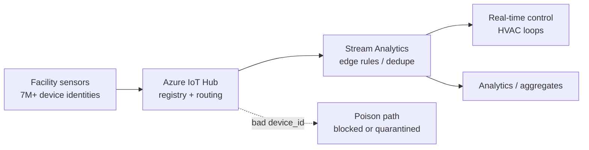
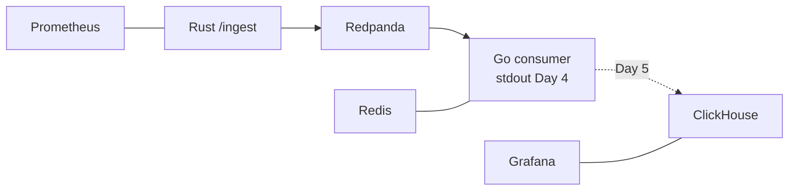

# Day 4 — Experience Series Blog · Execution Plan

**Agent:** A2 (Experience blog) · **Phase:** Plan mode only — no HTML, no Profile repo writes  
**Calendar:** 4 of N · **Date:** 2026-05-16 (Saturday)  
**Code repo (today):** `akshantvats/infra-ai-streaming` — Ticket G-02 (docker-compose stack + Go consumer skeleton + Rust → Kafka → Go E2E)  
**Profile target (after approval):** `blog/series/agoda/` (series slug unchanged in site; kicker evolves to Experience / **X of N** numbering)

---

## Source inputs (locked)

| Field | Value (`plan.json` day 4) |
|-------|---------------------------|
| **Experience title** | Seven Million IoT Sensors — Failure Modes Textbooks Skip |
| **Subtitle** | Walmart · device identity · edge filtering at scale |
| **Bridge** | Multi-service compose today mirrors shard isolation before you touch million-device fan-out. |
| **Shared Daily Thread** | Go consumer skeleton exists so tomorrow's ClickHouse writer can aggregate cost_usd the way finance asks. |
| **Sibling AI post** | 3 of N — Learning LLM Inference — Token Budgets and Real Cost Structure |
| **AI hook** | Validate `cost_usd` + prompt vs completion token fields in event JSON against provider pricing pages. |

---

## 1. Proposed headline, subtitle, URL slug

| Item | Proposed value |
|------|----------------|
| **Headline (H1)** | Seven Million IoT Sensors — Failure Modes Textbooks Skip |
| **Subtitle (hero)** | 4 of N — Experience Series · Walmart · refrigeration, HVAC, and why bad telemetry is worse than a crash |
| **URL slug / filename** | `seven-million-iot-sensors-failure-modes.html` |
| **Canonical path** | `blog/series/agoda/seven-million-iot-sensors-failure-modes.html` |
| **`<title>` / og:title** | Seven Million IoT Sensors — Failure Modes Textbooks Skip — Akshant Sharma |
| **meta description** | How Walmart uses 7M+ IoT points to keep ice cream frozen and HVAC efficient — and why today's LensAI compose stack is blast-radius practice (SmartBuildings platform perspective, not the corporate blog author). |

**Kicker (tags + series nav):** `Experience Series · 4 of N` (retain `Agoda Series` slug in `data-series-slug="agoda"` until a site-wide rename; kicker text carries the new brand per CHECKLIST.md).

**Series-index.json entry (post-approval):**

```json
{
  "href": "blog/series/agoda/seven-million-iot-sensors-failure-modes.html",
  "kicker": "4 of N · Walmart",
  "title": "Seven Million IoT Sensors — Failure Modes Textbooks Skip",
  "desc": "Refrigeration, HVAC, and edge discipline at Walmart IoT scale — bridged to LensAI docker-compose isolation."
}
```

---

## 1b. Walmart corporate narrative — alignment & caution

**Official source:** [How Walmart Leverages IoT to Keep Your Ice Cream Frozen](https://corporate.walmart.com/news/2021/01/14/how-walmart-leverages-iot-to-keep-your-ice-cream-frozen) (Jan 14, 2021 · Sanjay Radhakrishnan, VP Global Tech).

**Voice boundary:** You worked on **SmartBuildings / WeIoT platform** work (resume). Do **not** imply you wrote the corporate post or own the public IoT roadmap. Frame as: *platform engineer perspective aligned with Walmart's published story*.

### Alignment (safe to echo)

| Theme | Official narrative | Our post use |
|-------|-------------------|--------------|
| **Scale** | 7M+ unique IoT data points across U.S. stores | Headline/stat callout — matches resume "7M+ sensors" |
| **Refrigeration / food quality** | Monitors refrigeration units; ice cream frozen, milk cold; proactive maintenance | Opening hook + Diagram A — **lead with refrigeration**, not abstract "sensors" |
| **HVAC / energy** | IoT on HVAC and energy systems; Demand Response; regional/store energy reduction without hurting shoppers | Bridge to facility operations; honest parallel to compose **isolation** (not throughput) |
| **Anomaly / action** | Proprietary software + algorithms detect anomalies in real time and fix issues quickly | Analog to **edge filter before warehouse** — conceptually, not same product names |
| **Maintenance path** | Signals triaged via cloud app → store associate / work order / remote fix | War-story shape: **triage before aggregate**, not "everything to BI" |
| **Business outcome** | Food quality, lower energy, cost for customers | Outcome framing in opening — no invented dollar % |

### Mismatch / caution (do not overclaim)

| Our plan / resume | Official article | Guidance |
|-------------------|------------------|----------|
| **"Tens of millions of points/minute"** (Profile) | **~1.5 billion messages/day** (~1M/min average) | Do **not** state "tens of millions/min" without qualification. Prefer corporate **1.5B/day** or resume-consistent **"high-volume telemetry"** if peak internal numbers aren't publishable. |
| **Azure IoT Hub, Stream Analytics** by name | Not named; "proprietary software," "cloud application," "Demand Response" | OK as **your stack** (resume) — label as *platform you worked on*, not as quotes from the corporate post. |
| **Device identity / poison telemetry / spoofing** | Not discussed; focus is refrigeration performance + energy | Keep as **your engineering lessons** from SmartBuildings — don't attribute failure-mode taxonomy to the blog. |
| **Stream Analytics edge rules** | Edge filtering implied via algorithms + triage, not Stream Analytics | Say "stream processing / edge rules" generically or name Azure stack as **your** implementation. |
| **50+ global facilities** (resume) | **4,600+ U.S. stores** (corporate) | Different units — don't merge into one number. Facilities bullet = your scope; store count = cite corporate if needed. |
| **WeIoT / SmartBuildings** branding | "IoT team within Walmart Global Tech" | Use internal team names only with *I worked on…* framing. |

### Citation — quotable facts (safe)

1. *"Walmart manages more than **7 million** unique IoT data points across our U.S. stores."*
2. *"Every day, this network … sends almost **1.5 billion messages** regarding temperature, operating functions and energy use."*

Link the corporate post in footnotes; ice-cream / refrigeration angle is **authentic** to Walmart's public story.

### Outline adjustments from alignment review

| Section | Adjustment |
|---------|------------|
| **Opening** | Hook: spoiled rollup / wrong temperature signal — tie to **refrigeration case** (ice cream), not generic "sensor ID" only |
| **`scale`** | Lead with 7M+ **data points** + food-quality mission (corporate); add your platform role second |
| **`edge-vs-cloud`** | Pair **Demand Response / HVAC scheduling** (corporate) with your **stream rules** analogy |
| **Diagram A** | Label hot path **refrigeration / HVAC**; avoid implying Azure product names from corporate URL |
| **Headline** | Keep — 7M+ is corporate-backed; subtitle now mentions refrigeration/HVAC |

Insert **after** the percentiles post in the `posts` array (newest near top is OK per NEW-POST-CHECKLIST).

---

## 2. Outline with section headers

Match published Agoda posts: short opening hooks (1–3 sentence paragraphs), `h2` with `id=` anchors, stat callout grid, attr-boxes for team vs mine where relevant, pullquote for the thesis, Mermaid in architecture sections, closing bridge to LensAI + series footer.

| # | Section `id` | Header | Purpose |
|---|--------------|--------|---------|
| 0 | — | **Opening** (no H2) | Hook: refrigeration telemetry looked fine until a case drifted — ice cream risk, no loud crash. Thread sentence verbatim. |
| 1 | `scale` | **Seven Million Data Points — Until a Case Stops Being Boring** | Corporate scale + food-quality mission; then SmartBuildings / WeIoT platform context; stat callout. |
| 2 | `textbook-gap` | **What Textbooks Teach vs What Production Teaches** | CAP/at-least-once vs device spoofing, duplicate `device_id`, clock skew, firmware version drift. |
| 3 | `identity` | **Device Identity Is a Partition Key, Not a String** | Registry, provisioning, cert rotation, why "just use MAC" fails at scale. |
| 4 | `poison` | **Poison Telemetry: The IoT Version of a Hot Partition** | One device → bad aggregates; edge filter vs central drop; analogy to bad `tenant_id` in LensAI. |
| 5 | `edge-vs-cloud` | **Edge Filtering vs Cloud Aggregation** | Stream Analytics / facility rules; what must never reach the warehouse. |
| 6 | `failure-modes` | **Five Failure Modes I Still Design For** | Numbered list with honest severity (silent wrong > loud crash). |
| 7 | `compose-bridge` | **Why Today's `docker compose` Is Shard Isolation Practice** | Bridge section — map each compose service to blast-radius boundary (see §5). |
| 8 | `lensai` | **Same Muscle, Different Silicon: LensAI Day 4** | Rust → Redpanda → Go consumer; `cost_usd` lands in Kafka today, ClickHouse tomorrow; link AI Day 3. |
| 9 | `tradeoffs` | **What We Didn't Do (and Why)** | Honest constraints — see §10. |
| 10 | `stayed` | **The Thing That Stayed With Me** | Trust / cumulative damage theme (mirror post 2 closing tone). |
| — | — | **Series footer** | 4 of N; tease 5 of N DH geo-events OR next Agoda deep-dive per nav. |
| — | — | **Footnotes / related** | Prior Experience posts + infra-ai-streaming README + AI Day 3 URL. |

**TOC sidebar:** Mirror post 2 — anchor list for sections 1–10.

---

## 3. Mermaid diagram(s) to include

### Diagram A — Walmart IoT data plane (flowchart LR)

**Shows:** Facility devices → Azure IoT Hub (device registry + routing) → Stream Analytics (edge rules) → hot path (real-time HVAC / alerts) vs cold path (warehouse / BI). Annotate **identity check** at Hub and **filter** at Stream Analytics.



### Diagram B — Failure-mode decision tree (flowchart TD)

**Shows:** Incoming telemetry → `{known device?}` → `{within rate budget?}` → `{schema valid?}` → accept / quarantine / drop. Emphasize **quarantine** branch (DLQ metaphor for IoT).

### Diagram C — LensAI Day 4 compose isolation (flowchart LR)

**Shows:** Parallel to Diagram A — `ingestion (Rust)` → `redpanda` → `go-consumer` → stdout (Day 4) → `clickhouse` (Day 5); sidecars `redis`, `prometheus`, `grafana` as **isolated failure domains** with healthchecks. Label: "each box = restartable blast radius."



**Render pattern:** Copy from `when-percentiles-lie-cross-tier-queries.html` — `<pre class="mermaid">`, Mermaid 10 CDN, theme-aware init.

**Optional (waive unless draft feels thin):** Sequence diagram — single poison event from device → Hub → rejected at edge rule → metric `quarantined_total` (conceptual; no need for real metric name until code lands).

---

## 4. Company / experience story angle

| Item | Choice |
|------|--------|
| **Atom** | **Walmart Labs — WeIoT SmartBuildings** (first Walmart story in the Experience arc; plan.json explicit) |
| **Resume facts to anchor** (Profile `index.html`) | 7M+ unique sensors; Azure IoT Hub; Stream Analytics for HVAC; OTA firmware at scale — **throughput:** prefer corporate 1.5B msgs/day or "high-volume" unless user confirms peak/minute stat for public copy |
| **Corporate facts to anchor** | [Ice cream / IoT post](https://corporate.walmart.com/news/2021/01/14/how-walmart-leverages-iot-to-keep-your-ice-cream-frozen): 7M+ data points; ~1.5B messages/day; refrigeration + HVAC + Demand Response |
| **Narrative spine** | Production war story: **device identity + edge filtering** prevent poisoned aggregates — same class of bug as wrong percentiles (post 2) but IoT-shaped (silent wrong facility KPIs) |
| **Contribution boundary** | Platform architecture on IoT Hub + stream processing; avoid claiming sole authorship of all 7M devices — "I worked on the platform that connected…" |
| **Contrast with Agoda posts** | Agoda = **information loss in aggregates** (histograms); Walmart = **bad identity / bad actor at the edge** before aggregation |

**Do not** drift into Delivery Hero (Day 5) or OTA deep-dive (Day 12) — one sentence max on OTA as future echo.

---

## 5. Bridge to today's infra-ai-streaming work

Use plan.json `bridge` verbatim in the **compose-bridge** section, expanded:

| Walmart concept | Day 4 code analog |
|-----------------|-------------------|
| Facility / region shard | Compose **service** boundary (restart, healthcheck, resource cap) |
| IoT Hub routing | Redpanda **topic + partition** strategy (`tenant_id:model_id` from DESIGN.md) |
| Stream Analytics edge rules | Go consumer **validation + log-and-skip** (skeleton); future anomaly topic |
| Poison device quarantine | DLQ / reject path (design; CHAOS.md foreshadow) |
| Tens of millions msgs/min | Not claimed for local compose — **honest**: laptop stack proves **topology**, not throughput |

**Concrete day-4 deliverables to cite (after code agent finishes):**

- `deploy/docker-compose.yml`: Redis, Redpanda, ClickHouse (+ init), Grafana, Prometheus per G-02 ticket text
- Go consumer: read Kafka, **stdout** (ClickHouse writer Day 5)
- E2E: `curl /ingest` → topic → consumer log line with `cost_usd`, `prompt_tokens`, `completion_tokens`

**Commit pointer in footnote only** — SHA + PR link, no full diff (CHECKLIST Phase 4).

---

## 6. Cross-link text to AI Learning Day 3 blog

**Placement:** End of `lensai` section + footnote row.

**Sibling link paragraph (draft copy):**

> Today's companion post is **[3 of N — Learning LLM Inference — Token Budgets and Real Cost Structure](https://akshantvats.github.io/Profile/blog/series/ai-learning/day-3-token-budgets-cost-structure.html)** *(URL placeholder until AI agent publishes)*. The Go consumer you stand up today is deliberately dumb: it only needs to prove events carry **`prompt_tokens`**, **`completion_tokens`**, and **`cost_usd`** intact. Tomorrow's ClickHouse writer aggregates those fields the way finance asks — the same separation I learned shipping cost signals only after telemetry was trusted at Walmart scale.

**Thematic tie:** Walmart = don't aggregate untrusted telemetry; AI Day 3 = don't sum dollars without understanding prompt vs completion **budget** structure.

**AI → Experience reverse link** (for AI agent plan): "Read Experience Day 4 for why identity and edge filtering matter before `cost_usd` rollups."

---

## 7. Shared Daily Thread one-liner

Paste **verbatim** at top of draft (after title block in chat; first prose paragraph in HTML):

> **Daily Thread (Day 4):** Go consumer skeleton exists so tomorrow's ClickHouse writer can aggregate cost_usd the way finance asks.

---

## 8. Numbers / metrics to include

| Metric | Value | Source / usage |
|--------|-------|----------------|
| Unique sensors | **7M+** | Profile / resume |
| Telemetry rate | **~1.5B messages/day** (corporate, Jan 2021) — or qualified high-volume from platform work | Corporate post + resume (see §1b caution) |
| Facilities (HVAC) | **50+ global facilities** | Profile bullet |
| Tenure | Aug 2018 – May 2021 | Profile |
| Stack labels | Azure IoT Hub, Stream Analytics, edge computing | Tags |
| LensAI design target | **1M events/min** ingest (aspirational) | infra-ai-streaming README — label as target, not Day 4 benchmark |
| Local compose | **3–5 services** healthy on laptop | Day 4 smoke — count actual services after G-02 |
| Event JSON example | `prompt_tokens: 512`, `completion_tokens: 128`, `cost_usd: 0.00423` | README curl example |

**Avoid:** Inventing Walmart P99 latencies or dollar savings percentages not on resume.

**Stat callout grid (4 cells):** `7M+` data points · `1.5B`/day messages (corporate) · `50+` facilities (resume scope) · `3` failure classes worse than crash (identity / poison / silent aggregate)

---

## 9. Code / config snippet to show

**Primary (compose isolation)** — trimmed `deploy/docker-compose.yml` service names + healthchecks (not full 100 lines):

```yaml
# deploy/docker-compose.yml (excerpt) — each service = isolated blast radius
services:
  redis:        # hot-state / future overflow
  redpanda:     # durable log (Kafka API)
  clickhouse:   # analytics store (writer ships Day 5)
  # grafana, prometheus — observability sidecars (G-02)
```

**Secondary (event contract)** — JSON one-liner from README / DESIGN.md:

```json
{
  "tenant_id": "demo",
  "model_id": "gpt-4o",
  "prompt_tokens": 512,
  "completion_tokens": 128,
  "cost_usd": 0.00423,
  "latency_ms": 342
}
```

**Tertiary (optional)** — Go consumer log line format: `consumed event_id=… tenant_id=… cost_usd=…` (exact string from implementation).

**Do not** show pre-approval HTML; fences are for chat draft only.

---

## 10. Tradeoffs / honest constraint section

Section **`tradeoffs`** — bullet narrative, Agoda post tone:

| Tradeoff | Chose | Didn't | Why honest |
|----------|-------|--------|------------|
| Edge vs cloud filter | Facility-level rules in Stream Analytics | Full cloud ML anomaly on every reading | Cost + latency; edge cheap at 7M scale |
| Strong identity | Hub registry + provisioning discipline | Anonymous telemetry | Debugging impossible without identity |
| Day 4 consumer | stdout sink | ClickHouse writer today | Prove Kafka path first; finance rollups need trusted schema (thread) |
| Compose on laptop | Topology correctness | Walmart throughput replay | Don't fake 10M/min on MacBook |
| Multi-service stack | Separate containers | Single binary monolith | Restart isolation > demo convenience |
| Poison handling | Quarantine + metrics | Silent drop | Silent drop repeats percentiles post lesson |

**Acknowledge:** Grafana/Prometheus may land same day as compose — if not in repo at draft time, say "wired in G-02" or defer sentence to HTML pass after code merge.

---

## 11. Retrofix suggestions for posts 1–2 (consistency)

| Post | Issue | Retrofix (backlog; don't block Day 4) |
|------|-------|--------------------------------------|
| **building-tsdb-at-agoda.html** (Post 1/5) | Kicker says `Post 1/5 · overview`, not **X of N** | Add tag `Experience Series` or calendar kicker; add footnote link to 4 of N when live |
| **when-percentiles-lie-cross-tier-queries.html** (Post 2) | `series-index` says `Post 2/5 · Day 3` but hero subtitle is `Post 2 of 5 — Agoda TSDB Series` only | Align subtitle to `3 of N — Experience Series` + keep Agoda context |
| **Post 2** | No **Daily Thread** sentence | Add retroactive thread for Day 3 in footnote (optional) or leave historical |
| **Post 2** | No **sibling link** to AI Day 2 | Add "Companion: Day 2 Continuous Batching" footnote |
| **Post 2** | Strong LensAI bridge in prose but no **commit/PR** footnote | Add infra-ai-streaming link with "as of Day 3" SHA when known |
| **series-index.json** | Placeholder Post 3/5 (k8s cardinality) is **day 11** in plan — nav drift | Either update kicker to plan day or add note "roadmap subject to open-ended calendar" |
| **Series naming** | CHECKLIST: Experience Series; site: Agoda Series | 4 of N introduces dual kicker: `Experience Series · 4 of N` inside `agoda` slug folder until rename issue |
| **AI series** | `day-3-token-budgets-*.html` not yet in repo | Day 4 footnote uses placeholder URL; fix on publish day |

---

## 12. Draft workflow — what to paste in chat first for user review

**Order for Phase 2 approval (single chat message):**

1. **Metadata block** — headline, subtitle, slug, kicker, `article:published_time` (2026-05-16), est. read time (14–16 min)
2. **Daily Thread** — verbatim one-liner
3. **Opening 3 paragraphs** — poisoned rollup hook (Walmart), thesis, "textbooks skip"
4. **Full outline** — section headers + 1-sentence beat per section (§2 table)
5. **Three Mermaid sources** — Diagrams A–C (§3)
6. **Stat callout** — four numbers (§8)
7. **Bridge section draft** — `compose-bridge` + `lensai` (~400 words)
8. **Cross-link paragraph** — AI Day 3 (§6)
9. **Tradeoffs** — bullet list (§10)
10. **Code snippets** — compose excerpt + event JSON (§9)
11. **Retrofix list** — §11 for user yes/no
12. **Ask:** approve / edit / defer HTML

**After approval only:** HTML from `when-percentiles-lie-cross-tier-queries.html` template, update `series-index.json`, local `python3 -m http.server` sanity check, user-requested commit/push.

---

## Consistency checklist (from CHECKLIST.md §B)

- [ ] Experience label: **4 of N** in kicker/meta
- [ ] Walmart claims checked against §1b (corporate post + resume boundaries)
- [ ] Tone matches post 2: story-led, short paragraphs, stat callout, pullquote, mermaid
- [ ] Sibling AI Day 3 linked
- [ ] Thread verbatim
- [ ] Company bridge required (Walmart) ✓
- [ ] Numbers with sources ✓
- [ ] Tradeoffs section ✓
- [ ] Mermaid ≥2 (architecture + failure or compose) ✓
- [ ] No HTML until user approves draft ✓

---

## Dependencies on other agents (Phase 1 matrix)

| Dependency | Owner | Before HTML |
|------------|-------|-------------|
| Final `docker-compose` service list (Grafana/Prometheus included?) | A1 code | Confirm snippet |
| Go consumer log format | A1 code | Snippet accuracy |
| AI Day 3 published URL | A3 AI blog | Fix footnote href |
| Commit SHA / PR | A1 code | Footnote only |

---

*Plan artifact only. Next step: user reviews §12 paste in chat → approve → Experience blog agent writes HTML.*
