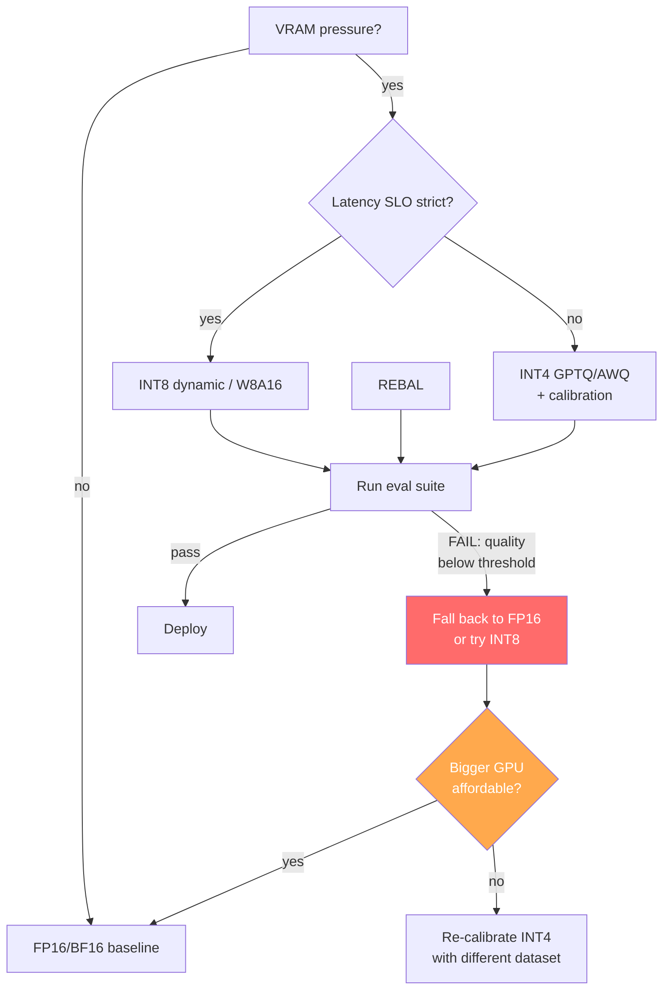
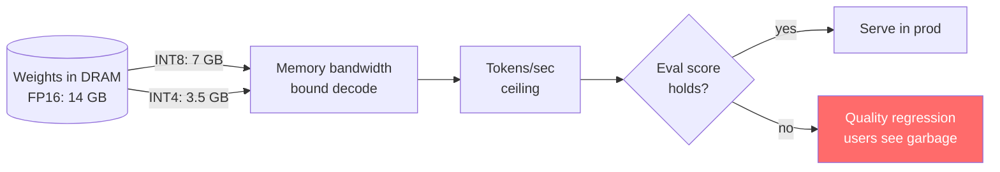
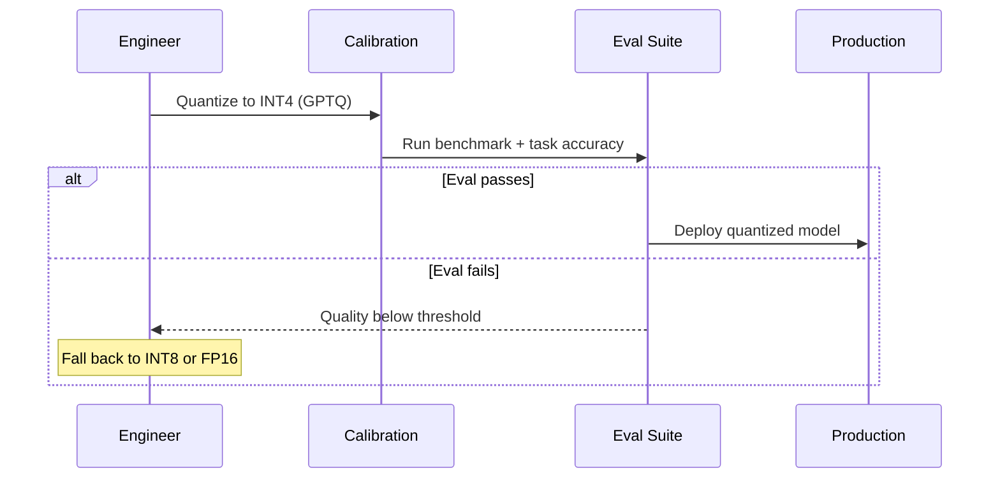

# Plan C — AI Learning blog (Day 7 · Day 6 of N)

**Status:** Plan mode only — no HTML until `approve ai`.

---

## Metadata

| Field | Value |
|-------|--------|
| **Calendar day** | 7 of N |
| **Public kicker** | **Day 6 of N** (0-based `day_index: 6` per CHECKLIST — **not** Day 7 in sidebar) |
| **H1** | Day 6 of Learning LLM Inference — Quantization vs Compression Tradeoffs |
| **Subtitle** | INT8/INT4 as Snappy-vs-Zstd for weights |
| **Hook** | Your model fits in VRAM — until someone adds a second concurrent user. The first knob isn't a bigger GPU. It's quantization. |
| **plan.json drift** | `ai.day_index: 7` in plan.json — **fix to 6** when implementing (filename + kicker must match) |
| **Word target** | 1,000–1,400 |
| **Mermaid** | **2 diagrams** (3rd optional: deploy pipeline sequence) |

## Paths & OG

| Item | Value |
|------|--------|
| **target_html** | `Profile/blog/series/ai-learning/day-6-quantization-vs-compression-tradeoffs.html` |
| **Canonical** | `https://akshantvats.github.io/Profile/blog/series/ai-learning/day-6-quantization-vs-compression-tradeoffs.html` |
| **og:image** | `https://akshantvats.github.io/Profile/blog/assets/og/day-6-quantization-vs-compression-tradeoffs.png` |
| **Cover badge** | `AI LEARNING SERIES` only |

---

## Voice contract

### MUST

- **Open with a moment, not a definition.** First paragraph puts the reader in a situation where quantization matters — a model that fit yesterday and doesn't today, a latency SLO that broke when traffic doubled. The reader should feel the problem before the word "quantization" appears.
- **Sentences connect.** "Because", "so", "the problem was", "what I didn't expect" — every paragraph binds to the next. No orphan statements.
- **One core analogy, developed deeply.** Quantization = codec selection for weight tensors. Snappy/LZ4 maps to INT8 (fast, good enough). Zstd maps to INT4/GPTQ (slow calibration, better compression). Uncompressed FP16 = shipping raw WAV. Return to this analogy in the closing.
- **Write like a staff engineer explaining to a backend colleague.** "You already pick codecs by access pattern" tone. Not an ML paper, not a tutorial. First person where it helps ("when I first saw INT4 benchmarks..."), "you" when explaining shared intuition.
- **Concrete examples over abstract claims.** "A 7B parameter model in FP16 takes ~14 GB of VRAM. In INT8, that's ~7 GB. In INT4, ~3.5 GB." — not "quantization reduces memory."
- **Failure paths in diagrams.** Decision flowcharts must show what happens when eval fails, when quality regresses, when you pick wrong. Not just the happy deploy.
- **Ending punches, doesn't fade.** Last sentence is a standalone insight that reframes how the reader thinks about precision.

### MUST NOT

- **No definition-first openings.** "Quantization is the process of..." is banned. Start with the problem, arrive at the definition naturally.
- **No concept overload in the opening.** First 3 paragraphs: one scenario, one problem. FP16 vs BF16 vs INT8 vs INT4 vs GPTQ vs AWQ taxonomy comes in section 3, not section 1.
- **No GPU cosplay.** Don't pretend to have run A100 benchmarks if you haven't. Use published benchmarks with citations. "According to NVIDIA's INT8 inference guide..." or "Hugging Face reports..."
- **No passive diagrams.** If a flowchart only shows VRAM pressure → INT8 → deploy → done, it's hiding the failure. Show the eval-fail → fallback-to-FP16 path.
- **No dashboard UIDs, file paths, or sprint metadata in prose.** `plan.json`, `day_index`, `G-06` stay out of the published narrative.
- **No over-referencing siblings.** Max 2 body links (Day 1 KV cache + Experience 6). Everything else in footnotes.
- **No "5 things" listicle structure.** This is a narrative with one thread (precision as a budget), not a format comparison table with commentary.
- **No endings that summarize.** "In this post we covered..." is a failing grade.

---

## Example opening paragraph (exact tone target)

> The model fit fine on a single A10G — 13 billion parameters in FP16, about 26 GB, and the GPU had 24. Wait. That already doesn't fit. So we quantized to INT8 and it dropped to ~13 GB. Latency was fine, eval scores held. Then someone asked for batched inference — two concurrent users — and the KV cache blew past what was left. The problem wasn't that we needed a bigger GPU. The problem was that we'd treated precision as a fixed property of the model instead of a deployment budget we could negotiate.

This works because: concrete numbers first, a surprise ("wait, that doesn't fit"), escalating consequences, and the thesis emerges from the situation.

---

## Example section transition

> So INT8 saved us on memory, and the eval scores held. But INT4 is a different bet.
>
> With INT8, you're rounding weights at inference time — dynamic quantization, minimal calibration. INT4 requires an offline pass: GPTQ or AWQ walks your calibration dataset and finds weight groupings that minimize error under tighter precision. The tradeoff isn't just "more compression." It's that you're now coupling your deployment artifact to a specific calibration set — the way a Zstd dictionary is tuned to a corpus.

This transition works because: previous section's conclusion ("INT8 held") leads directly to the next question ("what about going further?"). The codec analogy extends naturally.

---

## Example ending punch

> Pick precision the way you pick a codec: measure decompression speed (latency), measure distortion (eval), and ship the tightest format your quality budget allows. Parameter count is storage size. Precision is fidelity. Confuse them and you'll deploy a model that's small, fast, and wrong.

---

## Core analogy (develop in prose — required)

**Quantization is codec selection for weight tensors.**

- **Snappy / LZ4** — fast decompress, lower ratio → **INT8 dynamic quantization** for latency-sensitive, memory-bound decode: good enough precision, cheaper bandwidth from DRAM.
- **Zstd (high level)** — slower, better ratio → **INT4 / GPTQ / AWQ** when VRAM is the hard constraint and you can pay offline calibration time.
- **Uncompressed FP16/BF16** — like shipping raw WAV: simplest, wastes capacity; fine for dev, wrong default at scale.

Extend the analogy once: **random access vs sequential read** maps to **prefill (one-shot matmul)** vs **decode (memory-bound KV growth)** — link Day 1 KV cache post.

---

## Outline

1. **Cold open** — Model fits in VRAM until it doesn't. Not a hypothetical — a concrete scenario with GPU model, parameter count, and the arithmetic that breaks. The word "quantization" doesn't appear until after the problem is felt. *(3–4 sentences)*
2. **Thesis** — Precision is a deployment budget, not a fixed model property. Glued to cold open with "The problem wasn't..." *(1–2 sentences)*
3. **Daily Thread bridge** — One sentence tying precision budget to Redis fail-open fairness: losing Redis removes enforcement but not storage, like deploying INT4 without running eval — you saved memory but lost the contract. *(1 sentence, woven into a transition, not a callout box)*
4. **Precision formats** — FP16, BF16, INT8, INT4. What each buys in memory and costs in math error. Concrete numbers: a 7B model at each precision level. Table format, but with a paragraph above explaining why these numbers matter for your GPU bill. *(1 paragraph + table)*
5. **Compression ≠ quantization** — Weight packing (GPTQ, AWQ) vs on-the-fly activations. The codec analogy developed fully here: Snappy vs Zstd vs uncompressed. Two paragraphs, not a bullet dump. *(2 paragraphs)*
6. **Serving tradeoffs** — Throughput vs accuracy cliff. When to re-quantize vs swap model_id. The moment INT4 eval scores drop below threshold and you have to fall back — this is the failure path. *(2 paragraphs)*
7. **Infra bridge (light)** — `model_id` in event schema. `cost_usd` doesn't capture quality regression. Link Day 3 cost post in footnote. *(1 paragraph)*
8. **Experience link** — Wayfair supplier 429 story: "budget" language shared. Rate limit budget = token budget = precision budget. *(1 sentence in a transition, not a separate section)*
9. **Ending punch** — Pick precision like pick codec. Measure decompress (latency) and distortion (eval). Parameter count is storage size; precision is fidelity. *(2–3 sentences, no summary)*
10. **Forward tease** — Day 7 = prompt caching (calendar day 8). One line, no sprint meta. *(1 sentence)*

---

## Mermaid

### Diagram 1 — Decision flowchart with FAILURE paths



### Diagram 2 — Memory bandwidth with precision failure



### Diagram 3 (optional) — Deploy pipeline with rollback



---

## Anti-pattern checklist (AI Learning post — quantization topic)

Before shipping the draft, verify NONE of these appear:

- [ ] **Definition-first opening.** If paragraph 1 says "Quantization is..." before the reader has a problem to care about, rewrite.
- [ ] **Format taxonomy too early.** If FP16, BF16, INT8, INT4, GPTQ, and AWQ all appear before paragraph 4, you've overloaded. Introduce the problem first, then the options.
- [ ] **Missing concrete failure.** There must be a specific moment where quantization went wrong or nearly went wrong — eval scores dropped, inference was garbage, the model didn't fit. Abstract "tradeoffs exist" isn't enough.
- [ ] **Happy-path-only diagrams.** Decision flowchart must show the eval-fail → fallback path, not just VRAM pressure → quantize → ship.
- [ ] **GPU cosplay.** Claims about A100/H100 benchmarks must cite a source. "In my experience" is fine for general patterns; specific throughput numbers need a link.
- [ ] **Codec analogy abandoned.** The Snappy/Zstd/uncompressed analogy should appear in the opening, develop in the middle, and echo in the closing. If it only shows up once, it's decoration, not structure.
- [ ] **More than 2 sibling links in body.** Day 1 KV cache + Experience 6 supplier story are the max body links. Day 3 cost and Day 5 sampling go in footnotes.
- [ ] **Sprint metadata leaking.** `plan.json`, `day_index`, `G-06`, `calendar day 8` should not appear in published prose. "Tomorrow" or "next in the series" is fine for a forward tease.
- [ ] **Ending that summarizes.** "In this post we explored..." is banned. End with an insight that reframes the topic.
- [ ] **Disconnected statements.** Read paragraph transitions aloud. If you can't hear the logical connective, add one.

---

## Cross-links

| Post | Canonical |
|------|-----------|
| Day 5 sampling | `.../ai-learning/day-5-sampling-deterministic-routing.html` |
| Day 3 cost | `.../ai-learning/day-3-token-budgets-cost-structure.html` |
| Day 1 KV cache | `.../ai-learning/day-1-kv-cache-memory-bandwidth.html` |
| Experience 6 | `.../experience/supplier-apis-and-token-buckets-wayfair-circuit-breaker.html` |
| DESIGN.md §5 | Link Redis fail-open row after CHAOS.md lands |

**Body links (max 2):** Day 1 KV cache + Experience 6. Everything else in footnotes.

---

## Daily Thread (verbatim)

> CHAOS.md scenario 3 (Redis lost) exists because rate limiting without a fallback store is a decorated denial-of-service.

Map in §3 transition: losing Redis removes **enforcement** but not **storage** — like deploying INT4 without running eval: you saved memory but lost the contract.

---

## Schema / code refs (optional box)

No quantization in repo today — pseudocode only:

```text
deploy_precision(model_id) -> {fp16, int8, int4}
quality_metric = eval_perplexity_or_task_accuracy()
```

Optional: mention `model_id` label cardinality discipline from Experience 5.

---

## Pre-publish gates

- [ ] Filename `day-6-*` + kicker **Day 6 of N**
- [ ] Fix plan.json `ai.day_index` → 6 for day 7 row when editing plan site locally
- [ ] OG PNG generated via Profile cover scripts
- [ ] Voice contract checklist passed — every MUST verified, every MUST NOT absent
- [ ] Anti-pattern checklist above has all boxes checked (meaning: none found)
