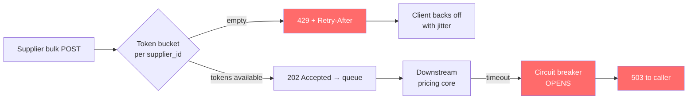
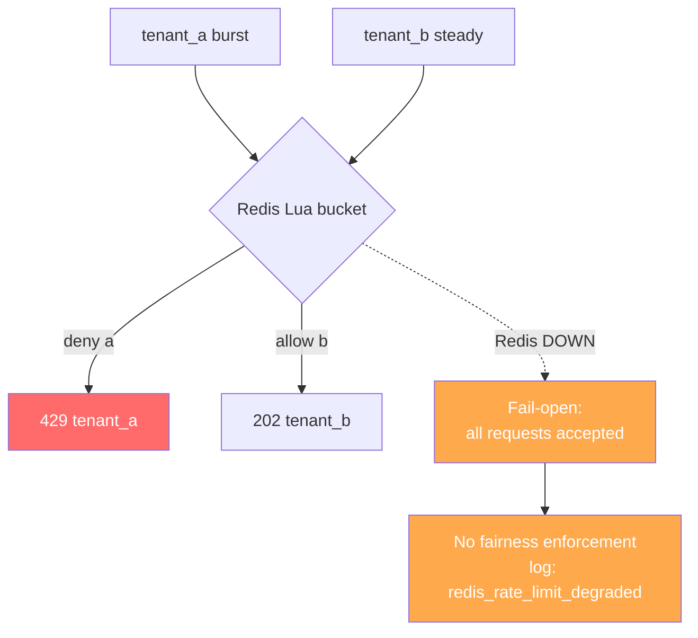
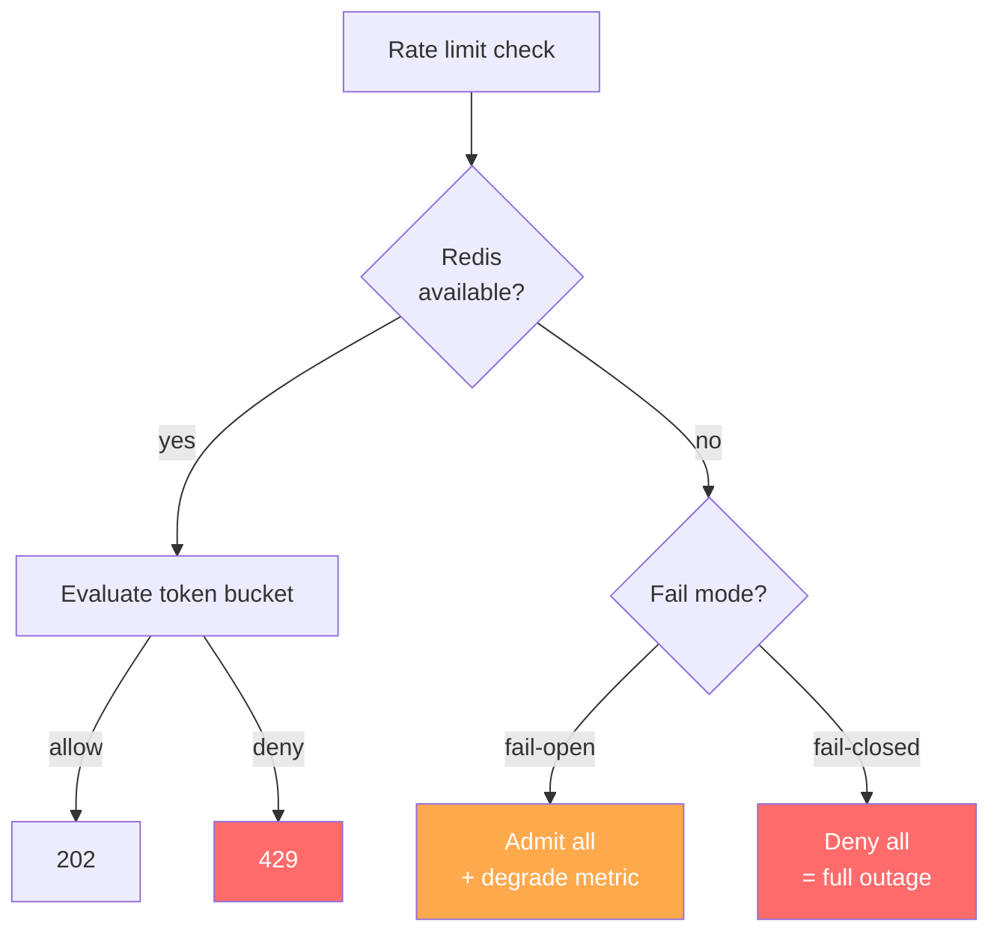

# Plan B — Experience blog (Day 7 · Experience 6 of N)

**Status:** Plan mode only — no HTML until `approve experience`.

---

## Metadata

| Field | Value |
|-------|--------|
| **Calendar day** | 7 of N |
| **Public kicker** | **Experience 6 of N** (1-based; N−1 rule) |
| **Title** | Supplier APIs and Token Buckets — Wayfair's Real Circuit Breaker |
| **Subtitle** | Rate limits that survived 10× surprise load |
| **Bridge** | Redis token buckets on `tenant_id` today are the pricing-API pattern I shipped — 429 with Retry-After, not silent drop. |
| **Word target** | 1,200–1,600 |
| **Mermaid** | **2–3 diagrams** (gold standard: IoT = 3, percentiles = 2) |

## Paths & OG

| Item | Value |
|------|--------|
| **target_html** | `Profile/blog/series/experience/supplier-apis-and-token-buckets-wayfair-circuit-breaker.html` |
| **Canonical** | `https://akshantvats.github.io/Profile/blog/series/experience/supplier-apis-and-token-buckets-wayfair-circuit-breaker.html` |
| **og:image** | `https://akshantvats.github.io/Profile/blog/assets/og/supplier-apis-and-token-buckets-wayfair-circuit-breaker.png` |
| **Cover badge** | `EXPERIENCE SERIES` + headline only — **no** episode number on PNG |
| **published_time** | 2026-05-19 (adjust on ship) |

Register in `blog/series-index.json` with `kicker: "Experience 6 of N"`.

---

## Voice contract

### MUST

- **Open with incident, not theory.** First paragraph drops the reader into a real failure — supplier burst, pricing brownout, graph flatlines. The reader should feel "oh no, what broke?" before they know the topic.
- **Sentences connect.** Use "because", "so", "the problem was", "what I didn't expect" to bind paragraphs. Every paragraph answers "why should I care?" or "what went wrong?"
- **One core analogy, developed deeply.** Token bucket as a fairness contract — not five shallow metaphors. Return to this analogy in the closing.
- **Write like a staff engineer over coffee.** First person. Contractions. Short declarative sentences punctuated by one longer explanation sentence. Not documentation, not LinkedIn.
- **Concrete numbers with honest scope.** 250k+ SKUs is team scope — say so in an attribution box. Personal scope: the rate limiter, the 429 contract, the fail-open decision.
- **Failure paths in diagrams.** Every mermaid must show what breaks, not just what works. Red paths, deny paths, degraded states.
- **Ending punches, doesn't fade.** Last line is a standalone insight, not a summary of what you just read.

### MUST NOT

- **No disconnected single-line statements.** If a sentence doesn't reference what came before or after, it doesn't belong.
- **No concept overload in the opening.** First 4 paragraphs: one incident, one problem. The taxonomy and comparisons come later.
- **No passive architecture diagrams.** If a diagram only shows the happy path, it's a marketing slide, not an engineering artifact.
- **No dashboard UIDs, repo paths, or ticket IDs in prose.** G-06, `plans/drafts`, and Grafana UIDs stay out of the narrative. Link repos in footnotes.
- **No over-referencing siblings.** Maximum 2 sibling post links in body text. Everything else goes in a "Further reading" footnote block.
- **No "5 lessons I learned" structure.** This is a story with a thread, not a listicle with headers.
- **No endings that summarize.** "In conclusion, rate limiting is important" is a failing grade.

---

## Example opening paragraph (exact tone target)

> The supplier feed was supposed to plateau at 2,000 requests per minute. That was the contract — handshake agreement, nothing enforced. On the Tuesday before a major promo, one supplier pushed 22,000 in sixty seconds. The pricing API didn't crash, but response times tripled, and three other suppliers started timing out on their own feeds. The problem wasn't the burst. The problem was that we had no mechanism to say "slow down" that the client could actually respond to.

This opening works because: incident first, concrete number, consequence chain ("because" and "so" are implicit in the sequence), and the thesis emerges from the failure — not from a textbook definition.

---

## Example section transition

> So we had per-supplier buckets in Redis, and they held. But the next question was obvious: what happens when Redis itself goes away?
>
> This is where fail-open gets uncomfortable. Without the bucket store, you have two choices: block everyone (fail-closed, which means a Redis blip is a full outage) or admit everyone (fail-open, which means a Redis blip is a fairness holiday). We picked fail-open — because a degraded system that serves requests is more recoverable than a dark system that serves nothing.

This transition works because: the previous section's conclusion ("buckets held") leads directly to the next question. The reader doesn't need a header to know we changed topics.

---

## Example ending punch

> Fairness is measurable. You can graph the moment one tenant's 429s spike while another's throughput stays flat. What you can't graph is the alternative — the silent overload where every tenant degrades together and nobody knows who to throttle first. That's why the rate limiter isn't ops tooling. It's a product interface.

---

## Outline

1. **Cold open** — Supplier feed spike on promo Tuesday. Graph flatlines because downstream pricing had no token budget. Scene, not slogan — the reader sees the incident before they know the topic. *(3–4 sentences)*
2. **Thesis** — Rate limiting is a **product interface** (429 + Retry-After), not an ops afterthought. This sentence should land after the incident makes the reader want an explanation. *(1–2 sentences, glued to the cold open with "The problem was...")*
3. **Wayfair pricing API pattern** — Per-supplier token buckets in Redis. Bulk SKU validation path. Circuit breaker on dependency failure. **Attribution box:** 250k+ SKUs was team scope; the rate limiter and 429 contract were mine. *(4–5 paragraphs, one diagram)*
4. **Bridge to LensAI** — Same fairness problem, different payload. `tenant_id` buckets in Redis. The move from supplier IDs to tenant IDs was mechanical; the design decision (fail-open, honest 429) was identical. *(2 paragraphs, connected with "so when I built the same thing for inference events...")*
5. **429 vs 503 vs silent drop** — Table: client behavior, retry storm risk, observability story. One paragraph above the table explaining why this distinction matters more than most engineers think. *(1 paragraph + table)*
6. **Fail-open when Redis dies** — Honest tradeoff paragraph. Not "we considered" — "we picked, and here's what we gave up." Link to CHAOS.md §3 in footnote (canonical GitHub URL, not TBD). *(2 paragraphs, one diagram showing the degraded path)*
7. **What we did not do** — Global-only throttle. Fail-closed without ops buy-in. Unbounded retry without jitter. Each gets one sentence explaining why it was wrong, not just that we avoided it. *(1 paragraph)*
8. **Ending punch** — Fairness is measurable. The rate limiter is a product interface. Forward-link to AI post (quantization as precision budget). *(2–3 sentences, no "in conclusion")*

---

## Mermaid (2 required, 3rd optional)

### Diagram 1 — Token bucket lifecycle with FAILURE paths (flowchart)

### Diagram 2 — Multi-tenant fairness with Redis failure (flowchart)

### Diagram 3 (optional) — Fail-open vs fail-closed decision tree

---

## Anti-pattern checklist (Experience post — rate limiting topic)

Before shipping the draft, verify NONE of these appear:

- [ ] **Opening is theory, not incident.** If paragraph 1 defines "rate limiting" or "token bucket" before something breaks, rewrite.
- [ ] **Multiple concepts before the incident lands.** If the reader encounters token buckets, circuit breakers, AND fail-open before paragraph 4, you've overloaded.
- [ ] **Missing "something actually broke" moment.** The Wayfair supplier burst is the incident. It must be concrete (numbers, timeline, consequence) not abstract ("we had scale challenges").
- [ ] **Happy-path-only diagrams.** Every mermaid must show at least one failure or degraded path. If it only shows request → accept → done, it's incomplete.
- [ ] **Dashboard UIDs or repo paths in narrative.** `ai-inference-e2e-local`, `G-06`, `plans/drafts` — none of these belong in prose. Link repos in footnotes.
- [ ] **More than 2 sibling links in body.** Experience 5 (cardinality) and AI Day 6 (quantization) are the max body links. Everything else in a "Further reading" footnote section.
- [ ] **Ending that summarizes or fades.** "In this post we discussed..." is banned. End with a punchline insight.
- [ ] **Disconnected statements.** Read each paragraph transition aloud. If you can't hear "because" or "so" connecting them (explicit or implicit), add a glue sentence.
- [ ] **Attribution confusion.** If 250k+ SKUs appear without a "team scope" attribution box, the credibility score drops. Personal scope claims must be specific: "I built the rate limiter and defined the 429 contract."

---

## Code / schema references (post G-06)

- `X-Tenant-ID` header + partition key alignment
- Example JSON error: `rate_limit_exceeded`
- Link infra README quickstart — not full diff
- Commit SHA in footer after code merges

---

## Cross-links (canonical)

| Sibling | URL |
|---------|-----|
| Experience 5 (cardinality) | `.../experience/cardinality-is-the-silent-killer-roaringbitmap-lessons.html` |
| Experience 4 (DH geo) | `.../experience/five-thousand-geo-events-per-second.html` |
| AI Day 6 (quantization) | `.../ai-learning/day-6-quantization-vs-compression-tradeoffs.html` |
| infra README | `https://github.com/akshantvats/infra-ai-streaming` |

**Body links (max 2):** Experience 5 + AI Day 6. Everything else in footnotes.

---

## Daily Thread (verbatim — weave once in prose)

> CHAOS.md scenario 3 (Redis lost) exists because rate limiting without a fallback store is a decorated denial-of-service.

---

## Pre-publish gates

- [ ] Kicker **Experience 6 of N** matches filename index (series position 6, not calendar 7)
- [ ] `og:image` 1200×630 absolute HTTPS
- [ ] Mermaid renders on local `http.server`
- [ ] No `blog/series/agoda/` paths
- [ ] Voice contract checklist passed — every MUST verified, every MUST NOT absent
- [ ] Anti-pattern checklist above has all boxes checked (meaning: none found)
