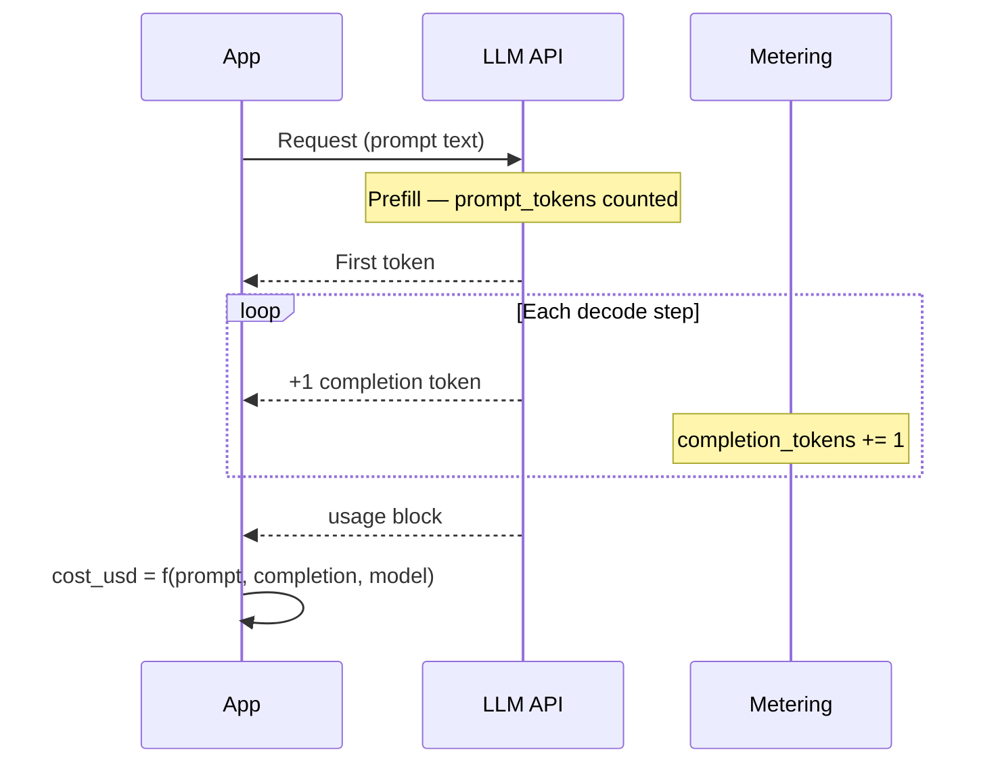

# Day 3 of Learning LLM Inference — Token Budgets and Real Cost Structure

**Subtitle:** 3 of N — AI Learning Series. Prompt vs completion pricing as capacity planning — and why `cost_usd` in the ingest schema has to reconcile with provider bills, not a single latency chart.

---

I assumed LLM cost would track total tokens the way a batch job’s bill tracks rows processed.

It does not. Providers meter **prompt** and **completion** on separate rate cards, and completion is usually priced higher per token. A request can be eighty percent prompt tokens by count and still split the dollar bill down the middle — or worse if the model generates a long answer.

[Day 1](https://akshantvats.github.io/Profile/blog/series/ai-learning/day-1-kv-cache-memory-bandwidth.html) covered decode as a memory-bandwidth problem; [Day 2](https://akshantvats.github.io/Profile/blog/series/ai-learning/day-2-continuous-batching-vllm.html) covered schedulers that keep GPUs busy. Today I learned the unit finance actually asks about: **dollars per tenant per hour**, built from two buckets the API returns on every successful call.

The expensive surprise in data pipelines I have run was rarely the initial scan — it was unbounded work in the tail. LLM invoices rhyme: you pay once to ingest context, then you pay again for every token the model emits until it stops.

---

## Every bill splits into two token buckets {#two-buckets}

Every hosted LLM response carries a **usage** object. Vendor field names differ — OpenAI exposes `prompt_tokens` and `completion_tokens`; Anthropic uses `input_tokens` and `output_tokens` — but the split is stable:

| Bucket | What it counts | Tie to Day 1 |
|--------|----------------|--------------|
| **Prompt (input) tokens** | System prompt, RAG chunks, tool results, user message — everything counted before the first generated token | **Prefill** — largely parallel across prompt length |
| **Completion (output) tokens** | Every token generated after prefill | **Decode** — serial, one step at a time |

Providers bill these on **different rate cards**. Storing only `total_tokens` (when the API offers it) hides the lever finance actually cares about: **completion is the variable line item**. Prompt is the setup charge you pay once per request; completion is the meter that runs until the model stops or hits `max_tokens`.



*Alt text: Request lifecycle from prefill through decode, with completion tokens accumulating on the provider meter.*

Failed requests deserve a footnote here: you may still pay for prompt tokens on a truncated or errored call. That is why `status` and `error_code` belong on the same `InferenceEvent` as dollars — finance and SRE need the same row.

---

## Asymmetric pricing is the default {#pricing-table}

List prices are quoted **per million tokens** (older docs sometimes use per 1K). For capacity planning you need **two rates** per model: input and output. The total is linear:

```text
cost_usd ≈ (prompt_tokens / 1e6) × rate_input(model)
         + (completion_tokens / 1e6) × rate_output(model)
```

**As of May 2026 — verify on each vendor’s pricing page before you hard-code a rate card.** Numbers move; contracts and cached tiers move faster than blog posts.

| Model (illustrative) | Input $/1M | Output $/1M | Output ÷ input |
|----------------------|------------|-------------|----------------|
| GPT-4o-class | $2.50 | $10.00 | 4× |
| Claude Sonnet-class | $3.00 | $15.00 | 5× |

Typical hosted APIs price output at **2×–5×** input, model-dependent. That is not a marketing quirk; it mirrors different compute shapes (parallel prefill vs serial decode).

### Worked example

Request: `prompt_tokens = 2,000`, `completion_tokens = 500`, model priced like GPT-4o-class ($2.50 / $10.00 per million):

```text
cost_usd ≈ (2000 / 1e6) × 2.50 + (500 / 1e6) × 10.00
         = 0.005 + 0.005
         = $0.01
```

| Metric | Value |
|--------|-------|
| Token mix | 80% prompt / 20% completion |
| **Dollar mix** | **50% prompt / 50% completion** |
| If completion doubles (500 → 1,000, prompt fixed) | Total cost **$0.015** (+50%) |
| If prompt doubles (2,000 → 4,000, completion fixed) | Total cost **$0.015** (+50%) |

Eighty percent of tokens can still be half the bill when output is priced 4× input. Doubling either bucket alone raises total cost fifty percent in this example — so capacity planning argues about completion length before it argues about another hundred tokens of RAG context.

---

## Why completion costs more per token {#why-completion}

Output tokens are not “more intelligent.” They are **more expensive to produce at scale**. I keep four layers in mind; the first three are systems, the fourth is economics.

1. **Compute shape** — prefill parallelizes; decode is serial ([Day 1](https://akshantvats.github.io/Profile/blog/series/ai-learning/day-1-kv-cache-memory-bandwidth.html)). GPU-seconds grow with every completion token.
2. **Memory bandwidth** — each decode step reads a growing KV cache; longer outputs mean more VRAM traffic per token.
3. **Scheduling** — long completions hold slots on shared GPUs ([Day 2](https://akshantvats.github.io/Profile/blog/series/ai-learning/day-2-continuous-batching-vllm.html)); continuous batching reduces bubbles, not decode cost.
4. **Business model** — cheap input encourages RAG and long contexts; expensive output prices unbounded generation.

Finance will optimize completion first. Do not use `latency_ms` as a cost proxy — a fast, long completion can look healthy on SLOs and hurt on the bill.

The failure mode I did not expect until I stared at dashboards: a request with low `latency_ms` and a long `completion_tokens` tail looks like a win on percentile charts and a loss on the invoice. P99 latency stays flat while `sum(cost_usd)` drifts up — because decode stayed fast per token while the meter kept running. Split `prefill_latency_ms` and `decode_latency_ms` when you can; they explain **drivers**, not dollars.

> **Pullquote:** Completion tokens are the variable cost line item. Prompt tokens are the fixed setup charge.

---

## The systems parallel {#systems-parallel}

| LLM / inference | Data-systems parallel |
|-----------------|------------------------|
| Prompt tokens (prefill) | **Wide transformation** — read the partition once, high parallelism, cost ∝ input size |
| Completion tokens (decode) | **Per-row UDF in a foreach** — each output triggers another pass over growing state |
| KV cache growth | **Shuffle spill / state store** — every step reads more accumulated state |
| Higher $/completion token | **Egress / cross-AZ pricing** — marginal bytes out cost more than bytes in |
| `max_tokens` / budget | **Executor memory cap + shuffle partitions** — wrong cap → OOM or runaway bill |

At Agoda-scale batch jobs, finance never accepted “we processed *N* rows” without splitting **bytes read vs bytes written** and **shuffle spill**. Prompt tokens are the wide read: you pay proportional to input size once per request. Completion tokens are the serial tail: each new token adds another decode step and more KV cache traffic ([Day 1](https://akshantvats.github.io/Profile/blog/series/ai-learning/day-1-kv-cache-memory-bandwidth.html)). You cannot average two percentiles across tiers; you should not average two token buckets into `total_tokens` and call it a budget. This series stays on **serving**, not training ([Day 0](https://akshantvats.github.io/Profile/blog/series/ai-learning/day-0-series-roadmap.html)).

---

## Token budgets are capacity planning in dollars {#budgets}

Three caps show up in every production gateway conversation:

- **`max_tokens` / `max_completion_tokens`** — hard ceiling on variable spend per request.
- **Context window** — cap on prompt + completion combined; breach truncates or errors.
- **Tenant budget (later)** — rolling `sum(cost_usd)` per `tenant_id`; finance thinks in dollars.

Shrinking the prompt saves input **once**; limiting completion caps **every request at scale**. Instrument latency alone and you will optimize the wrong knob.

---

## Ingest should validate cost facts, not re-price them {#validate}

Store the formula at the **producer** (app, SDK, or gateway) using the provider `usage` block and a **versioned rate card**. The ingestion service should **validate**, not silently re-price — rate tables drift faster than deploy cadence.

We considered recomputing `cost_usd` inside the Rust ingest service from tokens plus a checked-in rate table. That would catch producer bugs early, but it couples every deploy to pricing changes and duplicates logic every SDK already has. For Day 4 we rejected repricing at the boundary: ingest rejects obvious lies (negative cost, zero latency, stale timestamps) and forwards the producer’s dollars. A later `pricing_version` field can flag drift without pretending the gateway is the billing system of record.

**Today in infra-ai-streaming:** `POST /ingest` rejects `cost_usd < 0` (`invalid_cost`), rejects `latency_ms == 0` (`invalid_latency`), enforces batch size and event age, and requires `X-Tenant-ID` to align with each event’s `tenant_id`. It does **not** yet recompute dollars from tokens at the boundary — that is intentional. Producers own pricing-version skew; the service owns **obvious lies** (negative cost, zero latency, ancient timestamps).

Future: `pricing_version` or `cost_validation_delta_usd` when producer math drifts from your rate card. k6 harness uses `cost_usd = prompt×5e-6 + completion×15e-6` — synthetic only.

---

## Every event needs tokens and dollars {#infra-today}

The ingestion contract is frozen in Rust (`InferenceEvent` in [`ingestion/src/handlers/ingest.rs`](https://github.com/akshantvats/infra-ai-streaming/blob/32fdb379895e83140a7e3534c5c1cb65f0f72268/ingestion/src/handlers/ingest.rs), commit `32fdb379895e83140a7e3534c5c1cb65f0f72268`). What I learned has to land on every row before ClickHouse can answer finance questions:

| Field | Why it matters |
|-------|----------------|
| `prompt_tokens` | Input bucket — prefill-sized |
| `completion_tokens` | Output bucket — decode-sized, variable spend |
| `cost_usd` | Finance source of truth; validated ≥ 0 at ingest |
| `model_id` | Rate-table key |
| `tenant_id` | Rollup dimension; must match `X-Tenant-ID` |
| `timestamp_unix_ms` | Hourly `sum(cost_usd)` partitions |

Other schema fields (`latency_ms`, `prefill_latency_ms`, `decode_latency_ms`, `event_id`, `request_id`, `status`, `error_code`) are documented in the same [`ingest.rs`](https://github.com/akshantvats/infra-ai-streaming/blob/32fdb379895e83140a7e3534c5c1cb65f0f72268/ingestion/src/handlers/ingest.rs) — latency explains drivers, not dollars; status captures failed calls that may still bill prompt tokens.

Compute `cost_usd` at the **producer**; ingest validates sanity and durably forwards facts. Store **tokens and dollars**, not dollars alone — finance reconciles to the provider; engineering debugs token leaks and context bloat.

Example batch (matches README quickstart):

```json
{
  "events": [
    {
      "tenant_id": "demo",
      "model_id": "gpt-4o",
      "timestamp_unix_ms": 1715000000000,
      "latency_ms": 342,
      "prefill_latency_ms": 120,
      "decode_latency_ms": 222,
      "prompt_tokens": 512,
      "completion_tokens": 128,
      "cost_usd": 0.00423,
      "status": "success",
      "request_id": "req-7f3a"
    }
  ]
}
```

`event_id` is assigned at ingest when omitted; `normalize_events` defaults `status` to `"success"`.

The Go consumer on branch G-02 (`fb309fc`) already prints structured stdout for the same shape — including `cost_usd: 0.00423` on the README sample — but that path is not on `main` yet; [PROJECT-STATUS](https://github.com/akshantvats/infra-ai-streaming/blob/main/docs/PROJECT-STATUS.md) is the honest merge gate. Local stack: Redis and Redpanda via `deploy/docker-compose.yml`; `cargo run -p ingestion` accepts the curl in the README.

---

## What I am taking away {#takeaway}

PagedAttention and continuous batching explain **why GPUs stay busy**; token buckets explain **why finance stays calm** when every event carries prompt, completion, and producer-computed `cost_usd`. Next I need `sum(cost_usd) GROUP BY tenant_id, toStartOfHour(timestamp_unix_ms)` on every row — not a blended latency percentile.

Today's Experience sibling — **[Seven Million IoT Sensors — Failure Modes Textbooks Skip](https://akshantvats.github.io/Profile/blog/series/agoda/seven-million-iot-sensors-failure-modes.html)** — is the same instinct at Walmart scale: validate before central aggregation, because poisoned `cost_usd` in Kafka is the same class of bug as a spoofed `device_id` in a fleet rollup.

---

## Series footer {#series-footer}

**Up next (series Day 4 / build Day 5):** ClickHouse batch writer — `sum(cost_usd)` by tenant and hour, plus the consumer graduating from stdout to inserts.

---

## Footnotes {#footnotes}

| Ref | Source |
|-----|--------|
| [1] | [OpenAI API pricing](https://openai.com/api/pricing/) — rate card (verify May 2026) |
| [2] | [OpenAI Chat Completions — `usage`](https://platform.openai.com/docs/api-reference/chat/create) — `prompt_tokens`, `completion_tokens` |
| [3] | [Anthropic pricing](https://www.anthropic.com/pricing) — second-vendor check |
| [4] | [Anthropic Messages API](https://docs.anthropic.com/en/api/messages) — `input_tokens` / `output_tokens` |
| [5] | [Google Gemini pricing](https://ai.google.dev/pricing) — optional third card |
| [6] | [infra-ai-streaming README](https://github.com/akshantvats/infra-ai-streaming) ingest example · [`ingest.rs`](https://github.com/akshantvats/infra-ai-streaming/blob/32fdb379895e83140a7e3534c5c1cb65f0f72268/ingestion/src/handlers/ingest.rs) @ `32fdb37` |
| [7] | [Seven Million IoT Sensors](https://akshantvats.github.io/Profile/blog/series/agoda/seven-million-iot-sensors-failure-modes.html) — Experience 4 of N |
| [8] | Go consumer G-02 @ [`fb309fc`](https://github.com/akshantvats/infra-ai-streaming/commit/fb309fc) — stdout sample with `cost_usd: 0.00423` (branch; verify merge on `main`) |

---

<!--
EDITOR NOTES — not for HTML body

### Retrofix (Day 2 footer)
Day 2 series-footer still teases "Day 3 — PagedAttention." PagedAttention depth was Day 2.
Retrofix on HTML pass: change to "Day 3 — Token budgets & cost structure" (or link to canonical).

### Publish gate (CHECKLIST §B)
- Draft approved → HTML only
- Verify Experience Day 4 returns 200 on GitHub Pages before share
- Go consumer: confirm fb309fc merged to main or note branch in HTML
- Word count (prose only, excl. tables/code/mermaid): ~1,050–1,150 — re-run before HTML

### Series cross-links (live)
Day 0: https://akshantvats.github.io/Profile/blog/series/ai-learning/day-0-series-roadmap.html
Day 1: https://akshantvats.github.io/Profile/blog/series/ai-learning/day-1-kv-cache-memory-bandwidth.html
Day 2: https://akshantvats.github.io/Profile/blog/series/ai-learning/day-2-continuous-batching-vllm.html
Day 3: https://akshantvats.github.io/Profile/blog/series/ai-learning/day-3-token-budgets-cost-structure.html

### Experience cross-links
Building TSDB: https://akshantvats.github.io/Profile/blog/series/agoda/building-tsdb-at-agoda.html
When Percentiles Lie: https://akshantvats.github.io/Profile/blog/series/agoda/when-percentiles-lie-cross-tier-queries.html
Day 4: https://akshantvats.github.io/Profile/blog/series/agoda/seven-million-iot-sensors-failure-modes.html
-->
