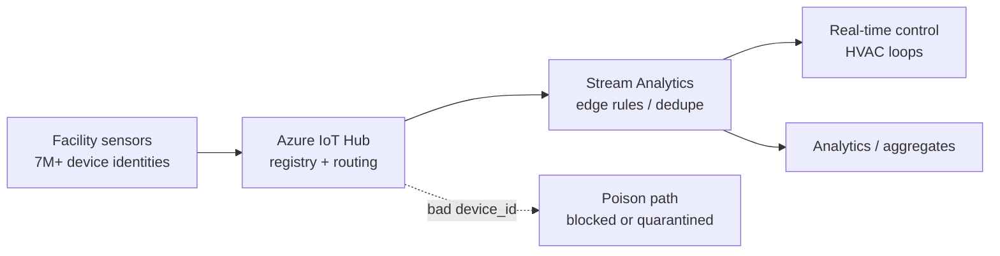
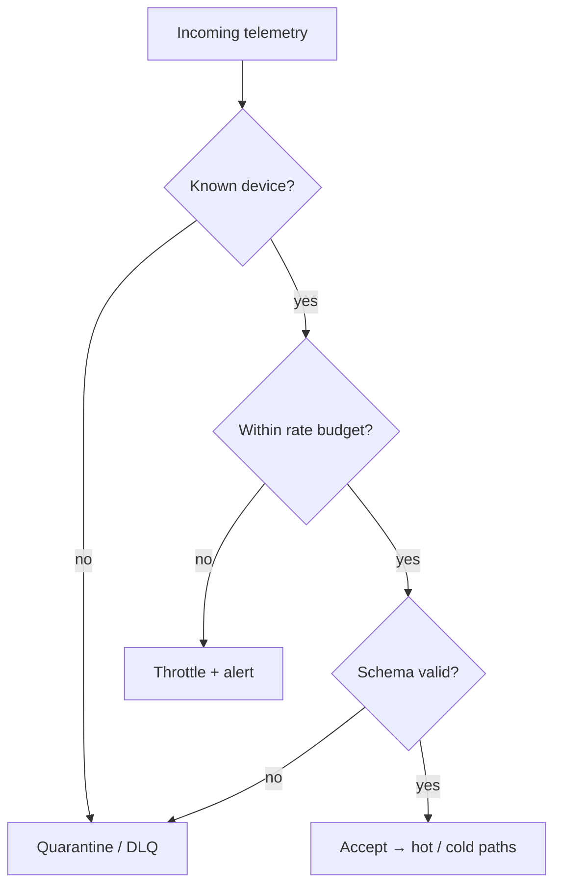

# Seven Million IoT Sensors — Failure Modes Textbooks Skip

**Experience Series · 4 of N**

*4 of N — Experience Series · Walmart · refrigeration, HVAC, and why bad telemetry is worse than a crash*

**Akshant Sharma** · May 16, 2026 · 15 min read

---

The first time a refrigeration case drifted one degree at a time, the fleet rollup still looked green.

No crash. No obvious alert on the screen the on-call engineer checks first. The aggregate said healthy. Somewhere in the long tail, a unit kept sending readings that parsed as numbers and landed in the warehouse — but no longer meant what the dashboard assumed. By the time someone opened the case, the damage was physical, not theoretical.

That is the same class of failure I hit later at Agoda with cross-tier percentiles: the system stays up while the answer is wrong. Textbooks spend pages on CAP and at-least-once delivery. Production spends years on spoofed `device_id` values, poisoned temperature streams, and firmware that never finished cert rotation — because nobody pages on "slightly wrong forever."

I worked on Walmart Global Tech's SmartBuildings / WeIoT platform from August 2018 through May 2021. I did not write [Walmart's corporate IoT story](https://corporate.walmart.com/news/2021/01/14/how-walmart-leverages-iot-to-keep-your-ice-cream-frozen); I helped build platform plumbing that had to survive the scale that story describes. What follows is a platform engineer's perspective aligned with Walmart's published narrative. The failure-mode taxonomy and identity discipline here are mine, not quotes from the corporate post.

---

## Seven Million Data Points — Until a Case Stops Being Boring {#scale}

In January 2021, Walmart's Global Tech team published how the company uses IoT to keep ice cream frozen and milk cold across thousands of U.S. stores. The numbers are blunt: more than **seven million unique IoT data points**, sending almost **1.5 billion messages per day** about temperature, operating functions, and energy use.[^wmt] The mission is not abstract "sensor scale." It is food quality, HVAC performance, and energy programs like Demand Response — routing anomalies into action through store associates, work orders, or remote fixes before shoppers feel it.

| | |
|---|---|
| **7M+** | Unique IoT data points (U.S. stores) |
| **~1.5B/day** | Messages — temperature, ops, energy |
| **50+** | Global facilities in my HVAC / platform scope |

**Team context (published):** Walmart Global Tech's IoT organization — refrigeration monitoring, HVAC, Demand Response, proprietary anomaly detection, and cloud triage applications that turn signals into work.[^wmt]

**My context:** Platform work on **Azure IoT Hub** routing, **Stream Analytics** edge rules, and facility-scale stream processing across **50+ global facilities** in my scope. I am not claiming ownership of every device behind the seven-million figure. For throughput in public copy, I prefer Walmart's **1.5 billion messages per day** over unpublished peak-per-minute claims from internal dashboards.

That distinction matters. Corporate scale is the backdrop. Your job is the plumbing that survives what production actually throws at you: **identity** that ghosts after a board swap, **poison** that dominates a rollup, and **silent wrong** aggregates that stay green while one case spoils — each worse than a clean crash because nobody pages on polite lies.

---

## When the Fleet Rollup Lies {#textbook-gap}

Textbooks give you clean diagrams: devices publish, cloud ingests, dashboards update. They mention **at-least-once** delivery and **clock skew** in a footnote, then move on to consensus algorithms.

Production gives you duplicate `device_id` values after a sloppy reprovision — two physical units, one logical row, one hot partition of lies. It gives you firmware version drift where a schema field means something different on build 1.04 than on 1.03, but the parser still accepts both. It gives you certificate rotation that half-completed, so a device authenticates intermittently and biases your "offline" metric. It gives you spoofing that is not nation-state drama: a misconfigured gateway forwarding another site's payload with the wrong identity header.

CAP still matters. But the failure that wakes you at 2 a.m. is often **silent wrong**, not **partition unavailable** — the same class of bug as [When Percentiles Lie](https://akshantvats.github.io/Profile/blog/series/agoda/when-percentiles-lie-cross-tier-queries.html), except IoT can spoil product before anyone opens a ticket.

We once chased a "healthy" refrigeration zone for two days because a reprovisioned board reused an old `device_id`. The new unit reported plausible temperatures. The old ghost kept reporting too. The fleet average looked fine. The case was not.

---

## Device Identity Is a Partition Key, Not a String {#identity}

At seven million identities, `device_id` is not a label for humans. It is how you **shard blame**.

Azure IoT Hub's device registry was the gate: provision, disable, rotate. "Just use MAC" fails the day a board is replaced and the old MAC ghosts in your cold store. **Provisioning** is a state machine, not a one-time script run during a pilot. **Cert rotation** is a migration project with a deadline, not a ticket you will get to next sprint when the fleet is quiet — the fleet is never quiet.

Treat identity like a **partition key**: co-locate telemetry, quarantine by device when poison appears, never let BI join on a renameable display name. If you cannot answer "which physical asset produced this reading?" in one hop, you do not have observability — you have a rollup that will lie politely.

---

## Poison Telemetry: The IoT Version of a Hot Partition {#poison}

One bad actor can dominate an aggregate that leadership trusts. One flapping sensor. One duplicated identity. One unit stuck reporting `-999` while the parser shrugs. In multi-tenant SaaS you would call it a noisy neighbor. In IoT it is a **hot partition in the semantics layer**: every rollup inherits the poison unless something cuts it off early.

Stream Analytics and facility rules existed to stop junk **before** it became "official" history. Central drop without metrics is how you repeat the percentiles mistake — you lose the evidence that the aggregate was ever wrong, and the org learns to trust numbers that learned nothing from the incident.

**Quarantine, not silent delete** — the IoT DLQ preserves forensics and keeps dashboards honest. A bad `tenant_id` in today's Kafka topic is the same class of bug: do not sum `cost_usd` until identity and schema are trusted.

---

## Edge Filtering vs Cloud Aggregation {#edge-vs-cloud}

Not every reading deserves the warehouse.

Walmart's corporate narrative pairs **real-time control** — HVAC loops, refrigeration performance — with **Demand Response** and energy scheduling. Algorithms and triage apps act before a human exports a CSV.[^wmt] Our platform named **Stream Analytics** and **edge rules** explicitly; the corporate post says "proprietary software" without product names. The idea is the same: **filter and decide at the edge**, aggregate in the cloud for trends and compliance.

Unknown devices, implausible bursts, schema violations, and identity duplicates with conflicting metadata should not reach cold storage unreviewed. Cloud aggregation is for **trends**; the hour that spoils product belongs to the hot path.



---

## How Telemetry Dies Quietly {#failure-modes}

Severity is honest: silent wrong beats loud crash.

Telemetry walks a gate chain. An unknown device should land in quarantine with a metric — never blend into fleet health. A rate budget breach should throttle and alert; accepting everything is how you fund a hot partition. Schema drift needs versioned parsers that reject unknown builds instead of guessing. Clock skew needs bounded lateness and explicit backfills, not silent reordering. A half-dead device — still sending, no longer trustworthy — is the ice-cream case: freshness SLOs per asset class matter more than another uptime chart.



---

## What We Didn't Do (and Why) {#tradeoffs}

We tried running cloud ML scoring on every temperature reading that cleared the hub. The models were useful on sampled windows and on triage queues already filtered by edge rules. At seven-million-device fan-out, per-message inference blew latency budgets and spend without catching the failures that actually hurt — identity ghosts, schema drift, half-dead senders. We kept proprietary anomaly detection where Walmart's public story describes it and kept the platform path boring: registry, edge filter, then analytics.

| Chose | Skipped | Why |
|-------|---------|-----|
| Facility edge rules in Stream Analytics | Per-reading cloud ML | Latency and cost at fleet scale |
| Hub registry + strong identity | Anonymous telemetry | Debugging without identity is archaeology |
| Quarantine + metrics | Silent drop | Green chart, wrong decision |

---

On a laptop today I run the same muscle on different silicon. The Day 4 stack uses compose-isolated Redis, Redpanda, and a Go consumer whose only job is to prove tenant-scoped events survive routing before a writer lands. Walmart's facility shard became a restartable service boundary; Stream Analytics edge rules became validate-and-quarantine before cold storage. I am not replaying 1.5 billion messages per day on a MacBook — I am practicing blast-radius separation while the pipeline is still small enough to reason about. Stack layout and the sample event shape are in the repo README and [^lensai-event].

---

## The Thing That Stayed With Me {#stayed}

Incidents fade. Dashboards get redesigned. What stays is **trust debt**: every time you let a bad identity slip into an aggregate, someone downstream makes a decision they cannot unmake.

Seven million data points do not need you to be heroic. They need you to be boring about identity, ruthless at the edge, and honest when the rollup looks fine but the case is not.

Infrastructure trust is cumulative — and very easy to lose. That is why quarantine branches still get sketched before dashboards.

---

## Series footer

**Experience Series · 4 of N** — Walmart IoT identity and edge discipline.

**Next:** 5 of N — Delivery Hero geo-events *(or the next Experience deep-dive per series nav)*.

---

## Footnotes & related

- [How Walmart Leverages IoT to Keep Your Ice Cream Frozen](https://corporate.walmart.com/news/2021/01/14/how-walmart-leverages-iot-to-keep-your-ice-cream-frozen) — corporate scale and mission (Jan 14, 2021).
- [When Percentiles Lie: Cross-Tier Queries in a 1.8T/day TSDB](https://akshantvats.github.io/Profile/blog/series/agoda/when-percentiles-lie-cross-tier-queries.html) — Experience 3 of N; silent wrong aggregates at Agoda.
- [Building WhiteFalcon at Agoda](https://akshantvats.github.io/Profile/blog/series/agoda/building-tsdb-at-agoda.html) — series opener; TSDB architecture context.
- [infra-ai-streaming](https://github.com/akshantvats/infra-ai-streaming) — compose + ingest quickstart.
- **Companion (AI):** [Day 3 — Token Budgets and Real Cost Structure](https://akshantvats.github.io/Profile/blog/series/ai-learning/day-3-token-budgets-cost-structure.html) *(TBD until published)* · [AI Learning series index](https://akshantvats.github.io/Profile/blog/series/ai-learning/) · [Day 1](https://akshantvats.github.io/Profile/blog/series/ai-learning/day-1-kv-cache-memory-bandwidth.html) · [Day 2](https://akshantvats.github.io/Profile/blog/series/ai-learning/day-2-continuous-batching-vllm.html)

[^wmt]: Sanjay Radhakrishnan, VP Global Tech, [Walmart corporate newsroom, Jan 14, 2021](https://corporate.walmart.com/news/2021/01/14/how-walmart-leverages-iot-to-keep-your-ice-cream-frozen): *"Walmart manages more than seven million unique IoT data points across our U.S. stores"* and *"Every day, this network … sends almost 1.5 billion messages regarding temperature, operating functions and energy use."*

[^lensai-event]: Example ingest payload for LensAI / infra-ai-streaming (fields must survive unchanged through the pipeline):

```json
{
  "tenant_id": "demo",
  "model_id": "gpt-4o",
  "prompt_tokens": 512,
  "completion_tokens": 128,
  "cost_usd": 0.00423,
  "latency_ms": 342
}
```
